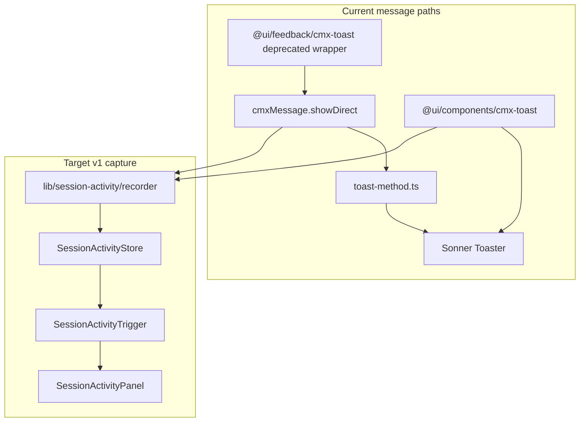
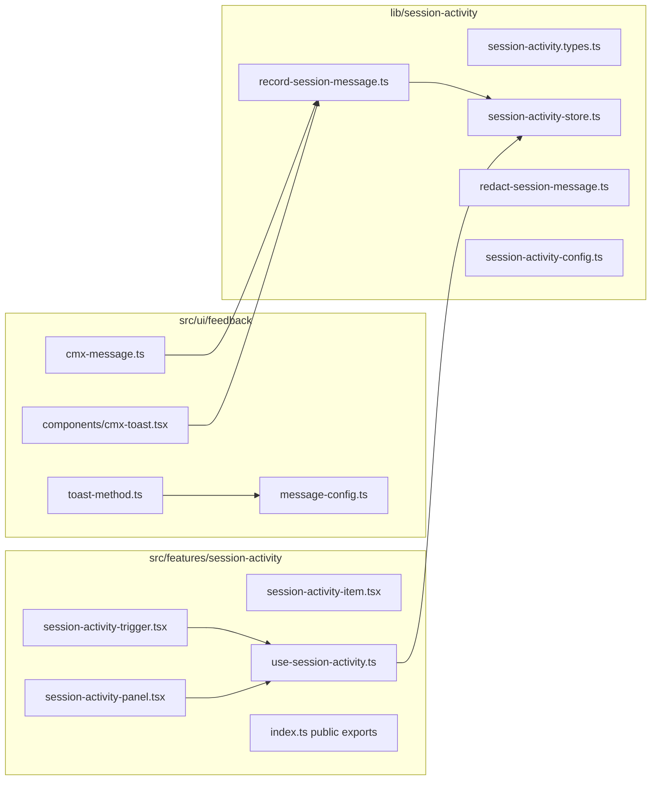

# Session Activity — Production Implementation Plan

## 1. Current-state assessment

### Problem
Transient toasts disappear before ops users can read them (especially EN/AR, payment/finance flows). Defaults today are short: success/info **3s**, warning **4s**, error **5s** ([`toast-method.ts`](web-admin/src/ui/feedback/methods/toast-method.ts) lines 136–145). [`message-config.ts`](web-admin/src/ui/feedback/message-config.ts) defines the same durations but **is not wired** into `getDefaultDuration()` — config changes currently have no effect on toasts.

### Existing assets to reuse

| Asset | Path | Reuse |
|---|---|---|
| Message pipeline | [`cmx-message.ts`](web-admin/src/ui/feedback/cmx-message.ts) `showDirect()` | Single hook point for capture |
| Message types/options | [`types.ts`](web-admin/src/ui/feedback/types.ts) | Extend with opt-out flags |
| Notification bell popover | [`notification-bell.tsx`](web-admin/src/features/notifications/ui/notification-bell.tsx) | Popover shell, outside-click, Escape, badge, scroll list |
| Notification item row | [`notification-item.tsx`](web-admin/src/features/notifications/ui/notification-item.tsx) | Relative time, compact row layout |
| Top bar mount point | [`cmx-top-bar.tsx`](web-admin/src/ui/navigation/cmx-top-bar.tsx) line 80 | Insert trigger before `NotificationBell` |
| External store pattern | [`use-payment-modal-version.ts`](web-admin/src/features/orders/hooks/use-payment-modal-version.ts) | `useSyncExternalStore` + subscribe |
| Singleton manager pattern | [`permissions-inspector-manager.ts`](web-admin/src/ui/navigation/permissions-inspector/permissions-inspector-manager.ts) | Optional `open()` from outside React |
| Sonner Toaster | [`AppProviders.tsx`](web-admin/lib/providers/AppProviders.tsx) line 70 | Add `closeButton`, RTL position already handled |
| i18n namespace pattern | [`notifications.json`](web-admin/messages/en/notifications.json) | Mirror with `sessionActivity.json` EN/AR |
| Feedback tests | [`cmx-message.test.ts`](web-admin/__tests__/ui/feedback/cmx-message.test.ts) | Extend for recorder integration |

### Critical gap (must address in v1)
Legacy [`@ui/components/cmx-toast.tsx`](web-admin/src/ui/components/cmx-toast.tsx) calls Sonner **directly**, bypassing `cmxMessage`. It is still used in high-value flows (payments, pay-extra, customer receipt allocation). **~6+ files** import it. Session capture will be incomplete unless this path is bridged.



---

## 2. Scope, assumptions, dependencies, constraints

### In scope (v1)
- Client-side session message log (errors + warnings; configurable info policy)
- Top-bar `SessionActivityTrigger` (distinct icon, **not** a second bell)
- Hook in `cmxMessage.showDirect()` + bridge legacy `@ui/components/cmx-toast`
- Toast UX improvements: `closeButton`, wire durations to `message-config`, bump defaults
- EN/AR i18n, RTL-safe panel
- Unit tests for store/recorder; extend cmx-message tests
- Feature doc under `docs/features/Session_Activity/`

### Assumptions
- v1 is **browser-session scoped** (in-memory; optional sessionStorage in Phase 2)
- No cross-device sync required
- Users understand this is a **UX recovery log**, not audit/compliance
- All dashboard users may access the trigger (no RBAC gate)

### Dependencies
- Sonner (already installed)
- `next-intl` namespace loading via [`next.config.ts`](web-admin/next.config.ts) glob `messages/**/*.json`
- `AppProviders` mount order unchanged except optional initializer

### Constraints (architecture)
- [`src/ui/feedback`](web-admin/src/ui/feedback) **must not import** from [`src/features`](web-admin/src/features) — store/recorder lives in **`lib/session-activity/`**
- Feature UI lives in **`src/features/session-activity/`**
- No DB migrations, no API routes, no permission seeds in v1
- Cmx components only in feature UI ([`.clauderc`](web-admin/.clauderc))

### Explicit non-goals (v1)
- Persisting messages to PostgreSQL / audit tables
- Replacing server notifications ([`org_ntf_inbox_mst`](web-admin/src/features/notifications/hooks/use-notification-bell.ts))
- Full-page `/dashboard/.../session-activity` route (Phase 3 optional)
- RBAC permission, navigation dual-write, ui-access-contract
- Bulk migration of all call sites from legacy toast to `cmxMessage` (bridge only; migration is follow-up)
- Logging PII/payment card data to server telemetry

---

## 3. Business rules and capture policy

### What gets logged (v1 — amended after gap review)

Capture only when display method is **`toast` or `alert`**. Skip **`inline`** and **`console`** (inline may never be rendered by the caller).

| Message type | Log? | Badge? | Rationale |
|---|---|---|---|
| `error` | Always (toast/alert) | Yes (unread) | Primary user pain |
| `warning` | Always (toast/alert) | Yes (unread) | Action may be required |
| `info` | Only if `forceSessionLog` | No | Avoid noise; no Info filter in v1 |
| `success` | Only if `forceSessionLog` | No | Confirmation noise |
| `loading` | No | No | Transient progress |
| `cmxMessage.promise()` terminal error/warning | Yes | Yes | **Must hook** — promise bypasses `showDirect` (see §21 G1) |
| `method: 'inline' \| 'console'` | No | No | Ghost-entry / dev-only risk |

### Opt-out / opt-in (extend `MessageOptions` in [`types.ts`](web-admin/src/ui/feedback/types.ts))
```ts
skipSessionLog?: boolean          // force skip (internal/noisy messages)
forceSessionLog?: boolean         // force capture (e.g. important success)
sessionActivitySource?: string  // optional tag: 'payment', 'orders', etc.
```

### Dedupe rule
Skip append if same `(type + normalizedTitle + route)` within **5 seconds**.

### Retention
- Ring buffer max **100** entries (configurable constant)
- Newest first in UI

### Clear triggers
- User clicks **Clear log**
- **Sign out** — already calls `sessionStorage.clear()` in [`auth-context.tsx`](web-admin/lib/auth/auth-context.tsx) line 417; also call `sessionActivityStore.clear()`
- **Tenant switch** — must explicitly clear store (tenant switch does **not** clear sessionStorage today)
- **Full page reload** — in-memory cleared; Phase 2 sessionStorage rehydrates if enabled

### Redaction (client-side, before store)
- Truncate title to **500** chars, description to **2000** chars (align with cmxMessage 1000-char validation at display time)
- Strip patterns: card numbers, long JWT-like strings, `Bearer ` tokens
- Never store raw `options.data` unless explicitly allowlisted keys

---

## 4. UI/UX architecture

### Top bar placement
In [`cmx-top-bar.tsx`](web-admin/src/ui/navigation/cmx-top-bar.tsx), order:

```text
Search | Language | PermissionsInspector | SessionActivityTrigger | NotificationBell | Tenant | User
```

### Trigger (`SessionActivityTrigger`)
- Icon: **`ScrollText`** from lucide (distinct from `Bell`)
- Badge: unread count for **error + warning only**, cap `9+`, hidden when 0
- `aria-label`, `aria-expanded`, keyboard activatable
- Same focus ring styling as notification bell

### Panel (`SessionActivityPanel`) — ~320px width (`w-80`), match notification bell tokens
**Header**
- Title: `t('title')`
- Unread badge (errors/warnings)
- **Mark all read** (`CmxButton` ghost xs) when unread > 0
- **Clear log** (`CmxButton` ghost xs) — confirm if >10 entries via `cmxMessage.confirm()` / AlertDialogProvider (prefer over nested `CmxConfirmDialog` in popover)
- Opening the panel does **not** auto-mark-all

**Filter row** (segmented chips or 3 text buttons)
- `All` | `Errors` | `Warnings` — client-side filter, no loading state

**Popover exclusivity**
- Opening Session Activity closes Notification bell (and vice versa)

**List** (`max-h-80 overflow-y-auto`)
- Row: type icon + color, title (line-clamp-2), description (line-clamp-3, non-compact), relative time, route breadcrumb (truncated)
- Row actions: **Copy** (clipboard), **Mark read** (dismisses unread dot)
- Click row: expand description inline (accordion) for long text

**Footer**
- Phase 1: none (keep panel focused)
- Phase 3: link to full page if added

### States matrix

| State | Behavior |
|---|---|
| Loading | None (client-only, instant) |
| Empty | `CmxEmptyState` + `ScrollText` icon, `t('empty')` / `t('emptyDesc')` |
| Populated | Scrollable list |
| Error | N/A (no network) |
| Disabled | N/A |
| Success | Toast still shows; entry appears in log simultaneously |
| Confirmation | Clear log when many entries |

### Responsive
- Desktop: dropdown anchored `end-0` (RTL-aware via existing top bar dir)
- Mobile: same width, max-height viewport; ensure panel not clipped — use `max-h-[min(20rem,60vh)]`
- Touch: 44px min tap targets on row actions

### Accessibility
- Panel: `role="dialog"`, `aria-label={t('title')}`
- Escape closes panel (mirror notification bell)
- Focus trap **not required** for v1 dropdown (match notification bell pattern) but focus return to trigger on close
- Copy button: `aria-label={t('copyMessage')}`
- Type conveyed by icon + text, not color alone
- Relative time uses `Intl.RelativeTimeFormat` (reuse pattern from notification item)

---

## 5. Component and service boundaries



### Ownership

| Module | Owns |
|---|---|
| `lib/session-activity/*` | Types, store, capture policy, redaction, dedupe — **no React** (subscribe/getSnapshot only) |
| `src/ui/feedback/*` | Emits messages; calls recorder from `showDirect` **and** promise helpers; toast duration config |
| `src/features/session-activity/*` | Top-bar UI + `useSessionActivity` (`useSyncExternalStore`) |
| `src/ui/navigation/cmx-top-bar.tsx` | Composition/wiring; mutual-close with NotificationBell |

---

## 6. Folder structure and naming

```
web-admin/
  lib/session-activity/
    session-activity.types.ts
    session-activity-config.ts      # MAX_ENTRIES, DEDUPE_MS, capture rules
    session-activity-store.ts       # singleton + subscribe + useSyncExternalStore helper
    record-session-message.ts       # shouldCapture + append orchestration
    redact-session-message.ts
    index.ts

  src/features/session-activity/
    ui/
      session-activity-trigger.tsx
      session-activity-panel.tsx
      session-activity-item.tsx
    hooks/
      use-session-activity.ts
    index.ts

  messages/en/sessionActivity.json
  messages/ar/sessionActivity.json

  docs/features/Session_Activity/
    README.md
    IMPLEMENTATION_STATUS.md
    Manual_QA_Checklist.md

  __tests__/lib/session-activity/
    session-activity-store.test.ts
    record-session-message.test.ts
    redact-session-message.test.ts
```

Public imports:
- `@lib/session-activity` — store/recorder (feedback layer)
- `@features/session-activity` — `SessionActivityTrigger` only (top bar)

---

## 7. Data model and data flow

### `SessionActivityEntry`
```ts
interface SessionActivityEntry {
  id: string                    // crypto.randomUUID() or nanoid
  type: 'error' | 'warning' | 'info'   // subset of MessageType
  title: string
  description?: string
  method: 'toast' | 'inline' | 'alert'
  route: string                 // pathname at capture time
  source?: string               // sessionActivitySource
  createdAt: string             // ISO
  read: boolean
}
```

### Capture flow
1. Caller invokes `cmxMessage.error(...)` or legacy `showErrorToast(...)`
2. Message displays via existing path (unchanged behavior)
3. `recordSessionMessage({ type, title, description, method, options })` runs **after** validation, **never throws** (wrap in try/catch)
4. Store appends → subscribers update trigger badge + panel

### Store API (`session-activity-store.ts`)
```ts
subscribe(listener): () => void
getSnapshot(): SessionActivityState
append(entryInput): void
markRead(id): void
markAllRead(): void
clear(): void
getUnreadCount(): number        // error + warning only
```

Do **not** put React hooks in `lib/`. Export `useSessionActivity()` from `src/features/session-activity/hooks/use-session-activity.ts` using `useSyncExternalStore` against the lib store (follow payment-modal-version pattern). Ensure `getSnapshot()` returns a **stable reference** when state is unchanged.

---

## 8. Backend, database, security, audit

### Backend / DB / API
**None for v1.** Explicitly document that this is not an audit trail.

### Security
- Client-only storage; cleared on logout
- Redact sensitive substrings before append
- Do not capture HTML (`options.html`) rendered output — store sanitized plain text only
- `skipSessionLog: true` for any future internal diagnostics

### Audit
- Not a substitute for server audit logs or notification inbox
- Optional dev-only `console.debug` when `NODE_ENV === 'development'` and entry captured

---

## 9. Localization

Add [`messages/en/sessionActivity.json`](web-admin/messages/en/sessionActivity.json) and Arabic mirror.

Minimum keys:
- `title`, `empty`, `emptyDesc`
- `clearLog`, `clearLogConfirmTitle`, `clearLogConfirmBody`
- `copyMessage`, `copied`, `copyFailed`
- `markRead`, `markAllRead`
- `filters.all`, `filters.errors`, `filters.warnings`
- `badgeLabel` (aria)
- `item.justNow` — reuse from `notifications.item.justNow` if identical, else duplicate per i18n parity script

Usage: `useTranslations('sessionActivity')`

Run: `npm run check:i18n` after adding files.

Optional top-bar tooltip key in [`layout.json`](web-admin/messages/en/layout.json) `topBar.sessionActivity` — only if not duplicating `sessionActivity.title`.

---

## 10. Configuration changes

### Extend [`MessageConfig`](web-admin/src/ui/feedback/types.ts) (optional v1.1)
```ts
sessionActivity?: {
  enabled: boolean              // default true
  logSuccess: boolean           // default false
  maxEntries: number            // default 100
}
```

Wire via [`setMessageConfig`](web-admin/src/ui/feedback/message-config.ts).

### Toast duration updates (same PR, small)
Update defaults in [`message-config.ts`](web-admin/src/ui/feedback/message-config.ts) (**locked**):
- success: **4000**
- info: **5000**
- warning: **7000**
- error: **Infinity** (sticky until user dismisses; requires `closeButton` on Toaster)
- loading: **Infinity** (unchanged)

Refactor [`getDefaultDuration()`](web-admin/src/ui/feedback/methods/toast-method.ts) to read `getMessageConfig().durations`.

Update [`AppProviders.tsx`](web-admin/lib/providers/AppProviders.tsx):
```tsx
<Toaster position={toastPosition} richColors closeButton />
```

---

## 11. Legacy toast bridge

Refactor [`web-admin/src/ui/components/cmx-toast.tsx`](web-admin/src/ui/components/cmx-toast.tsx) (**locked: delegate**):

```ts
// Keep exported names; route through cmxMessage for single capture + duration path
export function showErrorToast(message: string, options?: ToastOptions) {
  cmxMessage.error(message, { ...options, method: DisplayMethod.TOAST })
}
// same pattern for success / info
```

- Preserve call-site imports (`showErrorToast`, `showSuccessToast`, `showInfoToast`)
- No bulk rewrite of consumers in v1
- Verify no double-toast (must not also call Sonner directly)
- [`@ui/feedback/cmx-toast.ts`](web-admin/src/ui/feedback/cmx-toast.ts) already wraps `cmxMessage` — no extra bridge needed there

Do **not** bulk-rewrite all import sites in v1.

---

## 12. Integration points to modify

| File | Change |
|---|---|
| [`cmx-message.ts`](web-admin/src/ui/feedback/cmx-message.ts) | Call `recordSessionMessage` at end of `showDirect()` (all display methods except console) |
| [`toast-method.ts`](web-admin/src/ui/feedback/methods/toast-method.ts) | Use `getMessageConfig().durations`; honor `dismissible` if wiring Sonner `closeButton` per toast |
| [`message-config.ts`](web-admin/src/ui/feedback/message-config.ts) | Updated durations + sessionActivity config block |
| [`types.ts`](web-admin/src/ui/feedback/types.ts) | Add `skipSessionLog`, `forceSessionLog`, `sessionActivitySource` |
| [`components/cmx-toast.tsx`](web-admin/src/ui/components/cmx-toast.tsx) | Bridge to recorder |
| [`cmx-top-bar.tsx`](web-admin/src/ui/navigation/cmx-top-bar.tsx) | Import and render `SessionActivityTrigger` |
| [`auth-context.tsx`](web-admin/lib/auth/auth-context.tsx) | Call `sessionActivityStore.clear()` in `signOut` and `switchTenant` success path |
| [`AppProviders.tsx`](web-admin/lib/providers/AppProviders.tsx) | `closeButton` on Toaster |
| [`index.ts`](web-admin/src/ui/feedback/index.ts) | Do **not** export store (keep in lib); no change required unless re-exporting config types |

---

## 13. Deployment, rollback, backward compatibility

### Deployment
- Pure frontend change; deploy with normal web-admin build
- No migration runbook
- No feature flag required for v1 (always on); optional `sessionActivity.enabled` config for emergency disable

### Backward compatibility
- Existing toast/message APIs unchanged
- New `MessageOptions` fields are optional
- Legacy toast imports continue working via bridge

### Rollback
- Revert PR; remove top-bar trigger
- Recorder try/catch ensures message display never breaks if store fails

---

## 14. Error handling, concurrency, performance

| Concern | Approach |
|---|---|
| Recorder failure | try/catch; never block message display |
| Concurrent appends | Single-threaded JS; synchronous append to array |
| Idempotency | Dedupe window prevents spam |
| Performance | O(1) append, O(n) filter on render (n ≤ 100); negligible |
| Memory | Ring buffer evicts oldest |
| Throttled cmxMessage | If throttled/skipped in [`cmx-message.ts`](web-admin/src/ui/feedback/cmx-message.ts) line 302–310, **do not log** (message was not shown) |

### Observability
- Dev-only debug log on capture
- No Sentry/server logging in v1 (avoid leaking message content)

---

## 15. Testing strategy

### Unit tests (`__tests__/lib/session-activity/`)
- `shouldCapture()` matrix (type, method, options flags)
- Dedupe within 5s
- Ring buffer eviction at MAX_ENTRIES
- Redaction of card-like patterns
- `markRead`, `markAllRead`, `clear`, unread count
- Store subscribe notifies listeners

### Extend [`cmx-message.test.ts`](web-admin/__tests__/ui/feedback/cmx-message.test.ts)
- Mock `recordSessionMessage`
- Assert called for error/warning, not for skipped success

### Integration (manual / future Playwright)
- Trigger error toast → badge increments → panel shows entry
- Clear log → empty state
- Switch tenant → log cleared
- Sign out → log cleared
- RTL Arabic: panel anchors correctly, text direction
- Copy message works

### Regression
- Notification bell unchanged (separate badge)
- Payment flow still shows toasts (legacy bridge)
- `npm run build` in web-admin
- `npx eslint . --quiet`
- `npm run check:i18n`

### Accessibility
- axe spot-check on panel
- Keyboard: Escape closes, Tab reaches Copy/Clear

---

## 16. Acceptance criteria and definition of done

### Acceptance criteria
1. User sees a **ScrollText** control in the top bar (not a second bell)
2. When `cmxMessage.error/warning` fires, an entry appears in Session Activity within 1 render frame
3. Legacy `@ui/components/cmx-toast` errors/warnings also appear in the log
4. Unread badge reflects unread errors/warnings only
5. User can read full message text, copy it, mark read, clear log
6. Log clears on sign-out and tenant switch
7. EN/AR strings present and parity passes
8. Error toasts stay visible longer (config wired) and show close button globally
9. No DB/API/RBAC changes

### Definition of done
- [ ] All files created/modified per phase checklist
- [ ] Unit tests pass
- [ ] `cd web-admin && npm run build` succeeds
- [ ] `npm run check:i18n` succeeds
- [ ] Manual QA checklist completed ([`Manual_QA_Checklist.md`](docs/features/Session_Activity/Manual_QA_Checklist.md))
- [ ] Feature README documents non-audit nature and capture policy

### Post-release verification
- Smoke test payment modal error path (legacy toast)
- Smoke test a `useMessage().showError` path
- Verify notification badge count unaffected
- Monitor for support feedback on sticky error toasts (adjust duration if needed)

---

## 17. Decisions to lock before implementation

| # | Decision | Status | Locked value |
|---|---|---|---|
| 1 | Error toast duration | **Locked** | `Infinity` (sticky until dismiss) + global `closeButton` on `<Toaster>`; warnings `7000ms`; success `4000`; info `5000` |
| 2 | Info capture | **Locked** | Skip info unless `forceSessionLog` |
| 3 | sessionStorage persistence | **Locked** | Defer to post-v1 Phase 3 |
| 4 | Clear log confirmation | **Locked** | Confirm when > 10 entries via `cmxMessage.confirm()` |
| 5 | Legacy toast bridge | **Locked** | **Delegate** `@ui/components/cmx-toast` to `cmxMessage.*({ method: DisplayMethod.TOAST })` so capture + durations are single-path; keep exported function names for call-site compatibility |
| 6 | Inline capture | **Locked** | Skip inline in v1 |
| 7 | Promise capture | **Locked** | Capture terminal error/warning from promise helpers (not loading) |
| 8 | Auto mark-all on open | **Locked** | No; provide Mark all read button |

All decisions locked. Plan is implementation-ready.

---

## 18. Risks and technical debt

| Risk | Mitigation |
|---|---|
| Incomplete capture due to legacy/direct Sonner usage | Bridge `@ui/components/cmx-toast` in v1; document remaining gaps |
| Users confuse Session Activity with Notifications | Distinct icon + copy in empty state explaining difference |
| Sticky error toasts feel noisy | closeButton + Activity tab as archive; tune duration post-release |
| Sensitive data in messages | Client redaction; skip `options.data` |
| `message-config` / `toast-method` drift | Wire `getDefaultDuration` to config in same PR |
| Tenant switch leaves stale messages | Explicit `clear()` in switchTenant |
| Future bulk cmxMessage migration | Bridge is temporary; track in IMPLEMENTATION_STATUS |

---

## 19. Phased implementation sequence

### Phase 1 — Core feature + toast UX (single shippable release)
**Create**
- `lib/session-activity/*` (types, config, store, recorder, redact, index) — **no React hooks**
- `src/features/session-activity/ui/*` (trigger, panel, item)
- `src/features/session-activity/hooks/use-session-activity.ts` — `useSyncExternalStore`
- `src/features/session-activity/index.ts`
- `messages/en/sessionActivity.json`, `messages/ar/sessionActivity.json`
- `docs/features/Session_Activity/README.md`, `Manual_QA_Checklist.md`, `IMPLEMENTATION_STATUS.md`
- Update [`docs/features/folders_lookup.md`](docs/features/folders_lookup.md)
- `__tests__/lib/session-activity/*.test.ts`

**Modify**
- [`types.ts`](web-admin/src/ui/feedback/types.ts) — new MessageOptions fields
- [`cmx-message.ts`](web-admin/src/ui/feedback/cmx-message.ts) — recorder in `showDirect` **and** promise terminal handlers
- [`toast-method.ts`](web-admin/src/ui/feedback/methods/toast-method.ts) — record from promise success/error if not done in cmx-message; read `getMessageConfig().durations`
- [`message-config.ts`](web-admin/src/ui/feedback/message-config.ts) — updated durations
- [`AppProviders.tsx`](web-admin/lib/providers/AppProviders.tsx) — `closeButton`
- [`components/cmx-toast.tsx`](web-admin/src/ui/components/cmx-toast.tsx) — bridge (prefer delegate to `cmxMessage`)
- [`cmx-top-bar.tsx`](web-admin/src/ui/navigation/cmx-top-bar.tsx) — mount trigger + mutual-close with NotificationBell
- [`notification-bell.tsx`](web-admin/src/features/notifications/ui/notification-bell.tsx) — close when Session Activity opens (shared event or callback)
- [`auth-context.tsx`](web-admin/lib/auth/auth-context.tsx) — clear on signOut/switchTenant
- Extend [`cmx-message.test.ts`](web-admin/__tests__/ui/feedback/cmx-message.test.ts)

**Validate:** unit tests + build + i18n + manual QA

### Phase 2 — (merged into Phase 1)
Toast UX hardening is no longer a separate release gate; keep as sequential commits inside Phase 1 if useful for review.

### Phase 3 — Enhancements (optional)
- sessionStorage rehydration keyed by `tenantId + userId`
- Full page route + access contract (only if product requests)
- Filter persistence, “jump to route” action
- Gradual migration of `@ui/components/cmx-toast` call sites to `cmxMessage`
- Platform info inventory refresh (not required — no gating surfaces)

### Deprecate (future, not v1)
- [`@ui/components/cmx-toast.tsx`](web-admin/src/ui/components/cmx-toast.tsx) after call-site migration
- [`lib/utils/toast.ts`](web-admin/lib/utils/toast.ts) console fallback

---

## 20. Manual QA checklist (summary for doc)

1. Open panel → empty state shows helpful copy distinguishing from notifications
2. Fire error via payment flow → toast appears + log entry + badge
3. Mark read → badge decrements
4. Copy message → clipboard content matches
5. Clear log → empty state returns
6. Switch tenant → log empty
7. Sign out/in → log empty
8. Arabic locale → RTL layout, translated strings
9. Long error message → truncated in store, expandable in panel
10. Rapid duplicate errors → dedupe works (single entry)
11. Notification bell badge independent of activity badge
12. `cmxMessage.promise` failure → error appears in Session Activity
13. Opening Session Activity closes Notification bell (and vice versa)
14. Inline-only error (`method: 'inline'`) does **not** appear unless caller rendered it (or v1 skips inline entirely)
15. Copy failure shows `copyFailed` toast/feedback without crashing

---

## 21. Gap analysis (plan review)

Findings from reconciling the plan with current code. Items marked **Must fix in plan/v1** are required before implementation starts.

### G1 — `cmxMessage.promise()` bypasses `showDirect` (**Must fix**)

[`promise()`](web-admin/src/ui/feedback/cmx-message.ts) calls `showToastPromise` / alert / inline promise helpers **directly** and never enters `showDirect()`. Hooking only `showDirect` **misses all promise-based success/error toasts**.

**Fix (lock):** Also record from promise terminal states:
- Preferred: wrap recording inside [`showToastPromise`](web-admin/src/ui/feedback/methods/toast-method.ts) success/error callbacks (and alert/inline promise helpers for parity), **or**
- Call `recordSessionMessage` in a thin wrapper around promise result handlers in `cmx-message.promise()`.

Do **not** log the intermediate `loading` toast.

### G2 — Inline method can log messages the user never saw (**Must fix**)

`showDirect` with `method: 'inline'` returns a message object; the UI only appears if the caller renders `CmxSummaryMessage`. Logging at `showDirect` would create “ghost” Activity entries.

**Fix (lock for v1):** **Do not capture `DisplayMethod.INLINE`** in v1. Capture only `toast` and `alert` (plus legacy Sonner bridge). Document inline as Phase 3 if needed (caller-opt-in `forceSessionLog`).

### G3 — Store vs React hook ownership contradiction (**Must fix**)

Section 5 says `lib/session-activity` has **no React**, but Section 7 says export `useSessionActivityStore()` from the store file.

**Fix (lock):**
- `lib/session-activity/session-activity-store.ts` — pure subscribe/getSnapshot/mutations only
- `src/features/session-activity/hooks/use-session-activity.ts` — `useSyncExternalStore` wrapper

### G4 — Phase 1 vs Phase 2 vs Acceptance Criterion 8 (**Must fix**)

AC #8 requires longer error toasts + `closeButton`, but those are listed under Phase 2. Shipping Phase 1 alone would fail DoD.

**Fix (lock):** Merge Phase 2 toast UX into the **same shippable PR** as Phase 1 (or rename Phase 2 → “same release, sequential commits”). Do not ship Activity UI without toast duration/`closeButton` fixes.

### G5 — Info capture vs filter UI mismatch (**Should fix**)

Policy can log some `info` entries, but filters are only `All | Errors | Warnings`. Info would appear only under All with no type chip.

**Fix (lock for v1):** **Do not log `info` by default** (simplify). Keep `forceSessionLog` for rare info. Drop info threshold rule from v1. Filters stay Errors/Warnings/All.

### G6 — Mutual exclusion with Notification bell (**Should fix**)

Two popovers can open at once (Session Activity + Notifications), overlapping and confusing focus.

**Fix:** On open of either panel, close the other (lightweight custom event or shared “topbar popover” coordinator). Document in UI section + QA.

### G7 — Mark-all-read / open-panel behavior unspecified (**Should fix**)

i18n includes `markAllRead`, but header UI only specifies Clear log. Unclear whether opening the panel auto-marks unread.

**Fix (lock):**
- Opening panel does **not** auto-mark-all (user may glance and close)
- Header actions: **Mark all read** + **Clear log**
- Optional: mark individual row read on expand/click

### G8 — Docs index not listed (**Should fix**)

Plan creates `docs/features/Session_Activity/` but does not update [`docs/features/folders_lookup.md`](docs/features/folders_lookup.md).

**Fix:** Add index line in Phase 1 docs checklist. Also fill implementation-requirements N/A rows (permissions, nav, flags, settings, plan limits, API, migrations) in README.

### G9 — Legacy toast surface is incomplete (**Note**)

[`@ui/components/cmx-toast.tsx`](web-admin/src/ui/components/cmx-toast.tsx) only has success/error/info — **no warning**. Bridge must map:
- `showErrorToast` → capture as error
- `showInfoToast` → skip unless `force` (v1: skip info)
- `showSuccessToast` → skip

[`@ui/feedback/cmx-toast.ts`](web-admin/src/ui/feedback/cmx-toast.ts) already routes through `cmxMessage` — no separate bridge needed if `showDirect` is hooked.

### G10 — Compact dropdown + heavy Cmx patterns (**Note**)

`CmxEmptyState` + `CmxConfirmDialog` inside a `w-80` popover may be visually heavy / z-index awkward.

**Fix:** Prefer lightweight empty copy (match notification bell empty state). For clear confirmation, use `cmxMessage.confirm()` / existing alert dialog provider (already in AppProviders) instead of nesting another dialog component if z-index conflicts appear.

### G11 — `useSyncExternalStore` snapshot stability (**Note**)

Store must return **referentially stable** `entries` array when unchanged, or React will re-render every time.

**Fix:** Document in store implementation notes; unit-test that `getSnapshot()` returns same reference when no mutation.

### G12 — Route capture SSR / non-window (**Note**)

Recorder must guard `typeof window === 'undefined'` and use `window.location.pathname` only on client. Default route to `''` if unavailable.

### G13 — Residual PII risk (**Note**)

Redaction covers cards/JWT/Bearer only. Business error strings may still contain customer names/phones. Acceptable for **client-only** v1; document residual risk in README. Do not send Activity log to Sentry.

### G14 — Mobile top-bar crowding (**Note**)

Top bar already has Language + Permissions + Notifications + User. Adding another icon is justified but tight on small screens.

**Fix:** Keep icon-only trigger with tooltip; accept for v1; optional later collapse into overflow menu.

### G15 — Decisions still unlocked (**Must lock before coding**)

Section 17 items 1 and 5 remain open. Until locked, implementers will guess.

**Recommended locks (update Section 17 when confirmed):**
1. Error toast duration → **`Infinity`** (sticky) + global `closeButton`
5. Legacy bridge → **delegate to `cmxMessage`** (single path); if parity risk, fall back to recorder-wrap

**Status:** Both locked by product owner (2026-07-11). See §17.

---

## 22. Plan amendments (apply during implementation)

| ID | Amendment |
|---|---|
| G1 | Record promise terminal error/warning (not loading) via toast/alert promise helpers or promise wrapper |
| G2 | v1 capture methods: **toast + alert only** (skip inline/console) |
| G3 | React hook only under `features/session-activity/hooks` |
| G4 | Ship toast UX (durations + closeButton) in same release as Activity UI |
| G5 | v1: no info logging unless `forceSessionLog` |
| G6 | Mutual-close with NotificationBell |
| G7 | Header: Mark all read + Clear; no auto-mark-all on open |
| G8 | Update `folders_lookup.md` + N/A platform checklist in README |

Updated capture matrix (v1):

| Message type | method toast/alert | method inline/console | Badge |
|---|---|---|---|
| error | Log | Skip | Yes |
| warning | Log | Skip | Yes |
| info | Skip (unless forceSessionLog) | Skip | No |
| success | Skip (unless forceSessionLog) | Skip | No |
| loading | Skip | Skip | No |
