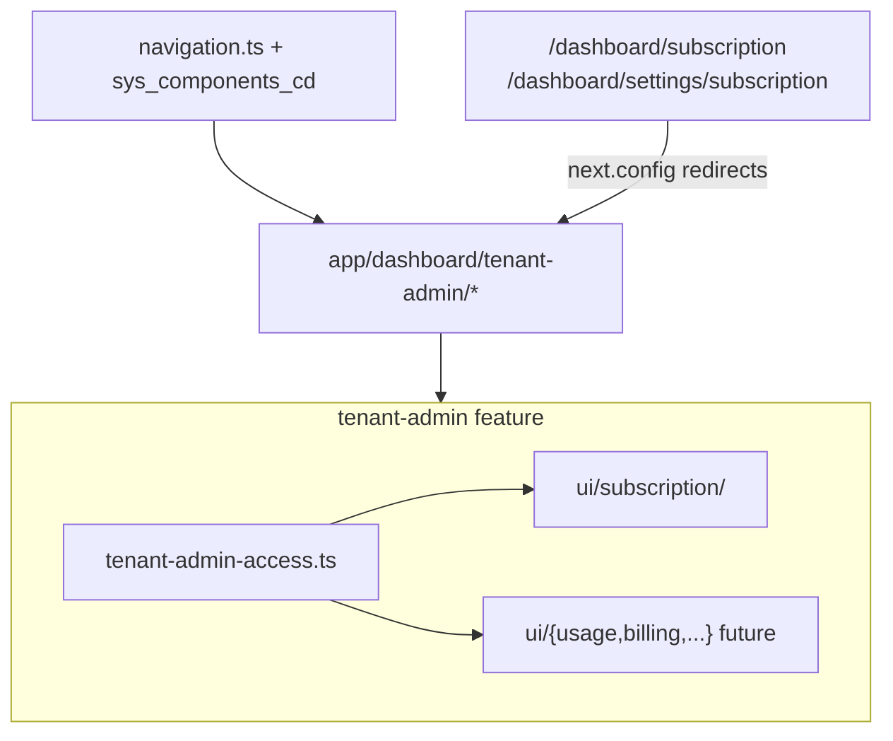

# Split core-access + Full tenant-admin (no deferrals)

## Recommendation: tenant-admin as a platform shell feature

Treat **tenant-admin** like [settings](web-admin/src/features/settings) or [marketing](web-admin/src/features/marketing/access/marketing-access.ts): one feature folder, one access file, many surfaces under a **stable URL namespace**.



### Scope boundary (lock this)

| Belongs in tenant-admin | Stays elsewhere |
|-------------------------|-----------------|
| Subscription / plan / usage / SaaS self-service | General settings (branding, tax, workflows) → `settings` |
| Future: billing profile, plan upgrade, invoices | Team / RBAC → `settings/users`, `users` feature |
| Tenant-level ops tied to CleanMateX platform | Operational modules (orders, inventory, reports) |

**Do not** put users or general settings under tenant-admin. The `tenant_admin` **role** in RBAC is separate from the **tenant-admin feature module** name—nav roles can still include `tenant_admin`.

### URL convention (Strategy A — from day one)

- **Canonical:** `/dashboard/tenant-admin/subscription` (only `page.tsx` + one `routePattern`)
- **Remove** legacy pages: [app/dashboard/subscription/page.tsx](web-admin/app/dashboard/subscription/page.tsx), [app/dashboard/settings/subscription/page.tsx](web-admin/app/dashboard/settings/subscription/page.tsx)
- **Redirects** in `next.config` (not redirect `page.tsx`—registry requires one contract per `page.tsx`):

```ts
// next.config — illustrative
{ source: '/dashboard/subscription', destination: '/dashboard/tenant-admin/subscription', permanent: true },
{ source: '/dashboard/subscription/:path*', destination: '/dashboard/tenant-admin/subscription/:path*', permanent: true },
{ source: '/dashboard/settings/subscription', destination: '/dashboard/tenant-admin/subscription', permanent: true },
```

- Future surfaces: `/dashboard/tenant-admin/usage`, `/dashboard/tenant-admin/billing`, etc.

### Module layout

```
web-admin/src/features/tenant-admin/
  access/tenant-admin-access.ts     # all /dashboard/tenant-admin/* contracts
  ui/subscription/
    tenant-admin-subscription-screen.tsx   # extract from legacy page; Cmx + fix Badge variants
  hooks/                            # optional: useTenantSubscription, etc.
  model/                            # optional: types shared across surfaces
web-admin/app/dashboard/tenant-admin/
  subscription/page.tsx             # thin server wrapper → screen component
```

**One access file, many route blocks** (same pattern as marketing-access). Add a new block when a new surface ships—do not create `subscription-access.ts` per surface.

### Navigation (dual-write, extensible)

Move subscription **out of** the Settings children tree ([navigation.ts](web-admin/config/navigation.ts) `settings_subscription` at ~L910).

Add a dedicated nav section (recommended: **top-level sibling** near Help, not buried in Settings):

```ts
{
  key: 'tenant_admin',
  label: 'Tenant Admin',           // i18n: tenantAdmin.nav.title
  label2: '...',
  icon: Building2,                   // or CreditCard for subscription-first
  path: '/dashboard/tenant-admin/subscription',  // default child
  roles: ['admin', 'super_admin', 'tenant_admin'],
  children: [
    {
      key: 'tenant_admin_subscription',
      label: 'Subscription',
      path: '/dashboard/tenant-admin/subscription',
      roles: ['admin', 'super_admin', 'tenant_admin', 'viewer', 'operator'],
    },
    // future: tenant_admin_usage, tenant_admin_billing
  ],
},
```

**Migration:** new `supabase/migrations/{next}_nav_tenant_admin.sql` must **dual-write**:

1. `INSERT` parent `tenant_admin` + child `tenant_admin_subscription` with canonical path
2. **Deactivate** (not leave orphaned) `settings_subscription`: `is_active = false`, `rec_status = 0`, or `UPDATE comp_path` + deactivate — match project nav migration pattern
3. `UPDATE parent_comp_id` for new children

Existing DB seed: `settings_subscription` in [0059_navigation_seed.sql](supabase/migrations/0059_navigation_seed.sql) at `/dashboard/settings/subscription`. Agent creates SQL only; user applies migration.

### Permissions

- **Today:** subscription routes are effectively **auth-only** + nav role visibility (matches [settings-access subscription block](web-admin/src/features/settings/access/settings-access.ts) pattern).
- **Best practice for growth:** add [lib/constants/permissions/tenant-admin-perm.ts](web-admin/lib/constants/permissions/) only when APIs need granular gates, e.g. `tenant_admin:view_subscription`, `tenant_admin:manage_subscription`—each with a DB migration in the same change.
- Do **not** invent permission codes until a route/API actually enforces them.

### Resolver fixes ([access-contract-files.ts](scripts/docs/ui-access-contract/access-contract-files.ts))

Apply the same override map in **both** `resolveAccessFileForRoute` and `defaultAccessFilePathForRoute` (scaffold/derive use the latter).

| Change | Why |
|--------|-----|
| Remove `help: 'core'` from **both** functions | Help → `help-access.ts` |
| Add `subscription: 'tenant-admin'` override | Legacy `/dashboard/subscription` tooling must not scaffold `subscription-access.ts` |
| Segment `tenant-admin` → `tenant-admin/access/tenant-admin-access.ts` | Future routes auto-resolve (hyphen folder matches `tenant[-_]` regex) |
| **Exact-route map** (highest priority): `/dashboard` → `dashboard-access.ts` | Fixes bug: `/dashboard` has no `segment[1]`; score is only 1 (< 2 threshold) so it wrongly stays on `core-access` today |
| Remove subscription block from `settings-access.ts` | Single owner: tenant-admin |

Add [scripts/docs/ui-access-contract/access-contract-files.test.ts](scripts/docs/ui-access-contract/access-contract-files.test.ts) covering `/dashboard`, `/dashboard/help`, `/dashboard/tenant-admin/subscription`, `/dashboard/subscription` (legacy derive target).

---

## core-access split (complete, not partial)

| Domain | Routes | Target |
|--------|--------|--------|
| Dashboard | `/dashboard` | `dashboard/access/dashboard-access.ts` |
| Help | `/dashboard/help`, `/dashboard/help/platform-inventories` | `help/access/help-access.ts` |
| Subscription | canonical only | `tenant-admin/access/tenant-admin-access.ts` |
| Customers | 4 | `customers/access/customers-access.ts` |
| Users | 3 | `users/access/users-access.ts` |
| Inventory | 3 | `inventory/access/inventory-access.ts` |
| Reports | 9 | `reports/access/reports-access.ts` |
| Debug | `/dashboard/jhtestui` | slim `core-access.ts` only |

Update [page-access-registry.ts](web-admin/src/features/access/page-access-registry.ts): import/spread all new modules; run `register --fix` if needed.

**Registry rule:** every `app/**/page.tsx` has exactly one matching `routePattern`; `uniquePatterns.size === pageRoutes.length` ([page-access-registry.test.ts](web-admin/__tests__/auth/page-access-registry.test.ts)).

---

## Link and reference updates

| File | Change |
|------|--------|
| [UsageWidget.tsx](web-admin/src/features/dashboard/ui/UsageWidget.tsx) | → `/dashboard/tenant-admin/subscription` |
| [SubscriptionSettings.tsx](web-admin/src/features/settings/ui/SubscriptionSettings.tsx) | → canonical URL (3 `router.push` calls) |
| [RequireFeature.tsx](web-admin/src/features/auth/ui/RequireFeature.tsx) | Upgrade button: `/dashboard/settings/subscription` → canonical |
| [plan-limits.middleware.ts](web-admin/lib/middleware/plan-limits.middleware.ts) | `/dashboard/subscription/upgrade` **does not exist** — use `/dashboard/tenant-admin/subscription` (upgrade is in-page modal on legacy page) |
| [e2e/subscription.spec.ts](web-admin/e2e/subscription.spec.ts) | canonical URL |
| Help [help/page.tsx](web-admin/app/dashboard/help/page.tsx) | use `help-access` exports, not raw `HELP_PERMISSIONS` |
| [platform-inventories-screen.tsx](web-admin/src/features/help/ui/platform-inventories-screen.tsx) | import permission from `help-access` export (align with wire) |
| [platform-info-inventory.json](web-admin/data/platform/platform-info-inventory.json) | run `sync:ui-access-contract` / `check:platform-info-inventories` after moves |

**Subscription contract merge:** when building `tenant-admin-access.ts`, carry over full `apiDependencies` from [core-access subscription block](web-admin/src/features/core/access/core-access.ts) (plans, usage, upgrade, cancel, tenants/me) — the settings block only lists usage and is incomplete alone.

**UI source of truth:** delete mock [settings/subscription/page.tsx](web-admin/app/dashboard/settings/subscription/page.tsx); extract real UI from [subscription/page.tsx](web-admin/app/dashboard/subscription/page.tsx) only. Fix Badge `size` prop + `danger` → `destructive` on CmxButton (pre-existing `ts.err` failures).

---

## Single rollout sequence (no deferred PR-E)

Execute on one branch. **Registry atomicity:** steps 2–5 must land in the **same commit** so page count (−2 legacy +1 canonical = −1 net) matches contract count (−2 patterns +1 = −1 net). Never leave orphan `routePattern`s for deleted `page.tsx` files.

1. **Resolver + tests** — both resolver functions; exact-route map; `subscription` override
2. **Create all access files** — move blocks from core-access; create `help/access/` (UI already at `src/features/help/ui/`); create `dashboard/access/`; merge subscription into `tenant-admin-access.ts`
3. **Registry** — `npm run register:ui-access-contract -- --fix` from repo root; verify imports in [page-access-registry.ts](web-admin/src/features/access/page-access-registry.ts)
4. **Tenant-admin UI + URL** — canonical `page.tsx`; delete both legacy subscription pages; add **first** `redirects()` in [next.config.ts](web-admin/next.config.ts) (none exist today)
5. **Slim core-access** — only `jhtestui`; remove moved blocks from core + settings subscription block
6. **Navigation dual-write** — navigation.ts + nav migration; i18n EN/AR (`tenantAdmin.*`)
7. **Deep links** — table above (including RequireFeature)
8. **Wire gates** — `npm run wire:ui-access-contract -- --fix` for moved routes; help platform-inventories already gated — align imports to `help-access` exports
9. **Docs/skills** — ui-access-contract-pattern, user_guide
10. **Validation gate** — all must pass:

```bash
# repo root (ui-access-contract scripts live here)
npm run register:ui-access-contract -- --fix
npm run wire:ui-access-contract -- --fix
npm run check:ui-access-contract -- --wire
npm run sync:ui-access-contract          # or rebuild:ui-access-contract if drift persists
npm run check:platform-info-inventories  # includes web-admin jest registry tests

cd web-admin
npx eslint . --quiet
npm run build
```

---

## Skills to load before writing

| Area | Skill |
|------|-------|
| Access contract split | `/rebuild-ui-access-contract` (or project equivalent) |
| Nav + migration | `/navigation` |
| Subscription screen | `/frontend`, `/i18n` |
| API routes if touched | `/backend` |
| SQL migration | `/database` |

---

## Plan audit — gaps and bugs (addressed above)

| Severity | Issue | Fix |
|----------|-------|-----|
| **Blocker** | `/dashboard` resolver always maps to `core-access` (score 1, no segment) | Exact-route override → `dashboard-access.ts` |
| **Blocker** | Registry test: `uniquePatterns.size === pageRoutes.length` — interim state with 2 subscription patterns + 2 pages fails | Atomic commit: delete legacy pages + remove 2 patterns + add 1 in same change |
| **Blocker** | `defaultAccessFilePathForRoute` still has `help: 'core'` — scaffold would write wrong file | Mirror overrides in both functions |
| **High** | `/dashboard/subscription/upgrade` referenced in middleware but **no page exists** | Point to canonical subscription (in-page upgrade flow) |
| **High** | [RequireFeature.tsx](web-admin/src/features/auth/ui/RequireFeature.tsx) hardcodes `/dashboard/settings/subscription` | Missing from original link table — added |
| **High** | Nav migration must deactivate `settings_subscription` in DB, not only add new rows | Explicit deactivate in migration |
| **High** | `subscription` segment would scaffold `subscription-access.ts` during derive | Override `subscription` → `tenant-admin` |
| **Medium** | Validation commands ran from `web-admin/` but `check:ui-access-contract` is root `package.json` | Fixed command block |
| **Medium** | `next.config.ts` has no `redirects` today — must add `redirects()` export | First-time setup |
| **Medium** | Two subscription UIs (full legacy vs settings mock) — plan must pick one | Legacy only; delete mock |
| **Medium** | Tenant-admin contract needs core-access API deps, not settings-only block | Merge apiDependencies |
| **Medium** | `register:ui-access-contract --fix` not in original sequence | Added step 3 |
| **Low** | `help` feature folder partially exists (`src/features/help/ui/`) — only `access/` missing | Note in scaffold |
| **Low** | `typescript.ignoreBuildErrors: true` masks Badge errors — still fix for cleanliness | Fix during UI extract |
| **Low** | DB `settings_subscription` roles (`admin` only) drift from navigation.ts roles | Align in new migration |

## Out of scope (follow-up epic)

**Settings sidebar categorization** — `/dashboard/settings` today is one flat `config_settings` group (16 children) because features were added incrementally under a single parent in [`navigation.ts`](web-admin/config/navigation.ts). The sidebar supports only **2 levels** (`NavigationSection` → flat `NavigationItem[]`; no nested groups). User confirmed **this rollout moves Subscription to Tenant Admin only**; remaining settings stay flat until a follow-up.

Recommended follow-up categories (multiple top-level sections, no URL changes):

| Section | Items |
|---------|--------|
| **Organization** | General, All Settings, Tenant, Branches, Branding |
| **Security & access** | User Preferences, Team Members, Roles, Permissions, Workflow Roles |
| **Finance setup** | Finance, Payment Setup, Tax Setup |
| **Operations** | Workflows, Navigation |

Each split requires dual-write (`navigation.ts` + `sys_components_cd` migration) per navigation rules.

## Risks / follow-ups

- **User applies** nav DB migration after review (agent never runs migrate).
- Subscription upgrade stays **in-page** on canonical route unless a dedicated `/tenant-admin/subscription/upgrade` page is added later (would need its own contract + page).
- If subscription APIs later need RBAC, add `tenant-admin-perm.ts` + migration—not blocking this split.
