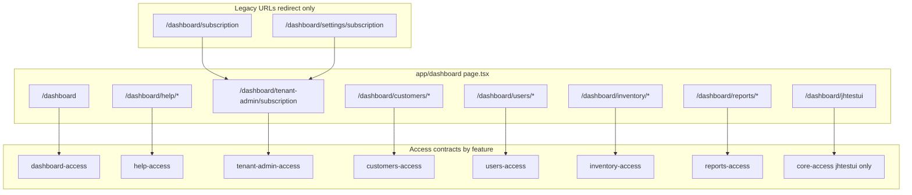

# Split core-access.ts — production-ready plan (no gaps)

## Rollout status (2026-06-26)

| Phase | Status | Notes |
|-------|--------|-------|
| 0 Preflight + resolver | **Done** | `access-contract-files.ts` + tests |
| 1 Contract split | **Done** | 8 modules; `core-access` = jhtestui only |
| 2 Registry | **Done** | All modules in `page-access-registry.ts` |
| 3 Wire | **Done** | `check --wire` passes; 3-tier API model |
| 4 Tenant-admin | **Done** | Canonical URL, redirects, nav `0389`, migration applied |
| 5 API gates | **Done** | Via tiers — not blanket `requirePermission` |
| 6 Perm constants | **Skipped** | Optional hygiene; inline literals still valid |
| 7 Extra tests | **Skipped** | Resolver tests exist; registry cases optional |
| 8 Docs/skills | **Done** | pattern.mdc, user_guide, rollout, SKILL |
| 9 Inventories | **Done** | sync + 0 drift; **commit local diff still pending** |

**Do not re-run this plan end-to-end.** Use `split_core-access_+_tenant-admin_886efe41.plan.md` as the executed rollout record.

## Definition of done

All items must be true before merge:

- [x] `core-access.ts` contains **only** `/dashboard/jhtestui` (debug)
- [x] **Zero** duplicate `routePattern` across all `*-access.ts` (registry Jest passes)
- [x] Every dashboard `page.tsx` resolves via `getPageAccessContractByPath` (registry Jest passes)
- [x] `resolveAccessFileForRoute` tests pass for `/dashboard`, help, subscription URLs, customers, jhtestui
- [x] `npm run check:ui-access-contract -- --wire --verbose` → no FAIL
- [x] `npm run check:platform-info-inventories` passes; no **new** drift in DRIFT_REPORT
- [ ] `npm run build` + `cd web-admin && npx eslint . --quiet` pass (on uncommitted diff)
- [x] Tenant-admin: **one** canonical subscription URL, legacy URLs redirect, nav dual-write complete
- [x] All deep links updated (`UsageWidget`, `SubscriptionSettings`, `plan-limits.middleware`, e2e)
- [x] Docs/skills/rules updated; `features:ui-access-contract` lists new feature keys
- [x] **Mandatory skills loaded** for every artifact type created (see table below)

---

## Mandatory skill loading (CLAUDE.md — no exceptions)

Before writing code/SQL/migrations for this rollout, **load the skill first**, then implement. This applies to agents and humans executing the plan.

| Work | Load skill first | Also applies |
|------|------------------|--------------|
| New/renamed **menu route** + `sys_components_cd` | **`/navigation`** | Dual-write: [navigation.ts](web-admin/config/navigation.ts) + `supabase/migrations/{next}_nav_*.sql` |
| New **`app/dashboard/**/page.tsx`** or feature UI | **`/frontend`** | Cmx only (`web-admin/.clauderc`); `next/link`; no raw HTML |
| New **`*-access.ts`**, wire, derive, registry | **`/rebuild-ui-access-contract`** | [ui-access-contract-pattern.mdc](.cursor/rules/ui-access-contract-pattern.mdc) |
| **`/api/**/route.ts`** gates, services | **`/backend`** | `requirePermission`; tenant context |
| Any **`org_*`** query in moved logic | **`/multitenancy`** | `tenant_org_id` filter |
| **SQL migrations** (nav, permissions) | **`/database`** | Never edit existing migrations; new file only |
| New **permission codes** in DB | **`/database`** + permissions rule | `*_permissions_*.sql`; mirror in `lib/constants/permissions/` |
| **i18n** keys (EN/AR) | **`/i18n`** | Reuse existing keys; `npm run check:i18n` |
| **E2E** updates | **`/testing`** | [e2e/subscription.spec.ts](web-admin/e2e/subscription.spec.ts) |
| Nav or contract **inventories drift** | **`/rebuild-platform-info-inventories`** | After dual-write or sync |
| End-to-end **feature module** (tenant-admin) | **`/implementation`** | PRD checklist: permissions, nav, i18n, API, migrations |

### Per-phase skill checklist

| Phase | Skills to load before starting |
|-------|-------------------------------|
| **0** Resolver/tests | `/database` (read-only conventions) if touching scripts; `/testing` for new test file |
| **1** Contract files | `/rebuild-ui-access-contract` |
| **2** Registry + derive | `/rebuild-ui-access-contract`; `/navigation` if derive reads nav for permissions |
| **3** Wire page gates | `/frontend`; `/rebuild-ui-access-contract` |
| **4** Tenant-admin (pages, nav, UI) | **`/navigation`** → **`/frontend`** → **`/i18n`** → `/rebuild-ui-access-contract` (update contract for canonical URL) |
| **5** API gates | `/backend` |
| **6** Permission constants | `/database` (verify DB codes); constants-db-mirror rule |
| **7** Tests | `/testing` |
| **8** Docs | `/documentation` or `/code-documentation` for skill/rule edits |
| **9** Inventories | `/rebuild-platform-info-inventories` |

### Phase 4 execution order (tenant-admin — skills enforced)

When creating canonical route `/dashboard/tenant-admin/subscription`:

1. **`/navigation`** — design `comp_code`, parent, permissions, `display_order`; draft migration SQL; update `navigation.ts` **before** derive on contracts
2. **`/database`** — create `{next}_nav_tenant_admin_subscription.sql` (do not apply via agent — file only for user review)
3. **`/frontend`** — `src/features/tenant-admin/ui/*`, thin `app/dashboard/tenant-admin/subscription/page.tsx`, legacy redirect pages (Cmx components only)
4. **`/i18n`** — bilingual keys EN+AR; search `settings.*` / `subscription.*` for reuse
5. **`/rebuild-ui-access-contract`** — update `tenant-admin-access.ts` routePattern to canonical URL; `derive --apply`; `wire --fix`; `check --wire`
6. **`/backend`** — verify subscription API routes match `apiDependencies`
7. **`/testing`** — update e2e; run targeted tests
8. **`/rebuild-platform-info-inventories`** — refresh after nav + contract stable

**Menu-visible rule:** If tenant-admin appears in sidebar, steps 1–2 are **mandatory** (not optional). If subscription stays settings-adjacent in nav only as redirect target, still dual-write when **any** nav entry path or `comp_code` changes.

---

## Phase 0 — Preflight and tooling (do first)

### 0.1 Baseline snapshot

```bash
npm run check:ui-access-contract -- --wire --verbose
cd web-admin && npm run check:access-contracts
npm run features:ui-access-contract
```

Record:

- Dashboard `page.tsx` count (registry test source of truth)
- `routePattern` count in `CORE_ACCESS_CONTRACTS` (expect 24 today)
- Wire FAIL/WARN list per domain (fix during rollout)

### 0.2 Resolver redesign (blocker — before any file moves)

Refactor [access-contract-files.ts](scripts/docs/ui-access-contract/access-contract-files.ts) to use **explicit override tables** evaluated in order:

```ts
// 1) Exact route wins (highest priority)
const EXACT_ROUTE_ACCESS_FILE: Record<string, string> = {
  '/dashboard': 'dashboard',
  '/dashboard/settings/subscription': 'tenant-admin',
}

// 2) First URL segment overrides (existing workflow rules)
const SEGMENT_FEATURE_OVERRIDES: Record<string, string> = {
  internal_fin: 'billing',
  preparation: 'orders',
  // ... keep workflow segments
  subscription: 'tenant-admin',  // /dashboard/subscription
  // REMOVE help: 'core'
}

// 3) Prefix overrides (vouchers special case — keep)
// 4) longestRoutePrefix score across *-access.ts files (score >= 2)
// 5) segment → features/{segment}/access/{segment}-access.ts
// 6) fallback null (NOT wrong core file when score < 2)
```

**Critical fixes:**

| Route | Bug today | Fix |
|-------|-----------|-----|
| `/dashboard` | `segment[1]` undefined → always `core-access.ts` | `EXACT_ROUTE` → `dashboard` |
| `/dashboard/help/*` | `help: 'core'` override | Remove; use `help-access.ts` |
| `/dashboard/subscription` | lands in core | `subscription` → `tenant-admin` |
| `/dashboard/settings/subscription` | settings-access prefix score | `EXACT_ROUTE` → `tenant-admin` |
| `/dashboard/tenant-admin/subscription` | segment `tenant-admin` (hyphen folder) | Default segment resolve works via `tenant[-_]admin` regex; add resolver test |

Mirror **both** `resolveAccessFileForRoute` and `defaultAccessFilePathForRoute`.

**After Phase 4 canonical URL:** add `'/dashboard/tenant-admin/subscription': 'tenant-admin'` to `EXACT_ROUTE` if segment resolve ever fails; remove legacy exact routes only when legacy `page.tsx` files are deleted (see Phase 4.1).

### 0.3 Resolver tests (add before moves)

New file: [access-contract-files.test.ts](scripts/docs/ui-access-contract/access-contract-files.test.ts)

Minimum cases:

- `/dashboard` → `features/dashboard/access/dashboard-access.ts`
- `/dashboard/help`, `/dashboard/help/platform-inventories` → `help-access.ts`
- `/dashboard/subscription`, `/dashboard/settings/subscription` → `tenant-admin-access.ts`
- `/dashboard/customers`, `/dashboard/customers/[id]`, `/dashboard/customers/account-receipt` → `customers-access.ts`
- `/dashboard/users/[userId]` → `users-access.ts`
- `/dashboard/reports/reconciliation` → `reports-access.ts`
- `/dashboard/jhtestui` → `core-access.ts`
- `/dashboard/settings/general` → `settings-access.ts` (regression: settings not broken)
- `/dashboard/tenant-admin/subscription` → `tenant-admin-access.ts` (post–Phase 4)

Wire into root `package.json` or existing derive test script runner.

---

## Route manifest (every contract block)

| routePattern | Target file | Single-route export (wire) |
|--------------|-------------|------------------------------|
| `/dashboard` | `dashboard/access/dashboard-access.ts` | `DASHBOARD_ACCESS` |
| `/dashboard/help` | `help/access/help-access.ts` | `HELP_HELP_ACCESS` |
| `/dashboard/help/platform-inventories` | help-access | `HELP_PLATFORM_INVENTORIES_ACCESS` |
| `/dashboard/subscription` | tenant-admin-access | `TENANT_ADMIN_SUBSCRIPTION_ACCESS` (interim PR-B; see Phase 4.1) |
| `/dashboard/settings/subscription` | tenant-admin-access | `TENANT_ADMIN_SETTINGS_SUBSCRIPTION_ACCESS` (interim PR-B) |
| `/dashboard/tenant-admin/subscription` | tenant-admin-access | `TENANT_ADMIN_CANONICAL_SUBSCRIPTION_ACCESS` (final PR-E) |
| `/dashboard/customers` | `customers/access/customers-access.ts` | `CUSTOMERS_ACCESS` |
| `/dashboard/customers/account-receipt` | customers-access | `CUSTOMERS_ACCOUNT_RECEIPT_ACCESS` |
| `/dashboard/customers/stored-value` | customers-access | `CUSTOMERS_STORED_VALUE_ACCESS` |
| `/dashboard/customers/[id]` | customers-access | `CUSTOMERS_DETAIL_ACCESS` |
| `/dashboard/users` | `users/access/users-access.ts` | `USERS_ACCESS` |
| `/dashboard/users/new` | users-access | `USERS_NEW_ACCESS` |
| `/dashboard/users/[userId]` | users-access | `USERS_DETAIL_ACCESS` |
| `/dashboard/inventory` | `inventory/access/inventory-access.ts` | `INVENTORY_ACCESS` |
| `/dashboard/inventory/stock` | inventory-access | `INVENTORY_STOCK_ACCESS` |
| `/dashboard/inventory/machines` | inventory-access | `INVENTORY_MACHINES_ACCESS` |
| `/dashboard/reports` | `reports/access/reports-access.ts` | `REPORTS_ACCESS` |
| `/dashboard/reports/orders` | reports-access | `REPORTS_ORDERS_ACCESS` |
| `/dashboard/reports/payments` | reports-access | `REPORTS_PAYMENTS_ACCESS` |
| `/dashboard/reports/invoices` | reports-access | `REPORTS_INVOICES_ACCESS` |
| `/dashboard/reports/revenue` | reports-access | `REPORTS_REVENUE_ACCESS` |
| `/dashboard/reports/financial` | reports-access | `REPORTS_FINANCIAL_ACCESS` |
| `/dashboard/reports/customers` | reports-access | `REPORTS_CUSTOMERS_ACCESS` |
| `/dashboard/reports/print` | reports-access | `REPORTS_PRINT_ACCESS` |
| `/dashboard/reports/reconciliation` | reports-access | `REPORTS_RECONCILIATION_ACCESS` |
| `/dashboard/jhtestui` | `core/access/core-access.ts` | `JHTESTUI_ACCESS` (optional) |

**Count (interim PR-B/C):** 24 from core + 1 from settings = **25** contract patterns in new modules; core retains **1** (`jhtestui`).

**Count (final PR-E):** See Phase 4.1 — registry requires **one `routePattern` per `page.tsx`**. Canonical rollout adjusts tenant-admin from 2→1 or 3 patterns depending on redirect strategy.

---

## Phase 1 — Atomic contract migration

**Rule:** For each domain, in **one commit**: create `*-access.ts` → copy blocks → add single-route exports → delete blocks from source → run registry test.

### 1.1 File templates

Each new file follows marketing pattern:

```ts
import type { PageAccessContract } from '@/lib/auth/access-contracts'
import { HELP_PERMISSIONS } from '@/lib/constants/permissions/help' // when applicable

export const HELP_ACCESS_CONTRACTS: PageAccessContract[] = [ /* ... */ ]

export const HELP_PLATFORM_INVENTORIES_ACCESS =
  HELP_ACCESS_CONTRACTS.find((c) => c.routePattern === '/dashboard/help/platform-inventories')!
```

Export naming: `{FEATURE}_{ROUTE_SEGMENTS}_ACCESS` (upper snake).

### 1.2 Tenant-admin contract merge

Create [tenant-admin-access.ts](web-admin/src/features/tenant-admin/access/tenant-admin-access.ts):

- Move `/dashboard/subscription` block from core-access (full `apiDependencies`)
- Move `/dashboard/settings/subscription` from [settings-access.ts](web-admin/src/features/settings/access/settings-access.ts)
- **Deduplicate** `apiDependencies` by `path` + `method` (one entry per `/api/v1/subscriptions/*`, `/api/v1/tenants/me`)
- Add `notes` documenting canonical URL (Phase 4)
- **Delete** subscription block from settings-access in same commit

### 1.3 Slim core-access

Final [core-access.ts](web-admin/src/features/core/access/core-access.ts): only `jhtestui` + `CORE_NOTES`. Remove `HELP_PERMISSIONS` import.

### 1.4 Grep gate (run after every domain commit)

Duplicate **values** of `routePattern` (not duplicate lines):

```bash
# PowerShell-friendly: fail if any routePattern appears twice across access files
node -e "
const fs=require('fs'),path=require('path');
const glob=require('glob')||null;
const files=require('child_process').execSync('git ls-files web-admin/src/features/**/access/*-access.ts',{encoding:'utf8'}).trim().split(/\r?\n/).filter(Boolean);
const counts={};
for (const f of files){const m=[...fs.readFileSync(f,'utf8').matchAll(/routePattern:\\s*['\"]([^'\"]+)['\"]/g)];for(const x of m){counts[x[1]]=(counts[x[1]]||0)+1;}}
const dups=Object.entries(counts).filter(([,n])=>n>1);
if(dups.length){console.error('Duplicate routePattern:',dups);process.exit(1);}
console.log('routePattern count',Object.keys(counts).length);
"
cd web-admin && npm run check:access-contracts
```

Or manually: `rg "routePattern:" web-admin/src/features --no-filename -o` and verify unique values.

---

## Phase 2 — Registry and derive refresh

### 2.1 Registry

Update [page-access-registry.ts](web-admin/src/features/access/page-access-registry.ts):

```ts
import { DASHBOARD_ACCESS_CONTRACTS } from '@features/dashboard/access/dashboard-access'
import { HELP_ACCESS_CONTRACTS } from '@features/help/access/help-access'
import { TENANT_ADMIN_ACCESS_CONTRACTS } from '@features/tenant-admin/access/tenant-admin-access'
import { CUSTOMERS_ACCESS_CONTRACTS } from '@features/customers/access/customers-access'
import { USERS_ACCESS_CONTRACTS } from '@features/users/access/users-access'
import { INVENTORY_ACCESS_CONTRACTS } from '@features/inventory/access/inventory-access'
import { REPORTS_ACCESS_CONTRACTS } from '@features/reports/access/reports-access'
// CORE_ACCESS_CONTRACTS — jhtestui only
```

Alphabetical imports/spreads. Run `npm run register:ui-access-contract -- --fix`.

### 2.2 Derive per feature (nav + code parity)

After contracts exist, refresh from code/navigation:

```bash
npm run derive:ui-access-contract -- --feature=reports --apply --refresh-extract
npm run derive:ui-access-contract -- --feature=customers --apply --refresh-extract
# repeat: help, dashboard, tenant-admin, users, inventory
```

**Reports (required):** fix pre-existing drift:

- `reports/financial`: nav has `finance_reports:view` + `advanced_analytics` — derive should merge into contract
- `reports/reconciliation`: already has both in core block — verify after move

**Customers:** derive may add action hooks from feature UI if present.

Use `--prune-stale` only after reviewing dry-run (comments orphans, never deletes).

---

## Phase 3 — Page gates (exhaustive)

### 3.1 Wire automation

Per feature (dry-run first, then `--fix`):

```bash
npm run wire:ui-access-contract -- --feature=dashboard --fix --dry-run
npm run wire:ui-access-contract -- --feature=help --fix --dry-run
# tenant-admin: wire interim legacy pages in PR-B/C; re-wire after PR-E canonical URL
npm run wire:ui-access-contract -- --feature=customers --fix --dry-run
npm run wire:ui-access-contract -- --feature=users --fix --dry-run
npm run wire:ui-access-contract -- --feature=inventory --fix --dry-run
npm run wire:ui-access-contract -- --feature=reports --fix --dry-run
```

### 3.2 Manual gates (wire cannot auto-fix)

| Page | Pattern |
|------|---------|
| `help/platform-inventories/page.tsx` | `RequireAnyPermission` + `HELP_PLATFORM_INVENTORIES_ACCESS.page.permissions` |
| `help/page.tsx` | Gate Platform Inventories card via `HELP_HELP_ACCESS.actions.openPlatformInventories` |
| `customers/account-receipt/page.tsx` | Often server/async — `hasPermissionServer` + contract permissions |
| `users/[userId]/page.tsx` | async server if applicable |
| Subscription pages (Phase 4) | After canonical route stabilizes |

### 3.3 Remove permission duplication in UI

- [platform-inventories-screen.tsx](web-admin/src/features/help/ui/platform-inventories-screen.tsx): stop exporting `PLATFORM_INVENTORIES_PERMISSION` for gates; pages import from `help-access.ts`. Screen may import constant from `lib/constants/permissions/help` for display-only if needed.

### 3.4 Full wire validation

```bash
npm run check:ui-access-contract -- --wire --verbose
```

Target: **0 PAGE FAIL** for moved routes. Document remaining WARN for `/app/actions/*` and `/tenant-api/*` as expected.

---

## Phase 4 — Tenant-admin product module (full consolidation)

User requirement: **create tenant-admin and move all subscription things** — not contracts-only.

### 4.1 Canonical URL and registry constraint (critical)

Registry Jest ([page-access-registry.test.ts](web-admin/__tests__/auth/page-access-registry.test.ts)) requires:

1. Every `app/dashboard/**/page.tsx` path resolves via `getPageAccessContractByPath`
2. `uniquePatterns.size === pageRoutes.length` (one contract per page file)

**You cannot** have redirect `page.tsx` files at legacy URLs **without** a matching `routePattern`, and **cannot** add a new canonical `page.tsx` without adding its contract — otherwise CI fails.

**Choose one strategy (document in PR-E):**

| Strategy | Legacy `/dashboard/subscription` | Legacy `/dashboard/settings/subscription` | Canonical page | Contract blocks |
|----------|----------------------------------|-------------------------------------------|----------------|-----------------|
| **A (recommended)** | `next.config` redirect — **delete** `page.tsx` | redirect — **delete** `page.tsx` | `tenant-admin/subscription/page.tsx` | **1** pattern: `/dashboard/tenant-admin/subscription` |
| **B** | thin `page.tsx` redirect | thin `page.tsx` redirect | canonical page | **3** patterns (legacy `page: {}` + notes `"redirect only"`, canonical full block) |

Strategy **A** is production-cleanest: no orphan page files, single contract, single screen.

```ts
// next.config.ts redirects (example — verify Next.js 16 API)
{ source: '/dashboard/subscription', destination: '/dashboard/tenant-admin/subscription', permanent: true },
{ source: '/dashboard/settings/subscription', destination: '/dashboard/tenant-admin/subscription', permanent: true },
```

If using Strategy A: remove interim `TENANT_ADMIN_SUBSCRIPTION_ACCESS` / `SETTINGS_SUBSCRIPTION` blocks from tenant-admin-access in PR-E; replace with one canonical block (merge `apiDependencies` once).

| Role | URL |
|------|-----|
| **Canonical** | `/dashboard/tenant-admin/subscription` |
| **Legacy** | Config redirects only (no `page.tsx` at legacy paths) |

### 4.2 Feature module structure

**Load `/frontend` skill before creating files.** Use Cmx imports from `web-admin/.clauderc`; feature UI under `src/features/tenant-admin/ui/`, routing only in `app/`.

```
src/features/tenant-admin/
  access/tenant-admin-access.ts     # Phase 1 (/rebuild-ui-access-contract)
  ui/tenant-admin-subscription-screen.tsx   # extract from legacy subscription/page.tsx (API-backed)
  ui/index.ts
```

- **Source of truth for UI:** [app/dashboard/subscription/page.tsx](web-admin/app/dashboard/subscription/page.tsx) (real API integration)
- **Deprecate:** inline mock in [settings/subscription/page.tsx](web-admin/app/dashboard/settings/subscription/page.tsx) — replace with feature screen import
- [SubscriptionSettings.tsx](web-admin/src/features/settings/ui/SubscriptionSettings.tsx): update links to canonical URL; move file to `tenant-admin/ui` or re-export from tenant-admin

### 4.3 New route

- Create `app/dashboard/tenant-admin/subscription/page.tsx` composing `TenantAdminSubscriptionScreen`
- **Strategy A:** delete legacy `app/dashboard/subscription/page.tsx` and `app/dashboard/settings/subscription/page.tsx`; add `next.config` redirects
- **Strategy B:** keep thin redirect `page.tsx` at legacy paths **and** keep matching `routePattern` blocks in contract

**Contract update (PR-E):**

- Final: **one** `routePattern: '/dashboard/tenant-admin/subscription'` (Strategy A) or three (Strategy B)
- Re-run `npm run check:access-contracts` — page count must equal unique pattern count
- `derive --apply` + `wire --fix` on `--feature=tenant-admin`

### 4.4 Navigation dual-write

**Load `/navigation` skill first** (then `/database` for migration SQL). Do not edit `navigation.ts` or create migrations without it.

1. Update [navigation.ts](web-admin/config/navigation.ts): add `tenant_admin` / `tenant_admin_subscription` entry pointing to `/dashboard/tenant-admin/subscription` (`permissions`, `roles`, `featureFlag` aligned with `tenant-admin-access.ts`)
2. Remove or repoint `settings_subscription` child under settings
3. New migration: `supabase/migrations/{next}_nav_tenant_admin_subscription.sql` seeding `sys_components_cd` (permissions, roles, bilingual `label`/`label2`, `description`/`description2`, parent `comp_id`, `display_order`)
4. Append block to `docs/navigation/add_sys_comp.sql` per navigation skill convention
5. **User applies migration** (agent creates file only — never run Supabase migrate)
6. Load **`/rebuild-platform-info-inventories`** → verify nav↔contract parity in `DRIFT_REPORT.md`

### 4.5 Deep link updates

| File | Change |
|------|--------|
| [UsageWidget.tsx](web-admin/src/features/dashboard/ui/UsageWidget.tsx) | `/dashboard/tenant-admin/subscription` |
| [SubscriptionSettings.tsx](web-admin/src/features/settings/ui/SubscriptionSettings.tsx) | canonical URL |
| [plan-limits.middleware.ts](web-admin/lib/middleware/plan-limits.middleware.ts) | `upgradeUrl` → canonical path; verify `/upgrade` route exists or use `?action=upgrade` on canonical URL |
| [e2e/subscription.spec.ts](web-admin/e2e/subscription.spec.ts) | goto canonical URL |

### 4.6 i18n

**Load `/i18n` skill first.** Search existing keys under `settings` / `subscription` in `messages/en.json` + `messages/ar.json`; reuse before adding `tenantAdmin.subscription.*`. Run `npm run check:i18n` after edits.

---

## Phase 5 — API gates audit

For each `apiDependencies` entry with local `/api/*` path in moved contracts:

| Domain | Example paths | Action |
|--------|---------------|--------|
| dashboard | `/api/dashboard/workflow-stats`, `/api/orders/overdue` | Verify `requirePermission` or document auth-only in notes |
| customers | `/api/v1/customers/*` | `wire --fix` or manual `requirePermission` |
| tenant-admin | `/api/v1/subscriptions/*` | Add guards if missing |
| help | `/api/dev/platform-inventories` | Match `help:platform_inventories` |

`/tenant-api/*` entries: keep `notes` (manual/upstream RBAC) — wire reports external/manual (expected WARN).

```bash
npm run audit-wire:ui-access-contract -- --feature=customers
npm run audit-wire:ui-access-contract -- --feature=tenant-admin
```

---

## Phase 6 — Permission constants (production hygiene)

Only [help.ts](web-admin/lib/constants/permissions/help.ts) exists today. Add mirrored files **without new DB migrations** (codes already in DB from existing nav/seeds):

| File | Codes to centralize (from contracts/nav) |
|------|---------------------------------------------|
| `permissions/customers-perm.ts` | `customers:read`, `customers:create`, `customers:update`, `customers:receipt_allocate`, `stored_value:view_balances` |
| `permissions/users-perm.ts` | (tenant-api only — optional stub / notes) |
| `permissions/inventory-perm.ts` | `inventory:read` |
| `permissions/reports-perm.ts` | `finance_reports:view` + feature flag keys stay in flag constants |
| `permissions/tenant-admin-perm.ts` | subscription-related if any explicit codes added later |

Refactor moved `*-access.ts` to import constants (same PR as files or follow-up immediately after). Values must **verbatim** match DB (`constants-db-mirror` rule).

---

## Phase 7 — Tests

### 7.1 Extend [page-access-registry.test.ts](web-admin/__tests__/auth/page-access-registry.test.ts)

Add resolution cases:

```ts
expect(getPageAccessContractByPath('/dashboard')?.routePattern).toBe('/dashboard')
expect(getPageAccessContractByPath('/dashboard/help/platform-inventories')?.routePattern).toBe('...')
expect(getPageAccessContractByPath('/dashboard/tenant-admin/subscription')?.routePattern).toBe('...')
expect(getPageAccessContractByPath('/dashboard/customers/abc')?.routePattern).toBe('/dashboard/customers/[id]')
```

After tenant-admin URL change: update dynamic route test if new segment added.

### 7.2 [derive-contract.test.ts](scripts/docs/ui-access-contract/derive-contract.test.ts)

Assert `resolveAccessFileForRoute('/dashboard/customers/account-receipt')` ends with `customers-access.ts` (not core).

### 7.3 E2E

Run `web-admin/e2e/subscription.spec.ts` after Phase 4 URL changes.

### 7.4 CI script bundle (final)

```bash
npx tsx scripts/docs/ui-access-contract/access-contract-files.test.ts
cd web-admin && npm run check:access-contracts
npm run check:ui-access-contract -- --wire --verbose
npm run check:platform-info-inventories
cd web-admin && npx eslint . --quiet
npm run build
```

---

## Phase 8 — Documentation and skills

Update all references to help/dashboard → core:

| Artifact | Action |
|----------|--------|
| [.cursor/rules/ui-access-contract-pattern.mdc](.cursor/rules/ui-access-contract-pattern.mdc) | Full route → file table; core = debug only; tenant-admin row |
| [user_guide.md](docs/platform/ui-access-contract/user_guide.md) | Resolver section; `features:ui-access-contract` list |
| [.claude/skills/rebuild-ui-access-contract/references/access-contract-rollout.md](.claude/skills/rebuild-ui-access-contract/references/access-contract-rollout.md) | New modules |
| `.codex` mirror of rollout | Same |
| `features:ui-access-contract` output | Verify includes `tenant-admin`, `dashboard`, `help`, `customers`, `users`, `inventory`, `reports` |

---

## Phase 9 — Inventories

```bash
npm run sync:ui-access-contract
npm run check:platform-info-inventories
```

- Review [DRIFT_REPORT.md](docs/platform/inventories/DRIFT_REPORT.md) — fix new nav↔contract mismatches (especially reports/financial, tenant-admin nav)
- Do **not** hand-edit `GENERATED_*.md` or `platform-info-inventory.json`
- `KNOWN_EXCEPTIONS.json` stays empty unless documented legacy debt

---

## PR sequence (each PR must pass its gate column)

| PR | Scope | Must pass before merge |
|----|-------|------------------------|
| **PR-A** | Phase 0 resolver + tests only | access-contract-files.test.ts |
| **PR-B** | Contracts: dashboard, help, tenant-admin (contracts only), registry, slim core partial | check:access-contracts |
| **PR-C** | Contracts: customers, users, inventory, reports; core slim complete | check:access-contracts + derive reports |
| **PR-D** | Wire all pages + API audit | check --wire (no FAIL) |
| **PR-E** | Tenant-admin UI, canonical URL, **redirect strategy A/B**, nav migration, links, i18n, e2e | Registry test page count = pattern count; build + eslint + e2e |
| **PR-F** | Permission constants refactor + docs/skills + sync inventories | full CI bundle |

**Alternative:** single epic branch with all phases — same gates at end.

---

## Architecture after state



---

## Risk matrix (complete)

| Risk | Mitigation |
|------|------------|
| Duplicate routePattern | Atomic move+delete; `rg` uniq -d gate |
| `/dashboard` resolver bug | Phase 0 before moves |
| settings subscription double contract | Delete from settings-access same commit as tenant-admin add |
| Canonical URL breaks bookmarks | 308 redirects from legacy URLs |
| Two subscription UIs | Single `TenantAdminSubscriptionScreen`; deprecate mock settings page |
| e2e/subscription.spec.ts fails | Update in PR-E |
| ts.err Badge issues on legacy subscription page | Fix Cmx Badge/Button variants when touching page (pre-existing) |
| Large blast radius | PR-A–F with independent gates |
| Nav/DB drift | Dual-write migration in PR-E |
| derive overwrites hand-tuned notes | dry-run first; use notes merge not `--force` unless intentional |

---

## Rollback

- Each PR is revertible independently
- Reverting PR-E: if Strategy A was used, restore legacy `page.tsx` files + interim contract patterns from PR-B or registry test fails
- Never revert resolver (PR-A) without reverting contract files — overrides and files must stay aligned

---

## Plan audit — bugs found and fixed in this document

| # | Bug / gap | Severity | Resolution in plan |
|---|-----------|----------|-------------------|
| 1 | Legacy redirect `page.tsx` without `routePattern` breaks registry Jest | **Blocker** | Phase 4.1 Strategy A (config redirect, delete legacy pages) or B (3 contracts) |
| 2 | Phase 1 manifest vs Phase 4 single canonical URL conflict | **High** | Interim 2 patterns PR-B → final 1 (or 3) in PR-E with explicit count rule |
| 3 | `rg \| uniq -d` on full lines does not detect duplicate routePattern values | Medium | Fixed grep gate script in §1.4 |
| 4 | Missing `/dashboard/tenant-admin/subscription` in manifest + resolver tests | Medium | Added to manifest, resolver tests, Phase 4 |
| 5 | `subscription` segment override does not cover canonical URL | Low | `tenant-admin` segment + exact route override |
| 6 | Phase 3 `wire --feature=tenant-admin` before PR-E canonical page exists | Low | Wire tenant-admin in PR-E after canonical page; PR-B/C wire interim legacy pages only |
| 7 | PR rollback note implied legacy contracts work after canonical-only | Low | Rollback section corrected |
| 8 | `plan-limits.middleware` `upgradeUrl` `/dashboard/subscription/upgrade` — path may not exist | Low | Verify route exists or point to canonical + query `?action=upgrade` in PR-E |
| 9 | Pre-existing Badge/`danger` variant TS errors on subscription page | Low | Fix when extracting UI (PR-E); listed in risk matrix |
| 10 | Phase 5 API audit in PR-D before tenant-admin canonical APIs wired | Low | Re-run `audit-wire --feature=tenant-admin` after PR-E |

**Still acceptable (not bugs):** `/tenant-api/*` WARN; marketing-style inline permission literals until Phase 6; `HELP_HELP_ACCESS` naming matches marketing convention.
