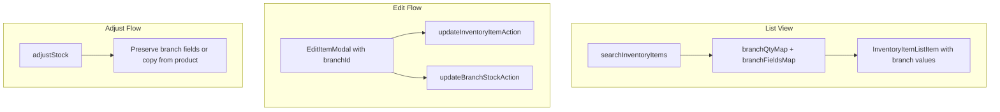

# Storage Location, SKU & Stock Fields on org_inv_stock_by_branch

## Current vs Target

| Field                                | org_inv_stock_by_branch | Used when branch set? |
| ------------------------------------ | ----------------------- | --------------------- |
| qty_on_hand                          | Yes                     | Yes (branch)          |
| reorder_point, min/max_stock_level   | Yes                     | No (product only)     |
| last_purchase_cost, storage_location | Yes                     | No (product only)     |
| **id_sku**                           | **Missing**             | No (product only)     |

**Target:** When `branch_id` is set, list/edit use branch-level values (fallback to product). Add `id_sku` to the table.

---

## 1. Database Migrations

### 1.1 Add id_sku to org_inv_stock_by_branch

**File:** `supabase/migrations/0110_add_id_sku_to_org_inv_stock_by_branch.sql`

```sql
ALTER TABLE org_inv_stock_by_branch ADD COLUMN IF NOT EXISTS id_sku TEXT;
COMMENT ON COLUMN org_inv_stock_by_branch.id_sku IS 'Branch-specific SKU; NULL = use product-level id_sku';
```

Optional backfill from product: `UPDATE org_inv_stock_by_branch b SET id_sku = p.id_sku FROM org_product_data_mst p WHERE b.product_id = p.id AND b.tenant_org_id = p.tenant_org_id AND b.id_sku IS NULL AND p.id_sku IS NOT NULL;`

### 1.2 Enhance deduct_retail_stock_for_order INSERT

**File:** `supabase/migrations/0111_deduct_copy_branch_stock_fields.sql`

When inserting a new row into `org_inv_stock_by_branch`, copy `max_stock_level`, `last_purchase_cost`, `storage_location`, `id_sku` from `org_product_data_mst` via subquery instead of hardcoded `0, 0, 0`.

Reference: [0108_enhance_deduct_retail_stock_for_order.sql](supabase/migrations/0108_enhance_deduct_retail_stock_for_order.sql) lines 72-79.

---

## 2. Types

**File:** [web-admin/lib/types/inventory.ts](web-admin/lib/types/inventory.ts)

- Add `BranchStockRecord` interface (org_inv_stock_by_branch row shape)
- Add `UpdateBranchStockRequest` with: `product_id`, `branch_id`, optional `reorder_point`, `min_stock_level`, `max_stock_level`, `last_purchase_cost`, `storage_location`, `id_sku`
- Extend `InventoryItemListItem` with optional `min_stock_level`, `last_purchase_cost` for branch-level edit UI

---

## 3. Service Layer

**File:** [web-admin/lib/services/inventory-service.ts](web-admin/lib/services/inventory-service.ts)

### 3.1 searchInventoryItems — branch-level field resolution

When `params.branch_id` is set:

- Expand branch query to select: `product_id, qty_on_hand, reorder_point, min_stock_level, max_stock_level, last_purchase_cost, storage_location, id_sku`
- Build a map of branch records per product (not only `qty_on_hand`)
- For each product: use branch values when branch row exists, otherwise fallback to product

Current logic at lines 371-384: only fetches `product_id, qty_on_hand`. Extend select and mapping.

### 3.2 New: updateBranchStock

```typescript
export async function updateBranchStock(
  request: UpdateBranchStockRequest,
): Promise<void>;
```

- Update `org_inv_stock_by_branch` for the given `product_id`, `branch_id` with only the provided fields (reorder_point, min_stock_level, max_stock_level, last_purchase_cost, storage_location, id_sku)
- Use upsert if row might not exist, or require row existence and return clear error

### 3.3 adjustStock — preserve branch-level fields

Current upsert at lines 586-604 overwrites all branch fields from product. Change to:

- If branch row exists: update only `qty_on_hand`, `updated_at`
- If no row: insert with `qty_on_hand`, and copy `reorder_point`, `min_stock_level`, `max_stock_level`, `last_purchase_cost`, `storage_location`, `id_sku` from product

This requires checking existence before upsert, or using an upsert that only overwrites `qty_on_hand` on conflict.

### 3.4 createInventoryItem

Add `id_sku` to branch upsert payload at lines 171-184 (currently missing; has storage_location).

---

## 4. Server Actions

**File:** [web-admin/app/actions/inventory/inventory-actions.ts](web-admin/app/actions/inventory/inventory-actions.ts)

Add `updateBranchStockAction(request: UpdateBranchStockRequest)` that calls `updateBranchStock` and returns `{ success, error? }`.

---

## 5. Validation

**File:** [web-admin/lib/validations/inventory-schemas.ts](web-admin/lib/validations/inventory-schemas.ts)

Add Zod schema for `UpdateBranchStockRequest` (product_id, branch_id required; others optional with sensible rules).

---

## 6. Frontend

### 6.1 Stock table

**File:** [web-admin/app/dashboard/inventory/stock/page.tsx](web-admin/app/dashboard/inventory/stock/page.tsx)

When `branchId` is set, add columns:

- **SKU** (e.g. after Item Name)
- **Storage Location** (e.g. after Unit or before Status)

Show these only when `branchId` is non-empty (branch context). Use existing i18n: `inventory.labels.storageLocation`, `inventory.labels.sku`.

### 6.2 Edit Item modal

**File:** [web-admin/app/dashboard/inventory/stock/components/edit-item-modal.tsx](web-admin/app/dashboard/inventory/stock/components/edit-item-modal.tsx)

- Add prop: `branchId?: string`
- Product-level fields (name, unit, product_cost, sell price) continue to call `updateInventoryItemAction`
- When `branchId` is set: show a "Branch Stock" section with reorder_point, min_stock_level, max_stock_level, last_purchase_cost, storage_location, SKU
- On save: when `branchId` set, also call `updateBranchStockAction` for branch fields (product + branch updates can be sequential)

---

## 7. i18n

Existing keys: `inventory.labels.storageLocation`, `inventory.labels.sku` (confirmed in en/ar). Add `inventory.actions.editBranchStock` if desired for section label (e.g. "Edit Branch Stock").

---

## 8. Data Flow (branch selected)



---

## 9. File Checklist

| Layer      | File                                             | Action                                                                    |
| ---------- | ------------------------------------------------ | ------------------------------------------------------------------------- |
| DB         | `0110_add_id_sku_to_org_inv_stock_by_branch.sql` | Create migration                                                          |
| DB         | `0111_deduct_copy_branch_stock_fields.sql`       | Update deduct INSERT                                                      |
| Types      | `lib/types/inventory.ts`                         | Add BranchStockRecord, UpdateBranchStockRequest                           |
| Service    | `lib/services/inventory-service.ts`              | Branch resolution, updateBranchStock, adjustStock preserve, create id_sku |
| Actions    | `app/actions/inventory/inventory-actions.ts`     | Add updateBranchStockAction                                               |
| Validation | `lib/validations/inventory-schemas.ts`           | Add UpdateBranchStockRequest schema                                       |
| Page       | `app/dashboard/inventory/stock/page.tsx`         | Add SKU, Storage Location columns; pass branchId to EditItemModal         |
| Edit Modal | `edit-item-modal.tsx`                            | Add branchId prop, branch section, updateBranchStockAction                |
| i18n       | `messages/en.json`, `ar.json`                    | Add editBranchStock if needed                                             |
