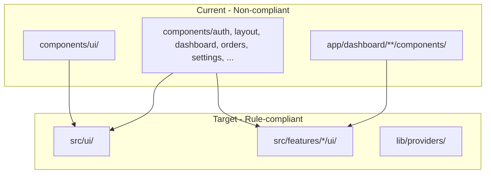

# UI Architecture Migration Plan

Migrate web-admin to the structure defined in `[.cursor/rules/aicoderfrontendinstructions.mdc](.cursor/rules/aicoderfrontendinstructions.mdc)` and `[.cursor/rules/frontendstandards.mdc](.cursor/rules/frontendstandards.mdc)`: `src/ui/` for the design system and `src/features/*/ui` for feature-specific UI.

---

## Current vs Target State



---

## Phase 1: Fill Gaps in src/ui Design System

Ensure every primitive and pattern used by `components/ui` has a Cmx equivalent in `src/ui`. Components that need creation or enhancement:

| components/ui       | src/ui status                         | Action                                                                                                                                      |
| ------------------- | ------------------------------------- | ------------------------------------------------------------------------------------------------------------------------------------------- |
| Tabs.tsx            | CmxTabs exists (low-level Radix)      | Add `CmxTabsPanel` in `src/ui/navigation/cmx-tabs-panel.tsx` – high-level wrapper with `tabs[]`, `value`, `onChange` API                    |
| dialog.tsx          | CmxConfirmDialog, CmxAlertDialog only | Add `CmxDialog` in `src/ui/overlays/cmx-dialog.tsx` – composable Dialog/DialogContent/Header/Title/Footer (wrap Radix Dialog or port logic) |
| ProgressBar.tsx     | Missing                               | Add `CmxProgressBar` in `src/ui/feedback/`                                                                                                  |
| Switch.tsx          | Missing                               | Add `CmxSwitch` in `src/ui/primitives/` (wrap Radix Switch)                                                                                 |
| select-dropdown.tsx | Custom                                | Move to `src/ui/forms/cmx-select-dropdown.tsx` as CmxSelectDropdown                                                                         |
| select-simple.tsx   | CmxSelect exists                      | Audit; keep or merge into CmxSelect                                                                                                         |
| summary-message.tsx | Missing                               | Move to `src/ui/feedback/cmx-summary-message.tsx`                                                                                           |

**Button, Input, Card, Badge, Alert, Textarea, Label, Checkbox, Select:**  
`src/ui` already has `CmxButton`, `CmxInput`, `CmxCard`, `cmx-checkbox`, etc. Map `components/ui` exports to these and update any API differences (e.g. `Button` vs `CmxButton` props).

**Deliverables:**

- New files: `cmx-tabs-panel.tsx`, `cmx-dialog.tsx`, `cmx-progress-bar.tsx`, `cmx-switch.tsx`, `cmx-select-dropdown.tsx`, `cmx-summary-message.tsx`
- Update `src/ui/index.ts` to export new components
- Update `src/ui/navigation/index.ts` and `src/ui/overlays/index.ts` (create overlays if absent)

---

## Phase 2: Migrate components/ Root-Level Modules

| Source                                                          | Destination                                                        | Rationale                                                     |
| --------------------------------------------------------------- | ------------------------------------------------------------------ | ------------------------------------------------------------- |
| `components/ui/*`                                               | Eliminate                                                          | Replaced by Phase 1 and existing `src/ui`                     |
| `components/layout/Sidebar.tsx`, `TopBar.tsx`                   | `src/ui/navigation/cmx-sidebar.tsx`, `cmx-top-bar.tsx`             | App shell = design system                                     |
| `components/layout/tenant-switcher.tsx`, `LanguageSwitcher.tsx` | `src/ui/navigation/`                                               | Reusable nav controls                                         |
| `components/auth/*`                                             | `src/features/auth/ui/`                                            | Feature: RequirePermission, RequireFeature, RequireRole, etc. |
| `components/dashboard/*`                                        | `src/features/dashboard/ui/`                                       | Feature: DashboardContent, widgets, charts, filters           |
| `components/orders/*`                                           | `src/features/orders/ui/`                                          | Feature: OrderPiecesManager, PieceCard, PieceList, etc.       |
| `components/settings/*`                                         | `src/features/settings/ui/`                                        | Feature: BusinessHoursEditor, NavigationManagement, etc.      |
| `components/permissions/PermissionAssignmentModal`              | `src/features/auth/ui/` or `src/features/settings/ui/`             | Auth/settings-related                                         |
| `components/providers/*`                                        | `lib/providers/`                                                   | Shared infrastructure                                         |
| `components/jhtest/*`                                           | `app/dashboard/jhtest/components/` or `src/features/dev-tools/ui/` | Dev tooling; keep co-located or in dev feature                |

**Steps:**

1. Create `src/features/auth/`, `src/features/dashboard/`, `src/features/settings/` if missing
2. Move layout to `src/ui/navigation/`, update internal imports to `@ui/*`
3. Move auth, dashboard, orders (components), settings, permissions into feature `ui/`
4. Move providers to `lib/providers/`
5. Update `app/layout.tsx` and `app/dashboard/layout.tsx` to import from new paths

---

## Phase 3: Migrate app/dashboard//components to src/features

Map each route area to a feature and move components:

| Route area                                                        | Feature      | Target path                                     |
| ----------------------------------------------------------------- | ------------ | ----------------------------------------------- |
| orders/                                                           | orders       | `src/features/orders/ui/`                       |
| customers/                                                        | customers    | `src/features/customers/ui/`                    |
| billing/                                                          | billing      | `src/features/billing/ui/`                      |
| catalog/                                                          | catalog      | `src/features/catalog/ui/`                      |
| inventory/                                                        | inventory    | `src/features/inventory/ui/`                    |
| processing/_, preparation/_, packing/_, assembly/_, qa/_, ready/_ | workflow     | `src/features/workflow/ui/` (or split by stage) |
| delivery/                                                         | delivery     | `src/features/delivery/ui/` (exists)            |
| reports/                                                          | reports      | `src/features/reports/ui/`                      |
| settings/                                                         | settings     | `src/features/settings/ui/`                     |
| users/                                                            | users        | `src/features/users/ui/`                        |
| subscription/                                                     | subscription | `src/features/subscription/ui/`                 |

**Convention for reports:** Keep `*-rprt.tsx` naming per project rules.

**Steps per feature:**

1. Create feature folder: `src/features/<name>/ui/`
2. Move components from `app/dashboard/<area>/**/components/*` to `src/features/<name>/ui/`
3. Preserve folder structure where helpful (e.g. `orders/new/`, `orders/[id]/`)
4. Update relative imports within each moved file
5. Add `tsconfig` path: `@features/<name>/*` → `src/features/<name>/*` (if not already covered by `@features/*`)

---

## Phase 4: Global Import Replacement

Replace all `@/components/*` imports across the codebase:

| Old import                               | New import                               |
| ---------------------------------------- | ---------------------------------------- |
| `@/components/ui/Button`                 | `@ui/primitives/cmx-button`              |
| `@/components/ui/Tabs`                   | `@ui/navigation/cmx-tabs-panel`          |
| `@/components/ui/dialog`                 | `@ui/overlays/cmx-dialog`                |
| `@/components/ui` (barrel)               | `@ui/*` (individual module imports)      |
| `@/components/layout/Sidebar`            | `@ui/navigation/cmx-sidebar`             |
| `@/components/auth/RequirePermission`    | `@features/auth/ui/RequirePermission`    |
| `@/components/orders/OrderPiecesManager` | `@features/orders/ui/OrderPiecesManager` |
| `@/components/dashboard/*`               | `@features/dashboard/ui/*`               |
| `@/components/settings/*`                | `@features/settings/ui/*`                |
| `@/components/providers/AppProviders`    | `@lib/providers/AppProviders`            |

**Execution:**

- Use project-wide search-and-replace or codemod for systematic updates
- Handle mixed import styles (`Button` vs `button`, `Badge` vs `badge`) – standardize on Cmx names
- Update any dynamic imports or barrel re-exports

---

## Phase 5: Remove Legacy Code and Verify

1. **Delete `components/` folder** after all imports are updated
2. **Remove `components/ui` barrel** and any re-exports
3. **Create `src/ui/overlays/`** if it does not exist; ensure CmxDialog and overlays are exported
4. **Update documentation** in `src/ui/USAGE_EXAMPLES.md`, `cmxMessage_developer_guide.md`, and any other docs that reference `@/components/ui`
5. **Run `npm run build`** in web-admin and fix remaining import/type errors
6. **Run `npm run check:i18n`** if applicable
7. **Manual smoke test** of key flows: dashboard, orders, new order, customer, billing, settings

---

## Phase 6: Alias and Rule Alignment

1. **Verify `tsconfig.json` paths:**

```json
{
  "@/*": ["./*"],
  "@ui/*": ["./src/ui/*"],
  "@features/*": ["./src/features/*"],
  "@lib/*": ["./lib/*"]
}
```

1. **Add `@lib/*`** if not present for `lib/providers`
2. **Update `.cursor/rules`** or add a migration-complete note if the rules should reference this structure explicitly
3. **Optional:** Add ESLint rule to disallow `@/components` imports

---

## File Count Summary

| Phase   | Scope                                                                               |
| ------- | ----------------------------------------------------------------------------------- |
| Phase 1 | 6–8 new Cmx components in `src/ui`                                                  |
| Phase 2 | ~35 files from `components/` (layout, auth, dashboard, orders, settings, providers) |
| Phase 3 | ~100+ files from `app/dashboard/**/components/`                                     |
| Phase 4 | ~95 files with import updates                                                       |
| Phase 5 | Remove entire `components/` directory                                               |

---

## Risk Mitigation

- **Incremental migration:** Optionally keep a thin `components/ui/index.ts` that re-exports from `@ui/` during transition to reduce breakage
- **API differences:** Where `components/ui` has extra props (e.g. Button `leftIcon`, `rightIcon`), extend Cmx components or add adapters
- **Tests:** Re-run relevant tests after Phases 2, 4, and 5
- **Git:** Prefer one commit per phase for easier rollback

---

## Execution Order

Phases must run sequentially: Phase 1 (design system) before Phase 4 (imports), Phase 2 and 3 (move files) before Phase 4, Phase 4 before Phase 5 (delete). Phase 6 can run in parallel with Phase 5.
