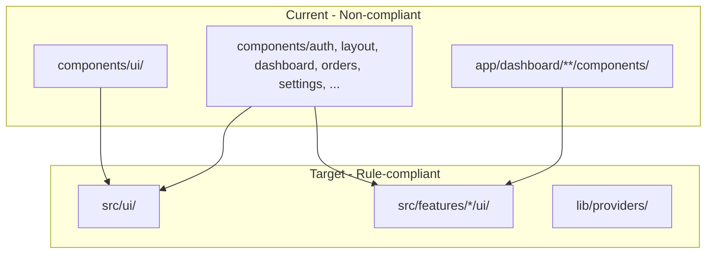

# UI Architecture Migration Plan (Complete)

Migrate web-admin to the structure defined in `[.cursor/rules/aicoderfrontendinstructions.mdc](.cursor/rules/aicoderfrontendinstructions.mdc)` and `[.cursor/rules/frontendstandards.mdc](.cursor/rules/frontendstandards.mdc)`: `src/ui/` for the design system and `src/features/*/ui` for feature-specific UI.

---

## Current vs Target State



---

## Phase 1: Fill Gaps in src/ui Design System

Ensure every primitive and pattern used by `components/ui` has a Cmx equivalent in `src/ui`:

| components/ui       | Action                                                                                                                   |
| ------------------- | ------------------------------------------------------------------------------------------------------------------------ |
| Tabs.tsx            | Add `CmxTabsPanel` in `src/ui/navigation/cmx-tabs-panel.tsx` - high-level wrapper with `tabs[]`, `value`, `onChange` API |
| dialog.tsx          | Add `CmxDialog` in `src/ui/overlays/cmx-dialog.tsx` - composable Dialog/DialogContent/Header/Title/Footer                |
| ProgressBar.tsx     | Add `CmxProgressBar` in `src/ui/feedback/`                                                                               |
| Switch.tsx          | Add `CmxSwitch` in `src/ui/primitives/` (wrap Radix Switch)                                                              |
| select-dropdown.tsx | Move to `src/ui/forms/cmx-select-dropdown.tsx`                                                                           |
| select-simple.tsx   | Audit; keep or merge into CmxSelect                                                                                      |
| summary-message.tsx | Move to `src/ui/feedback/cmx-summary-message.tsx`                                                                        |

**Theme compliance:** Replace hardcoded colors (`bg-blue-600`, `text-gray-500`) with design tokens (`rgb(var(--cmx-primary-rgb))`) and add RTL-aware styles (`ml-4 rtl:mr-4 rtl:ml-0`).

**Type exports:** Re-export all public types (ButtonProps, Tab, DialogProps) from each new Cmx module.

**Accessibility:** For CmxDialog, CmxTabsPanel, etc. - follow Radix patterns (focus trap, focus return), WCAG 2.1 AA (contrast, keyboard nav, aria labels). Add a11y checklist before Phase 1 sign-off.

**Barrel exports:** Update `src/ui/index.ts`, create `src/ui/overlays/index.ts` if absent. Ensure `src/ui/navigation/index.ts` exports CmxTabsPanel.

---

## Phase 2: Migrate components/ Root-Level Modules

| Source                                                                  | Destination                                            |
| ----------------------------------------------------------------------- | ------------------------------------------------------ |
| components/layout/ (Sidebar, TopBar, tenant-switcher, LanguageSwitcher) | `src/ui/navigation/`                                   |
| components/auth/                                                        | `src/features/auth/ui/`                                |
| components/dashboard/                                                   | `src/features/dashboard/ui/`                           |
| components/orders/                                                      | `src/features/orders/ui/`                              |
| components/settings/                                                    | `src/features/settings/ui/`                            |
| components/permissions/                                                 | `src/features/auth/ui/` or `src/features/settings/ui/` |
| components/providers/                                                   | `lib/providers/`                                       |
| components/jhtest/                                                      | `app/dashboard/jhtest/components/` or keep as-is       |

**lib/providers:** Verify `lib/providers/` exists. Add `@lib/` to tsconfig if needed for `@lib/providers/AppProviders`. AppProviders imports from `@/lib/auth`, `@ui/feedback` - those stay valid.

**Barrel exports:** Add `index.ts` per feature folder for clean imports.

---

## Phase 3: Migrate app/dashboard//components to src/features

Feature-by-feature migration (verify build after each feature):

| Route area                                            | Target                                          |
| ----------------------------------------------------- | ----------------------------------------------- |
| orders/                                               | `src/features/orders/ui/`                       |
| customers/                                            | `src/features/customers/ui/`                    |
| billing/                                              | `src/features/billing/ui/`                      |
| catalog/                                              | `src/features/catalog/ui/`                      |
| inventory/                                            | `src/features/inventory/ui/`                    |
| processing, preparation, packing, assembly, qa, ready | `src/features/workflow/ui/` (or split by stage) |
| delivery/                                             | `src/features/delivery/ui/`                     |
| reports/                                              | `src/features/reports/ui/`                      |
| settings/                                             | `src/features/settings/ui/`                     |
| users/                                                | `src/features/users/ui/`                        |
| subscription/                                         | `src/features/subscription/ui/`                 |

**Duplicate consolidation:** Two `customer-create-modal` files exist (orders/new and customers). Compare implementations; consolidate into one in `src/features/customers/ui/customer-create-modal.tsx` and import from there, or keep two with distinct names.

**Dynamic imports (CRITICAL):** [new-order-modals.tsx](web-admin/src/features/orders/ui/new-order-modals.tsx) uses `next/dynamic` with paths like `@/app/dashboard/orders/new/components/customer-picker-modal`. Update all dynamic import paths when moving:

```ts
// Before
() => import('@/app/dashboard/orders/new/components/customer-picker-modal').then(mod => ({ default: mod.CustomerPickerModal }))
// After
() => import('@features/orders/ui/customer-picker-modal').then(mod => ({ default: mod.CustomerPickerModal }))
```

Search project-wide for `dynamic(...` and `import('@/app/` to catch all dynamic imports. Update static imports in the same files (AmountMismatchDialog, ReadyDatePickerModal, etc.).

**Report naming:** Keep `*-rprt.tsx` suffix per project rules.

---

## Phase 4: Global Import Replacement

| Old                        | New                                       |
| -------------------------- | ----------------------------------------- |
| `@/components/ui/Button`   | `@ui/primitives/cmx-button`               |
| `@/components/ui/Tabs`     | `@ui/navigation/cmx-tabs-panel`           |
| `@/components/ui/dialog`   | `@ui/overlays/cmx-dialog`                 |
| `@/components/ui` (barrel) | `@ui/` (module-specific imports)          |
| `@/components/layout/`     | `@ui/navigation/`                         |
| `@/components/auth/`       | `@features/auth/ui/`                      |
| `@/components/orders/`     | `@features/orders/ui/`                    |
| `@/components/dashboard/`  | `@features/dashboard/ui/`                 |
| `@/components/settings/`   | `@features/settings/ui/`                  |
| `@/components/providers/`  | `@lib/providers/`_ or `@/lib/providers/_` |

**Case sensitivity:** Normalize imports - some use `Badge` vs `badge`, `Button` vs `button`. Standardize on Cmx names (PascalCase) and kebab-case file names.

**Tooling:** Consider a jscodeshift codemod for systematic import updates; document the script or manual fallback.

**Optional compatibility layer:** Add temporary `components/ui/index.ts` re-exporting from `@ui/` to ease incremental rollout. Remove in Phase 5.

---

## Phase 5: Remove Legacy Code and Verify

1. Delete `components/` folder after all imports updated
2. Remove any re-export barrels
3. Ensure `src/ui/overlays/` exists and exports CmxDialog
4. Run circular dependency check: `madge --circular web-admin/src` or ESLint plugin - fix any cycles (features must not import from other features; only lib, ui)
5. Run `npm run build` - fix remaining errors
6. Run `npm run check:i18n`
7. Update docs: `src/ui/USAGE_EXAMPLES.md`, `cmxMessage_developer_guide.md`, any references to `@/components/ui`
8. Manual smoke test: dashboard, orders, new order, customers, billing, settings
9. Run tests: `npm test` - update any `__tests__` that mock or import from old paths

---

## Phase 6: Alias and Rule Alignment

1. Verify tsconfig paths: `@ui/`_, `@features/`_, `@lib/_`(add`@lib/_` if missing)
2. Optional ESLint rule to disallow `@/components` imports
3. Add migration-complete note in rules if desired

---

## Best-Practice Checklist

| Item                                               | Phase |
| -------------------------------------------------- | ----- |
| Theme tokens (no hardcoded colors)                 | 1, 4  |
| RTL-aware styles                                   | 1, 4  |
| Accessibility (WCAG 2.1 AA) for new Cmx components | 1     |
| Barrel exports (index.ts) per feature/ui subfolder | 2, 3  |
| Dynamic import path updates                        | 3     |
| Duplicate component consolidation                  | 3     |
| Type exports for Cmx components                    | 1     |
| Circular dependency verification                   | 5     |
| Test import updates                                | 5     |
| Documentation updates                              | 5     |
| Codemod or script for import replacement           | 4     |
| Feature-by-feature migration with build verify     | 3     |

---

## Risk Mitigation

- **Incremental:** One feature at a time with build verification; optional re-export barrel for gradual cutover
- **API differences:** Extend Cmx components (e.g. Button leftIcon/rightIcon) or add thin adapters
- **Git:** One commit per phase for easier rollback
