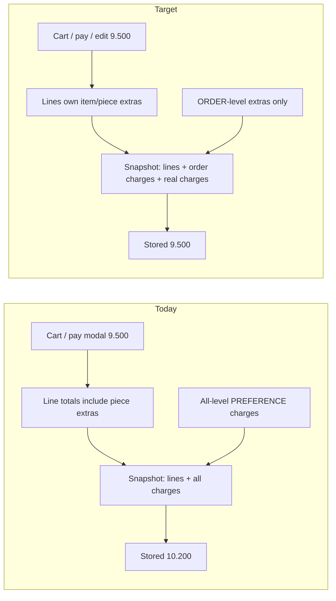

# Unify order commercial totals

## Locked decisions (from you)

- **Money model:** item/piece preference extras stay inside line totals (`item.total_price` / `items_base_amount`). Only **order-level** preference extras add as `PREFERENCE` charges. Item/piece extras must never be added again into `total_amount`, outstanding, payment preview, or the edit notice.
- **History:** no silent rewrite of existing totals. After going-forward is green, ship an **opt-in preview + confirm recalc** for contaminated orders (e.g. `ORD-20260919-0002`).
- **Out of scope:** Edit Order “Pay / Collect” button. Do not add it until this program’s acceptance test is green.

## What the test proved

On `ORD-20260919-0002` (remote):

- Payment confirm: **9.500**, remain **4.500**
- Stored after create: **10.200**, remain **5.200**
- Notice: **10.200 → 13.000**, due **2.800**
- Persist / history / financials: **13.700**, outstanding **8.700**
- Tax lines stayed at create (**0.622**); header `taxable_amount` **17.757** = 8.8785 + 8.8785

Two write bugs cause almost every symptom:

1. **Snapshot adds all charge rows on top of line totals.** [`resolveCanonicalTotalAmount`](web-admin/lib/services/order-financial-write.service.ts) does `itemsBase + totalChargesAmount + …`. Create writes one `PREFERENCE` charge per **every** pref ([`order-service.ts` ~1619–1640](web-admin/lib/services/order-service.ts)), including piece extras already inside Boxer **3.700**. That is the extra **0.700**.
2. **Edit replaces items/pieces but not prefs/charges/taxes.** [`updateOrder`](web-admin/lib/services/order-service.ts) `deleteMany`s items/pieces only. Old piece `PREFERENCE` charges stay active and are added again. New Separate Wash is on the line/pref row but gets no charge row. Tax rows are never rewritten, so VAT stays at create.

Financial Summary spec already states this: extras are included in `items_base_amount` and must not be double-counted in `total_charges_amount` ([spec §10](docs/features/Order_Fin/CleanMateX_Order_Details_Financial_Summary_Enhancement_Spec_v1_0.md)).

## Production-readiness review (gaps found in this plan)

The original slices were directionally correct but **not shippable as written**. These holes would recreate the same cashier-visible split.

### P0 — would still produce wrong money

1. **Two totals still compete on edit.** `updateOrder` writes `total_amount` from `calculateOrderTotals` (catalog reprice + `servicePrefCharge`). Snapshot then overwrites from `SUM(item.total_price)` + charges. If extras live only on `totalPrice` (your test: `service_pref_charge = 0` on items), catalog dry-run ≠ persisted lines. **Rule:** rewrite items/prefs first, then `recalculateOrderFinancialSnapshotTx` is the **only** header-total writer. Governance dry-run must use the same formula (`sum(client line totals) + order-level extras`), not a fresh catalog quote. Pass `priceOverride` only when the cashier overrode.

2. **Edit API cannot send order-level prefs.** [`updateOrderInputSchema`](web-admin/lib/validations/edit-order-schemas.ts) has no `orderServicePrefs`. [`saveOrderUpdate`](web-admin/src/features/orders/hooks/use-order-submission.ts) does not post them. Loading prefs into edit state is useless until the contract is extended.

3. **Qty helpers strip extras.** [`updateItemQuantity` / `addItemToOrder`](web-admin/lib/utils/order-item-helpers.ts) set `totalPrice = qty * pricePerUnit` and drop piece extras. A qty tap on edit would silently lose Separate Wash / Anti-bacterial from the cart total (violates no-silent-money-mutation). Must preserve extras when qty changes.

4. **Orphan charges after item delete.** Prefs `ON DELETE CASCADE` with items ([migration 0166](supabase/migrations/0166_create_org_order_preferences_dtl.sql)). Charges have **no FK** to prefs (`charge_source_id` is a bare UUID). Edit `deleteMany` items → prefs vanish → **old PREFERENCE charges remain** and still inflate the snapshot. Void (or exclude) those rows in the same transaction, not “rewrite later.”

5. **`total_charges_amount` meaning must be one number.** If the header still stores Σ(all charge rows) while `total_amount` only adds money charges, recon `ORDER_CHARGES_MATCH_SNAPSHOT` and Financial Summary stay split. Header `total_charges_amount` = **money addend only** (ORDER-level PREFERENCE + EXPRESS/BULK/SPECIAL). Ledger may still hold voided ITEM/PIECE rows (`is_voided = true`, excluded from sums).

6. **Client/server `AMOUNT_MISMATCH`.** Submit compares client `totals.total` to server `saleTotal`. Fix preview, cart, and persist in the **same release**. Do not ship snapshot-only first.

### P1 — production process / safety

7. **Slice 5 vs issued tax documents (B14).** Recalc that changes `total_amount` on an order with an **ISSUED** tax doc will fail fiscal match (`tax document total == order.total_amount`). Detect/preview must **block** those orders (or require a B14 correction path). Do not recalc them in the first batch.

8. **Slice 5 is underspecified as “an API.”** Need: permission (reuse `orders:create_adjustment` or `orders:post_settlement_edit` — do not invent a cashier button), feature flag + `FLAG_CATALOG` via `/create-feature-flag` (do not apply migration), preview + confirm routes, idempotency key, tenant filter, max batch size, written runbook. No UI required if the runbook is SQL/admin-only and owner-run.

9. **System void ≠ cashier `voidOrderCharge`.** Edit/recalc voids must run inside the order transaction without requiring `orders:manual_charge` on the floor user. Reuse the void primitive, not the permission-gated UI action.

10. **Transitional edit of contaminated orders.** Until slice 5, `0002` stays stored at 10.200/13.700. After slice 1, a new edit of `0002` should persist the **correct new** total (13.000 for that basket) while `previousTotal` remains inflated — notice delta will be 2.800 vs a true goods add of 3.500. Document this; do not treat it as a slice-1 bug.

11. **Legacy `OrderService.createOrder` (non-tx).** Still exists alongside `createOrderInTransaction`. Grep callers; if anything still creates orders there, it must use the same charge/snapshot rules after `recalculateOrderFinancialSnapshot`.

12. **Preparation item PATCH/DELETE** remains out of scope (B12) and can still stale-header. Call that out in QA as a known residual risk, not as fixed.

### P2 — completeness

13. **Checkout fallback double-count.** Confirm `checkoutAmount = subtotal + servicePrefCharge + packingPrefCharge + orderCharges` does not add extras already inside `totalPrice` ([`new-order-modals.tsx`](web-admin/src/features/orders/ui/new-order-modals.tsx)).

14. **Receipts / collect / BVM.** New orders only. Do not reprint or rewrite old receipts. Collect Payment on `PAY_ON_COLLECTION` will follow the new outstanding after persist — verify in QA.

15. **Access contract.** If slice 5 adds `/api/v1/orders/.../recalc-preference-charges`, add `apiDependencies` + permission gate (`/rebuild-ui-access-contract`). Slices 1–4 reuse existing update/submit routes.

## Recommended solution per bug (one choice each)

Do not implement alternatives. Each row is the locked fix.

**From the ORD-20260919-0002 test**

| Bug | Recommended solution |
|---|---|
| Create confirm 9.500 vs stored 10.200 | Stop writing ITEM/PIECE extras as money charges. Create writes `PREFERENCE` charge rows only for `prefs_level=ORDER`. Snapshot `total_amount` = line sum + ORDER extras + EXPRESS/BULK/SPECIAL only. |
| Notice 13.000 / 2.800 vs persist 13.700 / 3.500 | Set `financialDelta` from snapshot before vs after persist. Delete the pre-tx `calculateOrderTotals.saleTotal` as the notice source. |
| Edit cart 9.500 vs details 10.200 | After the formula fix, cart line sum **is** the order total (plus visible ORDER-level extras). Also load `orderServicePrefs` into edit state. |
| Tax frozen at 0.622 on edit | When items change, replace `org_order_taxes_dtl` from the same `taxBreakdown` create uses (`settleOrderTx` writer). Then snapshot. |
| Taxable 17.757 | Store and display **one** taxable base (engine `netAfterDiscounts` / VAT `baseAmount`). Never `SUM(tax_line.taxable_amount)`. |
| Extras shown three times | Mapper: piece extras = included-in-base only. Other charges = money addends only. |
| History vs notice disagree | Same snapshot totals in audit `changes.pricing`. Fix rprt field mapping if UI still swaps subtotals. |
| Chip +0.410 vs stored 0.400 | Chip label = persisted/selected `extra_price` only. No second catalog/tax-gross path. |

**From the production-readiness review**

| Bug | Recommended solution |
|---|---|
| Two totals on edit (catalog vs lines) | Persist cashier line `totalPrice` (extras included). Snapshot is the **only** header writer. Governance dry-run = `sum(line totals) + order-level extras`. Catalog quote is not the persisted total. |
| No `orderServicePrefs` on update | Add the same Zod field as create; `saveOrderUpdate` posts it. |
| Qty helpers drop extras | Recompute `totalPrice = qty * unit + current item/piece extras` (from prefs on the item). Never `qty * unit` alone. |
| Orphan charges after item delete | In the same `updateOrder` tx, after item delete: void all non-void ITEM/PIECE `PREFERENCE` charges for that order. System void helper, no floor `orders:manual_charge`. |
| Header `total_charges_amount` ≠ money addend | Header column = money addend only. Voided ITEM/PIECE rows stay in the ledger but are excluded from every sum. |
| `AMOUNT_MISMATCH` if snapshot ships alone | One release: cart fallback, preview, submit, snapshot. |
| Slice 5 vs ISSUED tax docs | Preview lists them **blocked**. First batch skips them. No B14 correction in this program. |
| Vague slice 5 API | Flag OFF + reuse `orders:post_settlement_edit` + preview/confirm + idempotency + max batch + runbook. No new cashier screen. |
| `voidOrderCharge` permission on edit | Extract/reuse void SQL inside the tx; do not call the permission-gated cashier action. |
| Editing contaminated `0002` after slice 1 | Expected: correct **new** total, inflated **old** total, smaller delta. Fix old totals only via slice 5. |
| Legacy `createOrder` | Grep callers; if live, apply the same charge filter + snapshot authority. |
| Preparation item PATCH | Stay out of scope. QA residual risk only. |
| Checkout `subtotal + servicePrefCharge + …` | `checkoutAmount = calculateOrderTotal(items) + order-level extras` only. |
| Old receipts / BVM | Do not rewrite. QA Collect Payment on new orders only. |
| Slice 5 route ungated | If the route exists, add access-contract `apiDependencies` + `requirePermission`. |
| Edit Ctrl/Cmd+S and mobile primary CTA open the **create** payment modal | In edit mode both must call `handleSaveEditOrder`, not `handleSubmitOrderClick`. Same files: [`new-order-content.tsx`](web-admin/src/features/orders/ui/new-order-content.tsx). |

## Canonical formula (single writer)

All of these must call the same resolved total (or persist first, then read the snapshot — never a second incomplete dry-run):

`total_amount = items_base_amount` (lines already include item/piece extras)
`+ order_level_preference_extras`
`+ non_pref_charges` (`EXPRESS` / `BULK_SURCHARGE` / `SPECIAL_HANDLING` only)
`- discounts`
`+ tax_addend` (0 when `TAX_INCLUSIVE`)
`+ rounding`

`outstanding_amount = total_amount - total_paid_amount - total_credit_applied_amount` (existing D005; do not change paid rows).

**Charge ledger vs money:** keep `org_order_charges_dtl` as an audit/recon table, but **money only includes ORDER-level PREFERENCE rows**. Stop creating new ITEM/PIECE `PREFERENCE` charge rows. On edit, **void** leftover ITEM/PIECE `PREFERENCE` charges (B18: do not hard-delete the ledger). Update recon in [`order-snapshot-checks.ts`](web-admin/lib/services/reconciliation/order-snapshot-checks.ts):

- `ORDER_PREFERENCES_MATCH_CHARGES` → compare charges to **ORDER-level** extras only
- ITEM/PIECE extras → must be included once in `items_base_amount` (existing included-once checks, retargeted)

## Slice 1 — One commercial total (must ship first)

**Create / preview / submit**

- [`calculateOrderTotals`](web-admin/lib/services/order-calculation.service.ts): `orderCharges` remains **order-level only** (already how preview maps `orderServicePrefs` in [`preview-payment/route.ts`](web-admin/app/api/v1/orders/preview-payment/route.ts) and [`order-submit-orchestrator.service.ts`](web-admin/lib/services/order-submit-orchestrator.service.ts)).
- Both [`createOrderInTransaction`](web-admin/lib/services/order-service.ts) **and** legacy [`createOrder`](web-admin/lib/services/order-service.ts) (if still called): write `PREFERENCE` charges only for `prefs_level = 'ORDER'`. After create, snapshot is the header-total authority.
- [`resolveCanonicalTotalAmount`](web-admin/lib/services/order-financial-write.service.ts): money `totalChargesAmount` = ORDER-level PREFERENCE + EXPRESS/BULK/SPECIAL; exclude voided rows and ITEM/PIECE PREFERENCE. Persist that same number on `org_orders_mst.total_charges_amount`.
- Cart / preview / persist in **one release** so `AMOUNT_MISMATCH` stays green. Verify [`new-order-modals.tsx`](web-admin/src/features/orders/ui/new-order-modals.tsx) checkout fallback does not add `servicePrefCharge`/`packingPrefCharge` when those extras are already inside `item.totalPrice`.

**Edit**

- Extend [`updateOrderInputSchema`](web-admin/lib/validations/edit-order-schemas.ts) + [`saveOrderUpdate`](web-admin/src/features/orders/hooks/use-order-submission.ts) with `orderServicePrefs` (same shape as create).
- Same transaction, this order: delete items/pieces → prefs cascade → **void leftover ITEM/PIECE PREFERENCE charges** (dangling `charge_source_id`) → recreate items/pieces/prefs → rewrite ORDER-level charges from payload.
- **Do not** use catalog `calculateOrderTotals.saleTotal` as the persisted header total. Persist line `totalPrice` (with extras) + order-level extras, then snapshot writes `total_amount`. Governance dry-run uses that same arithmetic so reason-required and delta match persist.
- **`financialDelta` after persist:** `snapshotBefore` vs `snapshotAfter` only.
- Load ORDER-level prefs into edit state ([`edit-order-screen.tsx`](web-admin/src/features/orders/ui/edit-order-screen.tsx)).
- Fix [`updateItemQuantity` / `addItemToOrder`](web-admin/lib/utils/order-item-helpers.ts) so qty changes keep piece/item extras (scale or recompute from prefs, never `qty * unit` only).
- In edit mode, Ctrl/Cmd+S and the mobile bottom-sheet primary action must call `handleSaveEditOrder`, not `handleSubmitOrderClick` ([`new-order-content.tsx`](web-admin/src/features/orders/ui/new-order-content.tsx)).

**History**

- [`generateChangeSet`](web-admin/lib/services/order-audit.service.ts) already uses snapshot `subtotal`/`total`. After the formula is one source, history `10.200 → 13.700` vs notice `13.000` disappears.
- Verify [`orders-edit-history-tab-rprt.tsx`](web-admin/src/features/orders/ui/orders-edit-history-tab-rprt.tsx) maps `oldSubtotal`/`newSubtotal` from `changes.pricing` (DB was `9.5 → 13`; UI looked swapped). Fix the mapper if it reads the wrong fields.

**Acceptance (new order, not `0002`):** same basket as the test → pay-modal total = Financial Summary total = edit-cart total; after add pants + Separate Wash, notice = history = financials; `paid + outstanding = total`.

## Slice 2 — Financial Summary display

[`map-order-financial-summary-view.ts`](web-admin/src/features/orders/lib/map-order-financial-summary-view.ts):

- Item/piece extras: **included** in base (keep current “included in base” labels).
- `otherCharges` / charge addend: ORDER-level PREFERENCE + EXPRESS/BULK/SPECIAL only. Do not show piece extras as “Other charges” **and** as included extras.
- Gross = base + money charges only (same formula as snapshot).

No new screen. EN/AR labels stay; only the amounts change.

## Slice 3 — Tax on amendment + unique taxable base

- Reuse the create tax writer from [`settleOrderTx`](web-admin/lib/services/order-settlement.service.ts) (replace `org_order_taxes_dtl` from `calculateOrderTotals.taxBreakdown`) inside `updateOrder` when totals recalculate.
- Header `taxable_amount`: store the **unique taxable base** from the engine (`netAfterDiscounts` / first VAT `baseAmount`), **not** `SUM(tax_line.taxable_amount)` ([writer ~563](web-admin/lib/services/order-financial-write.service.ts)). That is the **17.757** bug.
- UI: if snapshot `taxableAmount` is the unique base, do not fall back to summing tax lines ([`sumTaxableAmount`](web-admin/src/features/orders/lib/map-order-financial-summary-view.ts)).
- Coordinate with in-progress tax-config docs; do not invent a second tax engine. Inclusive mode must still not add tax on top of line prices.

## Slice 4 — Pref chip vs stored extra

Audit chip display vs persist for `ANTI_BACTERIAL` / `STARCH_LIGHT` (**+0.410 / +0.260** vs stored **0.400 / 0.200**). Display must use the same `extra_price` that is written to `org_order_preferences_dtl` (selected row / payload), not a second catalog format or tax-grossed figure. Likely files: [`piece-preferences-editor-dialog.tsx`](web-admin/src/features/orders/ui/piece-preferences-editor-dialog.tsx), [`preference-chip.tsx`](web-admin/src/features/orders/ui/piece-preferences/preference-chip.tsx), catalog `default_extra_price`. No silent rewrite of typed extras ([`no-silent-money-mutation.md`](docs/dev/rules/no-silent-money-mutation.md)).

## Slice 5 — Opt-in historical recalc (after 1–3 are green)

- Detection: active non-void ITEM/PIECE `PREFERENCE` charges that were added on top of `items_base_amount` (pattern on `0002`).
- **Skip** orders with an ISSUED tax document (B14 fiscal match). List them as blocked in the preview.
- Preview + confirm: tenant-scoped, idempotent, max batch size, permission reused (`orders:post_settlement_edit` or `orders:create_adjustment`), feature flag default OFF (`/create-feature-flag` + `FLAG_CATALOG`; do not apply the migration).
- Confirm voids contaminating charges, runs `recalculateOrderFinancialSnapshotTx`, writes audit reason `preference double-count correction`. **Never change `total_paid_amount`.** Do not auto-refund if outstanding falls.
- Operator surface: runbook is enough for v1 (no new dashboard page). Owner Preview QA on a pilot tenant before any production batch.

## Tests (required, targeted — not a full-suite dump)

- Unit: `resolveCanonicalTotalAmount` — piece extras in lines + piece charge rows must **not** increase total; order-level extras must.
- Unit: `computeAmendmentDelta` + `updateOrder` glue — `financialDelta.newTotal === snapshot.totalAmount`.
- Integration: create with piece prefs + card partial + pay-later → header total equals preview total.
- Integration: edit add item + piece pref → taxes rewritten; notice/history/header match.
- Recon tests updated for ORDER-level-only money charges.
- Mapper test: taxable unique base; extras not in other-charges.

## UI reuse (mandatory while implementing)

- Load `/frontend` before any UI edit.
- **Reuse first.** Use existing Cmx components from `@ui/primitives`, `@ui/feedback`, `@ui/overlays`, `@ui/forms`, `@ui/data-display`, `@ui/navigation`, `@ui/patterns`. Copy import snippets from [`web-admin/.clauderc`](web-admin/.clauderc). Prefer existing orders UI (Financial Summary mapper, pref chips, amendment notice) over a new one-off.
- **If the same UI will appear on more than one surface** (create + edit + details + summary, or another feature later), extract a reusable Cmx component under [`web-admin/src/ui/`](web-admin/src/ui/) with the `Cmx` prefix. One-off edit-only chrome stays in [`web-admin/src/features/orders/ui/`](web-admin/src/features/orders/ui/).
- Do not invent a second money/chip/summary widget when `CmxKpiStatCard`, `CmxSummaryMessage`, `CmxStatusBadge`, or the existing financial-summary view already covers it.
- Feedback stays on `cmxMessage` / `useMessage`. No raw toasts or `alert()`.

## Progress and documentation after every step

After **each** slice is coded and its targeted tests pass, do both of these before starting the next slice. Do not batch them to the end.

1. **Update this plan’s status/progress**
   - Mark the slice todo(s) completed in this plan file.
   - Write what shipped, what is still open, and any residual risk (contaminated `0002`, preparation PATCH, issued tax docs).
2. **Refresh related docs in place** (no new overlapping folder)
   - Slice 1: [`B18_Order_Charge_Write_Path.md`](docs/features/Order_Fin/Remediation_Work_Packages/B18_Order_Charge_Write_Path.md), [`B12_Order_Amendment_And_Financial_Delta.md`](docs/features/Order_Fin/Remediation_Work_Packages/B12_Order_Amendment_And_Financial_Delta.md), [`docs/features/orders/edit_order/STATUS.md`](docs/features/orders/edit_order/STATUS.md)
   - Slice 2: Financial Summary spec note + edit-order STATUS (extras once; other charges = money addends)
   - Slice 3: tax rewrite on amendment + unique taxable base (B12 / financial-write notes)
   - Slice 4: pref-chip vs persisted `extra_price`
   - Slice 5: historical recalc runbook, flag default OFF, permission, blocked issued tax docs
   - [`QA_TEST_GUIDE.md`](docs/features/Order_Fin/Remediation_Work_Packages/QA_TEST_GUIDE.md): add or update the create→edit replay for that slice

## Final documentation skill pass (after all slices)

Load **`/documentation`** ([`.claude/skills/documentation/SKILL.md`](f:/jhapp/cleanmatex/.claude/skills/documentation/SKILL.md)) and generate or complete the canonical pack for this work. Reuse existing folders; do not invent a second source of truth.

Canonical home: [`docs/features/orders/edit_order/`](docs/features/orders/edit_order/) plus in-place Order_Fin remediation docs (B12 / B18 / QA). If the folder already has STATUS / developer / test files, **update them**. Fill missing pack files the skill expects (`progress_summary` / `current_status` / `developer_guide` / `user_guide` / `testing_guide` / `CHANGELOG` / mermaid as applicable). Reflect repository truth only. Cross-link B12, B18, and QA. Do not rewrite archived files that carry a `**Doc Status:**` marker.

## Implementation rules

- Load `/backend`, `/frontend`, `/testing`, `/documentation`, `/implementation` before first edit; `/database` only if a flag/migration is required for slice 5.
- No existing-migration edits. No `db reset`. No applying migrations.
- Do not mutate historical money in slices 1–4.
- After UI/totals changes: `cd web-admin && npx tsc --noEmit && npx eslint . --quiet` on touched files; `npm run build` if compile surface changes.
- After each slice: run the **Progress and documentation after every step** closeout before the next slice.
- After the last slice + tests: run the **Final documentation skill pass**.

## Risks

- B18 recon currently expects one charge row per **all** prefs. Slice 1 must update those checks in the same change or Preview QA will go red.
- Inclusive tax + order-level extras stay non-taxable addends (existing B18 comment). Do not silently start taxing them.
- Contaminated orders keep inflated totals until slice 5; a new edit of `0002` after slice 1 will show a **smaller** delta than the goods add (inflated `previousTotal`).
- Preparation item mutation path is still ungoverned (B12 out of scope) and can stale headers.
- Issued tax documents block historical recalc until B14 correction exists.
