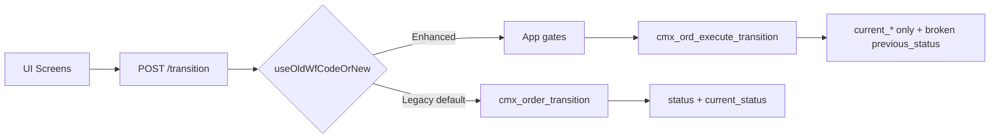
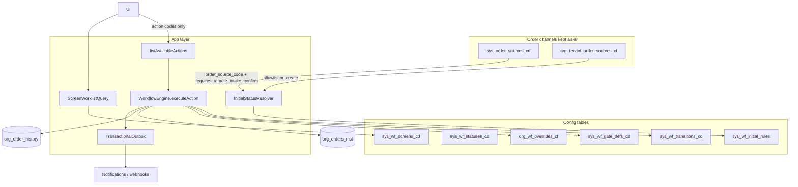
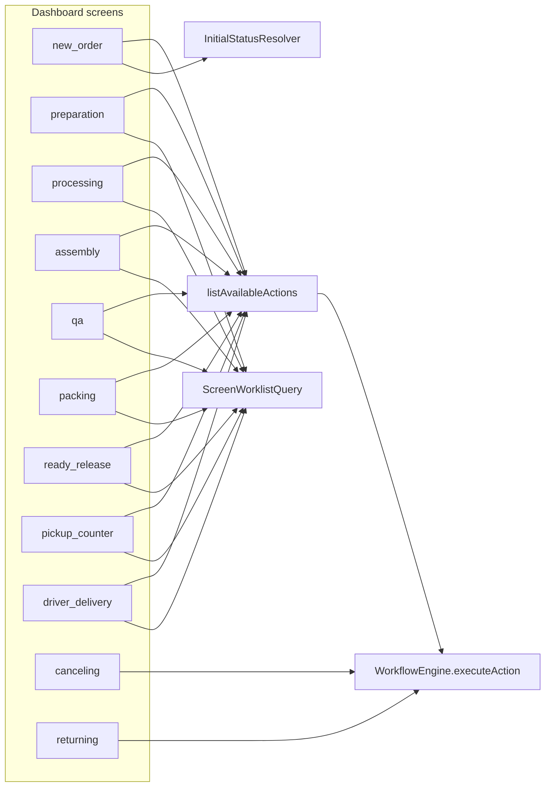

# Workflow Order Advance — Config-Driven Redesign

## What you get (deliverable sequence)

| Stage | Output | When |
|-------|--------|------|
| **Now (this Cursor plan)** | Master redesign decisions + phased roadmap + todos | Already here: [`.cursor/plans/workflow_order_advance_57b734d7.plan.md`](c:\Users\JHNLP\.cursor\plans\workflow_order_advance_57b734d7.plan.md) |
| **P0 (next, after you say execute)** | **Design pack + Implementation Plan** (docs only — no schema/code yet) | `docs/features/Workflow_Order_Advance/` |
| **P1–P7** | Schema, engine, screen integrations, cutover, Studio, harden | Only after P0 discovery sign-off |
| **Final** | Full documentation pack via `/documentation` skill | After implementation |

**P0 includes an explicit Implementation Plan file** (not only architecture prose):

- [`docs/features/Workflow_Order_Advance/IMPLEMENTATION_PLAN.md`](docs/features/Workflow_Order_Advance/IMPLEMENTATION_PLAN.md) — work packages, sequence, dependencies, exit criteria, per-screen `integ-*` tasks, risks, rollback
- Also mirrored as `11_Implementation_Roadmap.md` for the numbered pack
- Plus `development_plan.md` when the final `/documentation` pass runs

P0 design pack **written** under `docs/features/Workflow_Order_Advance/` (2026-07-24). Next: discovery sign-off, then user-approved P1.

---

## Goal

Replace the current **hybrid** system (Legacy `cmx_order_transition` + Enhanced `cmx_ord_*` RPCs + hardcoded CASE/maps) with **one** production engine:

- **Config tables** own screens, statuses, transitions, initial-status rules, gates, and tenant overrides
- **Application services** (Prisma transactions) own validation, permissions, finance gates, and writes
- **DB functions are retired** for workflow business logic (no `cmx_ord_execute_transition`, no CASE fallbacks, no `cmx_order_transition` as authority)

Documentation home: [`docs/features/Workflow_Order_Advance/`](docs/features/Workflow_Order_Advance/) (build on existing audits under `Audit_Reports_Order_Workflow/`; archive older plans already in `old/`).

---

## Reopened P7R — Stage-owned service and API architecture

The workflow engine remains the authority for state transitions. Each operational stage must own an application service and a versioned API surface so every caller uses the same validation and transaction boundary:

- **Shared workflow-command layer:** authenticated tenant context, permission checks, input validation, `state_version` concurrency, idempotency, audit metadata, central outbox events, and a stable error model.
- **Stage-owned services:** Preparation, Processing, Quality, Packing, Ready/Release, Pickup, and Delivery own their stage-specific gates and side effects; they call the workflow engine rather than writing order workflow state directly.
- **Versioned consumers:** web-admin, mobile applications, and third-party adapters consume `/api/v1/...` contracts or a dedicated integration adapter. UI components are never an alternative business-logic path.
- **Delivery first:** re-enable staff delivery only after one atomic completion orchestration covers stop ownership, POD/OTP evidence, applicable pay-on-collection settlement, workflow transition, route counters, audit trail, and outbox emission.

P7R is intentionally sequenced as: shared contracts → service boundaries → Delivery implementation → caller cutover → assurance/pilot. Later stages must adopt the same pattern, not create screen-local writers.

---

## Current-state verdict (why redesign)

Critical gaps already proven in code/audits:

- Two engines, inverted create vs transition flag semantics
- Dual columns (`status` vs `current_status`) drift
- Screen key mismatch (`ready`/`delivery` vs `ready_release`/`driver_delivery`)
- Contracts mix **membership list** with **create initial status** (`statuses[0]`)
- Enhanced write path references missing `previous_status`
- Stage permission codes often unseeded; wrappers/volatility bugs
- Next-status still hardcoded in `resolveNextStatus`

---

## Target architecture (committed decisions)

| Decision | Choice |
|----------|--------|
| Transition authority | Single **WorkflowEngine** (app) — sole writer of order workflow status; no business-logic RPCs |
| Command model | **Action codes** (e.g. `COMPLETE_PREPARATION`, `CONFIRM_PHYSICAL_INTAKE`) — UI never sends raw next-status; config maps action → edge |
| Available actions | Same policy path as execute — `listAvailableActions(orderId, screen)` powers buttons; no client-side next-status logic |
| Config SoT | **Rename + evolve** existing workflow tables → `sys_wf_*` / `org_wf_*` (≤30); add missing catalogs only — **no** parallel `sys_workflow_definitions_*` stack from the ChatGPT pack |
| Status SoT | `org_orders_mst.current_status` remains canonical (**reject** pack rename to `operational_status`); dual-write `status` during cutover only, then stop writing `status` |
| Atomicity | Prisma interactive TX + `FOR UPDATE` + **optimistic concurrency** (`expectedUpdatedAt`) + **idempotencyKey** on every command |
| Outbox | Transition TX writes history + **transactional outbox**; notifications/webhooks **after** commit — never call providers inside the status TX |
| Ready vs release | Operational **ready** ≠ financial/physical **release**; Order Fin owns money eligibility; engine gates on Fin answers; partial pickup/delivery via **release records** (no child-order default) |
| Version snapshot | At create, bind **profile/version snapshot** on the order so later seed/Studio edits do not rewrite in-flight orders |
| Create initial status | `sys_wf_initial_rules` by `order_source_code` + optional `order_type_id` + modifiers (physical_intake, quick_drop, retail) — not `statuses[0]` |
| Order channels / types / categories | Keep `sys_order_sources_cd`, `sys_order_type_cd`, service-category catalogs **outside** `sys_wf_*` |
| Items / pieces | Parallel vocabularies; engine **reads** via gates; no silent cascade; auto-ready only via engine |
| Screen worklists | Screen → `current_status[]` membership only |
| Operator UX | **Actions not graphs** — floor screens show one primary task action; technical status/graphs/rules only in admin Studio |
| Config authoring V1 | Tenant **Workflow Studio** (admin) + full system seeds; **not** full HQ Platform designer in this repo; HQ plans/flags via existing HQ APIs |
| Cancel/return/finance | Order Fin unwind before status flip; engine emits events only |
| Seed completeness | Full seed + **graph validation** (reachability, one default route per node, no edges into disabled stages) |
| Writer policy | Inventory + ban all direct `current_status` writers; expand→change→contract cutover; single flag `workflow_engine_v2` (no permanent Legacy+Enhanced adapters) |
| Pack reference | [`CleanMateX_Order_Workflow_V1_Full_Pack_v1.0`](docs/features/Workflow_Order_Advance/CleanMateX_Order_Workflow_V1_Full_Pack_v1.0) = idea source only; **this plan + our audits** = authority |

### Expert adoption from ChatGPT Full Pack (locked)

Source pack: [`CleanMateX_Order_Workflow_V1_Full_Pack_v1.0`](docs/features/Workflow_Order_Advance/CleanMateX_Order_Workflow_V1_Full_Pack_v1.0) — reference only.

**Adopted into this plan (production V1):**

1. Action-code commands (not UI `toStatus`)
2. Available-actions API (same policy as execute)
3. Ready ≠ release; Order Fin owns money eligibility
4. Partial fulfilment via release records + no double-release
5. Transactional outbox (no provider calls in transition TX)
6. Published profile/version + order snapshot at create
7. Operators see actions, not graphs (floor UX)
8. Writer inventory + expand→change→contract cutover
9. Idempotency key + optimistic concurrency on every command
10. Seed/publish graph validation (reachability, one default route, no disabled-stage edges)

**Explicitly rejected (do not implement):**

- Rename `current_status` → `operational_status`
- Parallel long-name definition stack (`sys_workflow_definitions_mst`, …)
- DB facade RPCs as transition authority
- Permanent Legacy + Enhanced adapter architecture
- HQ Platform workflow designer as V1 critical path in this repo
- Stages as worklist vocabulary (keep screen ↔ `current_status`)
- Create routing that ignores `order_source_code` initial rules

**V2 backlog (document in roadmap; not P0–P7 blockers):**

- Multidimensional summaries (commercial / fulfilment / exception / custody columns)
- Work-groups / parallel mixed-service stage instances
- Full outsourcing job lifecycle module
- Customer milestone projection catalog
- HQ maker/checker, simulation, impact preview (cross-project when contracted)
- Rich signed webhooks / analytics beyond outbox basics

### Order sources (POS, web-admin, mobile, partners)

Channels already exist and stay outside the `sys_wf_*` rename:

| Table | Role |
|-------|------|
| `sys_order_sources_cd` | Global catalog: `pos`, `web_admin`, `customer_mobile_app`, `staff_mobile_app`, `driver_mobile_app`, `kiosk`, `whatsapp_bot`, `b2b_portal`, `api_partner`, `legacy_unknown` + `requires_remote_intake_confirm` |
| `org_tenant_order_sources_cf` | Per-tenant allowlist (empty = all active sources) |
| `org_orders_mst.order_source_code` | FK set at create; never invent a second channel list in workflow tables |

**Initial-rule matching (committed):** `sys_wf_initial_rules` rows are keyed primarily by `order_source_code` (FK to `sys_order_sources_cd`), then specificity modifiers:

1. Exact match: `order_source_code` + `is_retail` + `is_quick_drop` + `physical_intake_status` (or null wildcards with priority)
2. Default fallback row per source when modifiers do not match
3. Remote default: if source.`requires_remote_intake_confirm` = true and physical intake not forced to `received`, rule yields `draft` / pending_dropoff (same behavior as today’s `computeCreateOrderWorkflowState`)
4. Counter sources (`pos`, `web_admin`, `staff_mobile_app`, … with flag false): received create → `new_order` path initial status from rule (not screen `statuses[0]`)

**Full seed for sources:** one (or more) `sys_wf_initial_rules` row for **every** row in `sys_order_sources_cd`, including remote vs in-store variants. P0 `04_Status_and_Vocabulary.md` / `03_ERD` include a matrix:

| order_source_code | remote? | default initial_status | notes |
|-------------------|---------|------------------------|-------|
| `web_admin` / `pos` / `staff_mobile_app` / `kiosk` | no | from rule (e.g. draft or preparing per product) | in-store / staff create |
| `customer_mobile_app` / typical remote | yes | `draft` + `pending_dropoff` | confirm-intake transition later |
| `driver_mobile_app` / `whatsapp_bot` / `b2b_portal` / `api_partner` | per catalog flag | seeded explicitly | no hardcoded special cases in app |
| `legacy_unknown` | no | safe default | backfill / unknown channel |

**Confirm physical intake** (remote → received) is a normal **engine transition** (gate + history), not a separate RPC path — callers: web-admin, staff app, public confirm-intake.

Create validation keeps using `validateOrderSourceForCreation` against `org_tenant_order_sources_cf`; workflow engine does not re-implement allowlisting.

### Ops screen integration (how features plug into the engine)

Screens keep their **UI and domain work** (scan pieces, edit items, assign rack, collect payment). The workflow engine only owns three shared contracts every screen uses:

| Shared contract | What each screen does |
|-----------------|------------------------|
| **Worklist** | `GET` orders where `current_status IN` membership for that `screen_key` (from `sys_wf_screen_status`) — replaces ad-hoc / inverted status maps |
| **Advance / Complete** | `listAvailableActions` → primary CTA → `executeAction({ actionCode })` — **no floor `toStatus`**; config maps action → edge |
| **Create / intake** | New Order (and mobile/API create) call `InitialStatusResolver` only; later status moves still go through the engine |

**Per-feature integration (UI stays; status authority moves):**

| Feature / route today | Screen key (canonical) | Own work (unchanged domain) | Workflow integration |
|----------------------|------------------------|-----------------------------|----------------------|
| New Order | `new_order` | Customer, lines, pricing, payments, quick-drop, retail | Create → `InitialStatusResolver`. Confirm intake / send-to-prep → `CONFIRM_PHYSICAL_INTAKE` / `SEND_TO_PREPARATION` actions |
| Preparation | `preparation` | Prefs, photos, piece intake, incomplete quick-drop complete | List + `COMPLETE_PREPARATION` (atomic with `preparation_status=completed`) |
| Processing | `processing` | Steps, piece/item progress, service-category recipes | List + leave actions; item/piece services stay; order leave via gates |
| Assembly | `assembly` | Scan-to-assemble | List + leave gated by `all_pieces_scanned` when piece tracking on |
| QA | `qa` | Inspections, fail/pass, issues | List + pass/fail actions + issue gates |
| Packing | `packing` | Pack confirmation (when profile enables packing) | Same pattern; edges only when profile enables packing |
| Ready / release | `ready_release` | Rack, notify | `MARK_READY` vs `RELEASE_*` separated; Fin eligibility gate on release |
| Counter pickup | `pickup_counter` | Hand-off, settle | Fin settle then engine; partial via release records |
| Driver delivery | `driver_delivery` | Stops, POD | Out / delivered / POD via engine (`capturePOD` must not bypass) |
| Cancel / return | `canceling` / `returning` | Disposition, refunds | Fin unwind then `CANCEL_ORDER` / `RETURN_ORDER` actions |
| Workboard | `workboard` | Cross-status board | Read-only; advances from detail via available-actions |

**What does *not* change per screen:** route layout, Cmx UI, item/piece editors, payment drawers, delivery stop CRUD (status flips only via engine).

**What *does* change:** every writer in the **mandatory caller inventory** (below) must call the engine — including prep-complete, POD, batch-update, bulk-status, PATCH status, ItemProcessing auto-ready, public confirm-intake.

**Feature-flag cutover (single selection layer):** retire `useOldWfCodeOrNew`, `NEXT_PUBLIC_USE_NEW_WORKFLOW_SYSTEM`, and HQ `USE_NEW_WORKFLOW_SYSTEM` create/transition inversion — replace with one HQ-managed flag `workflow_engine_v2` (consumed via HQ API only). Fail-closed if undefined. Profile flags (assembly/qa/packing) stay separate.

**Profile flags:** from renamed `sys_wf_template_cd` / tenant binding — disabled stages have no seeded edges / no available actions.

### Order type (`order_type_id`) vs order source

These are **different** dimensions — do not collapse them:

| Concept | Table | Examples | Drives today |
|---------|-------|----------|--------------|
| **Channel / source** | `sys_order_sources_cd` | `pos`, `web_admin`, `customer_mobile_app`, … | Remote intake via `requires_remote_intake_confirm`; create validation |
| **Order type** | `sys_order_type_cd` | DB seed: `POS`, `WALK_IN`, `PICKUP`, `DELIVERY`, `EXPRESS` | Stored on `org_orders_mst.order_type_id`; filters/reports/UI — **not** used in `computeCreateOrderWorkflowState` today |

**Committed redesign rule:**

1. Keep `sys_order_type_cd` (no `sys_wf_*` rename); fully re-seed / reconcile catalog so DB + [`lib/constants/order-types.ts`](web-admin/lib/constants/order-types.ts) match (today TS has `ONLINE`/`PHONE` while DB has `WALK_IN`/`PICKUP`/`DELIVERY`/`EXPRESS` — fix drift in P0 vocab + P1 constants/migration).
2. `sys_wf_initial_rules` columns: `order_source_code` (required or wildcard), **`order_type_id` nullable** (NULL = all types), plus quick_drop / retail / physical_intake modifiers, with **specificity scoring** (more non-null dims win).
3. Default seed: source-based rules with `order_type_id IS NULL` covering every source (current behavior preserved).
4. Add **explicit type-specific rows** only where product behavior differs (document in matrix), e.g. `EXPRESS` profile flags, `DELIVERY` vs `PICKUP` post-ready path expectations — not a full cartesian product unless needed.
5. Runtime transitions stay keyed by **status + screen + gates**; `order_type_id` may appear only as an **optional gate predicate** (e.g. “delivery address required when type = DELIVERY”), not as a second parallel graph.
6. Create APIs continue to require/accept `orderTypeId` and persist FK; resolver reads it for rule matching.

**P0 matrix section:** `order_source_code` × `order_type_id` (null vs specific) × modifiers → initial_status.

### Service category, items, and pieces

Three layers — do **not** fold garment/product identity into the order status graph:

| Layer | Tables (keep names; no `sys_wf_*` rename) | Role vs workflow |
|-------|-------------------------------------------|------------------|
| **Service category** | `sys_service_category_cd`, `org_service_category_cf`; processing recipes `sys_svc_cat_proc_steps` / `org_svc_cat_proc_steps_cf` | Product taxonomy + wash/dry/… step recipes. **Not** order transition edges |
| **Items** | `org_order_items_dtl` (`service_category_code`, `item_status` / `item_stage`, `quantity_ready`, QA fields) | Line operational state — parallel to order `current_status` |
| **Pieces** | `org_order_item_pieces_dtl` (`piece_status`, `piece_stage`, `scan_state`, `is_ready`, `rack_location`); `org_order_piece_hist_tr` | Garment tracking when `track_individual_piece` / piece tracking enabled — parallel SoT |

**Create (initial rules):**

- **Retail short-circuit** stays a first-class initial-rule modifier: all items `service_category_code = RETAIL_ITEMS` → initial status `closed` (or seeded terminal), skip ops screens, stock deduction remains inventory side effect — same as today’s `computeCreateOrderWorkflowState` retail branch.
- Mixed laundry+retail: document rule (typically laundry workflow; retail lines handled as stock lines) — seed explicitly, no silent ambiguity.
- Header `service_category_code` remains denorm of primary line category; **does not** select transition graph by itself.
- Optional: `sys_wf_initial_rules` may include nullable `service_category_code` / `is_retail_only` for specificity; default seeds use `is_retail_only` boolean rather than exploding every category.

**Gates (declarative in `sys_wf_gate_defs_cd`, evaluated by engine against item/piece tables):**

| Gate code | Reads | Typical screens |
|-----------|-------|-----------------|
| `rack_required` | order `rack_location` | → `ready` |
| `all_pieces_scanned` | piece `scan_state` vs item qty (when piece tracking on) | assembly leave |
| `all_items_ready` / `all_pieces_ready` | `item_status` / `quantity_ready` / `piece_status`+`is_ready` | → `ready` |
| `qa_passed` | item `qa_status` / open issues | QA leave / ready |
| `prep_complete` | `preparation_status` / prep contract | prep → processing |

Gate applicability is config + tenant flag (`track_individual_piece`); engine must not hardcode category names except seeded retail modifier.

**Sync rules (committed — document in `04` + `05`):**

1. Order `current_status` is the **only** worklist/transition SoT for the order header.
2. Item/piece statuses are **parallel**; create may seed them from initial order status; later updates do **not** silently rewrite order status except via **engine.transition** when a configured auto-transition fires.
3. **Ban bypass writers:** all inventory callers must use `executeAction` (no direct `status` / `current_status` write).
4. **Item cascade (locked):** **no silent order→item cascade**. Item/piece services own their writes. Before Legacy retire: parity tests for lagging items after header move; optional one-time sync job only if discovery finds widespread lag — not runtime cascade.
5. Normalize dual signals over cutover: piece `is_ready` vs `piece_status=ready`; item legacy `status` vs `item_status`.
6. **`preparation_status`:** leaving prep requires `preparation_status=completed` in the **same TX** as the order status flip (`COMPLETE_PREPARATION`).
7. **`current_stage`:** aligned to status projection on every create/transition (fix create drift where stage=`intake` while status already advanced).

**Keep out of `sys_wf_*` tables:** category catalogs, piece barcodes/prefs, processing-step recipes.

### Production gap closure (mandatory — closes plan holes)

#### A. Writer / reader inventory (P0 doc + P3 exit gate)

P0 must list **every** path (file → API → today writer → cutover owner). Known mandatory entries (extend from audits, do not stop at this list):

| Caller | Today | Target |
|--------|-------|--------|
| Prep complete route / `complete-preparation` | Direct Prisma `status='sorting'` (often skips `current_status`) | `COMPLETE_PREPARATION` + repair `sorting` / drift rows |
| `delivery-service.capturePOD` | `WorkflowService.changeStatus` | Engine action |
| Processing-table transition (no screen) | Always Legacy | Engine + required screen |
| `PATCH …/status`, `POST …/bulk-status`, order-actions raw picker | Direct / Legacy | Engine only; raw picker admin-gated or removed from floor |
| `ItemProcessingService` auto-ready | `transitionOrder` / bypass variants | `executeAction` |
| Piece `batch-update` auto-ready | Direct status write | `executeAction` |
| Public / staff confirm-intake / confirm-received | Always Legacy | `CONFIRM_PHYSICAL_INTAKE` |
| Cancel/return RPCs | Forced Enhanced + Fin | Fin unwind → engine actions |
| Split-order child create | Independent status writes | `InitialStatusResolver` + engine only |
| Dashboard workflow-stats / overdue / `/state` allowed edges | Legacy-shaped | Membership + `listAvailableActions` |

**P3 exit:** zero non-engine writers for active flows. **Reader exit before drop dual-write:** inventory of `status` column readers (badges, public tracking, reports, fromStatus checks) = migrated or explicitly grandfathered.

#### B. Schema completeness (must appear in `03_ERD` new-table list)

| Object | Purpose |
|--------|---------|
| `sys_wf_actions_cd` | Action codes + EN/AR labels + default permission |
| `sys_wf_action_trans` | action_code → from_status/to_status/screen/gate_set (or FK to transition) |
| `org_wf_outbox_tr` | Transactional outbox (tenant RLS) |
| `org_wf_release_mst` / `org_wf_release_ln` | Partial fulfilment release records (≤30 names) |
| `org_wf_idempotency` | Idempotency key store (tenant+key unique, stored response, TTL) |
| Order columns | `wf_profile_id`, `wf_version_no` (or equiv ≤30) snapshot at create |

#### C. Rename / cutover safety

- Prefer **expand→rename→contract**: dual-read period or compensating `RENAME` rollback documented; Prisma + deploy order in runbook. Flag-off alone is **not** schema rollback.
- Engine **never** calls `cmx_ord_execute_transition` (broken `previous_status` / partial writes). Interim off-flag path = Legacy dual-write only until P5.
- Screen keys: synonym map `ready`→`ready_release`, `delivery`→`driver_delivery`, `preparation`↔`preparing`; CI fails on legacy literals in UI after P3.
- P0 **production discovery gate** before P1: drift %, template distribution, packing usage, flag values (SQL from audits). No P1 rename until backfill plan signed.

#### D. Cross-cutting production requirements

| Area | Requirement |
|------|-------------|
| RLS | All new `org_wf_*` have tenant RLS + isolation tests |
| HQ flag | `workflow_engine_v2` via HQ API only — no direct `sys_feature_flags_*` |
| Observability | P2 structured logs/metrics (tenant, order, screen, action, from/to, gates, idempotency, latency, outcome) **before** any tenant flip |
| Canary | Pilot tenants + optional shadow evaluate (allow/deny without write) + auto-rollback thresholds |
| Fin gate | `fin_release_eligible` enforced server-side in P2 (not UI-only) |
| Cancel/return | First-class actions + Fin unwind + keyed idempotency + history parity |
| Public APIs | Auth, rate limit, action input contract for confirm-intake |
| Mobile / cmx-api | Document HTTP contract (or explicitly freeze “cmx-api deferred”); no second transition surface |
| Events | Compatibility matrix: existing Order Fin / ERP listeners vs new outbox; single emitter during dual-path; consumer dedupe |
| i18n | Action labels EN/AR from `sys_wf_actions_cd`; Studio + floor `cmxMessage`; `check:i18n` |
| Access contracts | Studio + execute/list APIs: `*-access.ts`, page gates, `requirePermission`, nav dual-write |
| Graph CI | P1 script: reachability, one default edge, no disabled-stage edges — fail CI |
| Issue/reprocess | Seed as actions **or** explicit V1 non-goal with UI disabled (no silent half-support) |
| Split orders | Create via resolver; parent/child only via engine |

---

## Documentation deliverables (write these files)

All under [`docs/features/Workflow_Order_Advance/`](docs/features/Workflow_Order_Advance/):

1. **`README.md`** — index; link audits + Full Pack (reference); non-goals
2. **`01_PRD.md`** — journeys; action UX; Ready≠release; partial release; acceptance
3. **`02_Architecture.md`** — engine/Fin/release/outbox; flag matrix; never call Enhanced execute; pack adopt/reject ADR
4. **`03_ERD_and_Data_Model.md`** — full rename + **all** new tables (actions, outbox, release, idempotency, snapshot); RLS; expand/contract rename
5. **`04_Status_and_Vocabulary.md`** — synonyms; action catalog; source/type; `sorting`/drift repair; stage alignment
6. **`05_Business_Rules_and_Gates.md`** — gates incl. Fin; prep_status atomic; release; no cascade
7. **`06_API_Contracts.md`** — available-actions + executeAction; public confirm-intake; mobile contract; ban floor toStatus
8. **`07_Permissions_RBAC_Nav.md`** — valid `resource:action` codes; remap unseeded stage codes; access contracts + nav
9. **`08_UI_UX_Screens.md`** — per-screen CTAs; Ready vs Release; Studio vs floor; no raw status picker on floor
10. **`09_Audit_Notifications_Observability.md`** — outbox; event compatibility with Fin/ERP; P2 log schema
11. **`10_Edge_Cases_and_Risks.md`** — **full writer/reader inventory**; discovery SQL; concurrency; public/POD/prep/bulk
12. **`11_Implementation_Roadmap.md`** + **`IMPLEMENTATION_PLAN.md`** — phased work packages, deps, exit criteria, integ-* screen wire-ups, canary/rollback, V2
13. **`12_Test_Plan.md`** — action matrix + parity + drift + concurrent + public confirm + POD + prep-complete + bulk denial + Fin gate
14. **`13_Production_Readiness_Checklist.md`** — go-live gates (writers=0, readers migrated, RLS, i18n, access contracts, canary)

---

## Target config model — **SUPERSEDED (expert lock 2026-07-24)**

> **Production decision:** Do **not** run the rename map below for V1.0.  
> Authority: [ADR_SCOPE_AND_CORRECTION_PASS.md](../../docs/features/Workflow_Order_Advance/ADR_SCOPE_AND_CORRECTION_PASS.md).  
> **V1.0 = additive** `sys_wf_*` / `org_wf_*` catalogs + engine cutover. Existing template/screen tables stay as **seed/legacy sources**.  
> Mass `ALTER TABLE … RENAME` is a later expand→contract hygiene pass (optional V1.1+), never a go-live gate.

Keep names ≤30 chars on **new** objects; bilingual `name`/`name2` where UI-facing.

**P1 rule (corrected):** create additive runtime catalogs (`0427`/`0428`); seed graph; dual-write order status; canary via `workflow_engine_v2`. Rename only if a table’s **responsibility** is wrong — not rename-for-prefix.

### Rename map (existing → target) — **DEFERRED / NOT V1.0**

Historical proposal only. Do not schedule as P1.

| Current table | Rename to | Role after redesign |
|---------------|-----------|---------------------|
| `sys_workflow_template_cd` | `sys_wf_template_cd` | Profile/preset header (assembly/qa/packing flags stay here or move to profile flags) |
| `sys_workflow_template_stages` | `sys_wf_tmpl_stages` | Template stage rows; **runtime status catalog** moves to new `sys_wf_statuses_cd` (stages stop being the status SoT) |
| `sys_workflow_template_transitions` | `sys_wf_tmpl_trans` | Legacy template edges kept for seed/migration; **runtime edges** live in `sys_wf_transitions_cd` |
| `sys_ord_workflow_template_versions` | `sys_wf_tmpl_versions` | Version history for templates/profiles |
| `sys_workflow_step_cd` | `sys_wf_step_cd` | Processing step catalog (orthogonal to order status — keep, just rename) |
| `org_tenant_workflow_templates_cf` | `org_wf_tenant_tmpl_cf` | Tenant → default template/profile binding |
| `org_tenant_workflow_settings_cf` | `org_wf_tenant_stng_cf` | Tenant workflow settings (branch/settings overlay) |
| `org_workflow_settings_cf` | `org_wf_settings_cf` | Legacy JSON settings — migrate useful fields into `org_wf_*`, then deprecate |
| `org_workflow_rules` | `org_wf_rules_cf` | Absorb into transitions/gates where possible; rename during cutover |
| `org_ord_screen_contracts_cf` | `org_wf_screen_cf` | Evolve: drop dual-use `statuses[0]` as create rule; membership moves to `sys_wf_screen_status` (+ tenant override rows if needed) |

Also rename dependent objects in the same migrations: PK/UK/FK/index names that embed the old table name, and any RPC/view that hardcodes the old identifier (then retire those RPCs in P5).

### New tables only where nothing exists today

| Table | Purpose |
|-------|---------|
| `sys_wf_statuses_cd` | Canonical statuses (`draft`, `intake`, `preparing`, `processing`, …) + display + sort |
| `sys_wf_screens_cd` | Screens (`new_order`, `preparation`, `processing`, …) + route path + feature_flag |
| `sys_wf_screen_status` | Worklist membership: screen ↔ status (≤30) |
| `sys_wf_transitions_cd` | Runtime allowed edges: from_status, to_status, screen, gate_set_code, permission_code, is_auto |
| `sys_wf_actions_cd` | Action codes + bilingual labels + default permission |
| `sys_wf_action_trans` | Maps action_code → transition edge |
| `sys_wf_initial_rules` | Create rules: match (source, optional type, physical_intake, quick_drop, **is_retail_only**) → initial_status + initial_stage |
| `sys_wf_gate_defs_cd` | Named gates: rack_required, all_pieces_scanned, all_items_ready, all_pieces_ready, qa_passed, prep_complete, fin_release_eligible, … |
| `org_wf_overrides_cf` | Tenant overrides of transitions / screen membership / initial rules |
| `org_wf_outbox_tr` | Transactional outbox (RLS) |
| `org_wf_release_mst` / `org_wf_release_ln` | Partial fulfilment releases |
| `org_wf_idempotency` | Idempotency key + stored response |

**Runtime authority after cutover:** `sys_wf_statuses_cd` + `sys_wf_screens_cd` + `sys_wf_screen_status` + `sys_wf_transitions_cd` + `sys_wf_initial_rules` + `sys_wf_gate_defs_cd` + `org_wf_overrides_cf` / `org_wf_tenant_tmpl_cf`.

**Template family after rename** (`sys_wf_template_cd`, `sys_wf_tmpl_*`, `org_wf_tenant_tmpl_cf`): **seed / preset / feature-flag profile only** — not the transition executor.

**Deprecate as authority (keep read-only during cutover):** `cmx_ord_*`, `cmx_order_transition`, CASE in `cmx_ord_screen_pre_conditions`, hardcoded `resolveNextStatus`, and treating renamed screen-contract rows’ `statuses[0]` as create SoT.

### Full seed mandate (all tables, all known + possible data)

P0 docs enumerate the seed matrix; P1 migrations insert it with `ON CONFLICT DO UPDATE` / idempotent upserts. **No catalog ships empty.**

| Table | Must seed |
|-------|-----------|
| `sys_wf_statuses_cd` | Every known order status used in code/UI/history **plus** planned synonyms normalized to one canonical code each: e.g. `draft`, `intake`, `preparing`, `processing`, `assembly`, `qa`, `packing`, `ready`, `out_for_delivery`, `delivered`, `completed`, `cancelled`, `returned`, `on_hold`, and any other codes found in audits/constants/CASE (document synonym → canonical map; seed only canonicals + inactive legacy aliases if needed for migration reads) |
| `sys_wf_screens_cd` | Every ops/settings screen key: `new_order`, `preparation`, `processing`, `assembly`, `qa`, `packing`, `ready_release`, `driver_delivery`, plus any admin/studio screens; include route path, sort, feature_flag, bilingual labels |
| `sys_wf_screen_status` | Full worklist membership for **every** screen (all statuses that may appear on that screen — not a partial subset) |
| `sys_wf_transitions_cd` | Full forward graph + packing-when-enabled + cancel/return/hold; CI graph validation |
| `sys_wf_actions_cd` + `sys_wf_action_trans` | Full action catalog (prep complete, confirm intake, mark ready, release pickup/delivery, cancel, return, POD deliver, …) mapped to edges; EN/AR labels |
| `sys_wf_initial_rules` | **All** create paths: every `order_source_code` × modifiers; remote + retail-only; reconcile `sys_order_type_cd` ↔ TS |
| `sys_wf_gate_defs_cd` | Every gate including `fin_release_eligible`, unpaid_cancel_disposition, piece/item/prep/qa/rack |
| `sys_wf_step_cd` | All processing steps already known in `sys_workflow_step_cd` (rename + re-seed gaps) |
| `sys_wf_template_cd` + `sys_wf_tmpl_stages` + `sys_wf_tmpl_trans` + `sys_wf_tmpl_versions` | All current system templates/presets (standard, with/without assembly/qa/packing) fully seeded so tenants can bind without blank graphs |
| `org_wf_tenant_tmpl_cf` | For **every existing tenant**, ensure a default template binding (backfill from current `org_tenant_workflow_templates_cf` + insert missing tenants) |
| `org_wf_tenant_stng_cf` / `org_wf_settings_cf` / `org_wf_rules_cf` | Backfill existing rows; seed defaults for tenants missing rows |
| `org_wf_screen_cf` | Full screen rows per tenant (or inherit system defaults): every screen key with bilingual labels; membership SoT moves to `sys_wf_screen_status` + optional overrides |
| `org_wf_overrides_cf` | Seed empty/default only where needed; document that overrides are additive — system seed remains complete without requiring overrides |

**Seed sources to mine in P0/P1 (must not miss any):** `sys_order_sources_cd` + `org_tenant_order_sources_cf`, **`sys_order_type_cd`** (+ fix TS drift), **`sys_service_category_cd` / RETAIL_ITEMS create path**, item/piece gate behaviors in Enhanced `validateBusinessRules` + piece services + batch-update auto-ready, current screen contracts / CASE, `sys_workflow_template_*`, `resolveNextStatus`, `computeCreateOrderWorkflowState`, audits under `Audit_Reports_Order_Workflow/`, constants (`order-sources`, `workflow-screens`, `order-types`), nav ops routes.

**Acceptance for P1:** seed counts + **graph CI**; every screen ≥1 membership; every action has a transition map; every `order_source_code` ≥1 initial rule; retail-only present; gates complete; RLS on org tables; `sys_order_type_cd` ↔ TS identical; discovery drift backfill signed.

---

## Engine API (app)

Single service, e.g. `lib/services/workflow/workflow-engine.service.ts`:

- `listAvailableActions({ tenantId, orderId, screen, actor })` → action codes + i18n labels + blocked reasons
- `executeAction({ tenantId, orderId, screen, actionCode, expectedUpdatedAt, actor, input, idempotencyKey })`
- Steps: load order (tenant filter) → resolve screen membership → map **actionCode → transition** → evaluate gates (order + items + pieces + Fin release eligibility when needed) → permission → optimistic lock → dual-write cutover → history + **outbox** → side effects hooks — **no silent item/piece cascade**
- Create path: `resolveInitialWorkflowState` + **snapshot profile/version** on order
- Worklist: `current_status IN` membership; stop inverted flag maps
- Release: dedicated release service/records for partial pickup/delivery; engine advances fulfilment-related statuses only after release rules pass

---

## UI / settings (production UX)

- **Floor screens:** action-oriented — one primary CTA from `listAvailableActions`; never expose transition graphs or raw status pickers for happy path (Cmx + `cmxMessage`; EN/AR + RTL)
- Normalize screen keys (`ready_release`, `driver_delivery`, pickup path)
- **Admin Workflow Studio** (Settings): Statuses, Screens, Membership, Transitions, Actions, Initial Rules, Gates, Tenant Overrides — not shown to cashiers/prep staff
- Ready screen separates **Mark ready** vs **Release / collect / dispatch** when Fin or release gates apply
- `use-workflow-context` aligns to profile flags (assembly/qa/packing)

---

## Permissions and notifications

- `orders:transition` + optional per-action `permission_code` from config
- Seed missing codes; access contracts + nav dual-write golden path
- Notifications consume **outbox** events after commit (`order.ready`, `order.cancelled`, …)

---

## Implementation roadmap (phased)

| Phase | Outcome |
|-------|---------|
| **P0 Docs + discovery** | 14 docs; full writer/reader inventory; run production discovery SQL; flag matrix; pack ADR; **no P1 until discovery signed** |
| **P1 Schema + seed** | Expand/contract rename → `sys_wf_*` / `org_wf_*`; actions/outbox/release/idempotency/snapshot; full seed; graph CI; RLS; Prisma |
| **P2 Engine v1** | `executeAction` + `listAvailableActions` + idempotency + Fin gate + structured logs; **never** call Enhanced execute RPC |
| **P2b Feature integration** | Wire each ops feature (todos `integ-*`): New Order, Preparation, Processing, Assembly, QA, Packing, Ready, Pickup, Delivery, Cancel/Return — each uses worklist + available-actions; update progress after each |
| **P3 Cutover writers** | Remaining bypass writers (bulk/PATCH/batch-update/public); screen-key synonym purge; dual-write `status`; repair `sorting`/drift; pilot canary |
| **P4 Create/list/release** | Snapshot hardening; release records; public confirm-intake; split-order paths |
| **P5 Retire RPCs** | Stop Legacy/Enhanced app grants after reader exit criteria |
| **P6 Studio UI** | Admin Studio + access contracts + nav dual-write; floor action-only; i18n |
| **P7 Harden** | Outbox consumers + event compatibility; full e2e matrix; production checklist sign-off |
| **V2+** | Multidim summaries, work-groups, outsourcing, HQ designer, customer milestones |

---

## Risks to call out in docs (not ignored)

- Incomplete writer inventory = production dual-write bugs — inventory is a hard gate
- Prep-complete `sorting` poison — must repair + retire early in P3
- Schema rename without expand/contract — irreversible; runbook required
- Multi-flag create/transition inversion — must collapse to one HQ flag
- Enhanced execute RPC must never be on the hot path
- Fin/ERP event consumers must migrate with outbox (compatibility matrix)
- Scope creep from Full Pack V2 — parked
- Dual-engine adapters must not re-enter

---

## Progress tracking and documentation tasks (mandatory)

After **every** phase/step:

1. **Update plan status** — mark completed todos `completed` in this plan; set the next todo `in_progress`.
2. **Update progress docs** under [`docs/features/Workflow_Order_Advance/`](docs/features/Workflow_Order_Advance/):
   - `progress_summary.md` — what shipped, % complete, blockers
   - `current_status.md` — current phase, next action
   - `CHANGELOG.md` — dated entry for that step
3. **Refresh related documentation** — create/update cross-links (audits, `old/`, Full Pack as reference-only). Reflect repo truth only; mark TBD until implemented.
4. **No silent drift** — if implementation diverges from a design doc, update that doc in the same step.

### Final documentation skill pass (end of delivery)

After P7 (or when requesting full pack generation):

1. Load and follow **`/documentation`** ([`.claude/skills/documentation/SKILL.md`](.claude/skills/documentation/SKILL.md)).
2. Canonical folder: `docs/features/Workflow_Order_Advance/`.
3. Generate/complete the **full pack**: `README.md`, `development_plan.md`, `progress_summary.md`, `current_status.md`, `developer_guide.md`, `developer_guide_mermaid.md`, `user_guide.md`, `user_guide_mermaid.md`, `deploy_guide.md`, `testing_guide_and_scenarios.md`, `CHANGELOG.md`, `version.txt`, `technical_docs/`, plus numbered design docs 01–13.
4. If overlapping/legacy folders conflict, use `/documentation-canonicalization` or `/documentation-pack-repair` per skill rules.
5. **Final plan status** — all todos completed; progress + current_status match production checklist.

---

## Immediate execution scope (after plan approval)

**P0 only (first execution):** author design docs 01–13 + **`IMPLEMENTATION_PLAN.md`**, writer/reader inventory, discovery documentation; update plan status + progress after each step. That **is** the Implementation Plan delivery. ChatGPT pack = reference. **No schema/code/migrations until you approve P1 after discovery sign-off.** Code/integration work is P1–P7. Full `/documentation` pack is the final todo (`final-documentation-skill`).
