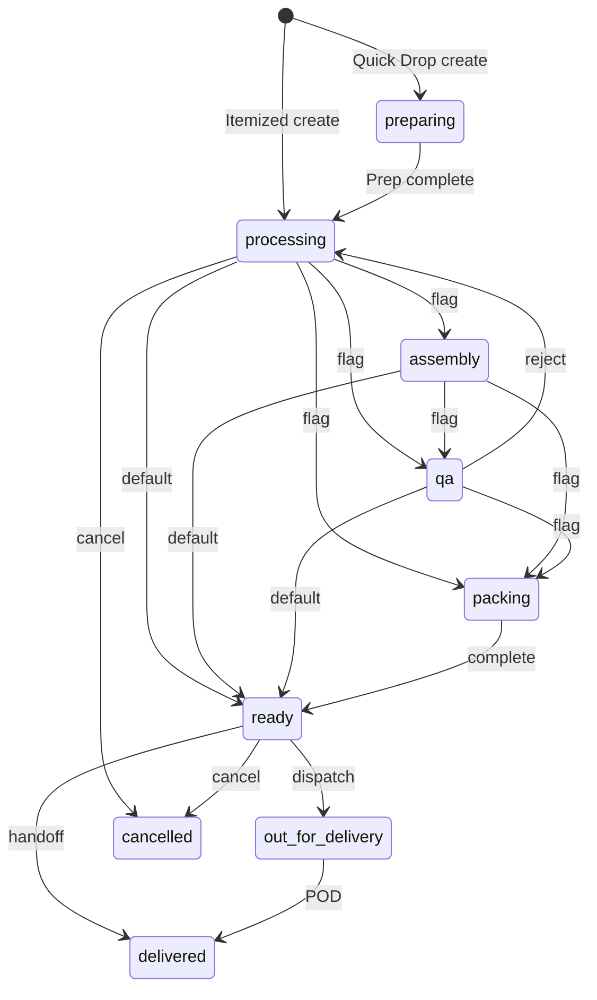

# Order Workflow — Current Implementation Discovery

**Document ID:** Order_Workflow_Current_17_07_2026_01  
**Date:** 17 July 2026  
**Type:** As-is implementation discovery (no redesign, recommendations, or future-state)

---

## 1. Document control

| Field | Value |
|-------|-------|
| Title | CleanMateX Current Order Workflow — Implementation Discovery |
| Scope | Executable implementation as of 17 Jul 2026 |
| Primary evidence | Source code, Prisma schema, Supabase migrations, tests |
| Documentation used | Only where needed to interpret intent; labeled as documented vs executable |
| Exclusions | Redesign, gap-vs-ideal comparison, remediation advice |

---

## 2. Investigation scope

Determine what Order Workflow functionality currently exists, how it runs, where it is implemented, and which path is active at runtime. Areas covered: New Order → Preparation → Processing → Assembly/QA/Packing/Ready → Delivery/Collection; splits; issues; cancel; finance gates; config; APIs; UI; events; tests.

---

## 3. Repositories and folders inspected

| Location | Result |
|----------|--------|
| `F:\jhapp\cleanmatex\web-admin\` | Primary active implementation (Next.js APIs, services, dashboard UI) |
| `F:\jhapp\cleanmatex\supabase\` | Migrations, RPCs, SQL tests |
| `F:\jhapp\cleanmatex\cmx-api\` | Auth/health scaffolding only — **no order workflow modules** |
| `F:\jhapp\cleanmatex\api-admin\` | **Not found** (directory does not exist) |
| `F:\jhapp\cleanmatex\cmx_mobile_apps\` | Customer booking prefs + driver app stub; no production driver POD runtime |
| `F:\jhapp\cleanmatex\docs\developers\workflow-system-guide.md` | Architecture intent (documented); cross-checked against code |
| `packages/`, workers | No BullMQ order-workflow workers found |

---

## 4. Executive summary

The active Order Workflow is a **hybrid** system centered on `web-admin`:

1. **Order status** lives on `org_orders_mst` as dual fields `status` and `current_status` / `current_stage`, plus flags such as `preparation_status`, `is_order_quick_drop`, `rack_location`.
2. **Two transition engines coexist:**
   - **Legacy (default):** `WorkflowService.changeStatus` → RPC `cmx_order_transition` (template-edge validated; dual-writes `status` + `current_*`).
   - **Enhanced (opt-in):** `WorkflowServiceEnhanced.executeScreenTransition` → screen contracts + app rules → RPC `cmx_ord_execute_transition` (updates `current_status`/`current_stage`; does not update `status` in that RPC).
3. **Default mode:** `NEXT_PUBLIC_USE_NEW_WORKFLOW_SYSTEM` defaults to **false** (`workflow-config.ts`). Many screen UIs pass `useOldWfCodeOrNew: useNewWorkflowSystem`; some callers force enhanced (`true`) for cancel/return; processing-table mark-ready often omits `screen` and always hits legacy.
4. **Runtime happy path (itemized walk-in):** create via `POST /api/v1/orders/submit-order` → initial `processing` → optional assembly/qa/packing (template flags) → `ready` → handover as `delivered` (or delivery route/POD). Quick Drop starts as `preparing` and goes through Preparation → `processing`.
5. **Piece tracking is active in code** (`OrderPieceService`; UI forces `trackByPiece: true`). Item processing steps are logged separately.
6. **Pickup ops:** schema/flags/notifications only — no `org_pickup*` runtime service. **Delivery:** routes/OTP/POD implemented in web-admin. **Customer collection:** Ready screen handoff with UI payment gate (not WorkflowService payment gate).
7. **api-admin** and **cmx-api order workers:** not present.

---

## 5. Active workflow architecture

### Controlling layer

| Concern | Layer |
|---------|-------|
| Allowed template edges (legacy) | Database (`sys_workflow_template_*` + `cmx_order_transition`) |
| Screen status membership (enhanced) | Database hard-coded (`cmx_ord_screen_pre_conditions`) |
| Next-status resolution by screen | Application (`resolveNextStatus` hard-coded map) |
| Feature flags / plan limits / HQ settings | Application |
| Atomic status write + history | Database RPCs |
| UI next-status branching | Frontend (processing/assembly/qa pages duplicate flag logic) |

**Verdict:** Mixed control; **Hybrid** hard-coded + configurable (templates + env/feature flags).

### Tracking levels present

| Level | Present |
|-------|---------|
| Order | Yes — primary |
| Item | Yes — status/stage/QA/steps |
| Piece | Yes — create/scan/status |
| Task | Partial — `org_asm_tasks_mst` assembly tasks |
| Batch | Partial — item batch-update APIs; not a batch workflow engine |
| Delivery | Yes — routes/stops/POD tables |

### Authoritative status literals (executable SoT for transitions)

- Primary TypeScript: `web-admin/lib/types/workflow.ts` (`OrderStatus`)
- Competing UI/list set: `web-admin/lib/constants/order-types.ts` (includes `pending`, `preparing`, `completed` not in workflow.ts)
- Runtime create path writes **`preparing`** (Quick Drop) and **`processing`** (normal) — not `preparation`

### Competing implementations

| Path | Entry | Write | Default |
|------|-------|-------|---------|
| Legacy | No `screen` or `useOldWfCodeOrNew === false` | `cmx_order_transition` | **Yes** (env default false) |
| Enhanced | `screen` + new mode true | `cmx_ord_execute_transition` / cancel / return RPCs | Opt-in |
| Legacy prep | `POST /api/v1/preparation/[id]/complete` + server action | Direct prep complete → `processing` | Parallel to FastItemizer |
| Direct status | `PATCH /api/orders/[orderId]/status`, bulk-status | WorkflowService | Secondary |

### Active runtime path (most common UI)

Dashboard screen → `useOrderTransition` → `POST /api/v1/orders/[id]/transition` → Enhanced **or** Legacy per flags → RPC → `org_order_history` STATUS_CHANGE.

Evidence:
- `web-admin/lib/config/workflow-config.ts:20-29`
- `web-admin/app/api/v1/orders/[id]/transition/route.ts`
- `web-admin/lib/services/workflow-service.ts:68-169`
- `web-admin/lib/services/workflow-service-enhanced.ts:120-452`

---

## 6. Current data model

| Actual name | Purpose | Workflow fields | Relationships | Readers/writers | Runtime status |
|-------------|---------|-----------------|---------------|-----------------|----------------|
| `org_orders_mst` | Order header | `status`, `current_status`, `current_stage`, `preparation_status`, `workflow_template_id`, `rack_location`, `is_order_quick_drop`, `parent_order_id`, `has_issue`, `physical_intake_status`, `payment_status`, `pay_on_collection_amount` | customer, items, parent | OrderService, Workflow*, screens | Active |
| `org_order_items_dtl` | Line items | `status`/`item_status`/`item_stage`, `qa_status`, `item_last_step` | order, pieces, issues | OrderService, ItemProcessing, UI | Active |
| `org_order_item_pieces_dtl` | Pieces | `piece_status`, `piece_stage`, `scan_state`, `is_ready`, `rack_location` | item | OrderPieceService, assembly/QA | Active |
| `org_order_item_processing_steps` | Per-item step log | step code/seq | item | ItemProcessingService | Active |
| `org_order_history` | Canonical audit | action types e.g. STATUS_CHANGE | order | RPCs, history consumer, OrderTimeline | Active |
| `org_order_status_history` | Old status history | — | — | Deprecated | Legacy |
| `org_order_item_issues` | QA/item issues | priority, solved_at | order/item | OrderService.createIssue/resolveIssue | Active |
| `sys_workflow_template_cd` + stages + transitions | Template graph | stage_code, from→to | tenant assignment | Legacy transition RPC | Active (legacy) |
| `org_tenant_workflow_templates_cf` | Tenant template pick | — | templates | Workflow assignment | Active |
| `org_tenant_workflow_settings_cf` | Tenant WF settings | `track_individual_piece`, screens | — | Settings; UI forces pieces on | Partial |
| `org_workflow_settings_cf` / `org_workflow_rules` | Old PRD-005 config | quality_gate_rules JSON | — | canMoveToReady reads settings | Legacy / mostly unused |
| `org_asm_tasks_mst` | Assembly tasks | task_status, scanned_items, qa_status | order | Assembly APIs/UI, canMoveToReady | Partial |
| `org_dlv_routes_mst` / `org_dlv_stops_dtl` / `org_dlv_pod_tr` | Delivery | route_status_code, stop_status_code | orders | DeliveryService | Active |
| `org_dlv_slots_mst` | Pickup/delivery slots | slot_type | — | Schema; no web-admin service usage found | Scaffolded |
| Quick Drop | Order flags | `is_order_quick_drop`, `quick_drop_quantity`, bags | — | Order create + Preparation | Active |
| Lockers / org_pickup* / outsourcing packages | — | — | — | — | **Not found** |

Evidence: `web-admin/prisma/schema.prisma:889+`, migrations `0018`, `0020`, `0025`, `0065`, `0073`, `0075`.

---

## 7. Status and stage inventory

### Order lifecycle (active literals seen in runtime writers/readers)

| Literal | Definition | Main writer | Main reader | UI | Status |
|---------|------------|-------------|-------------|-----|--------|
| `draft` | Remote intake / contract | create + screen contracts | new_order screen | New Order remote | Active |
| `preparing` | Quick Drop prep queue | `resolveInitialWorkflowStatus` | preparation screen/contract | Preparation list | Active |
| `preparation` | Enum/UI meta | Rare | workflow.ts / STATUS_META | Labels | Partial / enum-only vs `preparing` |
| `intake` | Stage / legacy create | `current_stage` on create; legacy action | contracts | Mixed | Active as stage; also status in places |
| `processing` | Main plant queue | create + prep complete | processing screens | Processing | Active |
| `sorting`/`washing`/`drying`/`finishing` | Enum + item steps | Item step codes more than order status | UI steps | Processing steps | Order-level mostly unused |
| `assembly` | Post-processing | transitions | assembly screens | Assembly | Active when template has stage |
| `qa` | Quality | transitions | QA screens | QA | Active when template has stage |
| `packing` | Pack | transitions | packing screens | Packing | Screens exist; seeded templates lack `packing` stage → flags often false |
| `ready` | Ready for handover | transitions | ready screens | Ready | Active |
| `out_for_delivery` | Driver | delivery transitions | delivery page | Delivery | Active |
| `delivered` | Complete handoff | transitions / POD | lists | Ready/Delivery | Active |
| `closed` | Retail-only terminal | create retail path | — | — | Active for retail-only |
| `cancelled` | Cancel/return | cancel/return RPCs | dialogs | Cancel UI | Active |
| `pending` / `completed` | order-types.ts only | Uncertain | filters? | List constants | Drift / uncertain |

### Item / piece

| Literal | Scope | Writer | Status |
|---------|-------|--------|--------|
| Item steps: `sorting`, `pretreatment`, `washing`, `drying`, `finishing` | Item | ItemProcessingService / processing page | Active |
| Piece: `intake` \| `processing` \| `qa` \| `ready` | Piece | OrderPieceService | Active |
| Create default piece_status `processing` | Piece | createPiecesForItem | Active |
| Item `assembled` / QA `passed` | Item | Assembly/QA paths | Active (gates) |

### Material inconsistencies

| Issue | Evidence |
|-------|----------|
| `preparing` vs `preparation` | Create writes `preparing`; enum has `preparation`; screen accepts both |
| `status` vs `current_status` dual-write | Old RPC updates both; new execute RPC updates `current_*` only |
| order-types `pending`/`completed` vs workflow.ts | Different constant sets |
| Seeded templates lack `packing`/`preparation` | `0018_workflow_templates.sql`; packing_enabled often false |
| Screen-contract permission codes not in `orders-perm.ts` | `orders:preparation:complete` etc. only in SQL contract |
| `canMoveToReady` never called | Defined `workflow-service.ts:279`; no call sites |

---

## 8. Current runtime workflow

```text
Submit order
→ Quick Drop (incomplete items): preparing → Preparation itemize → processing
→ Itemized: processing
→ [assembly?] → [qa?] → [packing?]  (template flags)
→ ready (rack often required)
→ customer handoff: delivered  OR  delivery: out_for_delivery → delivered (POD)
→ cancel path: → cancelled (+ financial unwind)
```

| Step | UI | API | Service | Validation | DB write | Transition | Side effects |
|------|----|-----|---------|------------|----------|------------|--------------|
| Create | New Order + Payment Modal | `POST …/submit-order` | OrderSubmitOrchestrator + OrderService | pricing/settlement/B2B credit | order+items+pieces+invoice/payments | initial status | number gen, settlement |
| Prep complete | FastItemizer | `POST …/transition` screen=preparation | Enhanced/Legacy | items complete (UI) | status→processing; prep completed | preparing→processing | markPreparationCompleted |
| Processing complete | processing/[id] | transition screen=processing | same | rack if next=ready | next status | → assembly/qa/packing/ready | — |
| Assembly | assembly/[id] | transition | Enhanced: all pieces scanned | scan_state | → qa/packing/ready | — |
| QA pass/fail | qa/[id] | transition / createIssue | — | — | → packing/ready or →processing | issue rows on reject |
| Packing | packing/[id] | transition | — | rack save | → ready | — |
| Ready deliver | ready/[id] | transition | UI remaining>0 block | — | → delivered | collect-payment optional |
| Delivery POD | delivery UI | delivery POD APIs | DeliveryService.capturePOD | OTP optional | stop+order delivered | WorkflowService.changeStatus |
| Cancel | CancelOrderDialog | transition screen=canceling | Enhanced cancel RPC | disposition if paid | cancelled | financial unwind |

Traced variants:

| Variant | Implemented? |
|---------|----------------|
| Normal walk-in | Yes |
| Quick Drop | Yes |
| Split/child | Yes (API + processing UI) |
| Issue/rework | Yes — same order back to processing |
| Pickup ops | Not found (flags/schema only) |
| Customer collection | Yes as Ready handoff (not separate status) |
| Driver delivery | Yes (web-admin); mobile driver stub |
| Partial payment / pay on collection | Yes at submit + Ready collect |
| Cancellation | Yes |
| Reopen workflow status | Not found (financial due reopen only) |

---

## 9. New Order

| Topic | As-is fact |
|-------|------------|
| Main route | `/dashboard/orders/new` → `NewOrderProvider` / `NewOrderScreen` |
| Persist timing | On submit inside orchestrator transaction (`OrderService.createOrderInTransaction`) |
| Canonical API | `POST /api/v1/orders/submit-order` (auth `orders:create` + CSRF) |
| Order number | `generate_order_number` / `generateOrderNumberWithTx` → `ORD-YYYYMMDD-XXXX` at persist |
| Drafts | Remote intake can start as `draft`; no separate long-lived draft store found beyond status |
| Initial status | Quick Drop incomplete → `preparing`; else `processing`; retail-only → `closed`; remote → contract/`draft` + `pending_dropoff` |
| Pieces | Created immediately per item quantity in create tx |
| Invoice/payments | Created in same submit orchestration |
| Guest/Stub/Full/B2B | Customer selection + B2B credit hold (`B2B_CREDIT_HOLD`) on submit |
| Quick Drop | Flags + incomplete items → preparation path |
| Express/rush | Priority / ready_by fields present; calculation in order create pricing path |
| Destination after submit | Order detail / workflow screens (UI flow) |
| Legacy alternate | Server action `createOrder` → status `intake`, prep pending (Quick Drop legacy) |

Evidence: `order-service.ts:380-436,873-918,1199+`; `order-submit-orchestrator.service.ts`; `use-order-submission.ts:509`.

---

## 10. Preparation

| Behavior | Implementation |
|----------|----------------|
| Screens | `/dashboard/preparation`, `/dashboard/preparation/[orderId]` (`FastItemizer`); legacy `/dashboard/orders/[id]/prepare` |
| Quick Drop itemization | FastItemizer completes → transition to `processing` |
| Declared vs actual qty | `quick_drop_quantity` vs items length drives initial preparing |
| Bags | `bag_count` on order |
| Item/piece create | Prep adds items; pieces via piece service patterns |
| Price / ready-by recalculation | Prep preview/complete APIs under `/api/v1/preparation/**` |
| Customer approval | Not found as a distinct gate |
| Transition | preparation → processing via transition API or legacy complete API |
| Feature gate | `NEXT_PUBLIC_FEATURE_PREPARATION` on legacy complete API |

---

## 11. Processing

| Question | Answer |
|----------|--------|
| Tracked at | Order status + item steps + optional pieces |
| Steps | Hard-coded UI list: sorting, pretreatment, washing, drying, finishing |
| Ordering | Seq via `stepSeq` / UI index |
| Completion | Per-item `recordProcessingStep`; order-level complete transitions to next stage |
| Skip | Not a first-class skip API found; UI can advance order without all steps |
| Auto transition | When all items ready, ItemProcessingService may call `transitionOrder` → ready |
| Progress | UI % from completed steps / 5 |
| History | `org_order_item_processing_steps` + order history on status change |
| Machine/batch engine | Not found as machine assignment workflow |

Evidence: `processing/[id]/page.tsx:50-56,156-208`; `item-processing-service.ts`.

---

## 12. Assembly, QA, Packing, and Ready

### Assembly

| Field | Fact |
|-------|------|
| Screens | `/dashboard/assembly`, `/dashboard/assembly/[id]` |
| Entry | `current_status=assembly` or list contract |
| Scope | Order + pieces (scan) |
| Actions | Complete → qa/packing/ready; assembly tasks API |
| Validation (enhanced) | All pieces `scan_state=scanned` |
| Permissions | UI contract `orders:transition`; assembly tasks API auth-only |

### QA

| Field | Fact |
|-------|------|
| Screens | `/dashboard/qa`, `/dashboard/qa/[id]` |
| Actions | Accept → packing/ready; reject → create issue + back to `processing` |
| Enhanced QA pass | Requires `inspection_data` + `inspected_by` when action=pass |

### Packing

| Field | Fact |
|-------|------|
| Screens | `/dashboard/packing`, `/dashboard/packing/[id]` |
| Actions | Save rack; complete → `ready` |
| Template flag | Often false on seeded templates (no packing stage) |

### Ready — gates currently implemented

| Gate | Where enforced | Path |
|------|----------------|------|
| Rack location (to ready) | DB `cmx_order_transition` when `p_to=ready` and rack null; UI on processing when next=ready | Legacy + UI |
| Quality gates (assembled / QA / blocking issues) | `checkQualityGates` when nextStatus==ready | **Enhanced path only** |
| `canMoveToReady` (assembly task READY/QA_PASSED, stains) | Defined in WorkflowService | **No call sites — unused** |
| Outstanding balance | Ready UI disables Mark Delivered if remaining > 0 | **UI only** |
| Payment status in WorkflowService | — | **Not found** |

---

## 13. Transition matrix

| From | Action | To | Scope | Implemented in | Main validation |
|------|--------|----|-------|----------------|-----------------|
| (create) | submit | preparing \| processing \| draft \| closed | Order | OrderService | items/QD/remote/retail |
| preparing | prep complete | processing | Order | transition / prep complete | screen/items |
| processing | complete | assembly \| qa \| packing \| ready | Order | transition + UI flags | rack if ready |
| assembly | complete | qa \| packing \| ready | Order | transition | pieces scanned (new) |
| qa | pass | packing \| ready | Order | transition | inspection (new) |
| qa | reject | processing | Order | transition + createIssue | — |
| packing | complete | ready | Order | transition | — |
| ready | deliver/handover | delivered | Order | transition | UI remaining=0 |
| ready / processing | dispatch | out_for_delivery | Order | delivery flows | — |
| out_for_delivery | POD / mark delivered | delivered | Order+stop | DeliveryService / transition | OTP optional |
| * | cancel | cancelled | Order | canceling RPC | reason + disposition |
| * | return | cancelled | Order | returning RPC | reason |

Also:

- **Direct status updates:** `PATCH /api/orders/[orderId]/status`, bulk-status — bypass screen orchestration.
- **Automatic:** ItemProcessing mark-complete may auto-ready order; POD auto-sets order delivered.
- **Reverse:** QA reject → processing; cancel is terminal for workflow status.
- **Duplicate:** Legacy vs Enhanced; FastItemizer vs legacy PreparationForm; processing-table ready without `screen`.



---

## 14. Pickup, delivery, and collection

### Pickup

| Capability | Status |
|------------|--------|
| Request/schedule/slots/driver/OTP/failed/reschedule | **Not found** as runtime ops |
| Schema | `org_dlv_slots_mst` (slot_type pickup/delivery) — unused by web-admin services found |
| Flags / NTF catalog | `pickup_scheduling_enabled`; notification event codes seeded |
| Flutter | PickupSlotModel / booking preferences only |

### Delivery

| Capability | Status |
|------------|--------|
| Route create, assign driver | Yes — DeliveryService + APIs |
| OTP generate/verify | Yes |
| POD signature/photo/OTP | Yes — `capturePOD` |
| Payment collection on delivery | **Not found** in DeliveryService |
| Failed/partial/refusal/offline driver queue | **Not found** / not confirmed |
| Status storage | Route + stop tables; order via WorkflowService → `delivered` |
| Notifications | Transition emits only ready/cancelled at API layer (not every delivery stage) |

### Customer collection

| Capability | Status |
|------------|--------|
| Ready-for-collection | Ready screen (`current_status=ready`) |
| Payment / release | Collect modal for `PAY_ON_COLLECTION`; deliver blocked if remaining > 0 (UI) |
| Barcode/OTP/PIN ID | Not found as collection verification |
| Package scan on collection | Not found |
| Same path as delivery? | **Separate** — Ready handoff vs Delivery route/POD; both can end at `delivered` |

---

## 15. Transfers, outsourcing, packages, racks, and lockers

| Area | Representation | Runtime |
|------|----------------|---------|
| Branch/plant/store transfer | Feature flag `branch_transfers` | No order-transfer service found |
| Outsourcing / external vendor | — | **Not found** |
| Packages (order packing units) | — | **Not found** (ERP package_id unrelated) |
| Rack | Text field `rack_location` on order/pieces; gate on ready | Active field + gate |
| Bins/shelves/lockers/staging | — | **Not found** |

---

## 16. Split and partial fulfilment

| Topic | Fact |
|-------|------|
| Parent field | `parent_order_id`, `has_split`, `order_subtype='split_child'` |
| Split action | `OrderService.splitOrder` / `splitOrderByPieces`; `POST /api/v1/orders/[id]/split` |
| UI | Processing modal; gated by setting `USING_SPLIT_ORDER` / `splitOrderEnabled` |
| Merge | **Not found** |
| Partial release | Flag `partial_release_enabled` defined; **no workflow reader found** |
| Split ≠ partial release | Split creates child order; partial release not implemented as fulfilment release |

---

## 17. Issues, rework, returns, and cancellation

| Flow | Behavior |
|------|----------|
| QA failure | Issue row + transition same order to `processing` |
| Damage/stain/missing | Issues table + item flags; quality gates can block ready (enhanced) |
| Rework order | **Not created** — original order moves backward |
| Customer return | `CustomerReturnOrderDialog` → returning → cancelled |
| Cancel | Disposition REFUND / STORE_CREDIT / KEEP_ON_ACCOUNT; unwind service |
| Hold / resume workflow | **Not found** |
| Reopen cancelled → prior status | **Not found** |
| Financial reopen due | Refund `reopens_due_amount` (finance, not workflow stage) |
| Force complete | Uncertain / not primary path |

---

## 18. Finance interaction

| Question | Fact |
|----------|------|
| Processing without payment? | Yes — WorkflowService has no payment gate |
| Ready without payment? | Status yes; handoff UI blocks if remaining > 0 |
| Collect/deliver with balance? | UI blocks deliver; collect-payment path for POC |
| B2B different? | Credit hold on submit; non-POC remaining → account-receipt link |
| Transitions creating invoices | Submit-order orchestration (create), not stage transitions |
| Release rules | Hard-coded UI remaining check; enhanced quality gates; DB rack gate |
| Wallet/gift/promo/credit | Present on order create/settlement (Order Fin), not stage transition logic |
| Cash drawer | Outside core status transition (settlement domain) |

---

## 19. Configuration and permissions

### Settings / flags read by runtime

| Setting | Storage | Default | Scope | Backend | UI | Active |
|---------|---------|---------|-------|---------|-----|--------|
| `NEXT_PUBLIC_USE_NEW_WORKFLOW_SYSTEM` | Env | false | Deploy | Yes | Yes | Active |
| `USE_NEW_WORKFLOW_SYSTEM` HQ key | Feature flags API | effectively off if absent | Tenant | Enhanced fork | — | Uncertain catalog |
| `assembly_workflow` / `qa_workflow` / `packing_workflow` | Plan flags | plan-dependent | Tenant | Enhanced screen check | — | Active when new path |
| Template assembly/qa/packing_enabled | RPC from stages | template | Order | Yes | Yes (next status) | Active |
| `workflow.{screen}.enabled` | HQ settings | — | Tenant | Soft fail | — | Partial |
| `NEXT_PUBLIC_FEATURE_PREPARATION` | Env | — | Deploy | Prep APIs | — | Active |
| `USING_SPLIT_ORDER` | Tenant setting | — | Tenant | — | Processing UI | Active |
| `track_individual_piece` DB | Tenant CF | false | Tenant | — | Forced true in hook | UI overrides |
| `pickup_scheduling_enabled` | Flag | false | Tenant | No reader found | — | Defined only |
| `partial_release_enabled` | Flag | — | Tenant | No reader found | — | Defined only |
| `offline_queue_enabled` | Flag | — | — | No workflow reader | — | Defined only |

### Permissions (major actions)

| Action | Code | Enforced |
|--------|------|----------|
| Transition | `orders:transition` | Transition API |
| Create | `orders:create` | submit-order |
| Prep complete legacy | `orders:update` | prep complete API |
| Collect payment | `orders:collect_payment` | collect-payment API |
| Cancel keep-on-account | `orders:approve_refund` | Enhanced cancel gate |
| Screen-contract stage codes | e.g. `orders:qa:approve` | Enhanced checks list from RPC — **codes not seeded in orders-perm** |
| Workflow page gates | `page: {}` | Navigation roles; no RequireAnyPermission on many workflow pages |

---

## 20. APIs

| Method/route | Handler | Main service | Main writes | Frontend caller | Auth |
|--------------|---------|--------------|-------------|-----------------|------|
| `POST /api/v1/orders/submit-order` | submit-order/route | Orchestrator + OrderService | order+fin | use-order-submission | orders:create |
| `POST /api/v1/orders/[id]/transition` | transition/route | Enhanced or WorkflowService | status/history | useOrderTransition | orders:transition |
| `GET /api/v1/orders/[id]/transitions` | transitions/route | isTransitionAllowed | — | UI | auth-only |
| `GET /api/v1/orders/[id]/workflow-context` | workflow-context | flags RPC | — | screens | orders:read |
| `GET /api/v1/workflows/screens/[screen]/contract` | contract/route | screen RPC | — | useScreenOrders | none in handler |
| `POST /api/v1/preparation/[id]/complete` | complete/route | completePreparation | prep+status | legacy prep | orders:update |
| `POST /api/v1/orders/[id]/split` | split/route | OrderService.split* | child order | processing modal | (route auth) |
| Item step/complete/pieces/scan | under orders/[id]/items… | ItemProcessing / Piece | steps/pieces | processing/assembly | orders:* |
| `POST /api/v1/orders/[id]/collect-payment` | collect-payment | collectPaymentTx | payments | Ready modal | orders:collect_payment |
| Delivery routes/OTP/POD | `/api/v1/delivery/**` | DeliveryService | routes/stops/pod | delivery UI | drivers:read etc. |
| `PATCH /api/orders/[orderId]/status` | legacy | WorkflowService | status | older clients | session |
| Server actions createOrder / completePreparation | app/actions/orders | lib/db/orders | order | legacy | server |

Supabase RPCs (core): `cmx_order_transition`, `cmx_validate_transition`, `cmx_ord_screen_pre_conditions`, `cmx_ord_execute_transition`, `cmx_ord_canceling_transition`, `cmx_ord_order_workflow_flags`, `generate_order_number`.

---

## 21. UI implementation

| Area | Route/component | Data source | Main actions | Statuses shown |
|------|-----------------|-------------|--------------|----------------|
| New Order | `/dashboard/orders/new` | submit-order | Create/pay | draft/submit |
| Prep list/detail | `/dashboard/preparation*` | useScreenOrders | Itemize, complete | preparing/intake |
| Processing | `/dashboard/processing*` | screen orders + pieces | Steps, complete, split | processing |
| Assembly | `/dashboard/assembly*` | screen + pieces | Scan, complete | assembly |
| QA | `/dashboard/qa*` | screen | Pass/fail | qa |
| Packing | `/dashboard/packing*` | screen | Rack, ready | packing |
| Ready | `/dashboard/ready*` | screen + payment ctx | Collect, deliver | ready |
| Delivery | `/dashboard/delivery` | out_for_delivery + routes | Route, POD, deliver | out_for_delivery |
| Order detail/actions | orders UI | order APIs | Cancel/return/transition | mixed |
| Pickup / collection screens | — | — | — | **Not found** |
| Driver app | cmx_mobile_apps driver | stub | — | Scaffolded |
| Customer tracking | customer app labels | — | view | Partial |

**Frontend rule duplication:** Processing/assembly/qa pages re-implement next-status flag logic also in `resolveNextStatus`.

---

## 22. Events, jobs, notifications, and audit

| Event/job | Producer | Trigger | Consumer | Runtime status |
|-----------|----------|---------|----------|----------------|
| STATUS_CHANGE history | Transition RPCs | Status change | org_order_history | Active |
| `order.ready` / `order.cancelled` notify | transition/route | After success | Notification outbox → WA/SMS/email | Active (those two only) |
| Financial outbox | Settlement | payment/order complete | edge outbox-worker | Active (finance) |
| BVM → history | order-history-consumer | outbox | history upsert | Active |
| BullMQ workflow jobs | — | — | — | **Not found** |
| Realtime stage fanout | — | — | — | **Not found** |

### Audit (org_order_history)

- Captures: action type, before/after status (via RPC payload), actor, timestamps
- UI: Order timeline polls `org_order_history`
- Immutable intent: outbox upsert idempotent on `(tenant_org_id, outbox_event_id)`
- Deprecated: `org_order_status_history`

---

## 23. Offline, concurrency, and resilience

| Mechanism | Status |
|-----------|--------|
| Offline mutation queue (workflow) | Not found (flag only) |
| Idempotency keys | Enhanced cancel/return/execute RPCs |
| Optimistic lock `expected_updated_at` | Enhanced RPCs; **not** old `cmx_order_transition` call |
| Transactions | Postgres RPCs; create order tx; cancel unwind after |
| Duplicate submit | Submit orchestration + CSRF; not fully catalogued here |
| Duplicate scan | Piece scan APIs exist; protection specifics vary |
| Webhook replay | Payment domain (outside stage workflow) |

---

## 24. Tests

| Area | Type | File | Covered | Status |
|------|------|------|---------|--------|
| Legacy transition | Unit | `__tests__/services/workflow-service.test.ts` | changeStatus RPC | Active |
| Enhanced tenant | Unit | workflow-service-enhanced-tenant-isolation.test.ts | isolation | Active |
| Cancel guard | Unit | workflow-cancel-guard.test.ts | disposition | Active |
| Schema | Unit | workflow-schema.test.ts | Zod statuses | Active |
| Client API | Unit | workflow-orders.test.ts | mocks | Active |
| Prep preview | Unit | preparation.preview.test.ts | totals | Active |
| History consumer | Unit | order-history-consumer.service.test.ts | mapping | Active |
| Pieces | Unit | order-piece-service.test.ts | pieces | Active |
| SQL RPC | SQL | supabase/tests/workflow_functions.test.sql | cmx_order_transition | Active |
| Screen contracts | SQL | test_screen_contracts_simplified.sql | flags | Active |
| E2E | Playwright | e2e/workflow-orders.spec.ts | create+transitions | Skeleton-ish |
| E2E | Playwright | e2e/new-order.spec.ts, cancel-return-orders.spec.ts | create/cancel | Active |
| Flutter workflow | — | — | — | **Not found** |

No `.skip` found on these workflow tests. Material risk: tests may assume single engine while dual paths exist.

---

## 25. Important inconsistencies

| ID | Inconsistency | Evidence | Likely active path | Confidence |
|----|---------------|----------|--------------------|------------|
| I01 | Dual transition engines; env defaults to legacy | workflow-config; transition route | Legacy unless flag+screen | High |
| I02 | `preparing` vs `preparation` literals | order-service create; workflow.ts | `preparing` at runtime | High |
| I03 | New RPC may not update `status` column | 0075 execute transition | Dual column drift risk | High |
| I04 | Processing-table ready without `screen` | processing-table.tsx | Always legacy | High |
| I05 | `canMoveToReady` unused vs enhanced `checkQualityGates` | workflow-service.ts call sites empty | Enhanced gates only when new+to ready | High |
| I06 | Screen permission codes not in RBAC seed/constants | 0075 SQL vs orders-perm.ts | Checks may always fail/miss if new path on | Medium |
| I07 | Packing UI exists; templates often lack packing stage | 0018 seed; flags RPC | Skip packing | High |
| I08 | Ready payment gate UI-only | ready/[id]/page.tsx; no WorkflowService payment check | UI enforce | High |
| I09 | Pieces forced on in UI; DB setting default false | useTenantSettings.ts | Always pieces in UI | High |
| I10 | Pickup nav/flags without page/service | order-header-nav; no pickups page | Dead link / scaffold | High |
| I11 | order-types vs workflow status sets | order-types.ts vs workflow.ts | Mixed list/filter usage | Medium |

---

## 26. Implementation maturity matrix

| Area | Database | Backend/API | UI | Audit | Tests | Runtime status |
|------|----------|-------------|-----|-------|-------|----------------|
| Order creation | Implemented | Implemented | Implemented | Implemented | Implemented | Implemented |
| Quick Drop | Implemented | Implemented | Implemented | Partial | Partial | Implemented |
| Preparation | Implemented | Implemented | Implemented | Partial | Partial | Implemented |
| Processing | Implemented | Implemented | Implemented | Implemented | Partial | Implemented |
| Item tracking | Implemented | Implemented | Implemented | Partial | Partial | Implemented |
| Piece tracking | Implemented | Implemented | Implemented | Partial | Implemented | Implemented |
| Batch processing | Partial | Partial | Partial | — | — | Partially implemented |
| Assembly | Implemented | Implemented | Implemented | Partial | Partial | Partially implemented (flagged) |
| QA | Implemented | Implemented | Implemented | Partial | Partial | Partially implemented (flagged) |
| Packing | Partial | Implemented | Implemented | Partial | — | Partially implemented / often skipped |
| Ready | Implemented | Implemented | Implemented | Partial | Partial | Implemented |
| Rack/storage | Field only | Gate | Field UI | — | — | Partially implemented |
| Pickup | Scaffolded | Not found | Not found | NTF seed | — | Scaffolded |
| Delivery | Implemented | Implemented | Implemented | Partial | — | Implemented |
| Customer collection | — | collect-payment | Ready handoff | Partial | — | Partially implemented |
| POD | Implemented | Implemented | Implemented | Partial | — | Implemented |
| Transfers | Flag only | Not found | Not found | — | — | Apparently unused |
| Outsourcing | Not found | Not found | Not found | — | — | Not found |
| Split orders | Implemented | Implemented | Implemented | Partial | Partial | Implemented |
| Partial release | Flag | Not found | Not found | — | — | Apparently unused |
| Issues | Implemented | Implemented | Partial | Partial | Partial | Implemented |
| Rework | Same-order | Implemented | QA reject | Partial | — | Partially implemented |
| Returns | Implemented | Implemented | Dialog | Partial | E2E | Implemented |
| Cancellation | Implemented | Implemented | Dialog | Implemented | Implemented | Implemented |
| Holds | Not found | Not found | Not found | — | — | Not found |
| Reopening (status) | Not found | Not found | Not found | — | — | Not found |
| Payment | Implemented | Implemented | Implemented | Implemented | Many Fin tests | Implemented |
| Invoice | Implemented | Implemented | Partial | Implemented | Fin tests | Implemented |
| Refund | Implemented | Implemented | Implemented | Implemented | Fin tests | Implemented |
| B2B | Implemented | Credit hold | Account receipt | Partial | — | Implemented |
| Marketplace | Unable to confirm | — | — | — | — | Unable to confirm |
| Notifications | Catalog | ready/cancelled emit | — | Outbox | Partial | Partially implemented |
| SLA / ready_by | Fields | Create calc | Display | — | — | Partially implemented |
| Audit | Implemented | Implemented | Timeline | — | Consumer tests | Implemented |
| Offline | Flag | Not found | Not found | — | — | Apparently unused |

---

## 27. Unknown or unconfirmed items

- Whether production tenants enable `NEXT_PUBLIC_USE_NEW_WORKFLOW_SYSTEM` / HQ `USE_NEW_WORKFLOW_SYSTEM`
- Live tenant template assignment distribution (which WF_* templates in use)
- Exact behavior when enhanced path checks screen-contract permissions that are not seeded
- Depth of Express/rush SLA enforcement beyond ready_by fields
- Marketplace order workflow
- Whether `PATCH /api/orders/.../status` is still called by any production client
- Staff Flutter app workflow depth (folder exists; not fully traced)

---

## 28. Key files and symbols

| Path | Symbols / role |
|------|----------------|
| `web-admin/lib/types/workflow.ts` | `OrderStatus`, `ORDER_STATUSES`, `STATUS_META` |
| `web-admin/lib/constants/order-types.ts` | Simplified `ORDER_STATUS` |
| `web-admin/lib/config/workflow-config.ts` | `getWorkflowSystemMode` |
| `web-admin/lib/services/workflow-service.ts` | `changeStatus`, `canMoveToReady` (unused) |
| `web-admin/lib/services/workflow-service-enhanced.ts` | `executeScreenTransition`, `resolveNextStatus`, `checkQualityGates` |
| `web-admin/lib/services/order-service.ts` | `resolveInitialWorkflowStatus`, `createOrderInTransaction`, `splitOrder`, `createIssue` |
| `web-admin/lib/services/order-piece-service.ts` | Piece CRUD/scan |
| `web-admin/lib/services/item-processing-service.ts` | Steps + mark complete |
| `web-admin/lib/services/delivery-service.ts` | Routes, OTP, POD |
| `web-admin/app/api/v1/orders/[id]/transition/route.ts` | Transition HTTP + notify |
| `web-admin/app/api/v1/orders/submit-order/route.ts` | Create |
| `supabase/migrations/0018_workflow_templates.sql` | Template seeds |
| `supabase/migrations/0023_workflow_transition_function.sql` | `cmx_order_transition` |
| `supabase/migrations/0075_screen_contract_functions_simplified.sql` | Screen contracts + execute |
| `supabase/migrations/0025_deprecate_old_workflow.sql` | Deprecations |
| `docs/developers/workflow-system-guide.md` | Documented architecture intent |

---

## 29. Final factual summary

CleanMateX’s current Order Workflow is **web-admin–centric and hybrid**: template-validated legacy RPC transitions (default) run alongside an optional screen-contract enhanced path. Orders are created through **submit-order** with immediate items, pieces, and financial settlement; Quick Drop enters **preparation (`preparing`)** while normal itemized orders enter **processing**. Downstream stages **assembly / QA / packing** are flag- and template-dependent, with packing often skipped by seed templates. **Ready** is gated by rack (DB/UI) and, on the enhanced path, quality checks; **handover payment** is enforced in the Ready UI, not in `WorkflowService`. **Delivery** (routes/OTP/POD) is implemented in web-admin; **pickup operations**, **lockers**, **outsourcing**, **order hold**, and **workflow reopen** were not found as runtime. Dual status columns, dual engines, and diverging status literal sets are the dominant structural characteristics of the as-is system.

---

*End of report. No recommendations included.*
`)