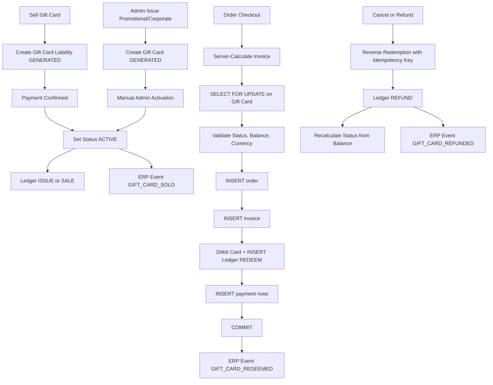

# Gift Card Stored-Value V1 Plan

## Scope And Decisions

- Target `cleanmatex` tenant app only for V1: fixed-value gift cards, same-currency redemption, partial redemption, dual PIN (hash new / legacy plaintext fallback), ledger, POS/admin UI, cancellation/refund/expiry handling, and ERP posting events.
- Activation flow from `docs/features/Promotions_and_Gift_Cards/9_Explain.md`: auto-active on paid sale; manual admin activation for promotional/corporate/goodwill/replacement cards. Never activate merely on code generation.
- `purchased_by_customer_id` (buyer) and `issued_to_customer_id` (recipient/beneficiary) are separate fields — both required for anti-fraud, refund rights, and ownership tracking.
- `issue_type` field (`SOLD`, `PROMOTIONAL`, `CORPORATE`, `GOODWILL`, `MIGRATION`, `REPLACEMENT`) determines ERP debit account.
- Treat gift cards as stored value and liability settlement. Do not persist or display them as commercial discounts.
- Rename misleading database/code semantics: `gift_card_discount_amount` → `gift_card_applied_amount` on orders and invoices; `card_number` → `gift_card_code`; generate new `CMX-XXXX-XXXX-XXXX` format for all existing and new codes.
- Keep `card_pin` column as legacy read-only. Add `pin_hash` for all new cards. Migrate on first successful legacy validation. Never return either to client.
- Feature flag enforcement deferred to V2 — gift cards always available in V1.
- QR support, scheduled expiry cron, extended ERP lifecycle events (SUSPENDED, ACTIVATED, ADJUSTMENT), breakage timing policy, and customer notifications are deferred to `Gift_Card_V2.md`.
- Defer `cleanmatexsaas` HQ features to a later cross-project plan.

## Target Flow



---

## Phase 1: Database And Type Contract

### Migration Rules
- Create one new migration file in `supabase/migrations/` (next seq after existing). Never edit existing migrations. Never apply via agent.
- Stop after creating the migration file and ask the user to review and apply it.

### 1.1 Table Rename: org_gift_card_transactions → org_gift_card_txn_dtl

**This rename requires the full DROP CASCADE workflow (CLAUDE.md mandate):**

1. Before writing the migration, run discovery queries via Supabase MCP (`supabase_local` or `supabase_remote`) to list all dependent objects:
   - RLS policies on `org_gift_card_transactions`
   - Foreign key constraints referencing the table
   - Views, triggers, functions referencing the table
2. Collect every `CREATE POLICY`, `CREATE TRIGGER`, `CREATE VIEW` statement for the affected objects.
3. Include in the migration:
   - `ALTER TABLE org_gift_card_transactions RENAME TO org_gift_card_txn_dtl;`
   - Or `DROP TABLE ... CASCADE` + `CREATE TABLE org_gift_card_txn_dtl ...` if rename is insufficient.
   - All recreate statements for affected objects immediately after the DROP/CREATE.
4. If no dependent objects beyond expected FKs and RLS policies exist, the rename migration is straightforward.

### 1.2 Column Renames

```sql
-- Orders
ALTER TABLE org_orders_mst
  RENAME COLUMN gift_card_discount_amount TO gift_card_applied_amount;

-- Invoices
ALTER TABLE org_invoice_mst
  RENAME COLUMN gift_card_discount_amount TO gift_card_applied_amount;

-- Gift cards master — rename card_number to canonical name
ALTER TABLE org_gift_cards_mst
  RENAME COLUMN card_number TO gift_card_code;
```

### 1.3 Card Number Format Migration

Update all existing card codes to the new `CMX-XXXX-XXXX-XXXX` secure format. Each card gets a unique deterministic-but-random new code:

```sql
UPDATE org_gift_cards_mst
SET gift_card_code =
  'CMX-' ||
  upper(substring(encode(gen_random_bytes(3), 'hex') from 1 for 4)) || '-' ||
  upper(substring(encode(gen_random_bytes(3), 'hex') from 1 for 4)) || '-' ||
  upper(substring(encode(gen_random_bytes(3), 'hex') from 1 for 4))
WHERE gift_card_code NOT LIKE 'CMX-%';
```

**Operational note:** Any physical cards already in customer hands will have old-format codes. Verify with operations team before applying. If old-format codes must remain valid, the service's lookup function must support both formats (regex-based detection) during a transition period defined by the tenant.

### 1.4 PIN: Add pin_hash, Keep card_pin As Legacy

```sql
ALTER TABLE org_gift_cards_mst
  ADD COLUMN pin_hash TEXT;
-- card_pin (varchar(20)) stays as legacy read-only column.
-- New cards: write pin_hash only (bcrypt/argon2), card_pin = NULL.
-- Legacy cards: card_pin non-null, pin_hash null until first successful login migrates it.
-- Service rule: never return card_pin or pin_hash to any client response.
```

### 1.5 Status Enum Migration

New canonical statuses: `DRAFT`, `GENERATED`, `ACTIVE`, `PARTIALLY_REDEEMED`, `FULLY_REDEEMED`, `EXPIRED`, `VOIDED`, `SUSPENDED`.

```sql
-- Migrate existing status values
UPDATE org_gift_cards_mst SET status = 'EXPIRED'         WHERE status = 'expired';
UPDATE org_gift_cards_mst SET status = 'VOIDED'          WHERE status = 'cancelled';
UPDATE org_gift_cards_mst SET status = 'SUSPENDED'       WHERE status = 'suspended';
UPDATE org_gift_cards_mst SET status = 'FULLY_REDEEMED'  WHERE status = 'used';
-- For 'active': split by balance ratio
UPDATE org_gift_cards_mst
  SET status = 'PARTIALLY_REDEEMED'
  WHERE status = 'active'
    AND current_balance < original_amount
    AND current_balance > 0;
UPDATE org_gift_cards_mst
  SET status = 'ACTIVE'
  WHERE status = 'active'
    AND current_balance = original_amount;
-- Edge: active but balance = 0 (should not occur, treat as FULLY_REDEEMED)
UPDATE org_gift_cards_mst
  SET status = 'FULLY_REDEEMED'
  WHERE status = 'active' AND current_balance = 0;
```

After migration, add a CHECK constraint:

```sql
ALTER TABLE org_gift_cards_mst
  ADD CONSTRAINT chk_gift_card_status
  CHECK (status IN ('DRAFT','GENERATED','ACTIVE','PARTIALLY_REDEEMED','FULLY_REDEEMED','EXPIRED','VOIDED','SUSPENDED'));
```

### 1.6 Extend org_gift_cards_mst

```sql
ALTER TABLE org_gift_cards_mst
  -- Stored value fields
  ADD COLUMN available_amount     DECIMAL(19,4) NOT NULL DEFAULT 0,
  ADD COLUMN redeemed_amount      DECIMAL(19,4) NOT NULL DEFAULT 0,
  ADD COLUMN bonus_amount         DECIMAL(19,4) NOT NULL DEFAULT 0,
  ADD COLUMN bonus_remaining      DECIMAL(19,4) NOT NULL DEFAULT 0,
  ADD COLUMN activation_date      TIMESTAMPTZ,
  ADD COLUMN batch_id             UUID,
  ADD COLUMN is_reloadable        BOOLEAN NOT NULL DEFAULT FALSE,
  ADD COLUMN is_transferable      BOOLEAN NOT NULL DEFAULT FALSE,
  ADD COLUMN max_redemptions      INT,
  ADD COLUMN redemption_count     INT NOT NULL DEFAULT 0,

  -- Buyer vs recipient
  ADD COLUMN purchased_by_customer_id UUID,
  -- issued_to_customer_id already exists; keep as recipient/beneficiary

  -- Issue classification (drives ERP debit account)
  -- SOLD: customer paid cash/card | PROMOTIONAL: marketing issue | CORPORATE: batch corporate
  -- GOODWILL: customer service | MIGRATION: imported legacy card | REPLACEMENT: reissue for voided card
  ADD COLUMN issue_type           TEXT NOT NULL DEFAULT 'SOLD'
                                  CHECK (issue_type IN ('SOLD','PROMOTIONAL','CORPORATE','GOODWILL','MIGRATION','REPLACEMENT')),

  -- Gift card type
  ADD COLUMN gift_card_type       TEXT NOT NULL DEFAULT 'FIXED_VALUE'
                                  CHECK (gift_card_type IN ('FIXED_VALUE','PROMOTIONAL','CORPORATE')),

  -- Currency (required, same-currency enforcement)
  ADD COLUMN currency_code        TEXT NOT NULL DEFAULT 'USD';

-- Back-fill currency_code from tenant default setting
UPDATE org_gift_cards_mst g
SET currency_code = COALESCE(
  (SELECT stng.setting_value
   FROM sys_tenant_settings_cd stng
   WHERE stng.tenant_org_id = g.tenant_org_id
     AND stng.setting_key = 'default_currency_code'
   LIMIT 1),
  'USD'
)
WHERE g.currency_code = 'USD';

-- Remove default after back-fill
ALTER TABLE org_gift_cards_mst ALTER COLUMN currency_code DROP DEFAULT;

-- Back-fill available_amount from current_balance, redeemed_amount from delta
UPDATE org_gift_cards_mst
SET available_amount = current_balance,
    redeemed_amount  = GREATEST(original_amount - current_balance, 0);
```

Add FK for purchased_by_customer_id:

```sql
ALTER TABLE org_gift_cards_mst
  ADD CONSTRAINT fk_gift_card_purchased_by
    FOREIGN KEY (tenant_org_id, purchased_by_customer_id)
    REFERENCES org_customers_mst (tenant_org_id, id)
    ON DELETE SET NULL;
```

### 1.7 Add idempotency_key to Ledger Table

```sql
ALTER TABLE org_gift_card_txn_dtl
  ADD COLUMN idempotency_key TEXT,
  ADD COLUMN transaction_type TEXT
    CHECK (transaction_type IN ('ISSUE','SALE','ACTIVATE','REDEEM','REFUND','VOID','EXPIRE','ADJUSTMENT','BONUS_ADD','BONUS_REDEEM'));

-- Unique constraint: one idempotency_key per tenant (covers redemption + refund retries)
CREATE UNIQUE INDEX IF NOT EXISTS uq_gift_card_txn_idem
  ON org_gift_card_txn_dtl (tenant_org_id, idempotency_key)
  WHERE idempotency_key IS NOT NULL;
```

Migrate existing transaction_type values:

```sql
UPDATE org_gift_card_txn_dtl SET transaction_type = 'REDEEM'     WHERE transaction_type = 'redemption';
UPDATE org_gift_card_txn_dtl SET transaction_type = 'REFUND'      WHERE transaction_type = 'refund';
UPDATE org_gift_card_txn_dtl SET transaction_type = 'ADJUSTMENT'  WHERE transaction_type = 'adjustment';
UPDATE org_gift_card_txn_dtl SET transaction_type = 'VOID'        WHERE transaction_type = 'cancellation';
```

### 1.8 Constraints And Indexes

```sql
-- Non-negative balances
ALTER TABLE org_gift_cards_mst
  ADD CONSTRAINT chk_available_amount_non_neg  CHECK (available_amount >= 0),
  ADD CONSTRAINT chk_redeemed_amount_non_neg   CHECK (redeemed_amount >= 0),
  ADD CONSTRAINT chk_bonus_amount_non_neg      CHECK (bonus_amount >= 0),
  ADD CONSTRAINT chk_bonus_remaining_non_neg   CHECK (bonus_remaining >= 0),
  ADD CONSTRAINT chk_redemption_count_non_neg  CHECK (redemption_count >= 0);

-- Tenant-scoped unique gift-card code
CREATE UNIQUE INDEX IF NOT EXISTS uq_gift_card_code_tenant
  ON org_gift_cards_mst (tenant_org_id, gift_card_code);

-- Lookup indexes
CREATE INDEX IF NOT EXISTS idx_gift_card_tenant_status   ON org_gift_cards_mst (tenant_org_id, status);
CREATE INDEX IF NOT EXISTS idx_gift_card_tenant_customer ON org_gift_cards_mst (tenant_org_id, issued_to_customer_id);
CREATE INDEX IF NOT EXISTS idx_gift_card_tenant_buyer    ON org_gift_cards_mst (tenant_org_id, purchased_by_customer_id);
CREATE INDEX IF NOT EXISTS idx_gift_card_tenant_expiry   ON org_gift_cards_mst (tenant_org_id, expiry_date);
CREATE INDEX IF NOT EXISTS idx_gift_card_tenant_batch    ON org_gift_cards_mst (tenant_org_id, batch_id);
CREATE INDEX IF NOT EXISTS idx_gift_card_txn_card_date   ON org_gift_card_txn_dtl (tenant_org_id, gift_card_id, transaction_date DESC);
```

### 1.9 RLS Policies

Validate and recreate RLS policies after table rename. Ensure every `org_*` table has:
- `SELECT`, `INSERT`, `UPDATE` policies filtered by `tenant_org_id = auth.jwt() ->> 'tenant_org_id'`.
- New columns (`purchased_by_customer_id`, `issue_type`, `gift_card_type`, `currency_code`) are covered by existing row-level policies (no column-level grants needed).

### 1.10 Permission Seeds

```sql
-- Insert all gift card permissions
INSERT INTO sys_auth_permissions (code, name, name2, module, description, is_active)
VALUES
  ('gift_cards:read',     'View Gift Cards',      'عرض بطاقات الهدايا',      'marketing', 'View gift card list and details', true),
  ('gift_cards:sell',     'Sell Gift Cards',       'بيع بطاقات الهدايا',       'marketing', 'Sell gift cards at POS',          true),
  ('gift_cards:issue',    'Issue Gift Cards',      'إصدار بطاقات الهدايا',     'marketing', 'Issue promotional/corporate cards', true),
  ('gift_cards:activate', 'Activate Gift Cards',   'تفعيل بطاقات الهدايا',    'marketing', 'Manually activate gift cards',    true),
  ('gift_cards:redeem',   'Redeem Gift Cards',     'استرداد بطاقات الهدايا',  'marketing', 'Apply gift card at checkout',      true),
  ('gift_cards:refund',   'Refund Gift Cards',     'استرداد مبلغ بطاقة الهدايا','marketing','Reverse gift card redemption',   true),
  ('gift_cards:void',     'Void Gift Cards',       'إلغاء بطاقات الهدايا',    'marketing', 'Void/cancel gift cards',          true),
  ('gift_cards:adjust',   'Adjust Gift Cards',     'تعديل بطاقات الهدايا',    'marketing', 'Manual balance adjustment',       true),
  ('gift_cards:expire',   'Expire Gift Cards',     'إنهاء صلاحية بطاقات الهدايا','marketing','Manually expire gift cards',    true)
ON CONFLICT (code) DO NOTHING;

-- Assign to roles: super_admin, tenant_admin, operator
INSERT INTO sys_auth_role_permissions (role_code, permission_code)
SELECT r.code, p.code
FROM sys_auth_roles r, sys_auth_permissions p
WHERE r.code IN ('super_admin', 'tenant_admin')
  AND p.code LIKE 'gift_cards:%'
ON CONFLICT DO NOTHING;

-- operator gets read, sell, redeem only
INSERT INTO sys_auth_role_permissions (role_code, permission_code)
SELECT 'operator', p.code
FROM sys_auth_permissions p
WHERE p.code IN ('gift_cards:read', 'gift_cards:sell', 'gift_cards:redeem')
ON CONFLICT DO NOTHING;
```

### 1.11 Prisma Schema Update

After the user applies the migration, update `web-admin/prisma/schema.prisma` and regenerate the Prisma client:
- Rename model `org_gift_card_transactions` → `org_gift_card_txn_dtl`.
- Add new fields to `org_gift_cards_mst` model.
- Add new fields to `org_gift_card_txn_dtl` model.
- Update relation names referencing the renamed table.

---

## Phase 2: Domain Constants, Schemas, And Services

### 2.1 Constants And Types

Create / update `web-admin/lib/constants/gift-card.ts`:

```typescript
export const GIFT_CARD_STATUS = {
  DRAFT:              'DRAFT',
  GENERATED:          'GENERATED',
  ACTIVE:             'ACTIVE',
  PARTIALLY_REDEEMED: 'PARTIALLY_REDEEMED',
  FULLY_REDEEMED:     'FULLY_REDEEMED',
  EXPIRED:            'EXPIRED',
  VOIDED:             'VOIDED',
  SUSPENDED:          'SUSPENDED',
} as const;

export const GIFT_CARD_TXN_TYPE = {
  ISSUE:        'ISSUE',
  SALE:         'SALE',
  ACTIVATE:     'ACTIVATE',
  REDEEM:       'REDEEM',
  REFUND:       'REFUND',
  VOID:         'VOID',
  EXPIRE:       'EXPIRE',
  ADJUSTMENT:   'ADJUSTMENT',
  BONUS_ADD:    'BONUS_ADD',
  BONUS_REDEEM: 'BONUS_REDEEM',
} as const;

export const GIFT_CARD_TYPE = {
  FIXED_VALUE:  'FIXED_VALUE',
  PROMOTIONAL:  'PROMOTIONAL',
  CORPORATE:    'CORPORATE',
} as const;

export const GIFT_CARD_ISSUE_TYPE = {
  SOLD:        'SOLD',
  PROMOTIONAL: 'PROMOTIONAL',
  CORPORATE:   'CORPORATE',
  GOODWILL:    'GOODWILL',
  MIGRATION:   'MIGRATION',
  REPLACEMENT: 'REPLACEMENT',
} as const;

// Redeemable statuses
export const REDEEMABLE_STATUSES = [
  GIFT_CARD_STATUS.ACTIVE,
  GIFT_CARD_STATUS.PARTIALLY_REDEEMED,
] as const;

// Statuses that can be reverted by a refund
export const REFUND_REVERTIBLE_STATUSES = [
  GIFT_CARD_STATUS.FULLY_REDEEMED,
  GIFT_CARD_STATUS.PARTIALLY_REDEEMED,
] as const;
```

Derive types from constants and export from `web-admin/lib/types/gift-card.ts`. Update `web-admin/lib/types/payment.ts` to import from the canonical gift-card types file.

### 2.2 Metadata Typed Schema

Define a Zod schema for the metadata JSON field to prevent untyped `any` casts:

```typescript
// web-admin/lib/schemas/gift-card-metadata.schema.ts
import { z } from 'zod';

export const GiftCardMetadataSchema = z.object({
  idempotency_key:  z.string().optional(),
  source:           z.enum(['POS','ADMIN','API','IMPORT']).optional(),
  pos_terminal_id:  z.string().optional(),
  batch_ref:        z.string().optional(),
  notes:            z.string().optional(),
}).catchall(z.unknown());
```

Use `GiftCardMetadataSchema.parse()` when reading metadata from the DB, never cast to `any`.

### 2.3 Dual PIN Support

Validation logic in `gift-card-service.ts`:

```
1. Fetch card row.
2. If pin_hash is set:
   a. Compare input PIN against pin_hash using bcrypt.compare().
   b. If mismatch → INVALID_PIN error.
3. Else if card_pin is set (legacy):
   a. Compare input PIN as plaintext.
   b. If match → asynchronously update pin_hash = bcrypt.hash(input PIN), set card_pin = NULL.
   c. If mismatch → INVALID_PIN error.
4. Never return card_pin or pin_hash in any response object.
5. mapGiftCardToType must omit both pin fields.
```

Use `bcrypt` (or `argon2`) for hashing. Never log PIN values.

### 2.4 Service Use-Cases

Refactor `web-admin/lib/services/gift-card-service.ts` into explicit use-cases:

| Use-Case | Description |
|---|---|
| `generateGiftCardCode(tenantOrgId)` | Produces `CMX-XXXX-XXXX-XXXX` using `crypto.randomBytes`; verifies uniqueness in DB |
| `createGiftCard(params)` | Creates card in `GENERATED` status; stores pin_hash if PIN provided |
| `sellGiftCard(params)` | Creates card + processes payment; transitions GENERATED → ACTIVE; fires SALE ledger + ERP event; sets activation_date; sets purchased_by_customer_id and issued_to_customer_id |
| `adminActivateGiftCard(id, actorId)` | Manual GENERATED → ACTIVE for promotional/corporate/goodwill/replacement; requires `gift_cards:activate` permission |
| `validateGiftCard(input)` | Read-only; checks status in REDEEMABLE_STATUSES; dual PIN check; never mutates |
| `validateGiftCardById(id, tenantId)` | For order calculation after prior validation; skips PIN (pre-authenticated context) |
| `redeemGiftCardTx(tx, params)` | Inside Prisma TX; SELECT FOR UPDATE; idempotency check by idempotency_key; debit available_amount; increment redemption_count; check max_redemptions; recalculate status; INSERT REDEEM ledger row |
| `refundGiftCardTx(tx, params)` | Inside Prisma TX; SELECT FOR UPDATE; idempotency check by idempotency_key; credit available_amount capped at original_amount; decrement redeemed_amount; recalculate status (see §2.5); INSERT REFUND ledger row |
| `adminAdjustGiftCard(id, params)` | Credit/debit with required reason; SELECT FOR UPDATE; recalculate status after debit; INSERT ADJUSTMENT ledger row |
| `voidGiftCard(id, actorId, reason)` | Set status = VOIDED; INSERT VOID ledger row; fire ERP GIFT_CARD_VOIDED |
| `suspendGiftCard(id, actorId, reason)` | Set status = SUSPENDED |
| `expireGiftCard(id)` | Set status = EXPIRED; INSERT EXPIRE ledger row; fire ERP GIFT_CARD_EXPIRED |
| `getGiftCard(id)` | Fetch by UUID; never return pin fields |
| `getGiftCardByCode(code)` | Fetch by gift_card_code; support legacy GC-format codes during transition |
| `listGiftCards(params)` | Paginated; filter by status/type/customer/issue_type/date |
| `getGiftCardTransactions(id)` | Ledger history for one card |
| `getGiftCardUsageSummary(id)` | Aggregated stats |
| `getTotalGiftCardLiability(tenantOrgId)` | Tenant-wide outstanding liability |

**Every balance mutation must**:
- Execute inside a DB transaction.
- Use `SELECT ... FOR UPDATE` on the gift card row.
- Write a ledger row in the same transaction.
- Recalculate and persist status in the same transaction.

### 2.5 Refund Status Revert Logic

After a successful refund, recalculate status deterministically:

```
if newAvailableAmount >= originalAmount:  → ACTIVE
elif newAvailableAmount > 0:              → PARTIALLY_REDEEMED
elif newAvailableAmount == 0:             → FULLY_REDEEMED
```

Only apply revert if current status is in `REFUND_REVERTIBLE_STATUSES` (`FULLY_REDEEMED`, `PARTIALLY_REDEEMED`). Do not change status if card is `VOIDED`, `EXPIRED`, or `SUSPENDED`.

### 2.6 Refund Idempotency

Every refund call must accept an `idempotency_key` (string, required). Before inserting:

```typescript
const existing = await tx.org_gift_card_txn_dtl.findFirst({
  where: { tenant_org_id: tenantId, idempotency_key: params.idempotencyKey },
});
if (existing) return { newBalance: currentBalance, skipped: true };
```

The unique index on `(tenant_org_id, idempotency_key)` prevents concurrent double-insert at the DB level as a second safety layer.

### 2.7 Concurrent Refund Race Prevention

Both redemption and refund must:
1. Start an explicit transaction.
2. Run `SELECT ... FOR UPDATE` on the gift card row before any read of balance.
3. Only then run the idempotency check (inside the lock).

This order ensures that two concurrent refund requests — both passing the idempotency check before either commits — cannot both succeed; the second one will block on the lock until the first commits, then see the idempotency row and skip.

---

## Phase 3: Order, Invoice, Payment, And Voucher Integration

### 3.1 Canonical Invoice Calculation

```
commercialDiscount = manualDiscount + autoRuleDiscount + promoDiscount
taxableBase        = subtotal - commercialDiscount
invoiceAmount      = taxableBase + VAT + otherTax
amountDue          = invoiceAmount - giftCardApplied
```

Gift card amount is applied **after** tax, reducing `amountDue` only — it does not affect the taxable base.

### 3.2 Atomic Transaction Sequence in create-with-payment

The exact mandatory order inside a single Prisma transaction in `web-admin/app/api/v1/orders/create-with-payment/route.ts`:

```
BEGIN TRANSACTION
  Step 1 — Server-calculate invoice totals (no DB writes)
  Step 2 — If gift card provided:
             SELECT ... FOR UPDATE on org_gift_cards_mst
             Validate: status in REDEEMABLE_STATUSES, available_amount >= requested amount,
                       currency_code matches invoice currency, max_redemptions not exceeded
             If validation fails → throw error (TX not yet mutated, safe to abort)
  Step 3 — INSERT org_orders_mst (persist gift_card_applied_amount)
  Step 4 — INSERT org_invoice_mst (persist gift_card_applied_amount, full invoiceAmount)
  Step 5 — Debit gift card:
             UPDATE org_gift_cards_mst (available_amount, redeemed_amount, redemption_count, status)
             INSERT org_gift_card_txn_dtl (REDEEM type, idempotency_key = orderId + ':redeem')
  Step 6 — INSERT org_payments_dtl_tr rows (cash/card/check if any)
  Step 7 — INSERT gift card settlement row in org_payments_dtl_tr
            (payment_method = 'GIFT_CARD', amount = giftCardApplied, accounting metadata)
COMMIT
```

**Rollback behavior**: If any step from 3 onward fails, the entire transaction rolls back. The gift card balance is never debited unless both the order and invoice are persisted successfully. The `SELECT FOR UPDATE` lock is released on rollback.

**On commit**: fire `GIFT_CARD_REDEEMED` ERP event outside the transaction (non-blocking; if ERP dispatch fails, log error but do not roll back the order).

### 3.3 Gift Card in Payment Settlement

Represent gift card usage as a payment row with `payment_method = 'GIFT_CARD'`, not as a discount entry. Do not write to `org_ord_discounts_dtl` for gift card applications (future writes only; existing rows are read-only historical data). If an audit view of the tender breakdown is needed, introduce a `SETTLEMENT` type in the payment table.

### 3.4 Cancellation / Refund Reversal

In `web-admin/lib/services/order-cancel-service.ts`:
- Detect gift card usage from the order's `gift_card_applied_amount` and the settlement payment row.
- Call `refundGiftCardTx(tx, { ..., idempotencyKey: orderId + ':refund' })` inside the cancel transaction.
- Works correctly for invoice/pay-later orders even when no cash/card payment row exists — the gift card row is sufficient.

### 3.5 All Renames In Code

After migration is applied, do a codebase-wide rename of:
- `gift_card_discount_amount` → `gift_card_applied_amount` in all service, action, type, and component files.
- `card_number` → `gift_card_code` in all service, action, type, and component files.
- `org_gift_card_transactions` → `org_gift_card_txn_dtl` in Prisma schema and all usages.
- `GiftCardTransactionType` old string values → new canonical uppercase values.
- `GiftCardStatus` old string values → new canonical uppercase values.

---

## Phase 4: ERP Lite Accounting Events

### 4.1 New Events In erp-lite-posting.ts

Add to `web-admin/lib/constants/erp-lite-posting.ts`:

```
GIFT_CARD_SOLD
GIFT_CARD_REDEEMED
GIFT_CARD_EXPIRED
GIFT_CARD_REFUNDED
GIFT_CARD_VOIDED
GIFT_CARD_BONUS_GRANTED
```

Note: `GIFT_CARD_SUSPENDED`, `GIFT_CARD_ACTIVATED`, and `GIFT_CARD_ADJUSTMENT` events are deferred to V2.

### 4.2 Accounting Treatment

| Event | Debit | Credit |
|---|---|---|
| GIFT_CARD_SOLD (issue_type = SOLD) | Cash / Card Received | Gift Card Liability |
| GIFT_CARD_SOLD (issue_type = PROMOTIONAL / GOODWILL) | Marketing Expense | Gift Card Liability |
| GIFT_CARD_SOLD (issue_type = CORPORATE) | Corporate Receivable | Gift Card Liability |
| GIFT_CARD_REDEEMED | Gift Card Liability | AR / Invoice Settlement |
| GIFT_CARD_EXPIRED | Gift Card Liability | Breakage Revenue |
| GIFT_CARD_REFUNDED | AR / Invoice Settlement | Gift Card Liability |
| GIFT_CARD_VOIDED | Gift Card Liability | Void Recovery / Other |
| GIFT_CARD_BONUS_GRANTED | Marketing Expense | Gift Card Liability (Bonus) |

The `issue_type` field on `org_gift_cards_mst` drives the debit account selection in the ERP posting builder.

### 4.3 Seed Data

Add migration seed rows for `sys_fin_evt_cd` covering each new event code. Add auto-post policy entries. If posting mapping data is missing at runtime, the ERP service must **fail and log** rather than silently skip — match the existing blocking-policy behavior.

### 4.4 Wiring

Wire gift card use-cases to dispatch ERP events from `web-admin/lib/services/erp-lite-auto-post.service.ts`:
- `sellGiftCard` → dispatch `GIFT_CARD_SOLD` after TX commit.
- `redeemGiftCardTx` → caller dispatches `GIFT_CARD_REDEEMED` after outer TX commit.
- `refundGiftCardTx` → caller dispatches `GIFT_CARD_REFUNDED` after outer TX commit.
- `voidGiftCard` → dispatch `GIFT_CARD_VOIDED`.
- `expireGiftCard` → dispatch `GIFT_CARD_EXPIRED`.
- `adminAdjustGiftCard` with bonus credit → dispatch `GIFT_CARD_BONUS_GRANTED`.

---

## Phase 5: Security And Permissions

### 5.1 Dual PIN — Rule Summary
- New cards: store `pin_hash` via bcrypt, `card_pin = NULL`.
- Legacy cards: compare `card_pin` plaintext; on success, hash and migrate to `pin_hash`, clear `card_pin`.
- Failed attempts: track and after N consecutive failures (configurable per tenant, default 5), suspend card or block further PIN attempts for a cooldown period. Implement using a `pin_failed_attempts` counter and `pin_locked_until` timestamp on the card row.
- Never log the PIN value. Never include `card_pin` or `pin_hash` in any response DTO.

### 5.2 Rate Limiting On Validation Endpoint
- Apply request-level rate limiting on the gift card validate/redeem endpoint using the existing middleware pattern.
- Limit: 10 validation attempts per card code per 60-second window per tenant.
- Return `429 Too Many Requests` with a `Retry-After` header.
- Log repeated failed attempts for fraud monitoring.

### 5.3 Permissions Enforcement
- Each server action and API route must check the relevant `gift_cards:*` permission using the existing auth guard.
- POS sell flow: requires `gift_cards:sell` + `gift_cards:redeem`.
- Admin void/adjust: requires `gift_cards:void` / `gift_cards:adjust`.
- Permission check happens before any DB read or mutation.

### 5.4 Feature Flag (V1)
Feature flag enforcement is deferred to V2. In V1, gift cards are always available. No `gift_cards_enabled` check needed.

---

## Phase 6: UI/UX Updates

### 6.1 Tenant Admin Gift Card Screens

Actions and dialogs to implement or update:
- Sell/issue gift card (single): two-step form — card details (type, amount, recipient, PIN, issue_type) → payment confirmation → card auto-activated.
- Issue promotional/corporate card: same form, issue_type = PROMOTIONAL/CORPORATE/GOODWILL, manual activation step.
- Batch generate: enter count + common parameters, system generates codes, status = GENERATED, admin activates batch.
- Activate card (single or batch): only available for GENERATED cards; confirmation dialog showing card code and face value.
- Suspend / unsuspend: confirmation dialog showing "Card will be blocked from redemption. Remaining balance: X".
- **Void (destructive)**: confirmation dialog must display: "You are about to void card [CMX-XXXX-XXXX-XXXX]. Remaining balance of [amount] [currency] will be forfeited. This cannot be undone." Require `gift_cards:void` permission.
- Adjustment (credit/debit): form with required reason field; for debit, confirmation dialog: "Deducting [amount] from card. New balance will be [X]. Reason: …".
- Balance and ledger history: paginated transaction log per card.
- Expiry status badges and warnings: amber badge when expiry < 30 days, red when < 7 days.

### 6.2 POS Checkout Screen

- Input: text field for manual code entry; `dir="ltr"` on the input regardless of locale.
- Optional PIN field: shown only when tenant PIN setting is enabled.
- Show available balance **before** applying: fetch via `validateGiftCard` on code blur/submit.
- Real-time calculation preview: `Remaining on card after apply = availableBalance - appliedAmount`.
- Apply partial amount: amount field capped at `min(availableBalance, amountDue)`.
- After applying: show gift card row in **Settlements / Payments** section, not Discounts section.
- Split payment display: clearly label "Gift Card Settlement: X", "Remaining Due: Y".
- Error states: distinct messages for EXPIRED, SUSPENDED, INSUFFICIENT_BALANCE, INVALID_CODE, INVALID_PIN — never a generic "invalid card".
- Optimistic update: immediately reflect reduced balance in UI; confirm on server response; revert optimistically if server returns error.

### 6.3 Order Details Page

Price breakdown section:
```
Subtotal:               XXX
Commercial Discounts:  −XXX
                        ───
Taxable Base:           XXX
VAT (X%):               XXX
Other Tax:              XXX
                        ───
Invoice Amount:         XXX
Gift Card Applied:     −XXX
                        ───
Amount Due:             XXX
```

Settlements section (separate from discounts):
```
Gift Card (CMX-XXXX-...): −XXX
Cash Paid:                  XXX
Card Paid:                  XXX
```

### 6.4 RTL Layout Rules

- Card code inputs: always `dir="ltr"` — card codes are left-to-right regardless of locale.
- Arabic labels (card name, customer name) use `dir="rtl"`.
- Balance and amount fields: numeric, use `dir="ltr"` for consistent formatting.
- POS gift card panel: in RTL mode, layout reverses horizontally; the Settlements column stacks on the right per the Arabic reading flow. Use `rtl:` Tailwind variants and add `/* rtl: ... */` comment annotation for each `rtl:` class per code-documentation standards.

### 6.5 Loading, Empty, And Error States

Every list screen, dialog, and report must implement:
- **Loading**: `CmxSkeleton` rows while data is fetching; do not show stale data.
- **Empty**: "No gift cards issued yet" with a primary action button to issue the first card.
- **Error boundary**: catch and display a `CmxAlert` with the error message and a retry button.
- **Optimistic updates**: apply React Query's `onMutate` / `onError` / `onSettled` pattern for balance mutations so the UI stays responsive during network latency.

### 6.6 Responsive / Tablet POS Layout

- POS gift card panel must use responsive grid: full-width stacked on mobile (< 640px), two-column on tablet (≥ 768px).
- Tap target size ≥ 44×44px for all POS action buttons per accessibility guidelines.
- Balance display and card code field must remain legible at 125% text scale.

### 6.7 Translations

Search existing message keys before adding new ones. Add under the `giftCards.*` namespace. Required keys for all new strings:
- Status labels for all 8 statuses (EN + AR).
- Issue type labels (EN + AR).
- Confirmation dialog texts (EN + AR).
- Error codes from validation (EXPIRED, SUSPENDED, INSUFFICIENT_BALANCE, INVALID_CODE, INVALID_PIN, MAX_REDEMPTIONS_REACHED) mapped to user-facing messages (EN + AR).
- POS section label "Settlements" (EN + AR) distinct from "Discounts".
- Run `npm run check:i18n` after all translation changes.

### 6.8 Print / Report Components

Follow the naming convention: feature prefix + report name + `rprt`. Examples:
- `orders-gift-card-settlement-rprt.tsx` — order-level gift card settlement in print receipt.
- `gift-cards-liability-rprt.tsx` — tenant outstanding liability report.

---

## Phase 7: Reports And Operations

Tenant-facing reports / screens:
- Outstanding gift card liability (by type, status, branch, date range).
- Gift card sales (by issue_type, date range, customer).
- Redemptions (by card, order, date range).
- Refunds / reversals (by card, order, date range).
- Expired / breakage balances.
- Adjustments / audit log (by actor, reason, date range).
- Card-level transaction history.
- Reconciliation: issued vs. redeemed vs. expired in a period.

All reports must:
- Use server-side pagination.
- Filter by `tenant_org_id` (no exceptions).
- Support operational filters: branch, customer, status, issue_type, expiry range, date range.
- Provide export to PDF and Excel where the report represents financial data (liability, sales, refunds).
- Include a dashboard summary widget: total outstanding liability, total cards active, total redeemed MTD.

---

## Phase 8: Tests And Validation

### Unit Tests (gift-card-service.ts)

- Sell gift card → status = ACTIVE, activation_date set, SALE ledger row created.
- Manual admin activate → GENERATED → ACTIVE.
- Redeem: partial redemption → status = PARTIALLY_REDEEMED; balance correct.
- Redeem: full redemption → status = FULLY_REDEEMED; balance = 0.
- Refund partial → status reverts to PARTIALLY_REDEEMED; balance correct.
- Refund to full original amount → status reverts to ACTIVE.
- Refund capped at original_amount (no overfund).
- **Refund idempotency**: same idempotency_key twice → second call skips, balance unchanged.
- PIN validation: bcrypt hash match; legacy plaintext match + auto-migration to hash; mismatch returns INVALID_PIN.
- PIN brute-force: after N failures, card enters lockout; further attempts return LOCKED error.
- Expire: status = EXPIRED, EXPIRE ledger row.
- Void: status = VOIDED, VOID ledger row.
- Adjust credit: capped at original_amount.
- Adjust debit: cannot exceed available_amount.
- max_redemptions enforcement: redemption_count at limit → MAX_REDEMPTIONS_REACHED error.
- Currency mismatch → CURRENCY_MISMATCH error.
- Tenant isolation: attempt to redeem card belonging to different tenant → rejected.
- Invalid status for redemption: VOIDED / EXPIRED / SUSPENDED / DRAFT / GENERATED → error.

### Integration Tests (create-with-payment)

- Partial card redemption + card/cash remainder → correct amountDue, correct ledger.
- Full gift card redemption → amountDue = 0, FULLY_REDEEMED status.
- Invoice/pay-later order with gift card → cancellation reverses redemption, status reverts.
- **Concurrent redemption double-spend**: two simultaneous requests for the same card → only one succeeds, balance debited once.
- **Concurrent refund race**: two simultaneous refund requests with same idempotency_key → only one inserts ledger row.
- Expired card rejected at checkout.
- Suspended card rejected at checkout.
- Voided card rejected at checkout.
- Same-currency enforcement: order in USD, card in OMR → rejected.
- TX rollback: if INSERT invoice fails after order insert, gift card balance unchanged.
- ERP event dispatched after commit; ERP failure does not roll back order.

### UI / Component Tests

- POS: available balance displayed before apply.
- POS: error message for each distinct error code.
- POS: settlement row appears in Payments section, not Discounts.
- Admin: void confirmation dialog shows remaining balance; cancel aborts void.
- Admin: debit-adjust confirmation dialog shows new balance preview.
- Order detail: price breakdown and settlement sections match expected amounts.

### Validation

```bash
npm run check:i18n      # after translation changes
npm run test            # targeted gift card tests
npm run build           # in web-admin (must pass with zero errors)
npx prisma generate     # after user applies migration
```

---

## Phase 9: Documentation And Rollout

### 9.1 Feature Docs

Update `docs/features/Promotions_and_Gift_Cards/` with:
- Full lifecycle: DRAFT → GENERATED → ACTIVE → PARTIALLY_REDEEMED → FULLY_REDEEMED / EXPIRED / VOIDED.
- Activation trigger matrix (from `9_Explain.md`).
- `purchased_by_customer_id` vs `issued_to_customer_id` distinction and anonymous card claim flow.
- `issue_type` field and ERP account mapping.
- Accounting treatment and accounting entries per event.
- Cancellation/reversal rules.
- V1 limitations: same-currency only, no QR, no scheduled expiry (manual only), no customer app.
- Reference to `Gift_Card_V2.md` for deferred features.

### 9.2 Migration Checklist (User Steps)

1. Review migration file in `supabase/migrations/`.
2. Apply migration (user only — agent never applies).
3. Verify status migration: `SELECT status, count(*) FROM org_gift_cards_mst GROUP BY status;` — no old-format values should remain.
4. Verify currency_code back-fill: `SELECT count(*) FROM org_gift_cards_mst WHERE currency_code = 'USD';` — confirm intentional vs. defaulted.
5. Run `npx prisma generate` in `web-admin`.
6. Run `npm run build` in `web-admin`.
7. Run targeted tests.

### 9.3 Data Repair SQL

Explicit statements for semantic reconciliation after column renames:

```sql
-- Verify no nulls introduced by rename (existing non-null values carry over)
SELECT count(*) FROM org_orders_mst WHERE gift_card_applied_amount IS NULL AND gift_card_applied_amount != 0;

-- Verify existing cards have correct available_amount after back-fill
SELECT id, original_amount, current_balance, available_amount, redeemed_amount
FROM org_gift_cards_mst
WHERE available_amount != current_balance
   OR (original_amount - current_balance) != redeemed_amount;

-- Verify no unknown status values remain
SELECT status, count(*) FROM org_gift_cards_mst GROUP BY status;
```

### 9.4 Rollback Plan

If column renames cause issues (missed view, trigger, or third-party integration):

Prepare a rollback migration file alongside the main migration:
```sql
-- Rollback: restore original column names
ALTER TABLE org_orders_mst RENAME COLUMN gift_card_applied_amount TO gift_card_discount_amount;
ALTER TABLE org_invoice_mst RENAME COLUMN gift_card_applied_amount TO gift_card_discount_amount;
ALTER TABLE org_gift_cards_mst RENAME COLUMN gift_card_code TO card_number;
-- Status enum: revert PARTIALLY_REDEEMED → active, FULLY_REDEEMED → used, VOIDED → cancelled, ACTIVE → active
UPDATE org_gift_cards_mst SET status = 'active'     WHERE status IN ('ACTIVE','PARTIALLY_REDEEMED');
UPDATE org_gift_cards_mst SET status = 'used'       WHERE status = 'FULLY_REDEEMED';
UPDATE org_gift_cards_mst SET status = 'cancelled'  WHERE status = 'VOIDED';
UPDATE org_gift_cards_mst SET status = 'suspended'  WHERE status = 'SUSPENDED';
UPDATE org_gift_cards_mst SET status = 'expired'    WHERE status = 'EXPIRED';
```

Keep this rollback file ready but do not apply unless explicitly instructed.

### 9.5 Permissions And Navigation Docs

Update access docs to reflect all 9 permissions and their role assignments. Update navigation tree docs for any new screens added in Phase 6.

---

## Risks And Guardrails

- Renaming database columns across the codebase is a high-blast-radius change. Do it in one tightly controlled migration/code update and verify with full build and tests before any other phase.
- Table rename requires the DROP CASCADE protocol; run discovery queries before writing the migration.
- The card number format update changes physical card values — confirm with operations team before applying if any physical cards are in customer hands.
- Gift-card accounting events need ERP mapping data; if mappings are missing, the system must fail according to the configured blocking policy, not silently post wrong journals.
- No remote migration will be applied by the agent. Migration files are created for review only, then the user applies them.
- HQ/cross-tenant controls are intentionally deferred because they belong in `cleanmatexsaas`.
- QR support, scheduled expiry, extended ERP lifecycle events, breakage timing policy, and customer notifications are deferred to `Gift_Card_V2.md`.
