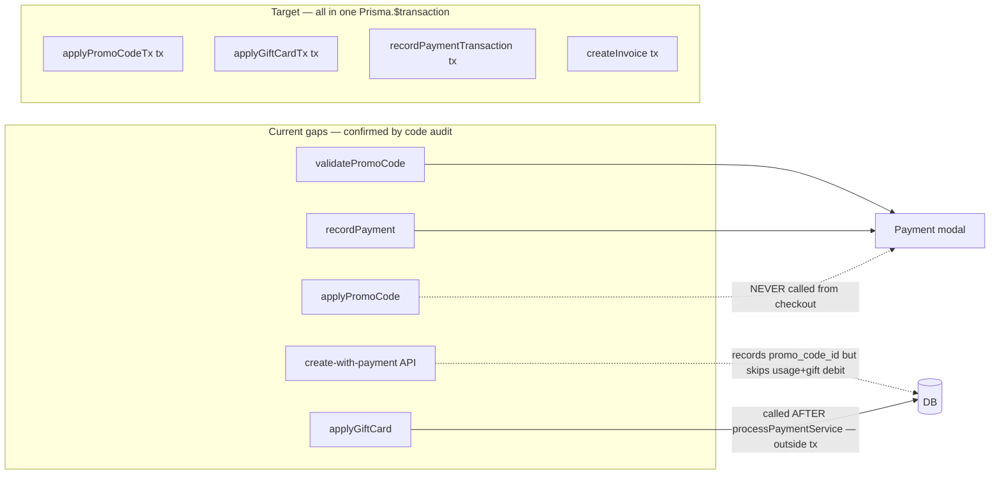

# Promotions and gift cards — production-ready implementation plan

## Current foundation (reuse, do not reinvent)

- **Schema** (RLS-enabled): [`supabase/migrations/0029_payment_enhancement_tables.sql`](f:/jhapp/cleanmatex/supabase/migrations/0029_payment_enhancement_tables.sql) — `org_promo_codes_mst`, `org_promo_usage_log`, `org_gift_cards_mst`, `org_gift_card_transactions`, `org_discount_rules_cf`; later migrations adjust RLS ([`0081_comprehensive_rls_policies.sql`](f:/jhapp/cleanmatex/supabase/migrations/0081_comprehensive_rls_policies.sql)), `branch_id` on gift transactions ([`0106_add_branch_id_to_transaction_tables.sql`](f:/jhapp/cleanmatex/supabase/migrations/0106_add_branch_id_to_transaction_tables.sql)).
- **Services**: [`web-admin/lib/services/discount-service.ts`](f:/jhapp/cleanmatex/web-admin/lib/services/discount-service.ts) (`validatePromoCode`, `applyPromoCode`, `evaluateDiscountRules`), [`web-admin/lib/services/gift-card-service.ts`](f:/jhapp/cleanmatex/web-admin/lib/services/gift-card-service.ts) (validate, apply, refund, CRUD helpers, `generateGiftCardNumber`).
- **Server totals**: [`web-admin/lib/services/order-calculation.service.ts`](f:/jhapp/cleanmatex/web-admin/lib/services/order-calculation.service.ts) — promo + gift card in one server-side total (gift applied after VAT/additional tax; keep this as the single definition of "amount before gift").
- **POS UI**: [`web-admin/src/features/orders/ui/payment-modal-enhanced-02.tsx`](f:/jhapp/cleanmatex/web-admin/src/features/orders/ui/payment-modal-enhanced-02.tsx) — validates promo/gift via actions.



---

## Phase 1 — Money safety and service layer fixes (implement first)

### 1.1 TOCTOU-safe promo increment with `SELECT FOR UPDATE`

**Bug confirmed**: `validatePromoCode` reads `current_uses`, but the check-then-increment is split across two operations, leaving a race window where two simultaneous checkouts can both pass the `max_uses` guard.

**Fix** — use `SELECT FOR UPDATE` inside `applyPromoCodeTx` to lock the promo row for the duration of the transaction. Any concurrent request that hits the same promo will block until the lock is released, then re-read the already-incremented `current_uses` and fail if the limit is now met.

```typescript
// inside applyPromoCodeTx(tx, ...) — LOCK FIRST, then check, then increment
const [locked] = await tx.$queryRaw<{ id: string; current_uses: number; max_uses: number | null }[]>`
  SELECT id, current_uses, max_uses
  FROM org_promo_codes_mst
  WHERE id = ${promoCodeId}
    AND tenant_org_id = ${tenantOrgId}
  FOR UPDATE
`;
if (!locked) throw new Error('PROMO_NOT_FOUND');
if (locked.max_uses !== null && locked.current_uses >= locked.max_uses) {
  throw new Error('PROMO_MAX_USES_EXCEEDED');
}

// safe to increment — no concurrent tx can read old current_uses until this tx commits
await tx.org_promo_codes_mst.update({
  where: { id: promoCodeId },
  data: { current_uses: { increment: 1 }, updated_at: new Date(), updated_by: appliedBy },
});
// then create usage log row
```

> **Why `SELECT FOR UPDATE` over a conditional raw UPDATE**: The lock approach keeps the check logic in TypeScript (readable, testable, type-safe) while still being race-free. The raw `UPDATE … WHERE current_uses < max_uses RETURNING id` pattern works but moves the business rule into SQL, making it harder to unit-test and extend. Use `SELECT FOR UPDATE` consistently for all row-level locking in this feature (gift card balance debit follows the same pattern — see §1.2).

### 1.2 `SELECT FOR UPDATE` on gift card balance debit

Inside `applyGiftCardTx`, lock the gift card row before reading balance and debiting, for the same reason as §1.1 — prevents double-debit on concurrent retries:

```typescript
const [locked] = await tx.$queryRaw<{ id: string; current_balance: number; status: string; card_pin: string | null }[]>`
  SELECT id, current_balance, status, card_pin
  FROM org_gift_cards_mst
  WHERE card_number = ${cardNumber}
    AND tenant_org_id = ${tenantOrgId}
    AND is_active = true
  FOR UPDATE
`;
if (!locked) throw new Error('GIFT_CARD_NOT_FOUND');
if (locked.status !== 'active') throw new Error('GIFT_CARD_NOT_ACTIVE');
if (locked.current_balance < amount) throw new Error('INSUFFICIENT_BALANCE');
// proceed with debit using locked.current_balance
```

### 1.3 Extract `applyPromoCodeTx` and `applyGiftCardTx`

Both functions must accept a Prisma `tx` argument so they compose into any outer transaction, and must use `SELECT FOR UPDATE` internally (§1.1 / §1.2) to be race-safe. The public `applyPromoCode` / `applyGiftCard` wrappers become thin shells that open their own `$transaction` when called standalone.

```typescript
// discount-service.ts
export async function applyPromoCodeTx(
  tx: PrismaTransactionClient,
  params: ApplyPromoCodeParams,
): Promise<void> { /* atomic: usage log + TOCTOU increment */ }

export async function applyPromoCode(params: ApplyPromoCodeParams) {
  return withTenantContext(params.tenantOrgId, () =>
    prisma.$transaction((tx) => applyPromoCodeTx(tx, params))
  );
}
```

```typescript
// gift-card-service.ts
export async function applyGiftCardTx(
  tx: PrismaTransactionClient,
  params: ApplyGiftCardTxParams,   // no Supabase client — currency passed as arg
): Promise<{ newBalance: number }> { /* debit + record transaction */ }
```

**Important**: `applyGiftCard` currently calls `createClient()` (Supabase) inside the `prisma.$transaction` block — a separate DB connection outside the tx. Move currency config fetch **before** the `prisma.$transaction` call, then pass it as a plain value into `applyGiftCardTx`.

### 1.3 Wire both into `create-with-payment/route.ts`

Inside the existing `prisma.$transaction` block (after `recordPaymentTransaction`):

```typescript
// After recordPaymentTransaction(...)
if (input.promoCodeId && serverTotals.promoDiscount > 0) {
  await applyPromoCodeTx(tx, {
    promoCodeId: input.promoCodeId,
    orderId,
    invoiceId: invoice.id,
    tenantOrgId: tenantId,
    customerId: input.customerId ?? undefined,
    discountAmount: serverTotals.promoDiscount,
    orderTotalBefore: serverTotals.afterManualDiscount,   // pre-promo base
    appliedBy: userId,
  });
}
if (input.giftCardNumber && serverTotals.giftCardApplied > 0) {
  await applyGiftCardTx(tx, {
    cardNumber: input.giftCardNumber,
    amount: serverTotals.giftCardApplied,
    orderId,
    invoiceId: invoice.id,
    branchId,
    processedBy: userId,
    currencyCode: serverTotals.currencyCode,
    decimalPlaces: serverTotals.decimalPlaces,
  });
}
```

### 1.4 Wire both into `process-payment.ts`

Replace the dead promo comment block and the post-hoc `applyGiftCard` call with a single wrapping transaction. The existing `processPaymentService` already writes payment inside its own Prisma tx — refactor `processPaymentService` to accept an optional outer `tx`, or call `applyPromoCodeTx` + `applyGiftCardTx` inside the same `prisma.$transaction` that wraps `recordPaymentTransaction`.

Remove lines 161–181 of [`process-payment.ts`](f:/jhapp/cleanmatex/web-admin/app/actions/payments/process-payment.ts) once the unified path exists.

---

### 1.5 Fix `validateGiftCard` — remove mutating side effects

**Bug**: [`gift-card-service.ts:107–113`](f:/jhapp/cleanmatex/web-admin/lib/services/gift-card-service.ts#L107) and [`L127–133`](f:/jhapp/cleanmatex/web-admin/lib/services/gift-card-service.ts#L127) call `prisma.org_gift_cards_mst.update()` during validation (a read-only intent). If validation is called during preview/totals calculation, it permanently mutates card state without a corresponding debit.

**Fix**: Remove all `update` calls from `validateGiftCard`. Status auto-transitions (`active → expired`, `active → used`) happen only inside `applyGiftCardTx` after a successful debit.

### 1.6 Fix gift PIN enforcement

**Bug**: [`gift-card-service.ts:68`](f:/jhapp/cleanmatex/web-admin/lib/services/gift-card-service.ts#L68):
```typescript
// CURRENT — broken: passes when pin set but not sent
if (giftCard.card_pin && input.card_pin) { ... }

// FIXED — fail when card has PIN but caller omits it
if (giftCard.card_pin) {
  if (!input.card_pin || giftCard.card_pin !== input.card_pin) {
    return { isValid: false, error: 'Invalid gift card PIN', errorCode: 'INVALID_PIN' };
  }
}
```

### 1.7 Fix `refundToGiftCard` — surface partial refund

**Bug**: [`gift-card-service.ts:349`](f:/jhapp/cleanmatex/web-admin/lib/services/gift-card-service.ts#L349) silently caps the refund at `original_amount` and returns `success: true` with no indication that less was refunded than requested.

**Fix**: Change return type and surface the difference:

```typescript
// Return type
{ success: boolean; newBalance: number; actualRefundAmount: number; error?: string }

// Inside tx:
const actualRefund = newBalance - currentBalance; // may be < amount
return { success: true, newBalance, actualRefundAmount: actualRefund };
```

All callers (cancellation flow) must check `actualRefundAmount !== amount` and log or surface the discrepancy to the operator.

---

## Phase 2 — Discount rules stacking policy (defined here, implemented in calculateOrderTotals)

### Stacking algorithm (canonical, frozen)

Defined as a constant in `lib/constants/discount-stacking.ts`:

```typescript
export const DISCOUNT_STACKING_ORDER = [
  'manual_discount',    // % or fixed amount, applies to subtotal
  'auto_rules',         // evaluateDiscountRules — best single rule (see below)
  'promo_code',         // explicit staff/customer code
  // VAT applies here on afterDiscounts
  // additionalTax applies here
  'gift_card',          // stored-value debit, applied post-tax
] as const;

export const STACKING_RULES = {
  /** Only the highest-value auto rule fires per order (no stacking of auto rules with each other). */
  autoRules: 'best_single',
  /** An auto rule with can_stack_with_promo=true stacks with a promo; otherwise promo wins if higher. */
  autoRulesWithPromo: 'stackable_flag',
  /** Combined discount (manual + auto + promo) cannot exceed subtotal. */
  maxCombinedDiscountCap: 'subtotal',
} as const;
```

**Wire into `calculateOrderTotals`** between the `manualDiscount` and `promoDiscount` steps:

```typescript
// After afterManualDiscount
let autoRuleDiscount = 0;
const bestRule = await getBestDiscount(tenantId, {
  order_total: afterManualDiscount,
  items_count: items.length,
  service_categories: serviceCategories ?? [],
  order_date: new Date().toISOString(),
});
if (bestRule) {
  // Stack with promo only if flag set; otherwise one or the other (higher wins)
  autoRuleDiscount = round(
    Math.min(bestRule.discount_amount, afterManualDiscount),
    decimalPlaces
  );
}

// If promo also present and rule is NOT stackable with promo, take best of the two
if (promoCode?.trim() && bestRule && !bestRule.rule.can_stack_with_promo) {
  const promoResult = await validatePromoCode({ ... });
  const promoAmt = promoResult.isValid ? promoResult.discountAmount ?? 0 : 0;
  if (promoAmt >= autoRuleDiscount) {
    autoRuleDiscount = 0;   // promo wins; auto rule zeroed
  } else {
    promoDiscount = 0;      // rule wins; promo zeroed
  }
}
```

`OrderCalculationResult` gains a new field `autoRuleDiscount: number` alongside `promoDiscount`.

The create-with-payment `buildDifferences` function must include `autoRuleDiscount` in its comparison set.

---

## Phase 3 — Admin CRUD (Marketing section)

### Navigation

Add to [`web-admin/config/navigation.ts`](f:/jhapp/cleanmatex/web-admin/config/navigation.ts):

```typescript
{
  key: 'marketing',
  label: 'Marketing',          // i18n key: navigation.marketing
  icon: Tags,                  // Tags already imported
  path: '/dashboard/marketing',
  permissions: ['promotions:read'],
  children: [
    { key: 'marketing_promos',    label: 'Promo Codes',      path: '/dashboard/marketing/promos',         permissions: ['promotions:read'] },
    { key: 'marketing_gift_cards',label: 'Gift Cards',        path: '/dashboard/marketing/gift-cards',     permissions: ['gift_cards:read'] },
    { key: 'marketing_rules',     label: 'Discount Rules',   path: '/dashboard/marketing/discount-rules', permissions: ['discount_rules:read'] },
  ],
}
```

### Feature structure

```
src/features/marketing/
  access/
    marketing-access.ts          ← PageAccessContract[] for all 3 routes
  ui/
    promo-list-screen.tsx
    promo-form-dialog.tsx        ← create + edit (shared form)
    promo-usage-table.tsx
    gift-card-list-screen.tsx
    gift-card-issue-dialog.tsx
    gift-card-detail-dialog.tsx  ← balance + transaction history
    discount-rule-list-screen.tsx
    discount-rule-form-dialog.tsx ← structured conditions form (see §3.3)
  api/
    marketing-api.ts             ← fetch wrappers for all 3 domains
  hooks/
    use-promos.ts
    use-gift-cards.ts
    use-discount-rules.ts

app/dashboard/marketing/
  page.tsx                       ← redirect to /promos
  promos/
    page.tsx
  gift-cards/
    page.tsx
  discount-rules/
    page.tsx
```

### Promo code form fields (Zod schema)

```typescript
const promoFormSchema = z.object({
  promo_code:              z.string().min(3).max(30).toUpperCase(),
  promo_name:              z.string().min(1).max(100),           // EN
  promo_name2:             z.string().max(100).optional(),       // AR
  description:             z.string().max(500).optional(),
  description2:            z.string().max(500).optional(),
  discount_type:           z.enum(['percentage', 'fixed']),
  discount_value:          z.number().positive(),
  max_discount_amount:     z.number().positive().optional(),
  min_order_amount:        z.number().nonnegative().default(0),
  max_order_amount:        z.number().positive().optional(),
  applicable_categories:   z.array(z.string()).optional(),
  max_uses:                z.number().int().positive().optional(),
  max_uses_per_customer:   z.number().int().positive().optional(),
  valid_from:              z.string().datetime(),
  valid_to:                z.string().datetime().optional(),
  is_enabled:              z.boolean().default(true),
});
```

### Gift card issue form fields (Zod schema)

```typescript
const giftCardIssueSchema = z.object({
  card_name:               z.string().min(1).max(100),
  card_name2:              z.string().max(100).optional(),
  amount:                  z.number().positive(),
  expiry_date:             z.string().datetime().optional(),
  issued_to_customer_id:   z.string().uuid().optional(),
  card_pin:                z.string().length(4).regex(/^\d+$/).optional(),
  // card_number is auto-generated via generateGiftCardNumber; not a form field
});
```

### 3.3 Discount rules conditions form — structured, NOT raw JSON

The conditions field is a `JSONB` column. Do **not** expose a raw JSON textarea. Instead, render a structured form driven by the `ConditionsSchema`:

```typescript
// lib/constants/discount-conditions-schema.ts
export const CONDITIONS_SCHEMA_VERSION = 1;

export interface DiscountConditions {
  schema_version: 1;
  min_order_amount?:   number;       // input type=number
  min_items?:          number;       // input type=number
  service_categories?: string[];     // multi-select from catalog
  customer_tiers?:     string[];     // multi-select: bronze | silver | gold | platinum
  days_of_week?:       number[];     // checkbox group: 0=Sun … 6=Sat
  time_ranges?:        { start: string; end: string }[]; // time pickers (HH:MM)
}

export const discountConditionsSchema = z.object({
  schema_version: z.literal(1),
  min_order_amount:   z.number().nonnegative().optional(),
  min_items:          z.number().int().positive().optional(),
  service_categories: z.array(z.string()).optional(),
  customer_tiers:     z.array(z.enum(['bronze','silver','gold','platinum'])).optional(),
  days_of_week:       z.array(z.number().int().min(0).max(6)).optional(),
  time_ranges:        z.array(z.object({ start: z.string(), end: z.string() })).optional(),
});
```

The form renders each key as a labeled control. On save, validate with `discountConditionsSchema.parse()` before writing. On load, parse and fall back gracefully if `schema_version` differs (show a read-only JSON view with an upgrade banner).

### Discount rules form fields

```typescript
const discountRuleFormSchema = z.object({
  rule_code:            z.string().min(2).max(30),
  rule_name:            z.string().min(1).max(100),
  rule_name2:           z.string().max(100).optional(),
  rule_type:            z.enum(['automatic', 'manual']),
  discount_type:        z.enum(['percentage', 'fixed']),
  discount_value:       z.number().positive(),
  can_stack_with_promo: z.boolean().default(false),
  can_stack_with_other_rules: z.boolean().default(false),
  priority:             z.number().int().nonnegative().default(0),
  valid_from:           z.string().datetime(),
  valid_to:             z.string().datetime().optional(),
  conditions:           discountConditionsSchema,
  is_enabled:           z.boolean().default(true),
});
```

### Server actions / API routes

| Action | File | Permission |
|--------|------|------------|
| `listPromoCodes` | `app/actions/marketing/promo-actions.ts` | `promotions:read` |
| `createPromoCode` | same | `promotions:write` |
| `updatePromoCode` | same | `promotions:write` |
| `archivePromoCode` | same | `promotions:write` |
| `getPromoCodeUsage` | same | `promotions:read` |
| `listGiftCards` | `app/actions/marketing/gift-card-actions.ts` | `gift_cards:read` |
| `issueGiftCard` | same | `gift_cards:issue` |
| `adjustGiftCard` | same | `gift_cards:adjust` |
| `cancelGiftCard` | same | `gift_cards:adjust` |
| `getGiftCardTransactions` | same | `gift_cards:read` |
| `listDiscountRules` | `app/actions/marketing/discount-rule-actions.ts` | `discount_rules:read` |
| `createDiscountRule` | same | `discount_rules:write` |
| `updateDiscountRule` | same | `discount_rules:write` |
| `archiveDiscountRule` | same | `discount_rules:write` |

All actions: thin wrapper → service → `requirePermission` check → Zod parse → return typed result. Never raw Prisma in an action.

### UI/UX patterns

- **Lists**: `CmxDataTable` with server-side pagination (default 20 rows). Columns freeze on mobile to show status + key identifier.
- **Create/Edit**: `CmxDialog` with `CmxForm` inside. Drawer width = 480px. Tab order matches field display order.
- **Status badges**: `active` = green, `expired` = gray, `used` = blue, `cancelled` = red, `suspended` = amber. Consistent across promo, gift card, rule screens.
- **Empty states**: Distinct messages per filter state ("No promos yet — create one" vs "No results match your filter").
- **Promo list**: Show `current_uses / max_uses` as a progress bar when `max_uses` is set.
- **Gift card detail**: Balance ring (like a gauge) + transaction timeline with `balance_before → balance_after` per row.
- **Discount rules**: Priority column is drag-sortable (or numeric input with up/down buttons on mobile).
- **Deactivate / archive**: Always require a confirmation dialog with the record name in the message body. Never destructive delete.
- **Loading states**: Skeleton rows on initial load; spinner overlay on submit. Disable submit button while in-flight.
- **Error states**: Use `cmxMessage.error(...)` for transient failures; inline field errors from Zod for form validation.
- **RTL**: All spacing uses `rtl:` Tailwind variants. ChevronRight icons get `rtl:rotate-180`. Form labels align `start`.

---

## Phase 4 — RBAC and access contracts

### New permissions (add to permission registry)

```typescript
'promotions:read'       // list + view promo codes and usage
'promotions:write'      // create, edit, archive promo codes
'gift_cards:read'       // list + view gift cards and transactions
'gift_cards:issue'      // create / issue new gift card
'gift_cards:adjust'     // cancel, suspend, adjust balance
'discount_rules:read'   // list + view discount rules
'discount_rules:write'  // create, edit, archive discount rules
```

Default role grants:
- `tenant_admin` → all 7
- `admin` → all 7
- `operator` → `promotions:read`, `gift_cards:read`, `gift_cards:issue`
- `viewer` → `promotions:read`, `gift_cards:read`, `discount_rules:read`

### Access contracts file

Create `src/features/marketing/access/marketing-access.ts` following the pattern in [`orders-access.ts`](f:/jhapp/cleanmatex/web-admin/src/features/orders/access/orders-access.ts). Register it in [`page-access-registry.ts`](f:/jhapp/cleanmatex/web-admin/src/features/access/page-access-registry.ts):

```typescript
import { MARKETING_ACCESS_CONTRACTS } from '@features/marketing/access/marketing-access'
// add to PAGE_ACCESS_CONTRACTS spread
```

---

## Phase 5 — Refunds and void (ledger integrity)

### Business rules (frozen)

1. **Gift card refund**: Restore balance up to `original_amount`. Call `refundToGiftCard` inside the same tx as the void/cancel write. Always log `actualRefundAmount`. If `actualRefundAmount < requested`, surface to operator as a warning, not an error (order can still be cancelled).
2. **Promo reversal**: On order cancellation, if a `org_promo_usage_log` row exists for that order, soft-delete it (set `voided_at = now()`, `voided_by = userId`) and decrement `current_uses` by 1. Add `voided_at` + `voided_by` columns via a new migration if not present.
3. **No automatic reuse**: Promo reversal does not make the code re-available to the same customer unless `max_uses_per_customer` logic is re-evaluated. Simply decrement `current_uses` to restore global capacity.
4. **Partial cancellation**: If an order is partially cancelled (line items removed), promo reversal is proportional; gift refund is proportional to the cancelled line total.

### Migration needed

```sql
-- new migration: add voiding columns to promo usage log
ALTER TABLE org_promo_usage_log
  ADD COLUMN IF NOT EXISTS voided_at  TIMESTAMPTZ,
  ADD COLUMN IF NOT EXISTS voided_by  TEXT;
```

Create migration file only, stop and ask for review before applying.

---

## Phase 6 — Gift card expiry: realtime at point of use

**Decision**: No scheduler. Expiry is enforced **inline** at every point a gift card is touched. This is simpler, always consistent regardless of how long the cron lag would have been, and avoids the session/auth context problems of calling TypeScript service functions from a scheduler.

### Where expiry is checked

| Call site | What happens |
|-----------|-------------|
| `validateGiftCard` | If `expiry_date < now()` → return `{ isValid: false, errorCode: 'EXPIRED' }`. **Do not mutate** here (see §1.5). |
| `applyGiftCardTx` (inside `SELECT FOR UPDATE`) | After locking the row, check `expiry_date < now()`. If expired → update `status = 'expired'` inside the same tx and throw `GIFT_CARD_EXPIRED`. The status write is safe here because we are inside a committed transaction with a row lock. |
| `getGiftCardBalance` | If `expiry_date < now()` → return `{ balance: 0, status: 'expired' }` without writing. |
| Admin list query | Filter UI badge; expired cards show gray `Expired` badge based on `expiry_date` column value, no separate status write needed for display. |

### Optional: pg_cron as a reconciliation sweep (belt-and-suspenders)

Realtime expiry is the primary enforcement mechanism. pg_cron is an **additive option** that keeps `status` in sync for reporting, admin list accuracy, and any path that reads the column without going through `validateGiftCard` (e.g. raw DB queries, external exports).

**When to enable**: add the migration if reporting dashboards or the admin gift-card list need `status = 'expired'` to be accurate for cards that were never presented for payment after their expiry date.

**Migration (create file only, stop and ask for review before applying)**:

```sql
-- enable extension (idempotent — safe if already enabled)
CREATE EXTENSION IF NOT EXISTS pg_cron;

-- nightly sweep at 01:00 UTC — marks cards whose expiry_date has passed
-- runs as superuser, bypasses RLS; WHERE clause covers all tenants intentionally
SELECT cron.schedule(
  'expire-gift-cards-nightly',
  '0 1 * * *',
  $$
    UPDATE org_gift_cards_mst
    SET    status     = 'expired',
           updated_at = now()
    WHERE  status      = 'active'
      AND  expiry_date IS NOT NULL
      AND  expiry_date <= now();
  $$
);
```

> The cron sweep never **gates** a transaction — it only corrects stale `status` values. The realtime `SELECT FOR UPDATE` check in `applyGiftCardTx` is still the authoritative guard. A card that passes the cron window between 23:59 and 01:00 will still be correctly rejected at the point of debit.

**`expireGiftCards` TypeScript function**: keep as a manually-triggered admin action (e.g. a button in the gift-card admin screen: "Reconcile expired cards"). Document with JSDoc `@remarks` explaining it is supplemental to realtime checks, not a replacement.

---

## Phase 7 — Receipt and invoice rendering

### What must change

Find the invoice/receipt print component (search `invoices-payments-rprt` or receipt routes). The payment summary section must include these line items when non-zero:

| Condition | Line to show |
|-----------|--------------|
| `promoDiscount > 0` | "Promo Discount (CODE)" — `−{amount}` |
| `autoRuleDiscount > 0` | "Discount" — `−{amount}` |
| `giftCardApplied > 0` | "Gift Card (last 4 digits of card_number)" — `−{amount}` |
| Always | "Total Charged" |

Data source: `org_payment_transactions` already stores `promo_discount_amount`, `gift_card_applied_amount`. Fetch promo code string and gift card number from their respective tables by joining on `promo_code_id` / `gift_card_id`.

---

## Phase 8 — Tests

### Unit tests (in `__tests__/services/`)

| Test | What it proves |
|------|---------------|
| `calculatePromoDiscount` percentage cap | `max_discount_amount` ceiling applied |
| `calculatePromoDiscount` fixed amount | Does not exceed order total |
| `validatePromoCode` PIN guard | Returns `INVALID_PIN` when card has PIN but input omits it |
| `applyPromoCodeTx` TOCTOU guard | Raw UPDATE returns 0 rows → throws `PROMO_MAX_USES_EXCEEDED` |
| `applyGiftCardTx` balance debit | Balance decremented; status transitions to `used` when zero |
| `refundToGiftCard` cap surface | `actualRefundAmount < amount` when balance + amount > `original_amount` |
| `evaluateDiscountRules` stacking | `can_stack_with_promo=false` → higher of rule or promo wins |
| `checkRuleConditions` day-of-week | Correct day filter |
| `checkRuleConditions` time-range | In-range and out-of-range cases |

### Integration tests

Single `prisma.$transaction` path for `create-with-payment`:
1. Happy path: order + invoice + payment + promo usage + gift debit — all committed atomically.
2. Gift debit fails mid-tx (card not found) → entire tx rolls back; order not created.
3. Promo TOCTOU: concurrent requests, only one increments `current_uses`.
4. Idempotent retry: same `orderId` submitted twice → second fails cleanly (unique constraint on payment or usage log).

---

## Phase 9 — i18n additions

Add to `web-admin/messages/en.json` under a top-level `marketing` key (check existing keys first with `npm run check:i18n`):

```json
"marketing": {
  "title": "Marketing",
  "promos": {
    "title": "Promo Codes",
    "create": "Create Promo Code",
    "edit": "Edit Promo Code",
    "archive": "Archive",
    "usageReport": "Usage Report",
    "fields": {
      "code": "Code", "name": "Name", "discountType": "Discount Type",
      "discountValue": "Discount Value", "maxUses": "Max Uses",
      "validFrom": "Valid From", "validTo": "Valid To",
      "minOrder": "Min Order Amount", "categories": "Applicable Categories"
    },
    "status": { "active": "Active", "expired": "Expired", "maxReached": "Limit Reached" },
    "errors": {
      "codeExists": "Promo code already exists",
      "maxUsesExceeded": "Usage limit already reached — cannot save"
    }
  },
  "giftCards": {
    "title": "Gift Cards",
    "issue": "Issue Gift Card",
    "detail": "Gift Card Detail",
    "adjust": "Adjust",
    "cancel": "Cancel Card",
    "transactions": "Transactions",
    "fields": {
      "cardNumber": "Card Number", "cardName": "Card Name",
      "amount": "Amount", "balance": "Current Balance",
      "issuedTo": "Issued To", "expiryDate": "Expiry Date",
      "pin": "PIN (optional)"
    },
    "status": { "active": "Active", "used": "Used", "expired": "Expired",
                "cancelled": "Cancelled", "suspended": "Suspended" },
    "errors": { "insufficientBalance": "Insufficient balance", "cardCancelled": "Card has been cancelled" }
  },
  "discountRules": {
    "title": "Discount Rules",
    "create": "Create Rule",
    "edit": "Edit Rule",
    "archive": "Archive",
    "fields": {
      "code": "Rule Code", "name": "Rule Name", "priority": "Priority",
      "discountType": "Discount Type", "discountValue": "Value",
      "stackWithPromo": "Stack with Promo Code",
      "stackWithRules": "Stack with Other Rules",
      "validFrom": "Valid From", "validTo": "Valid To"
    },
    "conditions": {
      "title": "Conditions",
      "minOrder": "Minimum Order Amount",
      "minItems": "Minimum Items",
      "categories": "Service Categories",
      "customerTiers": "Customer Tiers",
      "daysOfWeek": "Days of Week",
      "timeRanges": "Time Ranges"
    },
    "errors": { "codeExists": "Rule code already exists" }
  }
}
```

Mirror all keys in `ar.json` with Arabic translations.

---

## Phase 9 — Documentation (create and update)

Documentation is **not optional** — it is part of the definition of done for every phase. Follow the `/documentation` skill checklist.

### New feature doc to create

Create `docs/features/Promotions_and_Gift_Cards/README.md` covering:

| Section | Content |
|---------|---------|
| **Overview** | Feature scope, what exists in schema, what was added |
| **Permissions** | Full table: permission key → roles that hold it → pages/actions it gates |
| **Navigation tree** | Marketing section entries: key, label, path, permission |
| **Stacking policy** | Copy of `DISCOUNT_STACKING_ORDER` constant with plain-English explanation |
| **Conditions schema** | `DiscountConditions` interface + all supported keys + valid value ranges |
| **API routes** | All new server actions: name, file, permission, request shape, response shape |
| **Migrations** | List of new migrations created (voided_at on promo usage log); what each does |
| **Constants & types** | `discount-stacking.ts`, `discount-conditions-schema.ts` — what they export and why |
| **i18n keys** | New `marketing.*` key tree; confirm both EN and AR present |
| **Receipt rendering** | Which component was changed, what line items were added, data source |
| **Realtime expiry** | Explain the inline-check approach and where it fires |
| **SELECT FOR UPDATE** | Explain the locking strategy for both promo and gift card debit |
| **Refund rules** | Business rules from §5 (gift cap + promo reversal) in plain English |
| **Testing** | List of unit + integration tests, what each proves |

### Existing docs to update

| Document | What to add/change |
|----------|--------------------|
| `docs/platform/permissions/` (if exists) | Add the 7 new permission keys with descriptions |
| `docs/dev/unification_types_order_payment_audit.md` | Note that `autoRuleDiscount` was added to `OrderCalculationResult` |
| Plan todos | Mark each todo `status: done` as phases complete |

### Inline code documentation rules (follow `/code-documentation` skill)

- Every new exported function: JSDoc with `@param`, `@returns`, one-line `@throws` for each error code thrown.
- `applyPromoCodeTx` / `applyGiftCardTx`: add a `@remarks` block explaining the `SELECT FOR UPDATE` lock and why it is required.
- `expireGiftCards`: add a `@deprecated` note: "Not called automatically. Use inline expiry checks at point of use. May be called manually for bulk status reconciliation."
- `DISCOUNT_STACKING_ORDER` constant: inline comment above each entry explaining its position in the chain.
- `DiscountConditions` interface: TSDoc on every field with valid values and example.
- Migration SQL files: standard CleanMateX migration header block + comment per statement.

## Key files to touch (complete list)

| Area | Files |
|------|--------|
| Service layer — atomicity | [`discount-service.ts`](f:/jhapp/cleanmatex/web-admin/lib/services/discount-service.ts), [`gift-card-service.ts`](f:/jhapp/cleanmatex/web-admin/lib/services/gift-card-service.ts) |
| Service layer — calculation | [`order-calculation.service.ts`](f:/jhapp/cleanmatex/web-admin/lib/services/order-calculation.service.ts) |
| Checkout paths | [`process-payment.ts`](f:/jhapp/cleanmatex/web-admin/app/actions/payments/process-payment.ts), [`create-with-payment/route.ts`](f:/jhapp/cleanmatex/web-admin/app/api/v1/orders/create-with-payment/route.ts) |
| Payment modal | [`payment-modal-enhanced-02.tsx`](f:/jhapp/cleanmatex/web-admin/src/features/orders/ui/payment-modal-enhanced-02.tsx) |
| Constants | new `lib/constants/discount-stacking.ts`, new `lib/constants/discount-conditions-schema.ts` |
| Admin actions | new `app/actions/marketing/promo-actions.ts`, `gift-card-actions.ts`, `discount-rule-actions.ts` |
| Admin pages | new `app/dashboard/marketing/promos/page.tsx`, `gift-cards/page.tsx`, `discount-rules/page.tsx` |
| Feature UI | new `src/features/marketing/ui/*` (9 components per §3 above) |
| Access contracts | new `src/features/marketing/access/marketing-access.ts`, update [`page-access-registry.ts`](f:/jhapp/cleanmatex/web-admin/src/features/access/page-access-registry.ts) |
| Navigation | [`navigation.ts`](f:/jhapp/cleanmatex/web-admin/config/navigation.ts) |
| i18n | [`messages/en.json`](f:/jhapp/cleanmatex/web-admin/messages/en.json), [`messages/ar.json`](f:/jhapp/cleanmatex/web-admin/messages/ar.json) |
| Receipt rendering | invoice/receipt print component (locate via `invoices-payments-rprt`) |
| Migrations | new migration for `voided_at/voided_by` on `org_promo_usage_log`; new migration for `pg_cron` schedule |
| Tests | new `__tests__/services/discount-service.test.ts`, `gift-card-service.test.ts`, `marketing.integration.test.ts` |

---

## Implementation sequence (minimises production risk)

```
Phase 1 → service layer fixes (SELECT FOR UPDATE, realtime expiry, PIN, refund surface, tx helpers)
Phase 2 → stacking policy constant + wire evaluateDiscountRules into calculateOrderTotals
Phase 3 → admin CRUD (Marketing section) + navigation + i18n
Phase 4 → RBAC + access contracts
Phase 5 → refund/void wiring + voided_at migration (create file, stop for review)
Phase 6 → realtime expiry enforcement at all call sites (primary); optional pg_cron reconciliation migration (create file, stop for review)
Phase 7 → receipt rendering
Phase 8 → tests
Phase 9 → documentation (create README + update existing docs + inline JSDoc)
Phase 10 → npm run build; fix until green
```

## Optional later scope (not in this plan)

- **Non-monetary gifts** (free service line, BOGO): separate promo engine tied to order line items — only add if product explicitly needs it; completely separate from `org_gift_cards_mst`.
