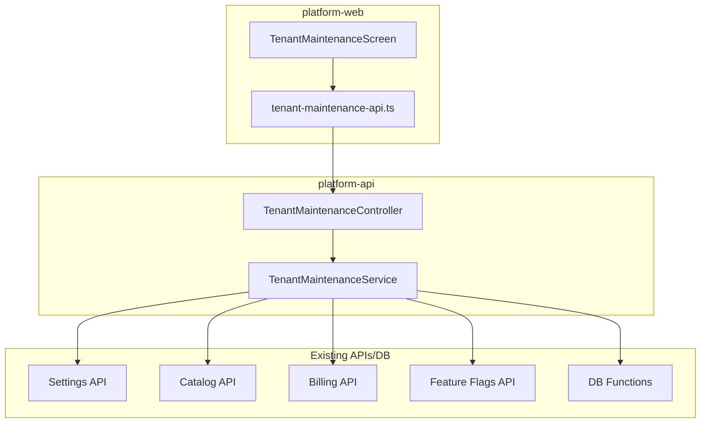

# Tenant Maintenance - Remaining Sections Implementation Plan

## Overview

Extend the Tenant Maintenance page with six new sections, each following the established pattern: **Check** (dry run, show what's missing/wrong) and **Fix** (apply the repair). All documentation in `F:\jhapp\cleanmatexsaas\docs\features\Tenant_Managment\Tenant_Maintenance`.

---

## Architecture (Same as Auth/RBAC)

---

## Section 1: Cache & Settings

**Scope:** Recompute settings cache for tenant. Uses existing `POST /settings/tenants/:tenantId/recompute`.

| Action                   | Check                                                                                  | Fix                                                          |
| ------------------------ | -------------------------------------------------------------------------------------- | ------------------------------------------------------------ |
| Recompute Settings Cache | Show cache stats (row count in `org_stng_effective_cache_cf` for tenant) or "No cache" | Call `resolutionApi.recompute(tenantId)` (existing endpoint) |

**Implementation:**

- **Backend:** Add `GET check-settings-cache` (returns cache row count or 0) and `POST fix-settings-cache` (calls `StngResolverService.invalidateCache(tenantId, 'ALL')` - proxy to existing logic).
- **Frontend:** New card with Check + Fix. Check calls maintenance API; Fix calls existing `resolutionApi.recompute` or new maintenance proxy.
- **No new migrations.**

---

## Section 2: Data Integrity

**Scope:** Fix order data (sync pieces, product names). Uses existing `fix_order_data` RPC.

| Action         | Check                                                                                           | Fix                                                 |
| -------------- | ----------------------------------------------------------------------------------------------- | --------------------------------------------------- |
| Fix Order Data | Call `fix_order_data(tenantId, steps, null, true)` (dry run) - return steps with status/summary | Call `fix_order_data(tenantId, steps, null, false)` |

**DB function:** `fix_order_data(p_tenant_org_id, p_steps, p_order_id, p_dry_run)` - already exists in cleanmatex.

**Implementation:**

- **Backend:** Add `GET check-order-data` (RPC dry run, return steps array) and `POST fix-order-data` (RPC with `p_dry_run=false`). Use `(client as any).rpc('fix_order_data', {...})`.
- **Frontend:** Card with Check (show steps that would run) and Fix (confirm, then apply).
- **No new migrations.**

---

## Section 3: Subscription & Billing

**Scope:** Sync subscription status, fix plan mismatches between `org_tenants_mst` / `org_subscriptions_mst` / `org_pln_subscriptions_mst`.

| Action            | Check                                                                                         | Fix                                    |
| ----------------- | --------------------------------------------------------------------------------------------- | -------------------------------------- |
| Sync Subscription | Compare tenant plan vs `org_pln_subscriptions_mst` / `org_subscriptions_mst`; list mismatches | Update tenant or subscription to align |
| Reconcile Billing | List tenants with inconsistent billing state                                                  | (Optional) Trigger reconciliation      |

**Implementation:**

- **Backend:** Add `GET check-subscription-sync` (query tenant + `org_pln_subscriptions_mst` + `org_subscriptions_mst`, return mismatches). Add `POST fix-subscription-sync` (update `org_tenant_plan_code` or subscription record to match).
- **Frontend:** Card with Check (show mismatches: tenant, current plan, subscription plan) and Fix.
- **Migrations:** May need a small migration for a sync function if logic is complex. Prefer API-side logic first; document migration only if required.

---

## Section 4: Branches & Catalog

**Scope:** Validate branch assignments, sync product catalog, fix catalog gaps.

| Action            | Check                                                                          | Fix                                                                   |
| ----------------- | ------------------------------------------------------------------------------ | --------------------------------------------------------------------- |
| Validate Branches | List branches with invalid refs (e.g. main_branch_id pointing to non-existent) | (Optional) Fix or report                                              |
| Fix Catalog       | Call `getMissingProducts` or catalog status API                                | Call `reseed_missing_products` or `initialize_tenant_product_catalog` |

**Existing APIs:**

- `catalogApi.tenantCatalog.getStatus`, `getMissingProducts`, `reseed`, `initialize` ([platform-web/lib/api/catalog.ts](platform-web/lib/api/catalog.ts))
- `POST /catalog/tenants/:tenantId/initialize`, `POST /catalog/tenants/:tenantId/reseed` ([platform-api](platform-api/src/modules/catalog))

**Implementation:**

- **Backend:** Add `GET check-catalog` (proxy to catalog status / missing products) and `POST fix-catalog-reseed` (call `reseed_missing_products` via `(client as any).rpc`). Add `GET check-branches` (orphaned main_branch_id, etc.) and `POST fix-branches` (clear invalid refs).

- **Frontend:** Two sub-cards: (1) Branches – Check + Fix; (2) Catalog – Check (show missing products) + Fix (Reseed).

- **No new migrations** (use existing RPCs).

---

## Section 5: Feature Flags

**Scope:** Sync tenant flags with plan, fix overrides.

| Action               | Check                                                              | Fix                               |
| -------------------- | ------------------------------------------------------------------ | --------------------------------- |
| Sync Flags with Plan | Compare tenant's effective flags vs plan mappings; list mismatches | Recompute/sync from plan mappings |
| Fix Overrides        | List invalid overrides (e.g. flag deleted, plan changed)           | Remove invalid overrides          |

**Existing:** `hq_ff_get_effective_value`, `PlanFlagMappingsService`, `TenantOverridesService`, `org_ff_overrides_cf`, `sys_ff_pln_flag_mappings_dtl`.

**Implementation:**

- **Backend:** Add `GET check-feature-flags` (get tenant subscription plan, compare `org_ff_overrides_cf` + plan mappings vs expected; return mismatches). Add `POST fix-feature-flags` (remove invalid overrides, or sync from plan - depends on business rules).

- **Frontend:** Card with Check (show mismatches) and Fix.

- **No new migrations** (use existing tables).

---

## Implementation Order

| Phase | Section                | Backend     | Frontend    | DB | Docs |
| ----- | ---------------------- | ----------- | ----------- | -- | ---- |
| 1     | Cache & Settings       | 2 endpoints | 1 card      | 0  | Yes  |
| 2     | Data Integrity         | 2 endpoints | 1 card      | 0  | Yes  |
| 3     | Branches & Catalog     | 4 endpoints | 2 sub-cards | 0  | Yes  |
| 4     | Subscription & Billing | 2 endpoints | 1 card      | 0  | Yes  |
| 5     | Feature Flags          | 2 endpoints | 1 card      | 0  | Yes  |

---

## File Changes Summary

### Backend (platform-api)

- [tenant-maintenance.service.ts](platform-api/src/modules/tenant-maintenance/tenant-maintenance.service.ts) – Add 5 new check + 5 new fix methods (10 total)
- [tenant-maintenance.controller.ts](platform-api/src/modules/tenant-maintenance/tenant-maintenance.controller.ts) – Add 10 new routes
- [dto/check-result.dto.ts](platform-api/src/modules/tenant-maintenance/dto/check-result.dto.ts) – New DTOs per section
- [dto/fix-result.dto.ts](platform-api/src/modules/tenant-maintenance/dto/fix-result.dto.ts) – New fix result DTOs

### Frontend (platform-web)

- [tenant-maintenance-api.ts](platform-web/lib/api/tenant-maintenance.ts) – Add 10 new API methods
- [tenant-maintenance-screen.tsx](platform-web/src/features/tenants/ui/tenant-maintenance-screen.tsx) – Add 5 new section cards (each with Check + Fix buttons, result display)

### Documentation

- [progress_status.md](docs/features/Tenant_Managment/Tenant_Maintenance/progress_status.md) – Update with new sections
- [developer_guide.md](docs/features/Tenant_Managment/Tenant_Maintenance/developer_guide.md) – Document new endpoints
- [user_guide.md](docs/features/Tenant_Managment/Tenant_Maintenance/user_guide.md) – Document new sections
- [REMAINING_SECTIONS.md](docs/features/Tenant_Managment/Tenant_Maintenance/REMAINING_SECTIONS.md) – Mark as implemented or remove

---

## UI/UX Pattern (Per Section)

- Collapsible card with section title and description
- Two buttons: `Check` (outline) and `Fix` (primary)
- Result area below: table or list when items found; "No issues" when empty
- Fix: confirmation dialog before apply
- Error display: use existing `buildErrorDetails` for full error details

---

## Dependencies

- **Cache & Settings:** Inject `StngResolverService` or call settings API from tenant-maintenance
- **Catalog:** Use `(client as any).rpc('reseed_missing_products', ...)` or `initialize_tenant_product_catalog`
- **Billing:** Use `TenantSubscriptionService` or direct Supabase queries
- **Feature Flags:** Use `FlagEvaluationService`, `TenantOverridesService`, or direct queries
