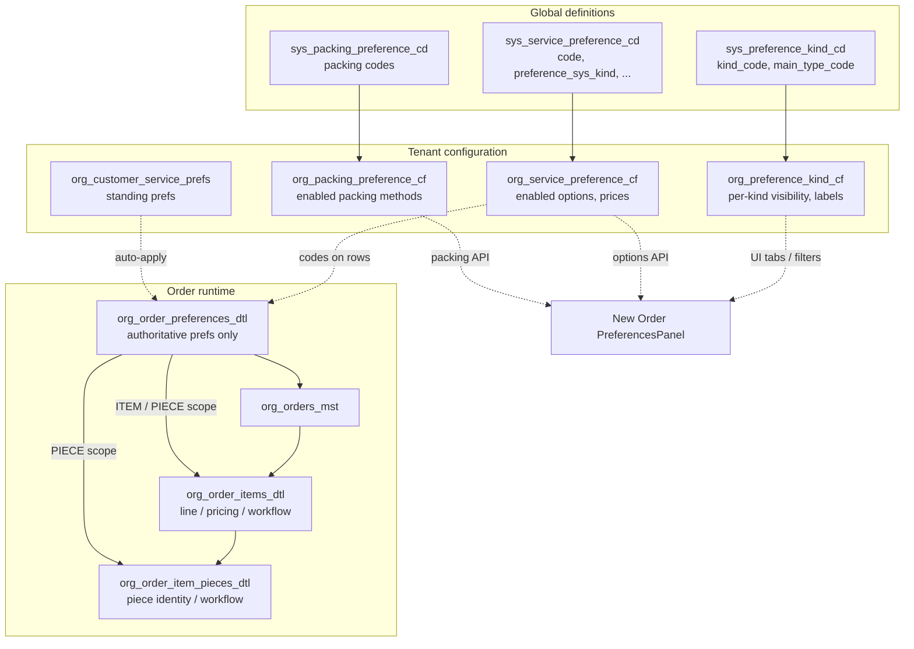

# Preferences architecture — canonical reference

This document is the **single entry point** for how **preference kinds**, **preference options**, **packing**, and **order selections** fit together in CleanMateX. Older notes remain for history; **implement new work against this file** and linked code paths below.

---

## 1. Mental model (four layers)

| Layer | Role | Typical tables |
|-------|------|----------------|
| **A. Kind taxonomy** | What *categories* exist (tabs/groups): service, packing, stain, damage, color, note, … | `sys_preference_kind_cd`, `org_preference_kind_cf` |
| **B. Option catalog** | What *choices* exist globally (codes, SLA, incompatibility, `preference_sys_kind`, color hex…) | `sys_service_preference_cd`, `sys_packing_preference_cd` |
| **C. Tenant enablement** | Which options/kinds this tenant exposes, prices, display flags | `org_service_preference_cf`, `org_packing_preference_cf`, `org_preference_kind_cf` |
| **D. Order preference facts** | **All** captured selections on an ORDER / ITEM / PIECE — service prefs, conditions, **packing**, **color**, **note** text, pricing lines | **`org_order_preferences_dtl` only** |

**Not part of the preference model:** `org_order_items_dtl` / `org_order_item_pieces_dtl` hold **operational** data (product, qty, workflow status, barcode, optional **aggregates** like `service_pref_charge`, legacy/denormalized columns). They are **not** a second source of truth for “what preferences were chosen”; new features should **read and write preferences only** via **`org_order_preferences_dtl`** (join by `order_id` + `prefs_level` + `order_item_id` / `order_item_piece_id`).

Flow: **tenant kinds (C + A)** drive UI grouping; **tenant-enabled options (C + B)** fill each group; **order writes (D)** persist every selection **into `org_order_preferences_dtl`** keyed by **`preference_sys_kind`** / **`preference_code`**.

---

## 2. Diagram

---

## 3. Kind taxonomy (`sys_preference_kind_cd` + `org_preference_kind_cf`)

- **`sys_preference_kind_cd`**: Global list of **`kind_code`** values and **`main_type_code`** (`preferences` | `conditions` | `color` | `notes`). Drives UX behavior (selector vs toggle grid vs notes vs packing).
- **`org_preference_kind_cf`**: Per-tenant row per **`kind_code`**: bilingual **`name` / `name2`**, **`kind_bg_color`**, **`is_active`**, **`is_show_in_quick_bar`**, **`is_show_for_customer`**, **`is_stopped_by_saas`**, **`rec_order`**.

**IMPORTANT — server truth (verified on production DB, 2026-05-11):** Damage kind spelling is **`condition_damag`** (shortened legacy code), **not** `condition_damage`.

| kind_code (`sys_preference_kind_cd`) | main_type_code | rec_order |
|-------------------------------------|----------------|-----------|
| `service_prefs` | preferences | 10 |
| `packing_prefs` | preferences | 20 |
| `condition_stain` | conditions | 30 |
| `condition_damag` | conditions | 40 |
| `condition_special` | conditions | 50 |
| `condition_pattern` | conditions | 60 |
| `condition_material` | conditions | 70 |
| `color` | color | 80 |
| `note` | notes | 90 |

Tenant rows that are **`is_active = false`** (or SaaS-stopped) should disappear from operators’ New Order wizard for that tenant.

---

## 4. Service options catalog (`sys_service_preference_cd` + `org_service_preference_cf`)

- Each **option** has a **`code`** and a **`preference_sys_kind`** that **must align with a kind tab key** (`kind_code`): e.g. all color swatches use `preference_sys_kind = 'color'`.
- Tenant **`org_service_preference_cf`** stores which codes exist for the tenant (**no org row ⇒ option not offered**), plus overrides (`extra_price`, `name`/`name2`, `preference_category`, `is_show_in_quick_bar`, …).
- **`PreferenceCatalogService.getServicePreferences`** merges **`org_service_preference_cf`** with **`sys_service_preference_cd`**. API: **`GET /api/v1/catalog/service-preferences`**.

**Distinct `preference_sys_kind` values present on catalog (production sample, 2026-05-11):**  
`service_prefs`, `condition_stain`, `condition_damag`, `condition_special`, `color`.

*Note:* Kinds **`condition_pattern`** and **`condition_material`** exist at kind level but may have **zero** catalog options until seeded — UI shows “no items” for those tabs.

---

## 5. Packing (separate product line)

Packing (**hang / fold / box / …**) is **not** a row in `sys_service_preference_cd`.

- Definitions: **`sys_packing_preference_cd`**
- Tenant enablement: **`org_packing_preference_cf`**
- Fetch: **`GET /api/v1/catalog/packing-preferences`** (`PreferenceCatalogService.getPackingPreferences`)

**On orders, the packing choice is stored in `org_order_preferences_dtl`** as **`preference_sys_kind = 'packing_prefs'`** at **ITEM** and/or **PIECE** scope (`preference_code` = packing catalog code).  

If **`packing_pref_code`** (or similar) still appears on **`org_order_items_dtl`** / **`org_order_item_pieces_dtl`**, treat it as **operational denormalization / legacy convenience** for some screens — **not** the canonical preference record. New code should rely on **`org_order_preferences_dtl`** for packing facts.

---

## 6. Unified order selections — `org_order_preferences_dtl`

**Authoritative** store for **all** **ORDER / ITEM / PIECE** preference facts — one table, multiple rows per scope, discriminated by **`preference_sys_kind`**.

**Key columns (abbreviated):**

| Column | Purpose |
|--------|---------|
| `prefs_level` | `ORDER`, `ITEM`, or `PIECE` |
| `order_item_id`, `order_item_piece_id` | Scope (nullable per level) |
| `preference_code` | Option code (`DELICATE`, `RED`, stain code, packing code, …) |
| **`preference_sys_kind`** | Same discriminator family as **`sys_service_preference_cd.preference_sys_kind`**, plus **`packing_prefs`** and **`note`** |
| `prefs_no` | Line seq within scope (create path computes offsets) |
| `prefs_owner_type`, `prefs_source` | Who “owns” the line vs how it arrived (see §6.1) |
| `extra_price`, `processing_confirmed`, … | Money / QA |

Every query from tenant apps MUST filter **`tenant_org_id`** (RLS-aligned).

### 6.1 `prefs_level`, `prefs_owner_type`, and `prefs_source`

These columns describe **scope** (where the preference applies), **custody** (who it belongs to conceptually), and **provenance** (how it got onto the order). DB column widths are permissive (**`prefs_source`** is **`VARCHAR(50)`** in Prisma-backed schema — keep new codes short or extend the column in a migration if you introduce long display strings universally).

 **`prefs_level`** — level this row applies to (FK scope):

| Value | Meaning |
|-------|---------|
| `ORDER` | Whole order |
| `ITEM` | Single line (`order_item_id` set) |
| `PIECE` | Single piece (`order_item_id` + `order_item_piece_id` set) |

 **`prefs_owner_type`** — **who owns** this preference on the order (audit / UX / routing):

| Value | Meaning |
|-------|---------|
| `CUSTOMER` | Originated from or attributed to the **customer’s** intent (saved profile, kiosk choice, explicit customer instruction). |
| `USER` | Set or confirmed by **staff** (`web-admin`/operator). |
| `SYSTEM` | **System default**, catalog default, automation, or “no explicit actor” baseline. |

**Implementation note:** The app also persists **`OVERRIDE`** today for some **packing** rows when operators override inherited packing (**`prefs_owner_type`** in item/piece packing paths). Treat **`OVERRIDE`** as staff-driven override semantics; normalize to **`USER`** in new features if you want a strict triple (`CUSTOMER` | `USER` | `SYSTEM`).

 **`prefs_source`** — **where this row came from** (lineage). Use stable machine codes where possible so reports and joins stay reliable; reserve human-readable phrases for legacy or display-only pipelines.

| Typical values | Meaning |
|----------------|---------|
| `ORDER_CREATE` | Written when the **order was first created** (Prisma/schema default aligns with this). |
| `ORDER_UPDATE` | Added or changed **during edit/update** flows. |
| `LAST_ORDER` / `repeat_order` | Carried from the **previous order** (repeat / “like last time”). |
| `CUSTOMER_SAVED` / `customer_pref` | Customer **saved** standing preference or **`PREFERENCE_SOURCES.CUSTOMER_PREF`** (`web-admin/lib/constants/service-preferences.ts`). |
| `manual` | Staff picked it in UI (**`PREFERENCE_SOURCES.MANUAL`**). |
| `bundle` | Applied from a **care package** (**`PREFERENCE_SOURCES.BUNDLE`**). |
| `PRODUCT_DEFAULT` / `CONTRACT_DEFAULT` | From **product** or **B2B contract** defaults (**constants**). |
| `SYSTEM` | Platform/tenant automation without a finer code. |

**Also seen in older or UI-facing data:** descriptive strings such as **`Auto: Customer preference`**, **`From bundle: Premium Care`**, **`Repeat: Last order`**. Prefer migrating new writes to short codes (`customer_pref`, `bundle`, `repeat_order`, …) and mapping to labels via i18n.

### 6.2 Worked example — one piece, several `preference_sys_kind` values

**Illustrative pattern** (not tied to a durable order id): six rows **all `prefs_level = 'PIECE'`** for one line item / one physical piece — **mixed kinds on the same piece**. To verify in your tenant, query **`org_order_preferences_dtl`** for a known live order, filter by **`tenant_org_id`**, **`order_id`**, and **`order_item_piece_id`**, and sort by **`prefs_no`**.

| prefs_no | `preference_sys_kind` | `preference_code` | `prefs_source` | `extra_price` (example) |
|----------|------------------------|-------------------|----------------|-------------------------|
| 1 | `service_prefs` | `HAND_WASH` | `manual` | non-zero |
| 2 | `service_prefs` | `STEAM_PRESS` | `manual` | non-zero |
| 3 | `service_prefs` | `STARCH_LIGHT` | `manual` | non-zero |
| 4 | `packing_prefs` | `VACUUM_SEAL` | `ORDER_CREATE` | `0` |
| 5 | `color` | `BLUE` | `ORDER_CREATE` | `0` |
| 6 | `note` | *(free-text operator note)* | `ORDER_CREATE` | `0` |

**Takeaways:**

- **`preference_code`** doubles as catalog code (`HAND_WASH`, `BLUE`) **and**, for **`note`** rows today, carries the **note body** itself (design carefully if you introduce structured/long notes elsewhere).
- **`packing_prefs`** rows use **packing** catalog codes (`VACUUM_SEAL`), not **`sys_service_preference_cd`**.
- **`preference_id`** may be **NULL** on older rows or paths that only stored codes. **Current New Order / edit / repeat-last flows** should populate it when the tenant catalog row is known: **`preference_sys_kind = service_prefs`** → **`org_service_preference_cf.id`**; **`color`** → same **`org_service_preference_cf.id`** (color options live in the merged service catalog); **`packing_prefs`** → **`org_packing_preference_cf.id`**. Reports and joins can still fall back to **`preference_code`** + tenant + **`preference_sys_kind`** when **`preference_id`** is null.
- **`prefs_source`** can differ on the same piece (`manual` vs `ORDER_CREATE`) depending on UX path.

---

## 7. Item / piece tables — operational only (not preference authority)

**`org_order_items_dtl`** and **`org_order_item_pieces_dtl`** exist for **line structure, pricing, garment/piece identity, and workflow** (status, stage, rack, barcode, brand, etc.).

**Preference semantics** (service options, conditions, **packing**, **color** choice, **notes** as a preference row) are defined **only** in **`org_order_preferences_dtl`**. Do not treat **`packing_pref_code`**, **`color` (JSONB)** on the piece row, or free-text **`notes`** on the piece row as a parallel source of truth when building new features — **query `org_order_preferences_dtl`** for selections.

**Implementation note:** Some create/update paths (e.g. **`OrderService.createOrder`**) may still **populate** piece/item columns alongside **`org_order_preferences_dtl`** for backward compatibility or legacy UIs. That is **denormalization**, not a second preference model. Prefer **reads** that **resolve display from `org_order_preferences_dtl`**, and steer **writes** through that table over time.

Persistence reference (where dual-write still occurs today): **`web-admin/lib/services/order-service.ts`** (piece create block ~1280–1415).

---

## 8. New Order UI (how A→D is wired)

| Concern | Code / route |
|---------|-------------------------------|
| Main screen | `web-admin/app/dashboard/orders/new/page.tsx` → `NewOrderScreen` → `NewOrderContent` |
| Dynamic kinds panel | `web-admin/src/features/orders/ui/preferences-panel.tsx` — tabs from **`preferenceKinds`**, body from **`main_type_code` + kind_code`** |
| Catalog hook | `web-admin/src/features/orders/hooks/use-preference-catalog.ts` — builds **`prefsByKind`** keyed by **`preference_sys_kind`** |
| Kind API | **`GET /api/v1/catalog/preference-kinds`** → `PreferenceCatalogService.getPreferenceKinds` (`org_preference_kind_cf` ∩ `sys_preference_kind_cd`) |
| Options API | **`GET /api/v1/catalog/service-preferences`** (merged CF + SYS) |
| Packing API | **`GET /api/v1/catalog/packing-preferences`** |
| Repeat Last Order | **`GET /api/v1/preferences/last-order?customerId=`** → `PreferenceResolutionService.getLastOrderPreferences` (`get_last_order_preferences`). Returns item-level **service** codes plus optional **`packing_pref_cf_id`** and **`service_prefs_catalog`** (code + `preference_id` pairs) after migration **0260**; **`RepeatLastOrderPanel`** falls back to **`packing_cf_id` / `preference_cf_id`** from catalog APIs when history rows omit ids. |

**Alignment rule:** For dynamic tabs to list the right chips, **`org_preference_kind_cf.kind_code`** must equal **`sys_service_preference_cd.preference_sys_kind`** for options in that tab (special cases: **`packing_prefs`** uses **`PackingPreferenceSelector`**, not service catalog).

**Damage tab code in UI:** `condition_damag` — must match DB / catalog.

### 8.1 “Edit Items Preferences” — piece card toolbar (fixes common E / F confusion)

Step **Edit Items Preferences** uses **`OrderPiecePreferencesSection`** → **`PiecePreferenceCard`** (toolbar) → **`PieceKindPickerDialog`** (modal for most kinds). Toolbar **order and labels** come from **`GET /api/v1/catalog/preference-kinds`** (**`PreferenceKind`**), not hardcoded English.

| Typical UI label (tenant `name`) | `kind_code` | `main_type_code` | How the user edits (wizard) |
|---------------------------------|-------------|------------------|-----------------------------|
| Service Preferences | `service_prefs` | `preferences` | **Modal**: **`ServicePreferenceSelector`** — grouped washing/processing/etc.; multi-select up to **`maxPrefs`** (catalog **`preference_sys_kind = service_prefs`**) |
| Packing Preferences | `packing_prefs` | `preferences` | **Modal**: **`PackingPreferenceSelector`** — packing catalog (**not** rows in **`sys_service_preference_cd`**) |
| Stains | `condition_stain` | `conditions` | **Modal**: **`StainConditionToggles`** — stain subset only |
| Damage | `condition_damag` | `conditions` | **Modal**: **`StainConditionToggles`** — damage subset only |
| Special / Pattern / **Material** | `condition_special`, `condition_pattern`, **`condition_material`**, … | `conditions` | **Modal**: **generic chip grid** driven by **`prefsByKind.get(kind_code)`** — must have catalog rows with **`preference_sys_kind`** **equal to that `kind_code`**. (**“Material” = `condition_material`** — **not** the same control as stains/damage.) |
| **Colors** | **`color`** | **`color`** | **Modal**: **multi-select** circular swatches; UI state uses **`piece.colorCodes`** (and aligned **`colorCfIds`**) with **`piece.color`** as primary/first code for legacy consumers; options from **`preference_sys_kind = color`** |
| Notes | `note` | `notes` | **Inline only**: selecting this tab expands **below the toolbar** a **`notes` textarea for the piece** (no substantive picker inside the modal — modal instructs operator to use the field) |

**E — “Material” (correction):** **`kind_code` = `condition_material`**, **`main_type_code` = `conditions`**, and chips come from **`org_service_preference_cf`** merged with **`sys_service_preference_cd`** entries whose **`preference_sys_kind`** is **`condition_material`**. If the modal shows “no items”, the tenant/catalog has **no active options** for that kind (**§4**).

**F — “Colors” (correction):** **`kind_code` = `color`**, **`main_type_code` = `color`** — distinct from **`condition_material`**. Color options use **`color_hex`** in the picker; **`org_order_preferences_dtl`** persists **one `preference_sys_kind = color` row per chosen swatch**, each with optional **`preference_id`** → **`org_service_preference_cf.id`** for that color code. **Multiple colors are not separate preference-kind tabs**; they are multiple rows of the same kind, ordered by **`prefs_no`**. Service multi-select remains under **Service Preferences**.

Chosen values are held in **`PreSubmissionPiece`** (`service_prefs` with optional **`preferenceCfId`**, **`packingPrefCode`** + **`packingCfId`**, `conditions`, **`color` / `colorCodes` / `colorCfIds`**, `notes`) until order submit; create path writes **authoritative** rows into **`org_order_preferences_dtl`** (**§7** persistence reference).

### 8.3 New Order — surcharge display (service + packing parity)

Operators should see **packing surcharges** the same way as **service** surcharges wherever the New Order UI shows a **name + optional extra** (wizard and cart summary).

| Surface | Behavior |
|---------|----------|
| **Packing modal** (`PackingPreferenceSelector`) | Native `<option>` labels append tenant-formatted surcharge when catalog **`default_extra_price` &gt; 0`, e.g. `Hang on Hanger +0.400 OMR` (uses tenant **`formatMoneyWithCode`**). |
| **Piece preference chips** (`PiecePreferenceCard` → `PreferenceChip`) | **`extra_price`** on each chip; packing rows get amounts from **`pieceToSelectedPreferences(piece, { packingExtraByCode })`** where **`packingExtraByCode`** is **`packingPreferencePriceMap(packingPrefs)`** — see **`useNewOrderPiecePreferences`**. Service rows use **`piece.servicePrefs[].extra_price`**. **`PreferenceChip`** formats money via tenant **`formatMoneyWithCode`** (not a hard-coded decimal count). |
| **Order summary** (right panel teal chips, `SummaryCartItem`) | Appends surcharge text for each **`piece.servicePrefs`** entry and for **`piece.packingPrefCode`** using **`packingExtraPriceByCode`** (same packing catalog amounts, passed from **`NewOrderContent`**). |

**Key implementation files**

- `web-admin/src/features/orders/ui/preferences/PackingPreferenceSelector.tsx`
- `web-admin/src/features/orders/ui/piece-preferences/preference-chip.tsx`
- `web-admin/src/features/orders/lib/selected-piece-preference.ts` — `pieceToSelectedPreferences(..., { packingExtraByCode })`
- `web-admin/src/features/orders/hooks/use-new-order-piece-preferences.ts` — binds packing price map into chip derivation and **`pieceToSelectedPreferences`** facade
- `web-admin/src/features/orders/ui/summary-cart-item.tsx` — teal chips + **`packingExtraPriceByCode`**
- `web-admin/src/features/orders/ui/new-order-content.tsx` — builds **`packingExtraPriceByCode`** from **`packingPreferencePriceMap`**

**Type note:** **`PackingPreference`** includes optional **`packing_cf_id`** when rows are populated from **`PreferenceCatalogService`** (aligns with Repeat Last Order / submit paths expecting catalog FK hints).

### 8.4 Repeat Last Order (item-level packing + service codes)

- **UI:** **`RepeatLastOrderPanel`** (`web-admin/src/features/orders/ui/preferences/RepeatLastOrderPanel.tsx`).
- **API:** **`GET /api/v1/preferences/last-order`** (plan flag **`repeat_last_order`**).
- **RPC:** **`get_last_order_preferences`** — per **`org_order_items_dtl`** line on the customer’s most recent order, returns **`packing_pref_code`**, **`service_pref_codes`**, and (after **`0260_get_last_order_preferences_catalog_ids`**) **`packing_pref_cf_id`** from the item’s **`packing_prefs`** row in **`org_order_preferences_dtl`**, plus **`service_prefs_catalog`** as a JSON array of **`{ preference_code, preference_id }`** for **`service_prefs`** rows. The client merges with **`GET /api/v1/catalog/service-preferences`** and **`packing-preferences`** so **`preferenceCfId` / packing catalog id** are still set when historical rows had null **`preference_id`**. (**§8.3** describes how catalog packing **`extra_price`** is shown beside names in the New Order UI.)

---

## 9. Condition code mapping

`web-admin/lib/utils/condition-codes.ts` **`getConditionPrefKind`**: derives **`preference_sys_kind`** from **`STAIN_CONDITIONS`** metadata (`category`: stain \| damage \| special). Used when flushing **`pieceInput.conditions`** to **`org_order_preferences_dtl`**.

**Generic chip kinds** (**`condition_material`**, **`condition_pattern`**, **`condition_special`**, …) reuse **`piece.conditions`** in the piece wizard; each catalog option’s **`preference_sys_kind`** should match **`kind_code`** for that tab. Persisted **`org_order_preferences_dtl`** rows must carry that **`preference_sys_kind`** — extend **`getConditionPrefKind`** / **`STAIN_CONDITIONS`** (or catalogue-driven inserts) whenever new **`condition_*`** kinds are seeded so codes are **not mis-filed** (e.g. defaulting as stain).

---

## 10. Standing customer preferences

**`org_customer_service_prefs`** — customer-level defaults (**FK to tenant preference config after unified migrations**). With tenant setting auto-apply on, **`/api/v1/preferences/resolve`** (+ order flow) can suggest or apply prefs at item/piece boundaries (see **`Order_Service_Preferences/developer_guide.md`**).

---

## 11. Permissions and catalog admin (snapshot)

See **`docs/platform/permissions/PERMISSIONS_BY_API.md`** — catalog GETs commonly require **`orders:read`**; **`config:preferences_manage`** for preference / packing / kind admin routes.

---

## 12. Historical migrations (do not rewrite old files)

- **0165–0169**: unified `org_order_preferences_dtl`, catalog extensions — **`docs/dev/preferences-unified-migrations-0165-0169.md`**
- **0260**: extends **`get_last_order_preferences`** with **`packing_pref_cf_id`** and **`service_prefs_catalog`** (Repeat Last Order + catalog FK alignment) — **`supabase/migrations/0260_get_last_order_preferences_catalog_ids.sql`**
- **0171+**: `sys_preference_kind_cd`, `org_preference_kind_cf`, seeds, RLS fixes — grep `org_preference_kind_cf` under `supabase/migrations/`

---

## 13. When you change something checklist

1. **`kind_code`** in SYS / ORG kind tables aligns with **`preference_sys_kind`** on new catalog rows.
2. **New Order** **`preferences-panel`** and piece wizard **`PieceKindPickerDialog`** **`switch (main_type_code)`** handle new **`main_type_code`** / **`kind_code`** values if introducing a novel UX class.
3. **Order write path** inserts **`org_order_preferences_dtl`** with correct **`preference_sys_kind`** and preserves **`prefs_no`** ordering if extending create logic.
4. **Downstream surfaces** (Processing, receipts, HQ) **resolve preference display from `org_order_preferences_dtl`**; ignore piece/item duplicated pref fields unless a legacy screen still depends on them.
5. **Repeat Last Order** RPC / API changes: update **`PreferenceResolutionService.getLastOrderPreferences`** and **`RepeatLastOrderPanel`** together; document in **`preferences-architecture-reference.md`** §8.4.
6. **Surcharge display (wizard + summary):** if New Order UX for labels or totals changes for **service** prefs, mirror for **packing** (§8.3): dropdown options, **`PreferenceChip`**, **`SummaryCartItem`** teal chips — keep **`pieceToSelectedPreferences`** and catalog maps aligned.

---

## Related docs (narrower scope)

| Topic | Doc |
|-------|-----|
| **Unified migrations 0165–0169** (apply order, rollback, post-migration checks) | `docs/dev/preferences-unified-migrations-0165-0169.md` |
| Customer prefs feature intro + overview diagram | `docs/features/Customer_Order_Item_Pieces_Preferences/README.md` |
| Permissions, flags, routes checklist (PRD-style) | `docs/features/Customer_Order_Item_Pieces_Preferences/implementation_requirements.md` |
| Compact table glossary (catalogs + tenant + order tables) | `docs/features/Order_Service_Preferences/technical_docs/tech_data_model.md` |
| Developer file map (APIs, services, flows) | `docs/features/Order_Service_Preferences/developer_guide.md` |
| New Order piece-notes PRD / QA scenarios | `docs/features/orders/new_order_piece_notes_preferences_ui_prd.md` etc. |
| Monetization / long-form PRDs | Historical files under `docs/features/Order_Service_Preferences/` |

---

**Maintainers:** Update **`version`** and **`last_updated`** when changing authoritative behavior or after verifying production schema drift.
