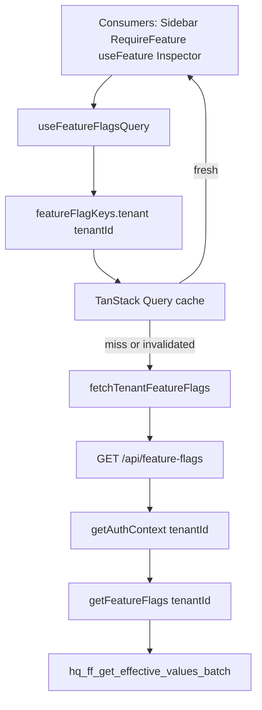

# Developer guide — mermaid

```mermaid
flowchart TD
  A[Consumers: Sidebar RequireFeature useFeature Inspector] --> B[useFeatureFlagsQuery]
  B --> C[featureFlagKeys.tenant tenantId]
  C --> D[TanStack Query cache]
  D -->|miss or invalidated| E[fetchTenantFeatureFlags]
  E --> F["GET /api/feature-flags"]
  F --> G[getAuthContext tenantId]
  G --> H["getFeatureFlags tenantId"]
  H --> I[hq_ff_get_effective_values_batch]
  D -->|fresh| A
```
