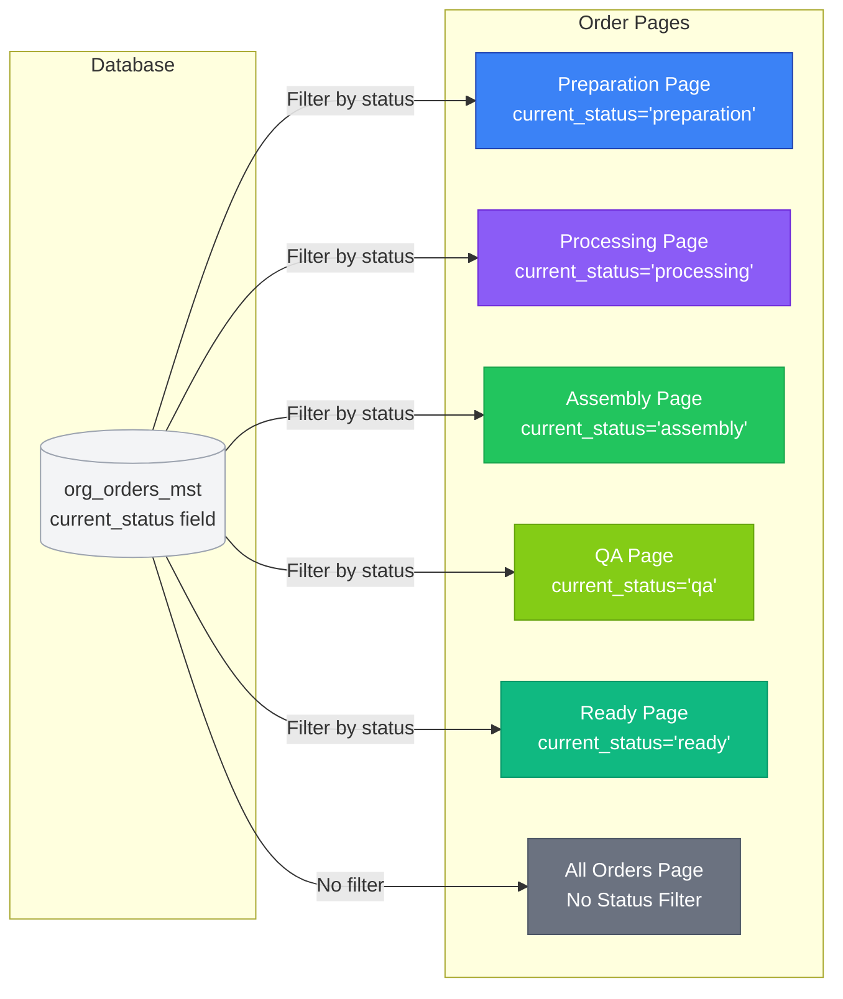
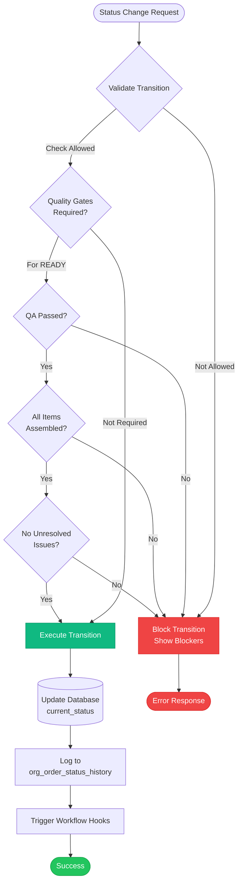
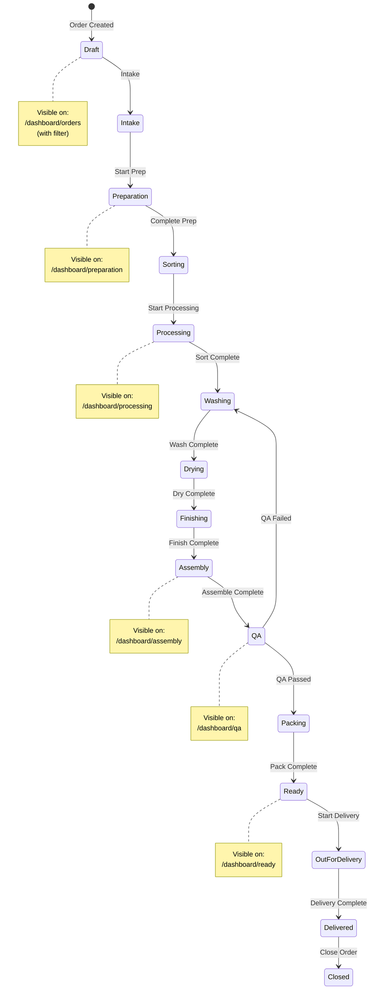

# Order Workflow Visual Diagram

**Version:** v1.0.0  
**Last Updated:** 2025-01-20

---

## Complete Order Workflow with Page Mapping

```mermaid
flowchart TD
    Start([Order Created]) --> Draft[DRAFT Status]
    Draft -->|Intake| Intake[INTAKE Status]
    Intake -->|Prepare| Prep[PREPARATION Status]
    
    Prep --> PrepPage[/dashboard/preparation<br/>Preparation Page]
    PrepPage -->|Complete| Sorting[SORTING Status]
    
    Sorting --> Processing[PROCESSING Status]
    Processing --> ProcessingPage[/dashboard/processing<br/>Processing Page]
    
    ProcessingPage -->|Sort| Washing[WASHING Status]
    Washing -->|Dry| Drying[DRYING Status]
    Drying -->|Finish| Finishing[FINISHING Status]
    Finishing -->|Assemble| Assembly[ASSEMBLY Status]
    
    Assembly --> AssemblyPage[/dashboard/assembly<br/>Assembly Page]
    AssemblyPage -->|Complete| QA[QA Status]
    
    QA --> QAPage[/dashboard/qa<br/>QA Page]
    QAPage -->|Pass| Packing[PACKING Status]
    QAPage -->|Fail| Washing
    
    Packing --> Ready[READY Status]
    Ready --> ReadyPage[/dashboard/ready<br/>Ready Page]
    
    ReadyPage -->|Deliver| OutDelivery[OUT_FOR_DELIVERY Status]
    OutDelivery -->|Complete| Delivered[DELIVERED Status]
    Delivered -->|Close| Closed[CLOSED Status]
    
    Intake -->|Cancel| Cancelled[CANCELLED Status]
    Draft -->|Cancel| Cancelled
    
    AllOrders[/dashboard/orders<br/>All Orders Page<br/>Shows ALL Statuses]
    
    style PrepPage fill:#3B82F6,stroke:#1E40AF,color:#fff
    style ProcessingPage fill:#8B5CF6,stroke:#6D28D9,color:#fff
    style AssemblyPage fill:#22C55E,stroke:#16A34A,color:#fff
    style QAPage fill:#84CC16,stroke:#65A30D,color:#fff
    style ReadyPage fill:#10B981,stroke:#059669,color:#fff
    style AllOrders fill:#6B7280,stroke:#4B5563,color:#fff
    
    style Draft fill:#9CA3AF,stroke:#6B7280
    style Intake fill:#3B82F6,stroke:#2563EB
    style Prep fill:#8B5CF6,stroke:#7C3AED
    style Sorting fill:#6366F1,stroke:#4F46E5
    style Processing fill:#8B5CF6,stroke:#6D28D9
    style Washing fill:#06B6D4,stroke:#0891B2
    style Drying fill:#14B8A6,stroke:#0D9488
    style Finishing fill:#10B981,stroke:#059669
    style Assembly fill:#22C55E,stroke:#16A34A
    style QA fill:#84CC16,stroke:#65A30D
    style Packing fill:#EAB308,stroke:#CA8A04
    style Ready fill:#10B981,stroke:#059669
    style OutDelivery fill:#F59E0B,stroke:#D97706
    style Delivered fill:#22C55E,stroke:#16A34A
    style Closed fill:#6B7280,stroke:#4B5563
    style Cancelled fill:#EF4444,stroke:#DC2626
```

## Page Filtering Flow



## Status Transition Validation Flow



## Order Lifecycle with Page Visibility



## Order Status to Page Mapping Matrix

```mermaid
graph TB
    subgraph "Workflow Stages"
        S1[DRAFT]
        S2[INTAKE]
        S3[PREPARATION]
        S4[SORTING]
        S5[PROCESSING]
        S6[WASHING]
        S7[DRYING]
        S8[FINISHING]
        S9[ASSEMBLY]
        S10[QA]
        S11[PACKING]
        S12[READY]
        S13[OUT_FOR_DELIVERY]
        S14[DELIVERED]
        S15[CLOSED]
        S16[CANCELLED]
    end
    
    subgraph "Dashboard Pages"
        P1[All Orders Page<br/>/dashboard/orders]
        P2[Preparation Page<br/>/dashboard/preparation]
        P3[Processing Page<br/>/dashboard/processing]
        P4[Assembly Page<br/>/dashboard/assembly]
        P5[QA Page<br/>/dashboard/qa]
        P6[Ready Page<br/>/dashboard/ready]
    end
    
    S1 --> P1
    S2 --> P1
    S3 --> P2
    S3 --> P1
    S4 --> P1
    S5 --> P3
    S5 --> P1
    S6 --> P1
    S7 --> P1
    S8 --> P1
    S9 --> P4
    S9 --> P1
    S10 --> P5
    S10 --> P1
    S11 --> P1
    S12 --> P6
    S12 --> P1
    S13 --> P1
    S14 --> P1
    S15 --> P1
    S16 --> P1
    
    style P1 fill:#6B7280,stroke:#4B5563,color:#fff
    style P2 fill:#3B82F6,stroke:#1E40AF,color:#fff
    style P3 fill:#8B5CF6,stroke:#6D28D9,color:#fff
    style P4 fill:#22C55E,stroke:#16A34A,color:#fff
    style P5 fill:#84CC16,stroke:#65A30D,color:#fff
    style P6 fill:#10B981,stroke:#059669,color:#fff
```



---

## Diagram Legend

### Page Colors
- 🔵 **Blue** - Preparation Page
- 🟣 **Purple** - Processing Page
- 🟢 **Green** - Assembly Page
- 🟡 **Yellow** - QA Page
- 🟢 **Green** - Ready Page
- ⚫ **Gray** - All Orders Page

### Status Colors
- ⚪ **Gray** - Draft, Closed
- 🔵 **Blue** - Intake
- 🟣 **Purple** - Preparation, Processing, Sorting
- 🔵 **Cyan** - Washing
- 🟢 **Teal** - Drying
- 🟢 **Green** - Finishing, Assembly, Ready, Delivered
- 🟡 **Yellow** - QA, Packing
- 🟠 **Orange** - Out for Delivery
- 🔴 **Red** - Cancelled

---

**Diagram Version:** v1.0.0  
**Last Updated:** 2025-01-20

