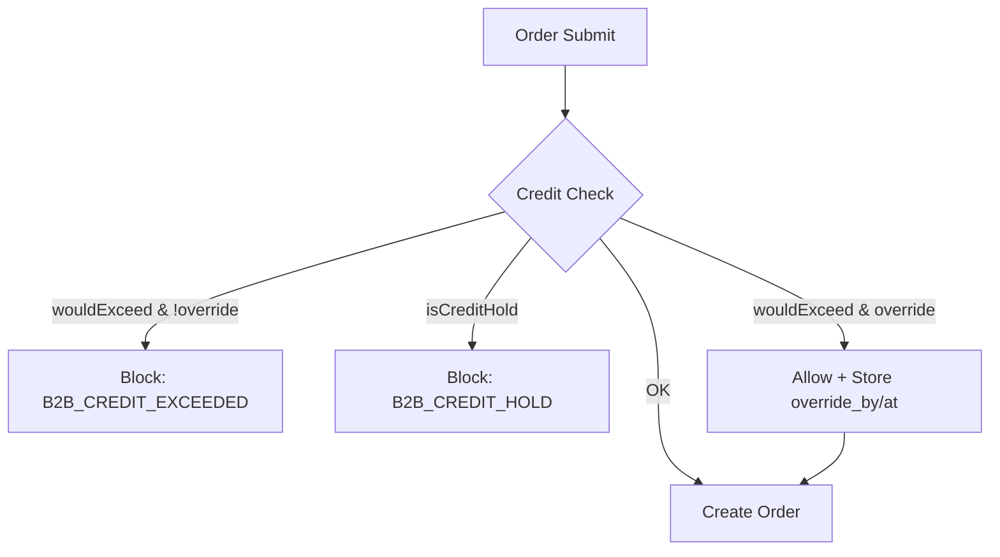
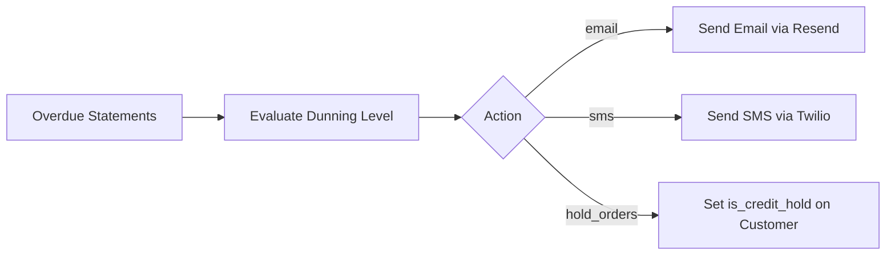

# B2B Feature Developer Guide — Code Flow

## Architecture Overview

```mermaid
flowchart TB
    subgraph UI [UI Layer]
        B2BCust[B2B Customers List]
        B2BCont[B2B Contracts]
        B2BStmt[B2B Statements]
        OverdueUI[Overdue Statements]
        NewOrd[New Order]
    end

    subgraph API [API Layer]
        ContactsAPI[/api/v1/b2b-contacts]
        ContractsAPI[/api/v1/b2b-contracts]
        StatementsAPI[/api/v1/b2b-statements]
        OverdueAPI[/api/v1/b2b/overdue-statements]
        DunningAPI[/api/v1/b2b/run-dunning-actions]
    end

    subgraph Services [Service Layer]
        ContactsSvc[B2BContactsService]
        ContractsSvc[B2BContractsService]
        StatementsSvc[B2BStatementsService]
        CreditSvc[CreditLimitService]
        DunningSvc[DunningService]
    end

    subgraph DB [Database]
        OCM[org_customers_mst]
        OBD[org_b2b_contacts_dtl]
        OBC[org_b2b_contracts_mst]
        OBS[org_b2b_statements_mst]
    end

    B2BCust --> ContactsAPI
    B2BCont --> ContractsAPI
    B2BStmt --> StatementsAPI
    OverdueUI --> OverdueAPI
    NewOrd --> CreditSvc

    ContactsAPI --> ContactsSvc
    ContractsAPI --> ContractsSvc
    StatementsAPI --> StatementsSvc
    OverdueAPI --> DunningSvc
    DunningAPI --> DunningSvc

    ContactsSvc --> OBD
    ContractsSvc --> OBC
    StatementsSvc --> OBS
    CreditSvc --> OCM
    DunningSvc --> OBS
    DunningSvc --> OCM
```

## Credit Limit & Override Flow



## Dunning Actions Flow


