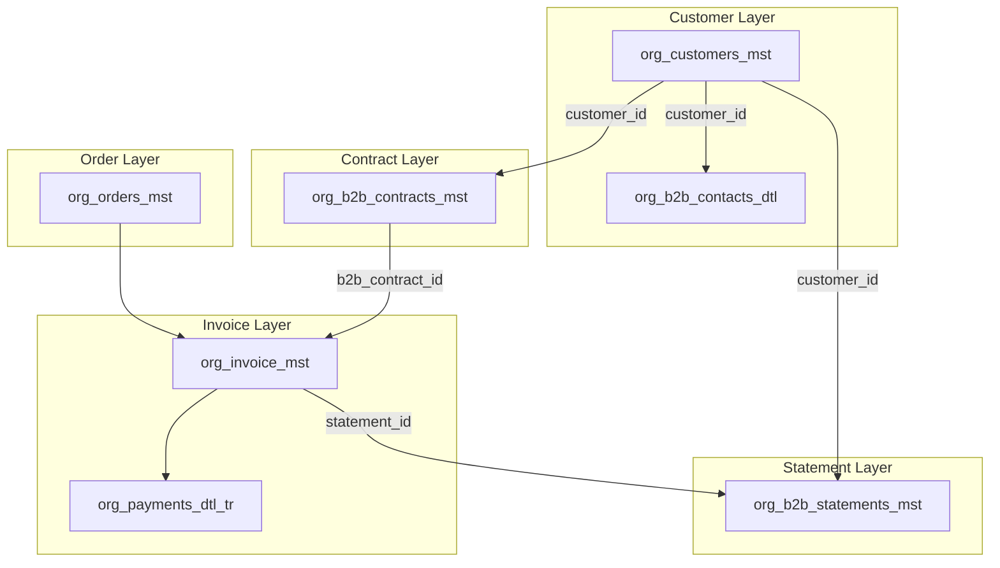

# B2B Feature Architecture

```mermaid
flowchart TB
    subgraph CustomerLayer [Customer Layer]
        OCM[org_customers_mst]
        OBD[org_b2b_contacts_dtl]
    end

    subgraph ContractLayer [Contract Layer]
        OBC[org_b2b_contracts_mst]
    end

    subgraph OrderLayer [Order Layer]
        OOM[org_orders_mst]
    end

    subgraph InvoiceLayer [Invoice Layer]
        OIM[org_invoice_mst]
        OPD[org_payments_dtl_tr]
    end

    subgraph StatementLayer [Statement Layer]
        OBS[org_b2b_statements_mst]
    end

    OCM -->|customer_id| OBD
    OCM -->|customer_id| OBC
    OBC -->|b2b_contract_id| OIM
    OOM --> OIM
    OIM --> OPD
    OCM -->|customer_id| OBS
    OIM -->|statement_id| OBS
```
