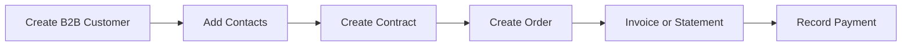
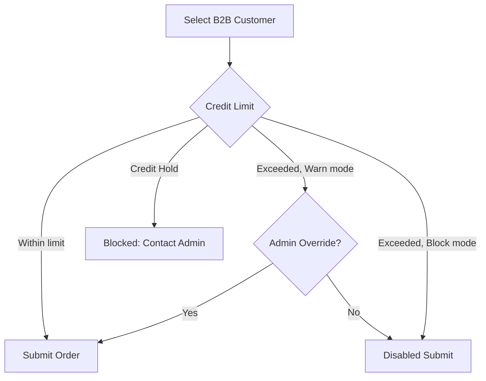
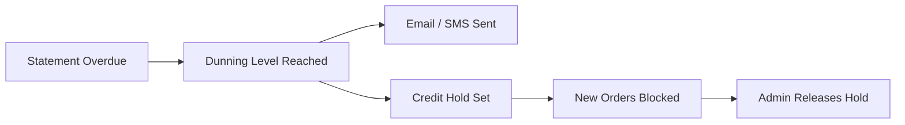

# B2B Feature User Guide — Workflow

## Main B2B Flow

```mermaid
flowchart LR
    A[Create B2B Customer] --> B[Add Contacts]
    B --> C[Create Contract]
    C --> D[Create Order]
    D --> E[Invoice or Statement]
    E --> F[Record Payment]
```

## Order Creation with Credit

```mermaid
flowchart TD
    A[Select B2B Customer] --> B{Credit Limit}
    B -->|Within limit| C[Submit Order]
    B -->|Exceeded, Warn mode| D{Admin Override?}
    D -->|Yes| C
    D -->|No| E[Disabled Submit]
    B -->|Exceeded, Block mode| E
    B -->|Credit Hold| F[Blocked: Contact Admin]
```

## Dunning & Overdue

```mermaid
flowchart LR
    A[Statement Overdue] --> B[Dunning Level Reached]
    B --> C[Email / SMS Sent]
    B --> D[Credit Hold Set]
    D --> E[New Orders Blocked]
    E --> F[Admin Releases Hold]
```
