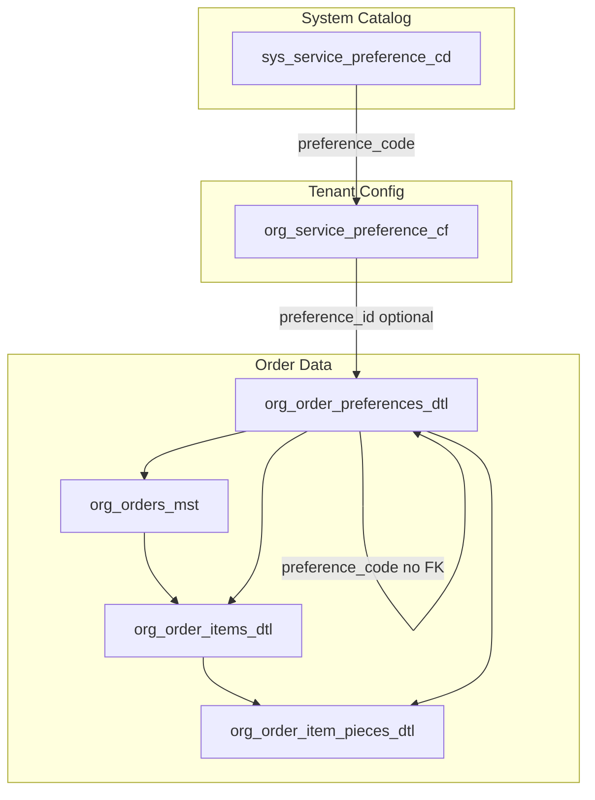

# Customer/Order/Item/Pieces Preferences — Unified Feature

## Delivery status (2026-05)

**Preparation & workflow piece editing** (list/detail UX, DTL-backed piece packing, conditions API, price preview refresh, nav highlighting, cross-screen `OrderPiecesManager` wiring) is **complete** as of 2026-05-12.

- **Plan / progress (detailed checklist):** [preparation-workflow-ui-status.md](./preparation-workflow-ui-status.md)

## Overview

The **Customer/Order/Item/Pieces Preferences** feature extends the Order Service Preferences system with a unified data model. A single catalog (`sys_service_preference_cd`) and one order preferences table (`org_order_preferences_dtl`) support:

- **Service preferences** (starch, perfume, delicate, etc.) at ORDER, ITEM, or PIECE level
- **Packing** (**`packing_prefs`**) — hang / fold / box, etc. at ITEM and/or PIECE scope (**`sys_packing_preference_cd` / `org_packing_preference_cf`**, persisted on **`org_order_preferences_dtl`**)
- **Conditions** (stains, damage, special care) at piece level
- **Colors** — catalog-backed **multi-select** on **`org_order_preferences_dtl`** (`preference_sys_kind = 'color'`; one row per chosen color with optional **`preference_id`** → **`org_service_preference_cf`**); piece-row JSON **`color`** supports **`codes` / `primary`** denormalization
- **Notes** — free-text **`note`** rows on **`org_order_preferences_dtl`**; piece `notes` column may duplicate for UX/legacy paths

This replaces the legacy tables `org_order_item_service_prefs` and `org_order_item_pc_prefs`.

**Canonical architecture (layers, preference kinds, catalogs, APIs, authoritative `org_order_preferences_dtl`):** [preferences-architecture-reference.md](../../dev/preferences-architecture-reference.md).

## Architecture

## preference_sys_kind Values

| Value            | Purpose                                      | Level   |
|------------------|----------------------------------------------|---------|
| `service_prefs`  | Processing options (starch, perfume, delicate)| ITEM, PIECE |
| `condition_stain`| Stain conditions (coffee, wine, oil, etc.)   | PIECE   |
| `condition_damag`| Damage indicators (hole, tear, zipper, etc.) | PIECE   |
| `color`          | Color codes (solid, pattern)                  | PIECE   |
| `packing_prefs` | Packing method (hang, fold, etc.) | ITEM, PIECE |
| `note`           | Free-form notes                              | PIECE   |

## UI Structure

### Edit Items Preferences (piece wizard)

- **Service + packing surcharges:** Catalog **extra** amounts are shown beside names in the packing modal (`PackingPreferenceSelector`), on piece **`PreferenceChip`** rows, and on the **order summary** teal chips — see **[preferences-architecture-reference.md](../../dev/preferences-architecture-reference.md)** §8.3.

### New Order — Preferences Section

- **Quick Apply** tab: Care Packages, Repeat Last Order (**`0260`** enriches last-order RPC with packing/service catalog ids — see **[preferences-architecture-reference.md](../../dev/preferences-architecture-reference.md)** §8.4), Smart Suggestions
- **Service Preferences** tab: Per-item or per-piece service prefs (starch, perfume, delicate, etc.)
- **Item details table**: Packing preferences only (service prefs moved to the tab)

### Customer/Order/Item/Pieces Panel

- Bottom-left panel for applying conditions (stains, damage, special) to the selected piece
- Click item/piece in order summary to select; then apply conditions from the panel

## Feature Flag

- **`item_conditions_colors_enabled`** (default: true) — Enables conditions and colors in the unified catalog and UI

## Related Documentation

- [Preparation & workflow piece UI — plan status](./preparation-workflow-ui-status.md)
- [Preferences architecture — canonical reference](../../dev/preferences-architecture-reference.md) (**start here** for full-stack prefs)
- [Order Service Preferences — Technical Data Model](../Order_Service_Preferences/technical_docs/tech_data_model.md)
- [Order Service Preferences — Developer Guide](../Order_Service_Preferences/developer_guide.md)
- [Unified Migrations 0165–0169](../../dev/preferences-unified-migrations-0165-0169.md)
