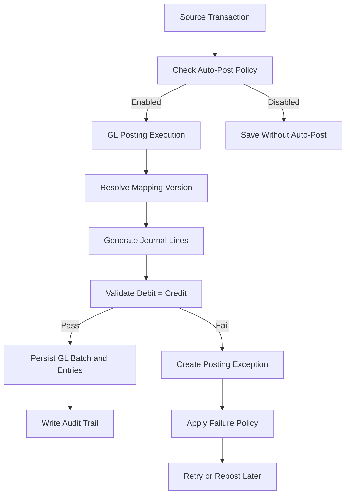

# GL Posting Execution vs Auto-Post

## 1. Purpose

This document explains the difference and relationship between:

- `GL posting execution`
- `auto-post`

These two concepts are closely related, but they are not the same thing.

---

## 2. Short Definition

### GL Posting Execution

GL posting execution is the runtime accounting engine that creates journal entries.

It answers:

`How are accounting entries created correctly for a source transaction?`

### Auto-Post

Auto-post is the policy that decides when GL posting execution should run automatically.

It answers:

`When should posting run automatically, and what should happen if it fails?`

---

## 3. Simple Difference

Think of them like this:

- `GL posting execution` = the accounting engine
- `auto-post` = the policy trigger for using that engine automatically

Or:

- `GL posting execution` = the accountant
- `auto-post` = the instruction telling the accountant to post automatically now

---

## 4. What GL Posting Execution Does

GL posting execution should:

- receive a source transaction
- identify the transaction type
- load the correct mapping rule and version
- evaluate conditions
- generate one or more journal lines
- validate debit = credit
- create posting batch and GL entries
- write execution audit trail
- create exception records on failure when appropriate

### Example Source Transactions

- invoice
- payment
- refund
- expense
- petty cash top-up
- later: AP invoice
- later: AP payment

---

## 5. What Auto-Post Does

Auto-post should:

- determine whether automatic posting is enabled for a transaction type
- determine whether posting success is mandatory
- determine whether failure is blocking or non-blocking
- determine whether retry/repost is allowed
- determine how failure should be surfaced

### Example Auto-Post Questions

- When an invoice is finalized, should posting run automatically?
- If payment posting fails, should payment save or stop?
- If expense posting fails, should it enter exception state?
- Can a failed posting be retried later?

---

## 6. Relationship Between Them

Auto-post uses GL posting execution.

Typical flow:

1. a business transaction occurs
2. runtime checks the auto-post policy
3. if policy allows, runtime calls GL posting execution
4. posting engine creates GL entries or raises an exception
5. system follows the configured failure policy

So:

`auto-post -> decides whether to call -> GL posting execution`

---

## 7. GL Posting Execution Can Exist Without Auto-Post

GL posting execution should also support non-automatic use cases.

Examples:

- manual repost
- retry failed posting
- controlled backfill posting
- admin-triggered reprocessing
- future manual finance actions

This is why the two concepts must remain separate.

If they are merged into one thing, the system becomes harder to control and harder to recover.

---

## 8. Governance and Ownership

### Platform / HQ (`cleanmatexsaas`)

Platform HQ owns:

- auto-post runtime behavior policy
- mapping governance
- mapping version governance
- account type governance

HQ decides:

- which transaction types auto-post
- blocking vs non-blocking behavior
- retry/repost policy
- allowed rule versions and standards

### Tenant Runtime (`cleanmatex`)

Tenant runtime owns:

- posting execution
- transaction-to-posting runtime call
- exception queue
- retry/repost execution
- GL inquiry and reporting

Runtime executes policy. It does not authoritatively define it.

---

## 9. Architecture Principle

Keep these layers separate:

### Layer 1: Source Transaction Layer

Examples:

- invoice creation
- payment completion
- refund creation
- expense save

### Layer 2: Auto-Post Policy Layer

Decides:

- enabled or disabled
- blocking or non-blocking
- success required or exception allowed
- retry/repost allowed

### Layer 3: GL Posting Execution Layer

Does:

- mapping resolution
- journal generation
- validation
- persistence
- audit logging

### Layer 4: Exception and Recovery Layer

Handles:

- failed posting visibility
- retry
- repost
- investigation and audit

---

## 10. Example Flow

### Example: Invoice Finalization

1. invoice is finalized
2. runtime checks HQ-governed auto-post policy for `invoice`
3. if enabled, runtime calls GL posting execution
4. posting engine:
   - loads mapping version
   - creates DR AR
   - creates CR Revenue
   - creates CR VAT if applicable
   - validates batch
   - saves entries
5. if posting fails:
   - follow blocking or non-blocking policy
   - create exception record if required

### Example: Expense Save

1. expense is saved
2. runtime checks HQ-governed auto-post policy for `expense`
3. runtime calls posting execution
4. posting engine creates expense-side and cash/bank/payable-side entries
5. if failure occurs:
   - visible exception path
   - retry/repost allowed if policy says so

---

## 11. Mermaid Flow Diagram

---

## 12. Best Practice Summary

### Do

- keep auto-post policy separate from posting execution
- govern auto-post policy at HQ/platform level
- keep posting logic in service layer
- make posting engine reusable for repost and retry
- log every execution
- make failures visible

### Do Not

- hardcode posting behavior in UI
- merge runtime policy and posting engine into one vague service
- let tenants freely redefine core posting behavior
- allow silent posting failures

---

## 13. Bottom Line

`GL posting execution` is the accounting engine.

`Auto-post` is the governance policy that decides when the engine runs automatically and what happens if it fails.

They must work together, but they must remain separate.

