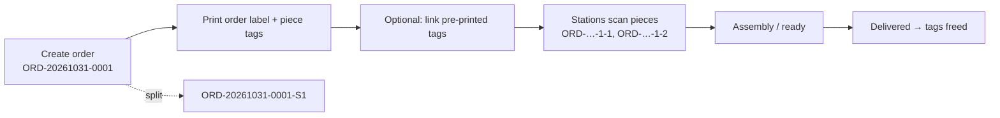
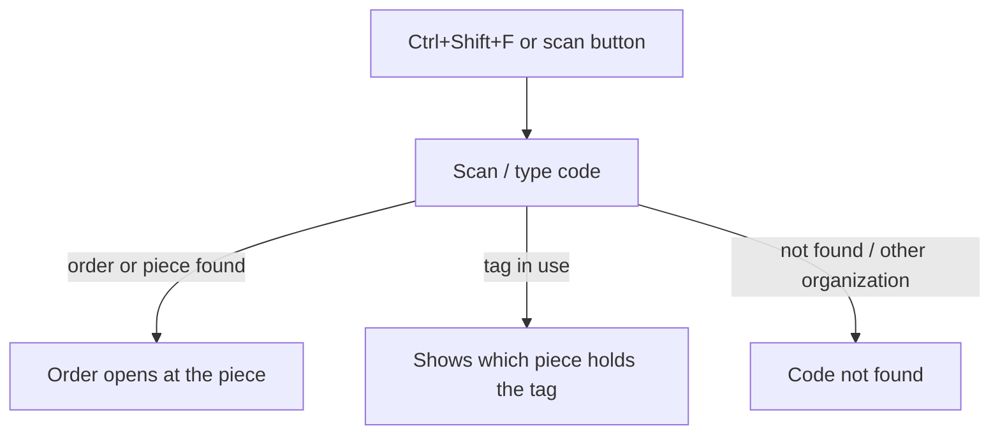
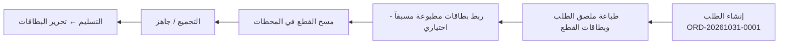

# User Guide (diagrams) — Human-Friendly Codes

Text version: [`user_guide.md`](./user_guide.md).

## Order life with codes

```mermaid
flowchart LR
  A[Create order<br/>ORD-20261031-0001] --> B[Print order label + piece tags]
  B --> C[Optional: link pre-printed tags]
  C --> D[Stations scan pieces<br/>ORD-…-1-1, ORD-…-1-2]
  D --> E[Assembly / ready]
  E --> F[Delivered → tags freed]
  A -. split .-> S[ORD-20261031-0001-S1]
```

## Scan anywhere

```mermaid
flowchart TD
  K[Ctrl+Shift+F or scan button] --> SC[Scan / type code]
  SC -->|order or piece found| OP[Order opens at the piece]
  SC -->|tag in use| TU[Shows which piece holds the tag]
  SC -->|not found / other organization| NF[Code not found]
```

## مسار الطلب (عربي)

```mermaid
flowchart RL
  A[إنشاء الطلب<br/>ORD-20261031-0001] --> B[طباعة ملصق الطلب وبطاقات القطع]
  B --> C[ربط بطاقات مطبوعة مسبقاً - اختياري]
  C --> D[مسح القطع في المحطات]
  D --> E[التجميع / جاهز]
  E --> F[التسليم ← تحرير البطاقات]
```
