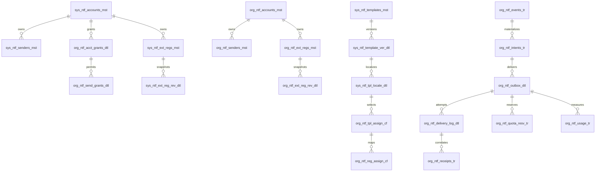

# Notification Hub — Proposed Schema and Contracts

**Status: DRAFT FOR IMPLEMENTATION REVIEW**  
**Planning date:** 3 October 2026 · Asia/Muscat  
**Canonical parent:** [Production implementation plan](./notification-hub-production-implementation-plan.md)

This is an implementation specification proposal, not an applied schema or completed integration. All new identifiers below are proposed. Shared migrations remain owned by `cleanmatex`; HQ implementation belongs to `cleanmatexsaas`. No SQL, migrations, provider operations, or live sends are authorized by this document alone. Live database shape, applied migrations, credentials, account approval, provider receipts, and deployment state remain unverified.

## 1. Evidence, reuse, and boundaries

Repository evidence comes from the tenant notification source and shared migration declarations. HQ application implementation was not inspected for this document. An HQ owner must reconcile this proposal with existing HQ storage before creating overlapping objects.

| Existing object / source | Reuse decision and verified limitation |
|---|---|
| `sys_ntf_events_cd`, `sys_ntf_event_chan_map` | Preserve event codes and channel mappings; add contract-version references through forward changes after live verification. |
| `sys_notification_channel_cd`, `sys_ntf_providers_cd` | Preserve channel/provider codes; attach explicit provider capabilities and config schema revisions. Channel identity is declared in migration 0053 and referenced by the notification FKs. |
| `sys_ntf_templates_mst` | Platform logical template identity; retain existing `template_code` and event association. |
| `sys_ntf_template_ver_dtl` | Platform internal revision; retain `DRAFT`, `APPROVED`, `RETIRED`; separate internal approval from provider approval. |
| `sys_ntf_template_chan_dtl` | Retain existing rendering rows during transition; normalized locale content becomes the new versioned rendering authority after cutover. |
| `org_ntf_settings_cf` | Channel controls, quiet hours and daily limits; enforce actual limits and declared timezone rather than only loading fields. |
| `org_ntf_channel_provider_cf` | Existing active provider assignment and configuration; migrate account/sender/template references without removing legacy reads immediately. |
| `org_ntf_user_prefs_dtl` | Tenant-user preferences; never treat staff consent as customer authorization. |
| `org_customers_mst.preferences` | Existing customer `notifications.whatsapp` boolean; preserve historical values, but do not invent consent evidence or assume cross-tenant copied preferences prove consent. |
| `org_ntf_outbox_dtl` | Dispatch jobs; retain exact existing statuses, IDs and idempotency semantics during compatibility rollout. |
| `org_ntf_delivery_log_dtl` | Extend as durable attempt ledger rather than creating another competing attempt table. |
| `org_ntf_inbox_mst` | In-app notification storage; retain IDs, read state, links, bilingual content and realtime behavior. |
| `org_notif_push_subs_dtl` | Device endpoint table declared in migration 0351; retain provider-specific subscription data with tenant predicates on every mutation. Reconcile mismatched runtime spelling before modifying access. |
| `hq_ntf_dispatch_log` | Existing shared migration declares dispatch idempotency/provider-message storage; reconcile its role with attempt authority before HQ implementation. |
| `hq_ntf_webhook_events` | Existing shared migration declares webhook storage; reuse as global ingress only if its verified columns/security support the staged model below. |
| [Template schema](../../../supabase/migrations/0346_ntf_templates_schema.sql) | Existing global template and provider catalog declarations. |
| [Provider configuration](../../../supabase/migrations/0352_notif_channel_provider_cf.sql) | Existing tenant active-provider storage and partial uniqueness. |
| [Emitter](../../../web-admin/lib/notifications/event-emitter.ts), [orchestrator](../../../web-admin/lib/notifications/orchestrator.ts) | Current best-effort entry and catalog dispatch; durable capture and audience policies are proposed additions. |
| [Outbox](../../../web-admin/lib/notifications/adapters/outbox.ts), [processor](../../../web-admin/app/api/notifications/process-outbox/route.ts) | Current atomic competing-worker claims are preserved; leases, recovery and reconciliation remain planned. |
| [Types](../../../web-admin/lib/notifications/types.ts), [renderer](../../../web-admin/lib/notifications/template-renderer.ts) | Exact persisted tokens are compatibility authority; current external rendering lacks full locale/version selection. |

The proposed ownership split is physical: `sys_*` holds platform-owned catalogs/resources without `tenant_org_id`; `org_*` holds private tenant resources with required `tenant_org_id`; `hq_*` holds global operational ingress/control data without mixed nullable tenant ownership. Tenant-scoped operational facts remain `org_*` even when HQ writes them through a service boundary.

## 2. Shared column dictionary and notation

Every new table receives the following columns unless a documented existing-table compatibility constraint requires an equivalent field. `T` below means the complete tenant/audit set; `G` means the same set without `tenant_org_id`. Existing audit fields keep their deployed types until a separately reviewed migration changes them.

| Column | Proposed type / nullability | Purpose and invariant |
|---|---|---|
| `id` | UUID required | Stable primary identity; externally opaque. Existing code-key tables retain their deployed PK. |
| `tenant_org_id` | UUID required on every new `org_*` table | FK to `org_tenants_mst.id`; immutable ownership; never inferred from an untrusted request body. |
| `created_at` | TIMESTAMPTZ required | Recorded server time; append-only facts retain original creation time. |
| `created_by` | TEXT nullable | Authenticated actor or identified system worker; never caller-selected attribution. |
| `created_info` | TEXT nullable | Request/provenance reference without credentials, raw destinations or unnecessary PII. |
| `updated_at` | TIMESTAMPTZ nullable | Last permitted administrative/projection change; not an event timestamp. |
| `updated_by` | TEXT nullable | Actor for that change; immutable facts do not permit content mutation. |
| `updated_info` | TEXT nullable | Bounded change/projection provenance. |
| `rec_status` | SMALLINT required | Preserve repository active/inactive semantics; documented allowed values. |
| `rec_order` | INTEGER nullable | Administrative ordering only; never provider placeholder sequence. |
| `rec_notes` | TEXT nullable | Redacted administrative explanation. |
| `is_active` | BOOLEAN required | Eligibility/soft retirement, not erasure of audit history. |

Human-managed masters additionally contain `name`, `name2`, `description`, `description2` as TEXT, with explicit required/optional EN/AR rules. Locale, country, city, timezone and currency fields have **no default**. All strings use TEXT. Monetary quantities use DECIMAL(19,4); FX rates, when actually needed, use DECIMAL(22,10). Never use floating-point arithmetic for charge facts.

In dictionaries below, “pair” means two separate tables with the same listed business fields, `G` on the platform table and `T` on the tenant table. References always identify the ownership side; a shared generic identifier is not sufficient authorization.

## 3. Account, sender, grants and activation dictionary

| Proposed object | Ownership / full business field dictionary | References and invariants |
|---|---|---|
| `sys_ntf_accounts_mst` / `org_ntf_accounts_mst` | G/T; `provider_code` TEXT required, `channel_code` TEXT required, `account_key` TEXT required, `external_account_id` TEXT required, `credential_ref` TEXT required, `credential_version` TEXT required, `account_state` TEXT required, `capability_rev` INTEGER required, `config_schema_rev` INTEGER required, `config` JSONB required, `verified_at` TIMESTAMPTZ nullable; bilingual master fields. | Provider/channel FK compatibility; unique account key within owner/provider; external IDs scoped to provider. Secrets stay in an approved credential store, not JSONB. Separate rows/credential refs for production and test environments. |
| `sys_ntf_senders_mst` / `org_ntf_senders_mst` | G/T; `account_id` UUID required, `channel_code` TEXT required, `sender_key` TEXT required, `external_sender_id` TEXT required, `sender_address` TEXT nullable, `sender_kind` TEXT required, `sender_state` TEXT required, `verified_at` TIMESTAMPTZ nullable, `capabilities` JSONB required; bilingual master fields. | Same-owner account FK; tenant side uses composite FK. Sender address means phone, email identity/domain or provider application as channel specifies; no global assumption that all senders are E.164. Verification alone does not imply template compatibility. |
| `org_ntf_acct_grants_dtl` | T; `platform_account_id` UUID required, `channel_code` TEXT required, `grant_state` TEXT required, `starts_at` TIMESTAMPTZ required, `ends_at` TIMESTAMPTZ nullable, `limits` JSONB required, `grant_version` INTEGER required. | FK to platform account; unique tenant/account/channel grant; enabled time window and limits enforced at dispatch. Private accounts require no platform grant. |
| `org_ntf_send_grants_dtl` | T; `account_grant_id` UUID required, `platform_sender_id` UUID required, `grant_state` TEXT required, `grant_version` INTEGER required. | Composite tenant FK to account grant; platform sender must belong to granted account/channel; enforce using a controlled activation validator and database consistency constraint/trigger. |
| `org_ntf_channel_provider_cf` (extend existing) | Existing fields retained; add `dispatch_owner` TEXT required after backfill, `platform_account_id` UUID nullable, `private_account_id` UUID nullable, `platform_sender_id` UUID nullable, `private_sender_id` UUID nullable, `assignment_version` INTEGER required, `config_schema_rev` INTEGER nullable. | Exactly one account owner per configured external assignment. Sender/account ownership must agree. Private refs use tenant composite FKs; platform refs require active grants. Existing unique active assignment per tenant/channel retained. |

`dispatch_owner` chooses a validated direct-tenant or HQ execution path, independently from resource ownership. A platform sender can be used only through its permitted dispatch path and grant. Do not route private credentials to an execution boundary without an explicit approved credential contract.

Activation is one transaction: lock tenant/channel assignment → validate expected version, channel/provider compatibility, verified account/sender, grants and selected registration revisions → deactivate old assignment → activate new assignment → increment version → append audit → commit. Failure preserves the old active assignment. Never deactivate first in one API request and activate later in another.

## 4. Logical templates, locale content and revisions

| Proposed object / reuse | Ownership / full business field dictionary | References and invariants |
|---|---|---|
| `sys_ntf_templates_mst` (reuse/extend) | Existing fields retained; add `schema_family` TEXT nullable during transition, `contract_version` INTEGER nullable, `content_purpose` TEXT nullable. | Preserve `template_code`, event code and existing approval lifecycle; platform authority only. |
| `sys_ntf_template_ver_dtl` (reuse/extend) | Existing fields retained, including existing `retired_at`; add `schema_rev` INTEGER nullable during transition, `variable_schema` JSONB nullable, `definition_hash` TEXT nullable, `published_at` TIMESTAMPTZ nullable. | Internal approval locks variable schema/content definition; a content edit creates a new version. Administrative retirement does not rewrite a used revision. |
| `sys_ntf_tpl_locale_dtl` | G; `template_version_id` UUID required, `channel_code` TEXT required, `language_code` TEXT required, `subject` TEXT nullable, `content_format` TEXT required, `content` JSONB required, `content_hash` TEXT required, `missing_policy` TEXT required. | Existing platform version FK; unique version/channel/language; language explicitly selected. Content includes structured ordered components or validated rich/plain body. No duplicated hidden second Arabic body authority. |
| `org_ntf_tpl_assign_cf` | T; `event_code` TEXT required, `channel_code` TEXT required, `language_code` TEXT required, `platform_locale_id` UUID required, `assignment_version` INTEGER required, `fallback_language` TEXT nullable. | FK to shared content consumed through authorized HQ API; selected locale must match event/channel/version/language and be approved. Unique tenant/event/channel/language active assignment. Explicit EN fallback for unavailable AR requires configured policy. |

Existing bilingual columns and legacy channel content remain readable until all old consumers are migrated. A backfill maps them to separate explicit language rows and records provenance; it does not claim provider approval or rewrite historical outbox text. Rendering chooses a pinned revision, selected language and strict missing-variable policy before delivery creation.

The essential model does not create a private duplicate of the entire logical-template hierarchy. BYO provider templates map to a shared logical event/variable contract while their private provider content and approval snapshots stay in tenant-owned registration revisions. A tenant-authored private logical library is deferred, requiring a demonstrated requirement and separate approval. Likewise, a separate delivery master is deferred because the existing outbox can carry delivery identity, frozen payload and state.

## 5. External registrations, immutable revisions and bindings

| Proposed object | Ownership / full business field dictionary | References and invariants |
|---|---|---|
| `sys_ntf_ext_regs_mst` / `org_ntf_ext_regs_mst` | G/T; `account_id` UUID required, `channel_code` TEXT required, `registration_key` TEXT required, `external_name` TEXT required, `external_id` TEXT nullable, `language_code` TEXT required, `provider_language_code` TEXT required, `content_type_code` TEXT required, `category_code` TEXT nullable, `current_revision_id` UUID nullable, `observed_status` TEXT required, `observed_status_raw` TEXT required, `observed_at` TIMESTAMPTZ required, `approval_fresh_until` TIMESTAMPTZ nullable, `rejection_code` TEXT nullable, `rejection_reason` TEXT nullable, `observation_evidence` JSONB required; bilingual master fields. | Same-owner account FK. Logical registration identity distinct from approved content revision. Unique owner/account/registration key; provider ID uniqueness uses verified provider/account scope. Current revision is a future-selection pointer, never the authority for a queued historical payload. |
| `sys_ntf_ext_reg_rev_dtl` / `org_ntf_ext_reg_rev_dtl` | G/T; `registration_id` UUID required, `revision_no` INTEGER required, `platform_locale_id` UUID nullable until mapped, `provider_status_at_import` TEXT required, `provider_status_raw_at_import` TEXT required, `provider_language_code` TEXT required, `content_type_code` TEXT required, `external_revision_id` TEXT nullable, `content_sid` TEXT nullable, `provider_content_hash` TEXT required, `provider_snapshot` JSONB required, `approval_evidence` JSONB required, `rejection_evidence` JSONB nullable, `submitted_at` TIMESTAMPTZ nullable, `verified_at` TIMESTAMPTZ nullable, `valid_until_at_import` TIMESTAMPTZ nullable, `unique_var_count` INTEGER required, `occurrence_count` INTEGER required, `provider_param_count` INTEGER required. | Same-owner registration FK; activate only after mapping to shared logical content/schema. Private provider snapshots never copied to global locale rows. Content, mapping and imported approval observation are immutable; later status observations update the audited master projection, never these frozen fields. Approval belongs to this account/locale/revision, never the internal logical template alone. |
| `sys_ntf_tpl_bind_dtl` / `org_ntf_tpl_bind_dtl` | G/T; `registration_revision_id` UUID required, `component_key` TEXT required, `component_position` INTEGER required, `parameter_position` INTEGER required, `external_slot` TEXT required, `variable_key` TEXT required, `value_path` TEXT nullable, `format_spec` JSONB nullable, `required` BOOLEAN required. | Same-owner revision FK. Ordered positions required; unique revision/component/parameter position. Validate variable/path against the revision schema, never JSONB key order. Repeated use of one variable may create multiple occurrences. |
| `org_ntf_reg_assign_cf` | T; `template_assignment_id` UUID required, `provider_assignment_id` UUID required, `platform_revision_id` UUID nullable, `private_revision_id` UUID nullable, `assignment_version` INTEGER required. | Exactly one registration revision; tenant composite references to both assignments and private revision. Platform revision account needs grant and compatible selected sender. Unique assignment/provider active mapping; dispatch pins the chosen revision. |

Counts are not interchangeable: `unique_var_count` is distinct logical variable keys; `occurrence_count` is placeholder appearances across components; `provider_param_count` is required serialized parameters for this provider revision. A repeated item collection has a runtime row count that is **none** of these static counts. Validation recomputes counts from schema/bindings and rejects inconsistent stored values.

Example: `order_number` appears in body and URL button, so one unique variable produces two occurrences; a provider may need two component parameters. A collection of ten order items can produce one formatted summary parameter. Provider-specific adapters must confirm that mapping against current provider contracts before activation.

Internal approval and external approval are independent. A provider rejection/expiry disables future sends using the affected revision without changing historical snapshots. No reusing the approved English SID for Arabic; no converting a missing production template to free text.

Canonical `language_code` and exact `provider_language_code` are separate: a connector explicitly maps provider regional codes without replacing imported spelling. `content_type_code` preserves the provider's concrete template/content type; the internal channel alone does not establish that type. Refusal/rejection evidence records raw code/reason, observation time, provider account and content hash, with sensitive examples redacted.

Status observation sources are authenticated provider import/sync/poll responses or verified signed callbacks stored in the account-scoped ingress evidence stream. Registration masters are mutable audited projections of those observations; revisions freeze content, bindings and approval evidence at import. A later approval observation can authorize the same immutable revision if it matches its content/account/language; a provider content change creates a new revision. Dispatch requires a current approved observation matching the pinned revision and declared freshness window; expired evidence triggers sync/retry/hold according to policy. It must not follow `current_revision_id` to silently switch queued content.

**Actual-account import gate:** the approved screenshot uses `estimated_ready_at` (18 characters), while the reported official Twilio Content variable-key guidance allows at most 16 characters. This discrepancy is a validation task, not permission to rename working keys. The HQ importer must fetch the actual account's Content definition/approval and exact variable keys, compare its live schema with current provider documentation, run controlled validation with the existing SID, and retain the imported evidence. Any slot alias belongs to a new explicitly reviewed provider revision/binding; internal `estimated_ready_at` can remain the domain variable. Never silently alter an existing approved SID or historical request.

## 6. Variable schema, sources, formats and calculation contract

`variable_schema` is validated JSONB with an explicit schema envelope; it is not arbitrary executable code. Store schemas in immutable internal revisions and materialized values in protected delivery snapshots. Validate with one backend authority shared by preview, save, publish and send.

Supported scalar types are string, integer, decimal-as-string, boolean, date, datetime, identifier and approved media reference. Objects have declared properties and required fields; collections have an item schema, maximum length, deterministic ordering and bounded selection. Nullability is explicit, independent of optionality. Unknown keys and unresolved paths are rejected for published contracts.

Sources are allowlisted `event`, `tenant`, `recipient`, `projection`, `literal` and `derived`. A projection is a registered service contract, version and field path, never a user-supplied SQL query/URL or arbitrary table name. Each tenant query filters tenant ownership, including every joined source. Resolve data through domain projections rather than adding order/business logic to provider adapters.

Derived operations start with `add_days`, `add`, `subtract`, `multiply`, `divide`, `sum`, `count`, `coalesce`, `concat`, `join`, `format_date` and `format_money`. Operators are typed and bounded; division-by-zero, cyclic dependencies, overflow and unsupported timezone are validation failures. Do not accept eval, JavaScript, SQL, JSONPath scripting or remote resolver execution.

```json
{
  "schema": "cmx.notification.variables",
  "schemaVersion": 1,
  "resolverVersion": 1,
  "variables": [
    {"key": "order_number", "type": "string", "required": true,
     "source": {"kind": "event", "path": "order.number"}, "maxLength": 64},
    {"key": "items", "type": "collection", "required": true, "maxItems": 50,
     "source": {"kind": "projection", "code": "order.notification", "version": 1, "path": "items"},
     "orderBy": [{"path": "lineNumber", "direction": "asc"}],
     "items": {"type": "object", "required": ["lineNumber", "name", "quantity"],
       "properties": {"lineNumber": {"type": "integer"}, "name": {"type": "string", "maxLength": 120},
         "quantity": {"type": "decimal", "scale": 4}}}},
    {"key": "item_count", "type": "integer", "required": true,
     "source": {"kind": "derived", "op": "count", "args": [{"variable": "items"}]}},
    {"key": "ready_at", "type": "datetime", "required": true,
     "source": {"kind": "derived", "op": "add_days",
       "args": [{"eventPath": "order.receivedAt"}, {"literal": 3}], "timezoneSource": "tenant.timezone"}},
    {"key": "estimated_ready_at", "type": "string", "required": true,
     "source": {"kind": "derived", "op": "format_date", "args": [{"variable": "ready_at"}]},
     "format": {"localeSource": "delivery.language", "timezoneSource": "tenant.timezone", "dateStyle": "medium"}}
  ],
  "components": [
    {"key": "body", "position": 0, "parameters": [
      {"position": 0, "slot": "order_number", "variable": "order_number"},
      {"position": 1, "slot": "estimated_ready_at", "variable": "estimated_ready_at"}]}
  ]
}
```

This example demonstrates computation, not a change to the approved `order_created_v4` business promise. The real ready date remains authoritative business input; adopting “received plus three days” requires the approved domain rule, not a template-author convenience.

| Format / collection rule | Required implementation behavior |
|---|---|
| Decimal and money | Preserve decimal strings; enforce scale/range. Monetary formatting requires explicit currency and locale; never recalculate customer charges. |
| Date arithmetic | Declare calendar-day versus elapsed-duration semantics; explicit tenant timezone, DST boundary tests and invalid-date rejection. |
| Collection formatting | Bounded join/summary transformation; deterministic order; defined empty and overflow policies; no silent clipping of business-critical fields. |
| Provider scalar serialization | Adapter converts typed values to the provider's verified parameter format; object/collection requires declared transformation. |
| Email HTML / links | Context-specific escaping, sanitized supported markup and validated URL scheme/host; never interpolate raw object strings. |
| Missing data | Required value fails preview/publish/send. Optional value follows declared null/fallback policy; no unresolved `{{name}}` in production. |
| Media | Approved media reference, verified ownership, content type/size/expiry; no arbitrary fetch of caller-controlled URLs. |

## 7. Durable events, intents, delivery jobs, attempts and receipts

| Proposed object / reuse | Ownership / full business field dictionary | References and invariants |
|---|---|---|
| `org_ntf_events_tr` | T; `event_id` UUID required, `event_code` TEXT required, `contract_version` INTEGER required, `occurred_at` TIMESTAMPTZ required, `producer_code` TEXT required, `source_type` TEXT required, `source_id` UUID nullable, `correlation_id` TEXT required, `causation_id` TEXT nullable, `dedupe_key` TEXT required, `payload` JSONB required, `payload_hash` TEXT required, `capture_state` TEXT required, `materialized_at` TIMESTAMPTZ nullable, `retention_until` TIMESTAMPTZ required. | Unique tenant/event ID and producer/dedupe key; event catalog FK. Capture in business transaction where the producer supports it. Immutable validated payload; materialization progress cannot replace payload. |
| `org_ntf_intents_tr` | T; `event_id` UUID required, `audience_kind` TEXT required, `tenant_user_id` UUID nullable, `customer_id` UUID nullable, `channel_code` TEXT required, `purpose_code` TEXT required, `requested_language` TEXT required, `dedupe_key` TEXT required, `policy_version` INTEGER required, `policy_decision` TEXT required, `policy_reasons` JSONB required, `scheduled_at` TIMESTAMPTZ required, `intent_state` TEXT required. | Composite event/customer FKs and verified tenant-user membership. Exactly one typed audience identity. Unique event/audience/channel intent; channel-disabled and consent-denied decisions remain inspectable facts. |
| `org_ntf_outbox_dtl` (extend existing) | Existing `id` becomes delivery identity; add `intent_id` UUID nullable during backfill, `platform_locale_id` UUID nullable, `platform_reg_rev_id` UUID nullable, `private_reg_rev_id` UUID nullable, `provider_assignment_id` UUID nullable, `assignment_version` INTEGER nullable, `language_code` TEXT nullable during backfill, `snapshot_schema_rev` INTEGER nullable, `snapshot_ciphertext` TEXT nullable, `snapshot_key_ref` TEXT nullable, `snapshot_hash` TEXT nullable, `recipient_hash` TEXT nullable, `policy_snapshot` JSONB nullable, `retention_until` TIMESTAMPTZ nullable, `claim_token` UUID nullable, `lease_expires_at` TIMESTAMPTZ nullable, `claimed_by` TEXT nullable, `reconcile_state` TEXT nullable, `last_attempt_id` UUID nullable, `finalized_at` TIMESTAMPTZ nullable. | Delivery and dispatch job authority in one existing row. New contract rows require frozen snapshot/locale/hash/retention even while legacy fields remain nullable. Composite intent/assignment/private-revision FKs; platform refs require grants. Existing retry/status columns retained. New content/destination requires new delivery ID; worker finalizes only matching tenant/claim/state. |
| `org_ntf_delivery_log_dtl` (extend existing) | Existing fields retained, including `outbox_id` as delivery FK; add `attempt_id` UUID nullable, `claim_token` UUID nullable, `provider_code` TEXT nullable, `platform_account_id` UUID nullable, `private_account_id` UUID nullable, `provider_message_id` TEXT nullable, `request_hash` TEXT nullable, `started_at` TIMESTAMPTZ nullable, `finished_at` TIMESTAMPTZ nullable, `acceptance_state` TEXT nullable, `error_code` TEXT nullable, `retryable` BOOLEAN nullable, `receipt_deadline` TIMESTAMPTZ nullable. | Unique tenant/attempt identity and outbox/attempt number; approved account ownership matches delivery. Composite existing outbox FK upgraded where needed. Append attempt facts and outcome observations; do not erase an accepted request when finalization fails. |
| `org_ntf_receipts_tr` | T; `delivery_id` UUID required, `attempt_id` UUID required, `provider_event_key` TEXT required, `provider_message_id` TEXT required, `receipt_kind` TEXT required, `provider_status_raw` TEXT required, `provider_occurred_at` TIMESTAMPTZ nullable, `received_at` TIMESTAMPTZ required, `verified_at` TIMESTAMPTZ required, `payload_hash` TEXT required, `redacted_payload` JSONB required. | Composite delivery/attempt FKs; provider account event dedupe through verified correlation. Monotonic delivery projection; out-of-order failure cannot overwrite a later verified terminal receipt without an explicit transition rule. |
| `hq_ntf_receipt_inbox_tr` (conditional new) | G; `provider_code` TEXT required, `platform_account_id` UUID required, `provider_event_key` TEXT required, `received_at` TIMESTAMPTZ required, `verified_at` TIMESTAMPTZ nullable, `payload_hash` TEXT required, `payload_ciphertext` TEXT required, `payload_key_ref` TEXT required, `ingress_state` TEXT required, `correlation_result` JSONB nullable, `retention_until` TIMESTAMPTZ required. | Platform ingress only, before tenant correlation; no tenant-owned resource placed here. Reuse existing HQ webhook table if it can satisfy this role. Never expose raw ingress through tenant APIs. Private-account callback enters its tenant-specific boundary. |
| `org_ntf_receipt_inbox_tr` (conditional new) | T; `private_account_id` UUID required, `provider_code` TEXT required, `provider_event_key` TEXT required, `source_kind` TEXT required, `received_at` TIMESTAMPTZ required, `verified_at` TIMESTAMPTZ nullable, `payload_hash` TEXT required, `payload_ciphertext` TEXT required, `payload_key_ref` TEXT required, `ingress_state` TEXT required, `correlation_result` JSONB nullable, `retention_until` TIMESTAMPTZ required. | Durable private-account quarantine; composite account FK and verified credential/signature tenant binding. Delivery may be uncorrelated in the result, but tenant/account ownership is never nullable or caller-selected. Reuse verified existing tenant ingress if it satisfies these guarantees; otherwise this object is required. |
| `org_ntf_consent_tr` | T; `customer_id` UUID required, `channel_code` TEXT required, `purpose_code` TEXT required, `decision` TEXT required, `recorded_at` TIMESTAMPTZ required, `effective_at` TIMESTAMPTZ required, `collection_method` TEXT required, `evidence_ref` TEXT nullable, `evidence_hash` TEXT nullable, `destination_hash` TEXT required, `policy_version` INTEGER required, `supersedes_id` UUID nullable. | Composite customer/self FK; append-only grant/revocation evidence; explicit tenant, destination and purpose. Historical boolean can be a legacy observation but not fabricated evidence. |
| `org_ntf_usage_tr` | T; `delivery_id` UUID required, `attempt_id` UUID nullable, `receipt_id` UUID nullable, `meter_code` TEXT required, `quantity` DECIMAL(19,4) required, `occurred_at` TIMESTAMPTZ required, `provider_event_key` TEXT required, `usage_state` TEXT required, `provider_currency` TEXT nullable, `provider_cost` DECIMAL(19,4) nullable, `pricing_policy_ref` TEXT nullable. | Composite fact FKs; unique tenant/provider event/meter; explicit unit semantics. Currency/cost either both present or both absent; currency FK to verified currency catalog. Corrections append reversal/replacement facts. |
| `org_ntf_quota_resv_tr` (conditional new) | T; `delivery_id` UUID required, `reservation_key` TEXT required, `meter_code` TEXT required, `bucket_key` TEXT required, `policy_ref` TEXT required, `policy_version` INTEGER required, `window_starts_at` TIMESTAMPTZ required, `window_ends_at` TIMESTAMPTZ required, `hard_limit_snapshot` DECIMAL(19,4) nullable, `quantity_reserved` DECIMAL(19,4) required, `quantity_finalized` DECIMAL(19,4) required, `quantity_released` DECIMAL(19,4) required, `reservation_state` TEXT required, `expires_at` TIMESTAMPTZ required, `finalized_at` TIMESTAMPTZ nullable, `released_at` TIMESTAMPTZ nullable, `usage_id` UUID nullable, `reconcile_reason` TEXT nullable. | Durable quota hold before billable submission; composite outbox/usage FKs; unique tenant/reservation key and delivery/meter/window. Required unless verified existing reservation storage provides equivalent atomic hold/finalize/release semantics. No currencies: these are quota units, not money. |

Every verified callback is persisted in the correct global or tenant-owned ingress before acknowledgment, including unmatched messages and provider-template status observations. Receipt namespace is `(provider_code, owned_account_id, provider_event_key)`; private namespace also contains `tenant_org_id`. If a provider lacks a stable event key, use a documented canonical event fingerprint including account/message/status/provider occurrence time; the raw body hash alone is not a universal receipt identity. Same key with different payload hash is quarantined as a conflict. Correlation creates a tenant receipt only after resolving an authorized delivery/attempt; unmatched private evidence cannot move to the platform inbox. A validated account binding is required before any tenant-owned row is written.

Legacy unbound outbox rows retain their rendered snapshots and explicitly labeled legacy dispatch path. New deliveries reference IDs that distinguish approved internal content and actual provider registration; never guess those IDs from a body string or template name.

## 8. Constraints, indexes, RLS and database functions

| Object class | Required database enforcement / access rule |
|---|---|
| All new `org_*` tables | Required tenant FK; unique `(tenant_org_id,id)` target for composite child FKs; RLS USING and WITH CHECK verified tenant membership/context; explicit tenant predicates in application queries and every join. |
| Tenant child tables | Composite FK includes tenant on events, intents, deliveries, attempts, customers, private accounts/senders/templates/revisions; RESTRICT deletion of retained financial/delivery history. |
| Platform masters / operational `sys_*` and `hq_*` | Review RLS, table/sequence/function grants and exposed schemas explicitly for every new/altered object, not only `org_*`. Platform-private accounts, credential references, sender identities, provider revision snapshots and receipt inboxes have no PUBLIC or direct tenant-read policy/grant. HQ-managed API returns only grant-filtered redacted DTOs; privileged service operations still authorize actor/scope. |
| Public metadata exception | Only deliberately approved provider/channel metadata projections can be publicly readable. Physical `sys_*` naming does not establish public visibility, and shared internal templates remain controlled catalogs consumed through the HQ API. |
| Ownership alternatives | Exactly-one owner checks on account/template/registration alternatives; consistency checks/triggers bind sender to account and registration to selected content/channel. |
| Immutable revisions/facts | Database rejection of published definition/payload changes; allow separately documented retirement and projection columns only. Remove/update permissions cannot rewrite historical evidence. |
| Logical uniqueness | Unique keys declared above; active assignment partial uniqueness; provider IDs include account scope; duplicate receipt keys compared by payload hash. |
| Tenant indexes | Required tenant, tenant/record-state, tenant/active and tenant/created indexes; choose combined/partial equivalents where they satisfy actual access patterns. |
| Scheduler indexes | Due queued jobs by `(scheduled_at,id)` and retry jobs by `(next_retry_at,id)`; lease recovery by `(lease_expires_at,id)`; include tenant/status predicates and fairness. |
| Receipt indexes | Account/provider message lookup, receipt dedupe, tenant/delivery chronology; preserve provider raw occurrence and received time separately. |
| Template indexes | Owner/template/version; channel/language active assignment; registration account/status/revision; ordered bindings by revision/component/parameter. |
| Consent indexes | Tenant/customer/channel/purpose/effective time and destination hash; latest projection respects revocation and explicit collection method. |
| Security definer functions | Fixed trusted search path, schema-qualified references, explicit tenant/actor authorization inside function; revoke PUBLIC execute; narrowly grant worker/admin role. Never trust caller-supplied tenant without authenticated binding. |

Proposed function identifiers, each under 30 characters: `ntf_activate_provider`, `ntf_claim_jobs`, `ntf_finish_attempt`, `ntf_recover_leases`, `ntf_apply_receipt`, `ntf_reserve_quota`, `ntf_finalize_usage`, `ntf_release_quota`. Privileged functions should be limited to operations needing database atomicity; ordinary reads remain service-layer queries with visible tenant filters. A scheduler may resolve eligible tenants centrally, then claim jobs under an authorized tenant scope rather than accepting arbitrary tenant arrays from clients.

Future migration authors must document **every** created, altered or removed object: tables, every column including identity/audit columns, PKs, FKs, checks, indexes, functions/arguments, views, triggers, sequences, types, schemas and RLS policies. Add PostgreSQL COMMENT metadata wherever supported; explain grant/revoke purpose and removal intent next to statements. Keep names within 30 characters, list next migration sequence at implementation time, never retrofit applied migrations and never execute migrations through the agent. Use RESTRICT; CASCADE requires separately approved dependency/recreate/rollback workflow.

Index/constraint/policy names must be budgeted independently from table names. Example proposed names: `uq_ntf_evt_dedupe`, `uq_ntf_job_delivery`, `ix_ntf_job_due`, `ix_ntf_job_lease`, `fk_ntf_del_intent`, `ck_ntf_del_owner`, `pl_ntf_tenant_scope`, `tr_ntf_rev_lock`. Each name is attached to a single explicitly documented object; no assumption that a short table name makes its generated indexes compliant.

## 9. Versioned event and delivery snapshot contracts

```json
{
  "schema": "cmx.notification.event",
  "contract_version": 2,
  "eventId": "20f47689-54b2-47b1-810f-ce2bd31bcbf5",
  "eventCode": "order.created",
  "tenantOrgId": "86b52fab-52dc-44e1-a8be-09ea7a148622",
  "occurredAt": "2026-10-03T08:30:00Z",
  "producer": {"code": "orders", "dedupeKey": "order:submitted:32e016fb:v1"},
  "source": {"type": "order", "id": "32e016fb-65ac-4424-a37f-8b3d99edb3ca"},
  "correlationId": "req-62e80d6b",
  "audiences": [{"kind": "tenant_customer", "id": "fa6f66d0-2366-446f-9810-c54f7f9aebea"}],
  "data": {"order": {"number": "ORD-20261003-001", "receivedAt": "2026-10-03T08:30:00Z",
    "readyAt": "2026-10-06T08:30:00Z"}},
  "privacy": {"purpose": "transactional", "classification": "customer_contact"}
}
```

The producer cannot specify unverified customer ownership, provider credential references, sender approval or raw callback correlations. Adapter from the existing `NotificationEvent` contract derives separate staff/customer audiences using verified source context, preserving existing producers until explicitly migrated. Repeat emission of the same producer dedupe key with a different payload hash returns a conflict rather than silently reusing the first event.

The envelope uses `contract_version=2` for the proposed event/dispatch boundary. Variable definitions independently use `schemaVersion=1`; these numbers identify different contracts and must not be compared as one lifecycle version. Database column names remain snake_case; DTO field casing beyond the required version field is frozen in generated OpenAPI/type artifacts before implementation. A shared runtime implementation package requires a separately approved ADR.

| Delivery snapshot field | Frozen value / dispatch recheck |
|---|---|
| Contract and IDs | Schema revision, event/intent/delivery IDs, tenant, source, correlation and stable dedupe key. |
| Audience | Typed recipient ID, encrypted destination, tenant membership/customer link, destination HMAC; changed destination cannot silently redirect a queued message. |
| Locale/content | Requested and selected language, fallback reason, internal content revision/hash, required variable schema and resolved typed values. |
| Provider | Code, account/sender IDs, selected registration revision/external ID, component bindings and serialized payload hash. No plaintext credentials. |
| Policy | Purpose, consent observation/version, channel/provider assignment versions, quota reservation, quiet-hour schedule and rule version. |
| Send-time eligibility | Recheck current revocation, channel/provider/grant/sender validity and domain cancellation rules. Denial records SKIPPED; never changes immutable payload to bypass the denial. |
| Attempt | Separate attempt identity, request hash, claim token, retry semantics, credential version used and acceptance result. |

## 10. API/service contracts and error envelope

All routes below are **proposed** unless explicitly marked existing. Final names must reconcile the parent plan and verified HQ API ownership; this document does not claim they exist. Use existing dynamic slug `[id]` consistently, service-layer handlers, CSRF on user writes, verified tenant context, RBAC, request validation and optimistic versions.

| Surface | Endpoint / operation | Contract and ownership |
|---|---|---|
| Existing tenant settings | `/api/v1/notifications/settings` | Existing channel settings remain; service adds validated limits/timezone and versioned update rather than raw ad hoc fields. |
| Existing provider API | `/api/v1/notifications/settings/providers` | Existing list/create/activate API; PUT becomes atomic activation with expected version, typed config, verified tenant binding and redacted response. |
| Tenant private connections/senders | `/api/v1/notifications/connections`, `/api/v1/notifications/senders` | List only own/granted resources, create private metadata, validate/verify server-side; credential input uses separate write-only secret endpoint, never GET JSON. API connection DTO maps to account storage, not a separate account resource. |
| Tenant templates | GET `/api/v1/notifications/templates/available`, GET `/api/v1/notifications/templates/[id]` | Authorized shared catalog; private internal draft/version library deferred. Structured variable/locale editing is HQ catalog governance. |
| Tenant BYO provider templates | `/api/v1/notifications/provider-templates`, POST `/provider-templates/[id]/sync` under the same base | Own registration metadata, immutable imported revisions and exact external binding evidence. |
| Tenant preview | POST `/api/v1/notifications/preview` | Same resolver/render validator as production; dry run only, redacted sample dataset or explicitly authorized tenant source. |
| Tenant activation | `/api/v1/notifications/routes`, PUT `/routes/[id]`, POST `/routes/[id]/activate` under the same base | Transactional content/registration/provider selection; expected version, exact revision, channel/language/sender compatibility. Route DTO maps to assignment storage. |
| Controlled test | POST `/api/v1/notifications/test-sends`, GET `/test-sends/[id]` under the same base | Explicit controlled destination and selected revisions; same consent/policy/provider path; separate test purpose, rate limits and audit. No bypass hidden in production adapter. |
| Tenant delivery/retry | GET `/api/v1/notifications/delivery-log/[id]`; POST `/delivery-log/[id]/retry`, `/cancel`, `/reconcile` under the same base | Authorized own-tenant facts; manual retry requires reconciliation clearance; no replay of accepted/unknown sends by default. Action access differs from read-log permission. |
| Existing logs | `/api/v1/notifications/delivery-log` | Preserve pagination/filters; add accepted/delivered/read/reconciliation distinctions and redacted attempt references. |
| Durable capture service | `captureNotificationEventTx` | Transaction context plus verified tenant and typed versioned envelope; no HTTP provider calls inside business transaction. |
| HQ connection/template governance | Proposed `/api/hq/v1/notifications/connections`, `/senders`, `/provider-templates`; existing `/templates` extended under the same base | HQ owns global metadata, verification, grants and immutable external revisions; tenant-private resources use explicitly selected-tenant routes from the parent plan. |
| HQ dispatch commands | Proposed POST `/api/hq/v1/notifications/dispatch/commands` | Async S2S `contract_version=2`; stable UUID command idempotency plus canonical payload fingerprint, service authentication, bound tenant, frozen payload and pinned registration. Existing `/dispatch` remains compatible; it does not silently accept a new contract. |
| Provider ingress | Proposed versioned provider callback route family | Verify provider signature against configured account before accepting/correlating; server determines tenant. Unknown message/account never becomes a tenant receipt. |

```json
{
  "success": false,
  "error": {
    "code": "NTF_TEMPLATE_VARIABLE_MISSING",
    "messageKey": "notifications.errors.requiredVariable",
    "params": {"variable": "estimated_ready_at"},
    "requestId": "req-62e80d6b",
    "retryable": false,
    "details": [{"path": "variables.estimated_ready_at", "reason": "required"}]
  }
}
```

Proposed API error codes are not DB enums or permissions. Centralize them only after contract review; map errors to resolved EN/AR feedback, preserving machine codes. Use 400 for invalid input/schema; 403 for policy/permission rejection; 404 for unavailable tenant resource; 409 for stale version/idempotency conflict; 422 for incompatible template/sender; 429 for bounded rate/quota; 503 for retryable resolver/provider availability. Do not disclose secret values, raw callback body, another tenant identity or full destination in errors.

Successful capture responds with event/intent identity and `accepted`, not delivered. Test creation returns a delivery ID; a test is successful only after its channel-specific acceptance/receipt criterion is met. All serialized collections and components have explicit ordered arrays and stable IDs.

### 10.1 Async command example and idempotency

```json
{
  "contract_version": 2,
  "command_id": "ffbc64f3-f2a3-4b30-b9c8-73360792fa94",
  "delivery_id": "ffbc64f3-f2a3-4b30-b9c8-73360792fa94",
  "tenant_org_id": "86b52fab-52dc-44e1-a8be-09ea7a148622",
  "request_id": "req-62e80d6b",
  "channel_code": "WHATSAPP",
  "provider_code": "TWILIO_WHATSAPP",
  "assignment": {"id": "905299a4-d421-444e-b2f6-cb06d1d45bf6", "version": 3},
  "account": {"owner": "platform", "id": "ccf0b199-49c3-4f0b-b85b-00d3e02124bb"},
  "sender_id": "b5823908-69a5-4b7a-83c7-cd21aeeec35a",
  "registration_revision_id": "a49a649c-adeb-4dd3-a8ee-c3a9a93f0777",
  "language_code": "en",
  "payload_ref": "protected-delivery:ffbc64f3-f2a3-4b30-b9c8-73360792fa94",
  "payload_fingerprint": "bdc3f80269bbd29a752684fc2f393aa23efef221a3063aa062592c1d489b0dd0"
}
```

`payload_ref` is resolved through an authenticated internal delivery service, not a caller-controlled URL or arbitrary storage path. An alternative encrypted payload transport requires a negotiated envelope key/ownership contract. The sample contains invented UUIDs and a demonstrative fingerprint; production fingerprints must be computed from canonical verified content.

| Command condition | Required response / persistence |
|---|---|
| First valid command | Durable command/job acceptance then HTTP 202 with command/delivery ID and `accepted`; never acknowledge only an in-memory promise. |
| Same UUID and fingerprint | Return original acceptance/current result; no second submission. |
| Same UUID, different canonical fingerprint | HTTP 409 `NTF_IDEMPOTENCY_CONFLICT`; retain original request and audit the conflict. |
| Unsupported `contract_version` | Reject before enqueue with a supported-version response; no reinterpretation through legacy body-only adapter. |
| Stale assignment or revoked grant | Rejected/skipped policy result; no guessing a substitute provider/sender. |
| Network timeout after command submission | Caller retries the same command UUID/fingerprint or reads command status; does not invent a new command identity. |
| Provider timeout after worker submission | Acceptance uncertainty enters reconciliation; command dedupe does not prove external provider nonacceptance. |

Canonical fingerprints include tenant, delivery, channel/provider/account/sender, pinned content/registration revisions, canonical destination representation, variables, components and payload-format version. Use the parent contract's protected keyed hash plus declared key scope/version for destination canonicalization; do not expose a bare guessable phone/email payload digest. Diagnostic `recipient_hash` is not a second uniqueness key or a substitute for the complete payload fingerprint. Exclude request IDs, mutable timestamps, transport headers and credential material. Publish a common canonicalization specification and generated golden fixtures; JSONB object order cannot define the fingerprint.

Use the existing HQ dispatch log/command store if live/HQ review confirms it supports durable command uniqueness, fingerprint comparison, async acknowledgment and lookup. Its existing status tokens remain compatible; additional command projections require an additive reviewed contract, not an unapproved replacement table. Source credentials are resolved at the execution boundary and never carried in command payloads.

## 11. Dispatch, ambiguity, statuses and compatibility

1. Capture event atomically with business facts where supported; dedupe by tenant/producer/event identity.
2. Materialize typed audiences and policy decisions independently per channel; isolate failure of one channel from others.
3. Resolve approved content/locale/provider registration and typed values; create immutable protected delivery snapshot and due job.
4. Atomically claim a due job with claim token and lease; persist attempt before provider submission.
5. Recheck revocation/channel/grants/provider validity; policy denial finalizes SKIPPED without email fallback caused by a transport-error classification.
6. Submit the frozen request through one selected adapter; persist provider ID/acceptance evidence before or with conditional job finalization.
7. Authenticate/dedupe receipts and project delivery status; reconcile ambiguous acceptance before any resend.
8. Release/reserve/record quotas and usage using deduplicated facts; keep financial charge calculation outside the delivery adapter.

Existing tokens remain exactly: `QUEUED`, `PROCESSING`, `SENT`, `DELIVERED`, `READ`, `FAILED_TEMPORARY`, `FAILED_PERMANENT`, `SKIPPED`, `CANCELLED`, as declared by migration 0348. Preserve `order.created` and catalog provider/channel codes. **Target compatibility semantics:** project provider accepted submission as `SENT`, not proof of recipient delivery. This is not a claim that every existing adapter already reports reliable acceptance; legacy mocks/no-endpoint behavior must be hardened. Provider callbacks supply DELIVERED/READ where supported; unsupported receipts do not fabricate those facts.

Existing due fields are `scheduled_at` (required TIMESTAMP) and `next_retry_at` (nullable TIMESTAMP), with `retry_count` and `max_retries`, verified against migration 0348. Lease recovery uses proposed `lease_expires_at` and `claim_token` while retaining existing status tokens. PROCESSING expiry either establishes safe retry through FAILED_TEMPORARY with a due `next_retry_at` or stays on reconciliation hold when submission may have occurred; it never invents an undeclared status. Review any TIMESTAMP-to-TIMESTAMPTZ conversion and historic timezone interpretation separately from adding leases.

Do not add a new persisted `UNKNOWN` outbox status without contract/migration review. Proposed `reconcile_state` and attempt `acceptance_state` separately represent acceptance uncertainty. An expired PROCESSING lease with possible submission enters reconciliation hold, not automatic resend. Retry only after evidence establishes nonacceptance or a provider-supported idempotent replay is verified. A database uniqueness key alone cannot guarantee exactly-once external delivery.

The delivery ID used in DTOs is the existing outbox `id`; receipt/usage `delivery_id` FKs therefore reference `(tenant_org_id,id)` on `org_ntf_outbox_dtl`. Do not introduce a second lifecycle projection solely to rename that identity. In-app intent materialization references the existing inbox identity and is not dispatched as an external job.

Provider capability contracts distinguish idempotent submission support, message lookup, signed receipts, bulk sends, templates, media, device fan-out and recipient reads. Unknown capabilities fail activation for mandatory requirements. Push no-subscription and development mock sends are explicit skipped/mock observations, never successful handset delivery. Each device fan-out attempt needs per-subscription outcome and retry eligibility to avoid duplicating already accepted devices.

## 12. Privacy, retention and pricing separation

| Data class | Proposed retention / protection requirement |
|---|---|
| Destination, variables and rendered content | Encrypt immutable snapshot with envelope key reference; minimize fields. A 30-day operational period is an example pending approved privacy policy, never a default. Exact period requires jurisdiction/product review. |
| Raw provider ingress | Encrypted, signature-verified, access-restricted quarantine. A 7-day diagnostic period is an example pending approved policy, never a default; reduce where unnecessary. Do not log raw receipt/request bodies. |
| Redacted receipts/attempts | Keep status, timing, provider ID and keyed destination hash for approved operational/audit period; exact period TBD, distinct from content retention. |
| Consent evidence | Purpose-bound evidence reference/hash and revocation chain; approved legal retention TBD; never fabricate time/source for legacy booleans. |
| Usage/financial facts | Financial retention authority determines period; payload erasure must preserve required non-PII accounting evidence. |
| Deletion/erasure | Destroy snapshot encryption key or authorized ciphertext payload after retention; retain IDs/hashes only where justified; worker detects erased payload and prevents resend. |

Use keyed tenant-scoped HMAC for destination correlation, not a bare phone/email hash vulnerable to enumeration. Logs redact destinations/variables/credentials. Preview, export, support inspection and reconciliation access must be separately authorized and audited. Subscription endpoints and media links require equivalent ownership and retention treatment.

Usage records quantities and observed provider cost, not a tenant invoice. Pricing policy revision, plan/quota evaluation, tax, FX, rounding and billing posting remain owned by the established financial authority. If costs are recorded, explicit currency and DECIMAL fields are required; no currency default. Same-currency valuation has equal base amount and null FX fields; cross-currency valuation stores direction/source/date immutably only when finance requires it. Corrections append ledger facts; notification delivery must never mutate historic invoice totals.

### 12.1 Durable quota reservations

Reservation storage is required even if usage storage is already present. Reuse an existing durable reservation ledger only after verifying its lock, idempotency, expiry and acceptance-ambiguity behavior; otherwise introduce the conditional `org_ntf_quota_resv_tr` above. A read-only usage check followed by a send is not a reservation.

| Reservation operation / constraint | Required invariant |
|---|---|
| Reserve | `ntf_reserve_quota` verifies tenant, meter/unit, pinned policy and window; atomically locks the quota bucket, tests finalized usage plus active held units against the hard cap, and creates/reuses the delivery reservation. All writers use the same transactional bucket lock. |
| Amount checks | `quantity_reserved` is positive; finalized/released quantities are nonnegative and their sum cannot exceed reserved units. Window end exceeds start; expiry is bounded by policy/window. Extra units require an atomic extension that rechecks capacity. |
| Idempotency | One reservation per tenant/delivery/meter/window. Same reservation key and quantity/policy returns original hold; mismatched inputs conflict. Retries of the same delivery reuse the hold, not another debit. |
| Finalize | `ntf_finalize_usage` atomically appends one deduplicated usage fact and converts the corresponding held units to finalized units. Already finalized acceptance/receipt replay returns the original fact. Unused units are released under the same lock. |
| Release | `ntf_release_quota` releases only proven unsent/nonbillable units after cancellation, policy denial or provider-proven nonacceptance. It cannot reverse finalized usage; corrections append reversal facts through finance-approved policy. |
| Expiry | An expired hold with no provider submission can release under lock. Possible acceptance changes reservation to reconciliation hold and preserves capacity until evidence settles the units; no automatic release-and-resend. |
| Retry / rollover | A retry cannot consume a new period while leaving an old hold active. Explicit rollover transition requires proof of nonacceptance, atomic old release/new reserve and policy approval; accepted/unknown work stays associated with its original window. |
| Fan-out | Reserve the declared billable unit, including per-device/provider segmentation where relevant. Partial acceptance finalizes only verified accepted/billable units and retains or releases the remainder under policy. |
| Projection integrity | Proposed reservation states (`RESERVED`, `FINALIZED`, `RELEASED`, `RECONCILING`) require reviewed checks/constants; they do not rename outbox statuses. Aggregate counters are rebuildable from reservation/usage facts, not independent authorities. |
| Concurrency and isolation | Composite tenant delivery/usage FKs; RLS; explicit tenant predicates; unique reservation key; bucket/window/status/expiry indexes; all competing workers cannot exceed cap via separate read-then-write transactions. |

Hard limits, billing eligibility, charge timing and quota units remain the existing commercial policy until separately approved. Unlimited policies explicitly represent no hard cap rather than a currency-like default. Reservation timeout/reconciliation alerts belong to P6 resilience and the P7 operational handover.

## 13. Migration and contract acceptance checklist

### 13.1 Essential and deferred schema scope

| Scope | Proposed additions / extensions | Estimate and dependency |
|---|---|---|
| Essential platform/private transport | Account pair, sender pair, account/sender grants; extend provider catalog capability metadata and tenant provider assignment. | 6 new tables plus existing extensions; P2 after P1 hardening. |
| Essential approved content mapping | One shared locale table, tenant template assignment, registration pair, revision pair, binding pair, tenant registration assignment. | 9 new tables plus existing shared template extensions; P2 dependent on transport accounts. |
| Essential durable/policy runtime | Tenant events, intents, receipts and consent facts; extend outbox and existing delivery log. | 4 new tables plus existing runtime extensions; P3. |
| Conditional webhook ingress | Global platform inbox and tenant-private inbox unless verified existing stores satisfy durable account-bound unmatched quarantine. | 0 to 2 new tables after HQ/live reconciliation; P3. |
| Conditional metering | Tenant usage facts only if verified existing metering storage cannot provide immutable deduplicated units. | 0 or 1 new table; P6, separate finance integration approval. |
| Conditional quota reservation | Tenant quota reservation ledger unless verified durable existing storage already implements atomic holds/finalization/release. | 0 or 1 new table; P6, required before enforcing concurrent quota guarantees. |
| Deferred library expansion | Tenant-authored internal template/version/locale hierarchy and a separate delivery master. | 0 tables in essential rollout; requires demonstrated need and separate ADR. |

The estimate is 19 essential new tables, potentially 23 after conditional platform/private ingress, metering and quota-reservation reconciliation, plus additive extensions. It is an upper-bound design decomposition, not permission to create all objects at once. A schema review may consolidate binding/assignment storage if it preserves typed ownership, immutable revision references and constraints. Never consolidate platform/private account or registration ownership into nullable-tenant rows.

### 13.2 Parent phase alignment and migration review checkpoints

| Parent phase | Schema/contract completion gate |
|---|---|
| P0 — scope/contracts baseline | Approve essential objects, source authority, existing-table reuse, resource grants, DTO casing/version, privacy and count semantics; inspect actual provider schema. |
| P1 — safety/legacy transport | Harden tenant predicates, atomic activation, recipient policy, callback auth and legacy error handling before introducing new abstractions. |
| P2 — accounts/senders/templates/variables | Separate reviewed migration drafts: accounts/senders/grants first; locale and registration revisions next; assignment/binding constraints and compatibility backfill next. |
| P3 — durable runtime | Review durable events/intents/consent before outbox lease/snapshot changes; then attempts/receipt correlation. Each draft has rollback and phased backfill validation. |
| P4 — HQ/tenant APIs and UI | Generate shared types/OpenAPI from approved contracts; implement structured catalog/account/sender/template mapping and redacted preview. |
| P5 — campaign/producer integration | Remove campaign bypass paths; onboard producers transactionally with stable event IDs and audience contracts. |
| P6 — quotas/measurement/resilience | Validate unit ledger reuse, reservation/reversal semantics, tenant fairness, ambiguous acceptance and operational recovery. |
| P7 — pilot/rollout/handover | Controlled real-account template import/send/receipt, coexistence/rollback proof, monitoring, incident and privacy handover. |

Do not reserve migration numbers now. For every approved dependency slice, list the latest migration sequence when the SQL draft is created, then stop for user review. Application of each migration is a user-operated deployment checkpoint. No later phase may assume a draft migration exists in production.

### 13.3 Permissions, navigation and grants

Reuse existing notification configure/manage/view-log permissions where their verified meaning fits. Any new permission must follow `resource:action`, be centrally defined, seeded by a new shared migration and documented in access contracts; no speculative permission codes are introduced here. Account secret write/verify, template publish, test delivery, grant administration and reconciliation require separate action-policy review.

New/modified navigation entries require both frontend navigation and `sys_components_cd` migration. Dashboard route/API gating follows the repository access-contract golden path; refresh platform inventories after gating changes. SQL EXECUTE/table privileges are not UI RBAC permissions: validate both independently. Catalog provider/channel metadata can be exposed through approved public/read-only DTOs; owned platform account/sender/registration content requires grant-filtered authenticated HQ API consumption.

Before approving migration/API drafts, record a matrix of role → table/function → allowed operation → scope → audit evidence. Include denied tenant catalog writes, denied cross-tenant private resource reads, revoked platform account/sender grants, secret response suppression, and support-only reconciliation. Document each grant/revoke and each policy rather than relying on service-role access as an explanation.

| Checkpoint | Required evidence before implementation acceptance |
|---|---|
| Existing-object reconciliation | Verify live columns/checks/indexes/RLS and HQ object role; settle conditional ingress reuse; do not duplicate existing attempt, secret or billing ledgers. |
| Contract/ownership ADR | Approve platform/private split, audience policies, dispatch owner, retention, consent evidence, ambiguity handling and HQ/tenant DTO compatibility. |
| Schema draft | Forward migration at next sequence, all objects/columns documented, names <=30 chars, no SQL execution by agent; user review before applying. |
| Backfill | Deterministic owner/locale/revision mapping with dry-run counts and exceptions; never infer external approval or create legacy consent evidence. |
| Compatibility | Existing producer/status/provider tokens and legacy read paths preserved; new contract behind scoped cutover; rollback stops new capture/activation without deleting history. |
| Security | Composite FK, explicit tenant predicates, RLS negative tests, grants/revokes audit, signed callback replay tests, credential leak scans and CSRF/stale-tenant tests. |
| Runtime reliability | Concurrent claim, expired lease, send timeout, accepted-but-DB-failed, duplicate/out-of-order receipt, manual replay and tenant fairness tests. |
| Rendering | EN/AR/RTL, declared fallback, repeated occurrence counts, ordered collection/derived values, missing scalar, cycle/overflow/date boundary and HTML/media safety tests. |
| Metering | Duplicate receipt produces one usage fact; retries/device fan-out units correct; reversal/FX/financial integration tested by finance authority. |
| Operations | Credentials configured securely, active sender/registration independently verified, controlled live send and receipt demonstrated, restore/reconciliation runbook approved. |

This document supplies schema and contract detail to the parent plan. It does not replace source evidence, schema discovery, implementation approval or the live release checklist.

## 14. Conceptual ownership and runtime ERD

This diagram shows essential references rather than every field. Platform/private resources are physically separate; connections are the API name for account storage. Conditional inbox and reservation storage must be reconciled with existing ledgers before creation.



Every tenant-to-tenant edge denotes a composite tenant FK, even where Mermaid cannot express its columns. Platform-grant edges add policy authorization, not a right for tenant clients to read global credentials or private registration snapshots.
