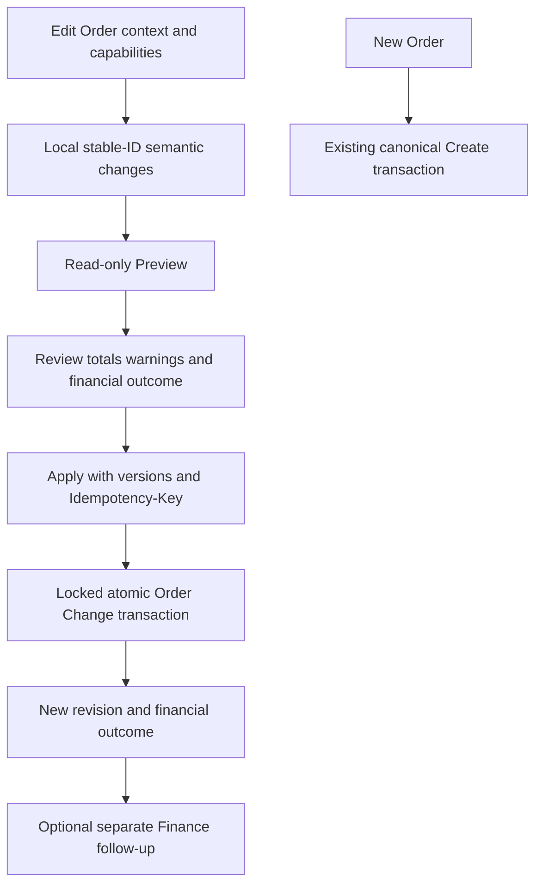

# CleanMateX Edit Order V2 / Order Change — Production Implementation Specification

**Version:** 3.0  
**Date:** 2026-10-02 (Asia/Muscat)  
**Status:** Authoritative technical specification; dependent implementation/release gates remain open.

Full Architecture v3.0 owns target business architecture. This specification owns the technical boundary and incorporates the linked specialized v3.0 contracts by reference. `Edit_Order_V2_Final_Implementation_Plan_Current_Codebase_v3.0.md` alone owns WP01–WP20 sequencing and progress. Current repository/database evidence and review results are in `../Edit_Order_V2_v3.0_Final_Validation_Report_Codex.md`.

The imported older plan and embedded copies of specialized contracts have been reconciled out of this specification. They are not independent authorities. Follow the active Markdown contracts below; supplied DOCX/ZIP exports are frozen reference snapshots until regenerated from the reconciled sources.

## Evidence and boundaries

The current review baseline is `main`, HEAD `a5fc878f4db53d83f3002e76036c3e613a28bc86`, plus the recorded working-tree changes. Local and remote catalog reads succeeded during this review. Catalog visibility does not prove data backfill eligibility, application-role behavior, PostgreSQL concurrency, live deployment of new code or production readiness. No implementation, migration or business-data mutation is authorized by this review.

## Part 1 — Validation result

### Verdict

**VALID WITH ADJUSTMENTS.** The modular monolith, separate Create and Change boundaries, stable identities, separate workflow/commercial concurrency, non-mutating Preview, atomic/idempotent Apply, immutable historical settlement facts and reuse of existing domains fit the current system. Do not continue committed full replacement through `OrderService.updateOrder()`.

The pack is **not ready for literal phase-by-phase execution as written**. Required implementation adjustments:

| Finding | Current evidence | Required adjustment |
|---|---|---|
| Existing domain service does not imply transaction composition | `lib/services/order-calculation.service.ts:126` opens Supabase/settings/global Prisma and reprices submitted lines; `lib/utils/idempotency.ts` uses global Prisma | Resolve inputs outside the transaction, reuse calculation algorithms through explicit inputs/transaction readers, and complete Change idempotency inside the Apply transaction. Preserve unchanged line facts. |
| Workflow transitions are not commercial-operation capabilities | `lib/services/workflow/workflow-engine.service.ts` action execution moves status/increments `state_version`; semantic transition schema requires from/to status | Add an operation/target capability adapter over existing policy/gate primitives. Do not execute a workflow transition for every Change. Missing operation-policy bindings deny until configured. |
| Warning acknowledgement needs commercial binding | `workflow-gate-decision.service.ts:66` binds workflow facts/version but not Edit revision/operations | Bind acknowledgement/override proof to expected edit version, workflow version, normalized operation digest, actor and policy/facts. Any changed review invalidates it. |
| Preference accounting is more specific than the pack | `lib/utils/order-charge-money.ts:1`, `:41`; `order-financial-write.service.ts:591` | Current ITEM/PIECE extras are already in line totals; only ORDER preference charge rows add separately. Preserve this single-count convention unless a reviewed monetary-contract change is approved. |
| Tax-inclusive unit amounts contradict an unconditional pre-tax definition | `order-calculation.service.ts:358`; inclusive tests in `__tests__/services/order-calculation.service.test.ts` | Explicitly distinguish existing gross inclusive selling amounts from net taxable base. Do not reinterpret historic `price_per_unit` values by changing labels or formulas. Review the pack wording before calculator implementation. |
| Charge tax treatment is not universally implied | `order-calculation.service.ts:360` adds order-level charges as flat non-taxable addends; accompanying B18 tests | Keep the current contract for compatibility. Taxable-charge support requires a concrete domain decision/configuration, not an Edit-only guess. |
| Soft removal already exists but readers are inconsistent | `order-piece-service.ts:1541` sets `rec_status=0`; general piece/item readers omit it; snapshot aggregates already filter it | Reuse `rec_status` and add removal lineage. Fix scoped active readers before exposing V2 removed rows. Do not add duplicate `is_deleted`/`is_active` sources of truth. |
| Payment V4 presentation is reusable; the collection API is narrower | `order-settlement.service.ts:416` restricts collection to `PAY_ON_COLLECTION`; `amendment-delta-notice.tsx` documents the limitation | Introduce a Finance-owned general additional-receivable collection adapter. Never rewrite original payment type to unlock collection. |
| Finance follow-up support is uneven | `overpayment-resolution-validator.service.ts` rejects stored-value restoration; `gift-card-service.ts` already has restoration primitives; refund service records manual gateway references | Offer only proven source/policy-supported dispositions. Add missing wiring in Finance, outside Apply. Do not advertise automatic gateway refunds as implemented. |
| B2B linked obligation needs more than a snapshot refresh | Snapshot writer reads linked AR invoice and can warn about mismatch | Compose existing AR correction/debit/credit-note authority or block unsupported issued-invoice edits. Do not mutate posted AR invoices in place. |
| Current idempotency/audit completion cannot be copied from B12 | `order-amendment.service.ts`, `order-service.ts:updateOrder`, `order-audit.service.ts:createEditAudit` | Change master/ops, canonical facts, revision increment, audit/outbox and replay response commit together. B12 remains compatibility only. |
| Protection tests overstate real coverage | `new-order-integration.test.ts` contains `expect(true)` placeholders; unpaid-balance test duplicates local arithmetic; B12 DB suite mocks calculation/skips unavailable DB | Build real canonical route/orchestrator protection first. Existing green unit tests do not establish V2 or full Create integration readiness. |

There is no reason to reopen stable identity, one Change authority, separate settlement, no event sourcing, no generic effect ledger, or no V1 price-list pinning. The genuine monetary wording contradictions and rollout prerequisites are isolated in Part 10.

## Part 2 — Meaningful differences from pack assumptions

| Area | Pack assumption | Current repository/local schema | Impact | Recommendation |
|---|---|---|---|---|
| Canonical file names | Several domains named conceptually | Financial aggregation is `web-admin/lib/services/order-financial-aggregation.ts`; snapshot writer is `order-financial-write.service.ts` | Avoid duplicate/misnamed services | Reuse these exact modules. |
| Structural deletion | Explicit deletion fields may all be required | `rec_status` exists on items/pieces/preferences; piece deletion already soft-deletes | Duplicate flags create contradictory visibility | Retain `rec_status`; add `deleted_at/by/deleted_order_change_id` only. |
| Preference extra-price | Extras separate; broad reuse declaration | ITEM/PIECE extras in `total_price`, ORDER PREFERENCE charges additive | A literal generic roll-up double-counts | Use `isMoneyAddendCharge`, `mapPreferenceLevels`, canonical snapshot semantics. |
| Inclusive pricing | Unit price unconditionally pre-tax | Inclusive calculation retains gross sale amount and extracts net/tax | Reinterpreting columns changes historic money | Make mode explicit in projected facts; review wording. |
| Order charges | General tax-engine reuse | Current B18 charges are non-taxable flat addends | Must not quietly change tax base | Preserve default; taxable extension only by reviewed domain contract. |
| Snapshot reuse | Snapshot recalculation sufficient | Transaction-aware writer exists; it persists overpayment but its return does not expose all fields; warnings are not a reconciliation assertion | Follow-up classification/Apply safety needs an adapter | Reload projected persisted summary in tx or extend typed return; assert required reconciliations. |
| Collection | Additional amount can use Payment V4 | Collection backend requires `PAY_ON_COLLECTION` | Fully paid Create orders cannot simply reuse the route | Reuse UI plus new general Finance collection adapter. |
| Stored value/gateway | Existing mechanics broadly available | Gift-card refund primitive exists; restoration disposition is blocked; gateway processing is record/manual-reference based | UI cannot imply unsupported execution | Source-qualified restoration wiring; supported/manual gateway flow only. |
| Cash drawer/FX | Finance reuse generically described | Recent drawer ledger, payment wiring and currency/FX work is present; local migrations include `0539`/`0540` | Old cash-in/out assumptions risk duplicate ledger movements | Reuse current ledger writers, wiring/outbox and currency context. Change alone creates no drawer movement. |
| Workflow counter | Physical rename considered early | `state_version` integer already widely consumed | Early rename expands risk into every command/consumer | Expose `wfStateVersion` as the V2 contract alias; retain one physical counter initially. |
| Editor loading | Preserve stable IDs in UI | GET already returns item/piece IDs but Edit mapper discards/replaces them; full normalized preferences are not loaded | Mapper-only fix is insufficient | Build tenant-filtered Change-context DTO with all preference row IDs. |
| Hierarchy isolation | Existing preference model mature | Level CHECK exists, but preference FKs are id-only; pieces lack composite parent hierarchy FK | RLS alone does not prove cross-ID consistency | Add scoped composite keys/FKs after orphan preflight. |
| Old monetary triggers | Pack does not enumerate installed item triggers | Local item triggers remain, but `fn_recalc_order_totals` is a no-op, matching superseding repository migration `0114` (`IF 1=2`) | The original `0015` roll-up is no longer an active calculation authority | Preserve canonical snapshot ownership; verify target installed definitions before cutover. Do not depend on this trigger for totals. |
| Edit settings | Reuse existing settings | `0128_order_edit_settings.sql` is empty; lock TTL is hard-coded | A migration filename is not proof of a seeded setting | Verify actual catalogs/API settings; reuse only confirmed entries. |
| Permissions | Preferred `orders:edit`/`orders:edit_override` | Both absent in current constant/catalog checks; `orders:update` and `orders:post_settlement_edit` exist | V2 needs deliberate seeded/gated permissions | Dedicated migration, explicit role mapping and contract updates; no silent universal grants. |
| Sequencing | Preview/Apply precede stable mutation/calculation integration; backfill late | Their correctness depends on stable projection, transaction-aware calculation/Finance and migrated readers | Early Apply would be incomplete | Implement projection/adapters before public Apply; perform backfill eligibility before pilot. |

## Part 3 — Reuse / Refactor / Build / Migrate / Retire / Leave unchanged

| Classification | Current component/table | Final responsibility |
|---|---|---|
| REUSE | `web-admin/app/api/v1/orders/submit-order/route.ts`, `lib/services/order-submit-orchestrator.service.ts` | Canonical Create; add only commitment/revision metadata at its existing successful commit point. |
| REUSE | `lib/services/order-calculation.service.ts`, `pricing.service.ts`, `discount-service.ts`, `tax.service.ts`, `tax-engine.service.ts`, `pricing-mode-resolver.service.ts`, `lib/money/currency-rounding.ts` | Existing calculation/rules. Refactor input/data access composition, not a second calculator. |
| REUSE | `lib/services/order-financial-aggregation.ts`, `order-financial-write.service.ts`, `order-financial-summary.service.ts` | Canonical financial components, transactional snapshot and read summary. |
| REUSE | `org_order_preferences_dtl`, preference catalogs/resolution, `lib/utils/order-charge-money.ts` | Generic hierarchical preference facts and single-count charge semantics. |
| REUSE | Workflow policy resolver, gate evaluator/decision, semantic context/runtime and `state_version` | Version-bound operation permission checks without a workflow transition. |
| REUSE | `org_idempotency_keys`, payload canonicalization/hash, `outbox.service.ts`, current consumers | Transactional replay and existing event transport; no parallel outbox. |
| REUSE | Existing payment/voucher/refund/stored-value/AR/cash-drawer domains and Payment Modal V4 capability registry | Separate financial follow-up. |
| REFACTOR | `src/features/orders/ui/edit-order-screen.tsx`, shared order workspace, `use-order-submission.ts`, order item/piece helpers/reducer | Preserve presentation; split Create versus Edit controllers and stable identity behavior. |
| REFACTOR | Existing calculation loaders and global idempotency helpers | Add explicit input/transaction composition without changing canonical Create results. |
| REFACTOR | Active item/piece/preference readers and workflow context aggregates | Exclude `rec_status=0` from active operations; retain historical access explicitly. |
| BUILD | `org_order_changes_mst`, `org_order_change_ops_dtl` | Immutable Change transaction and semantic operations; no generic Change effects ledger. |
| BUILD | NEW `lib/services/order-change/`, `lib/validations/order-change/`, `lib/types/order-change.ts`, `lib/constants/order-change.ts` | Contracts, context, capabilities, projection, Preview, Apply and financial-result orchestration. |
| BUILD | NEW Edit controller/change builder/Review/financial-resolution adapter | Familiar UI over authoritative Preview/Apply. |
| MIGRATE | Committed Preparation/detailing/preference/charge/bundle/piece/repair writers in Part 7 | Translate their intents to Change; retain Create-only and workflow-only paths. |
| MIGRATE | Commitment/backfill, `service_speed`, explicit new permissions and current access contracts | Additive reviewed migrations; seed only confirmed required codes. |
| RETIRE AFTER CUTOVER | Committed `OrderService.updateOrder()`, full replacement Edit DTO, product/sequence identity, `expectedUpdatedAt` OCC | Disable for V2-eligible committed orders; keep compatibility only within bounded rollout. |
| RETIRE AFTER CUTOVER | B12 amendment authority and old Save→delta settlement guidance | Read legacy history; new changes never originate through this authority. |
| LEAVE UNCHANGED | Existing paid/voucher/receipt/refund source facts, issued fiscal documents, historical Edit records | Immutable historical facts; domain-owned compensating/correction documents only. |
| LEAVE UNCHANGED | Workflow transitions, cancellation/return/issue/stop, Create draft editing | Separate authorities; only shared evidence/Finance adapters participate when needed. |

## Part 4 — Database and configuration contracts

Use [Database Schema Blueprint](CleanMateX_Edit_Order_V2_Order_Change_2026-10-02_v3.0_Database_Schema_Blueprint.md) for exact fields, types, immutable versus live hierarchy keys, lineage, indexes, constraints, RLS, grants, deployed-schema differences and migration gates. Use [Configuration Policy Matrix](CleanMateX_Edit_Order_V2_Order_Change_2026-10-02_v3.0_Configuration_Policy_Matrix.md) for exact current ownership and unresolved policy decisions. Do not execute the older embedded schema/settings snapshot.

## Part 5 — Final backend architecture



### Modules and route contracts

Use the established dynamic segment `[id]`: NEW `web-admin/app/api/v1/orders/[id]/change-context/route.ts` (GET), `.../[id]/changes/preview/route.ts` (POST), `.../[id]/changes/route.ts` (POST). The pack's `:orderId` is URL notation, not permission to introduce another slug. Thin routes authenticate, derive tenant/actor, enforce access, validate DTO and call services.

NEW contracts: `web-admin/lib/constants/order-change.ts`, `lib/types/order-change.ts`, `lib/validations/order-change/order-change.schemas.ts`. NEW services under `lib/services/order-change/`: `order-change-context.service.ts`, `order-change-capability.service.ts`, `order-change-projection.ts`, `order-change-calculation.service.ts` (adapter only), `order-change-preview.service.ts`, `order-change-apply.service.ts`, `order-change-mutation.service.ts`, `order-change-financial-result.service.ts`. Prefer these few coherent modules over one class per operation or another framework.

Context returns persisted item/piece/preference UUIDs, active canonical facts, original commercial revision, `wfStateVersion`, workflow profile binding/revision, edit-access state, currency/tax mode, source capabilities and current financial summary. Tenant-filter every table/relationship; do not copy the current unsafe nested include loader. Customer identity/branch/currency are immutable in V1; only approved contact/snapshot correction is editable.

Inputs contain two expected versions, ordered typed operations, persisted-versus-client reference discriminators, source context, optional reason and required warning/override data. Never accept actor, authorized outcomes, authoritative total, financial follow-up instruction, arbitrary fields or destination workflow status from the browser. Reject unknown operations, cycles, duplicate/conflicting operations, cross-order references and unresolved local references. An empty normalized batch returns no-change and creates no revision/Change row.

### Capability and projection

Evaluate commitment → edit access → `orders:edit` → pinned workflow/profile operation policy → target structural restrictions → Finance/fiscal restrictions → authorized warning/override. Temporary expiry does not bypass re-evaluation; permanent block is terminal. Existing profile binding identifies the policy version; operation bindings must be explicit and fail closed. Reuse gate evaluation, reasons, decisions and observability without cloning a rules engine or invoking transition execution.

Projection is a deterministic in-memory transformation shared by Preview/Apply. It preserves original stable IDs and unchanged line selling facts, resolves new client UUIDs, validates quantity against active pieces, propagates logical removals and produces canonical before/after operation facts. Preference kinds all use generic operations at ORDER/ITEM/PIECE level. Kind replacement is remove+add; changing content/extra policy preserves row ID. Pricing is required for new lines or policy-defined relevant changes; priority-only/note-only edits do not reprice unrelated lines. Service-speed change is a deliberate pricing trigger, subject to supported domain policy.

### Preview

Load authoritative tenant state, check both versions, resolve current catalog/settings/tax/payment policy inputs, evaluate capabilities and project/calculations in memory. Reuse pure Finance aggregation against current immutable settlement components and projected obligation. **No Change row, no audit/outbox/idempotency claim, no financial snapshot update, no preference rewrite and no promotion redemption/gift-card reserve.** Settings/catalog reading may occur; external payment/messaging actions never occur.

Return operation summary, original/projected amounts and mode, commercial delta, current/projected outstanding and unresolved overpayment, supported Finance follow-up, per-operation decision/reason, warnings/override requirements, versions and an input/calculation fingerprint. For every non-no-op Apply, the mandatory review proof defined in the API Contract binds operation/facts/calculation fingerprints without storing a pending Preview row. Because V1 intentionally has no price-list pinning and settings can change without order version changes, Apply recomputes and rejects changed reviewed totals/requirements with a re-review response. Do not silently apply a new amount.

### Apply

1. Authenticate/tenant-scope and canonicalize input; resolve required external/HQ-derived configuration before transaction. Revalidate its local version/fingerprint inside transaction or reject/require re-preview if currentness cannot be proved. No network/HQ/gateway call inside core transaction.
2. Enter existing tenant-context Prisma transaction. Consistent lock order: order row, transaction idempotency/replay record, targeted commercial children/source facts. Finance writers must coordinate on the same order lock to prevent payment/credit races.
3. Under tenant-scoped order lock, find durable successful key first. Same key/hash replays original response even if versions now advanced; different hash/order conflicts. Return frozen `apply_response`, never reconstruct it from the current order's newer totals/capabilities. A concurrent duplicate waits/replays or returns documented in-progress. Do not check stale versions before recognizing a successful retry.
4. Check commitment/access and both OCC versions, source/target ownership and current policy/gates; verify warning/override/review proofs. Re-load current Finance components. Recompute authoritative projection/calculation and require reviewed fingerprint/amount agreement.
5. Preallocate Change ID/number and new target IDs under lock. Apply stable-ID operations, record client→persisted mappings, retain removed rows, and synchronize active quantities. The Blueprint defers only the new removal-lineage FK until commit, allowing the preallocated Change ID without a pending/shell audit row.
6. Persist canonical line/preference/discount/tax/charge/rounding facts through transaction-aware existing domain adapters. Recalculate snapshot with `recalculateOrderFinancialSnapshotTx`. Assert expected projected totals, canonical aggregation and necessary fiscal/AR consistency; a snapshot warning is not automatically success or automatically a hard failure—classify known advisory versus blocking codes explicitly.
7. Insert the complete Change master once with final before/after summary, proofs and immutable response, then immutable ops; increment edit version exactly once with expected version predicate. All deferred removal-lineage references must resolve before commit. Do not update an applied master shell or increment workflow version for a purely commercial Change.
8. Insert required audit/outbox events via existing tx-capable writer and complete idempotency cached response in the same transaction. Commit all or roll back all. No old `createEditAudit` numbering/completion outside the boundary.
9. Respond with Change ID/number, revision, persisted identity map, amounts and financial outcome. Finance follow-up is a separate authenticated/idempotent transaction.

Finance outcome derives from canonical state, not signed delta: `NONE`, `OUTSTANDING_OPTIONAL`, `OUTSTANDING_REQUIRED`, `OVERPAYMENT`. Outstanding optional/required is existing collection-policy behavior and must have explicit source policy. Return source-qualified permitted dispositions; never execute a refund/payment as a side effect of Apply. Required example: total20/paid20→total15 leaves payment/voucher20 unchanged, outstanding0, unresolved overpayment5; no automatic refund row.

## Part 6 — Final frontend architecture

Keep the existing New/Edit workspace and Cmx design system. Build separate controllers beneath it; do not rewrite the catalog, summary, customer selection or payment capability presentation wholesale.

- Reuse shared layout/content/modals, product catalog, item/piece/preference editors, customer/contact presentation and Order summary. NewOrderController retains `useOrderSubmission` and canonical checkout/Create behavior.
- EditOrderController loads the new Change-context DTO, keeps immutable original and local projected state, capabilities, two versions, preview/proof, review state and Apply key. Existing `isEditMode` remains only temporary presentation compatibility; network/payment decisions live in controllers.
- Add stable `lineRef`/`pieceRef`/`prefRef` with persisted/client kind. Catalog product IDs locate products; they never merge two committed same-product lines. Never replace a committed piece UUID with `temp-${productId}-${index}` or match pieces by sequence. Preserve preference IDs at all levels.
- Separate Edit reducer/change builder from Create's product-keyed reducer. Reuse presentation via callbacks/adapters. Local statuses are UNCHANGED/ADDED/CHANGED/REMOVED; new+removed cancels locally, persisted removal remains visible in review.
- Piece-tracked quantity decrease opens eligible piece selection. Add/remove piece drives quantity. Prevent conflicting simultaneous quantity+piece operations or normalize them once. No blind slice/trim or automatic replacement of processed pieces.
- Build Review Changes with CmxDialog/sheet pattern: grouped target changes, original/new total, exact money/tax mode, financial outcome, warnings, required reason and override. It calls Preview, then Apply; no second Save path bypasses review.
- Display context bar, Revision N, workflow status, unsaved count and Discard. Browser navigation/close handling follows existing navigation conventions. Customer identity/branch/currency selection is disabled or omitted in Edit while allowed snapshot corrections remain available.
- On local change invalidate Preview. On 409 stale version/policy/calculation, offer reload/discard and preserve user intent for inspection; no V1 automatic merge. Failed network after Apply retries with the same key/payload; a genuinely changed request receives a new key. Disable duplicate submission without relying on the button for correctness.
- After commit refresh context/history/financial summary; clear local dirty state. Outstanding routes to supported Payment V4 adapter. Overpayment opens focused Finance Resolution with source lineage and supported dispositions. Refund failure leaves Change committed and resolution visibly pending.
- Use Cmx components only, `cmxMessage`/`useMessage()` for applicable resolved feedback, EN/AR glossary-backed keys and RTL-safe layouts. Follow no-silent-money-mutation rules in review/follow-up; do not overwrite typed money on toggles/close. Update existing Edit access contract and API dependencies; add no new sidebar by default.

### Reader prerequisite

The existing GET includes item/piece IDs, but normalized preferences are incomplete and Edit discards identities. The new context reader must load ORDER/ITEM/PIECE preference rows with `id`, `prefs_level`, `order_item_id`, `order_item_piece_id`, definition ID/code/kind/category/content/extra and active state. Current general `getOrderById` nested includes lack explicit tenant filters; use a new scoped reader rather than inheriting that omission. Active screens/totals/workflow contexts exclude removed rows; historical audit views deliberately include them with removal labels.

Concrete DTOs, errors, proofs, history and separate Finance follow-up contracts are owned by the [API Contract Catalog](CleanMateX_Edit_Order_V2_Order_Change_2026-10-02_v3.0_API_Contract_Catalog.md). Operation payloads and exactly-once piece/quantity normalization are owned by the [Operation Capability Catalog](CleanMateX_Edit_Order_V2_Order_Change_2026-10-02_v3.0_Operation_Capability_Catalog.md). Transaction compatibility, canonical Finance formulas and current source-lock gaps are owned by the [Service Module Map](CleanMateX_Edit_Order_V2_Order_Change_2026-10-02_v3.0_Service_Module_Map.md). No reuse claim waives these adapter and lock-coordination gates.

## Part 7 — Current writer and consumer closure evidence

The living plan's Part 7 retains the scoped current writer inventory. WP17 must prove closure for every enabled-cohort commercial writer, including server actions, Preparation, pieces/preferences/charges, repair RPCs, compensation and direct Data API access. The Security contract records the verified unsafe tenant helper and privileged RPC grants; route closure alone does not close those bypasses.

## Part 8 — Execution and progress authority

Read [the living implementation plan](Edit_Order_V2_Final_Implementation_Plan_Current_Codebase_v3.0.md). Its WP01–WP20 sequence is unchanged. WP01 protection remains substantially complete with validation PARTIAL; WP02 preparation remains PARTIAL; WP03–WP20 are not started. This document contains no second package ledger or execution plan.

## Part 9 — Test and release evidence

Use [Requirement Traceability Matrix](CleanMateX_Edit_Order_V2_Order_Change_2026-10-02_v3.0_Requirement_Traceability_Matrix.md) for every frozen invariant and scenario, required test layers and current evidence limits. Fresh review results and missing historical progress artifacts are recorded in [the validation report](../Edit_Order_V2_v3.0_Final_Validation_Report_Codex.md). Mock composition tests are not PostgreSQL rollback/concurrency/security proofs.

## Part 10 — Open gates

Use [Open Decisions and Release Gates](CleanMateX_Edit_Order_V2_Order_Change_2026-10-02_v3.0_Open_Decisions_Release_Gates.md). Missing owner decisions block their dependent packages/modes; they do not permit a silent default or reopen the frozen architecture.

## Part 11 — Production implementation completeness map

The living work-package plan is executable only together with the v3.0 normative companion contracts. No implementation package may invent a missing API field, DB column, operation code, UI state, permission, event or configuration default ad hoc.

### Required companions

- Database Schema Blueprint
- API Contract Catalog
- Operation & Capability Catalog
- Frontend / UI / UX Specification
- Service & Module Map
- Configuration & Policy Matrix
- Permissions, Security & Tenant Isolation
- Events, Observability, Performance & Support Signals
- Requirement Traceability Matrix
- Migration, Cutover & Operations Runbook
- Open Decisions & Release Gates

### Definition of production-complete

The feature is production-complete only when all applicable requirements are traced across:

```text
business rule
  -> configuration/policy owner
  -> database facts
  -> API contract
  -> backend service/transaction owner
  -> frontend state/UX
  -> permission/security control
  -> audit/event/observability
  -> automated test
  -> rollout/support procedure
```

A missing link is a release gap even if the happy path works.

## Part 12 — No-gap implementation rules

1. No generic full-order replacement remains for V2 committed orders.
2. No client amount/actor/tenant/permission is trusted.
3. No committed line/piece/preference identity is recreated to represent an edit.
4. No operation is authorized by a hard-coded status array in V2.
5. No missing pricing/tax/config error silently becomes zero/default unless that exact default is frozen in policy.
6. No payment/refund/gateway execution happens inside Change Apply.
7. No historical payment/receipt/fiscal fact is rewritten to make a Change “balance.”
8. No preview writes commercial or financial facts.
9. No successful Apply can commit without its Change/ops/version/audit/outbox/idempotent response.
10. No enabled cohort retains an ungoverned committed commercial bypass.
11. No new UI message is English-only; no critical state relies only on color.
12. No migration fabricates historical commitment actor/time/semantic operations when evidence is absent.
13. No unresolved owner/business gate becomes an undocumented developer default.


---

## Normative companion sources

These Markdown documents are incorporated technical contracts, not lower-priority optional examples. Keep their details in one maintained source; do not re-embed copies here.

- [Database Schema Blueprint](CleanMateX_Edit_Order_V2_Order_Change_2026-10-02_v3.0_Database_Schema_Blueprint.md)
- [API Contract Catalog](CleanMateX_Edit_Order_V2_Order_Change_2026-10-02_v3.0_API_Contract_Catalog.md)
- [Operation Capability Catalog](CleanMateX_Edit_Order_V2_Order_Change_2026-10-02_v3.0_Operation_Capability_Catalog.md)
- [Frontend UI UX Specification](CleanMateX_Edit_Order_V2_Order_Change_2026-10-02_v3.0_Frontend_UI_UX_Specification.md)
- [Service Module Map](CleanMateX_Edit_Order_V2_Order_Change_2026-10-02_v3.0_Service_Module_Map.md)
- [Configuration Policy Matrix](CleanMateX_Edit_Order_V2_Order_Change_2026-10-02_v3.0_Configuration_Policy_Matrix.md)
- [Permissions Security Tenant Isolation](CleanMateX_Edit_Order_V2_Order_Change_2026-10-02_v3.0_Permissions_Security_Tenant_Isolation.md)
- [Events Observability Performance](CleanMateX_Edit_Order_V2_Order_Change_2026-10-02_v3.0_Events_Observability_Performance.md)
- [Requirement Traceability Matrix](CleanMateX_Edit_Order_V2_Order_Change_2026-10-02_v3.0_Requirement_Traceability_Matrix.md)
- [Migration Cutover Operations Runbook](CleanMateX_Edit_Order_V2_Order_Change_2026-10-02_v3.0_Migration_Cutover_Operations_Runbook.md)
- [Open Decisions Release Gates](CleanMateX_Edit_Order_V2_Order_Change_2026-10-02_v3.0_Open_Decisions_Release_Gates.md)
- [Frozen Invariants](CleanMateX_Edit_Order_V2_Order_Change_2026-10-02_v3.0_Frozen_Invariants.md)
