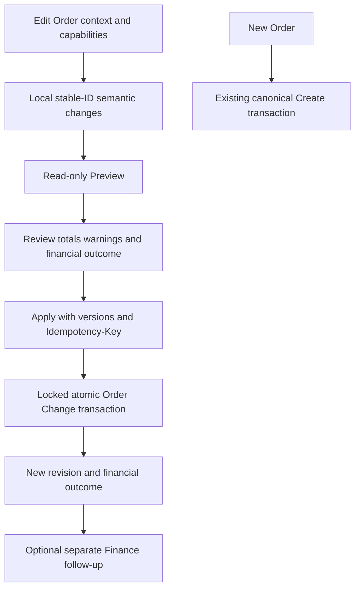

# Edit Order V2 — Final Implementation Plan Current Codebase v3.0

**Date:** 2026-10-02 (Asia/Muscat)  
**Version:** v3.0 — authoritative living implementation plan  
**Status:** ACTIVE  
**Supersedes:** `Edit_Order_V2_Final_Implementation_Plan_Current_Codebase_Codex.md` and all v2.x implementation-plan files.

## Authority hierarchy

This file is the **single living implementation plan and progress ledger** for Edit Order V2.

Use the following authority order:

1. `CleanMateX_Edit_Order_V2_Order_Change_2026-10-02_v3.0_Full_Architecture.md`
   - target/business architecture
   - frozen architectural intent

2. `CleanMateX_Edit_Order_V2_Order_Change_2026-10-02_v3.0_Production_Implementation_Specification.md`
   - master technical implementation contract

3. This file
   - current-codebase implementation sequence
   - verified repository findings
   - WP01–WP20 scope
   - package progress/status
   - implementation evidence and blockers

4. Specialized v3.0 contracts
   - `..._Database_Schema_Blueprint.md`
   - `..._API_Contract_Catalog.md`
   - `..._Configuration_Policy_Matrix.md`
   - `..._Operation_Capability_Catalog.md`
   - `..._Frontend_UI_UX_Specification.md`
   - `..._Service_Module_Map.md`
   - `..._Permissions_Security_Tenant_Isolation.md`
   - `..._Events_Observability_Performance.md`
   - `..._Requirement_Traceability_Matrix.md`
   - `..._Migration_Cutover_Operations_Runbook.md`
   - `..._Open_Decisions_Release_Gates.md`
   - `..._Frozen_Invariants.md`

5. Current repository + verified database
   - implementation reality
   - exact current filenames/functions/schema always win over stale file-location assumptions
   - they do **not** override frozen business invariants without explicit review

## Active-set rule

Only v3.0 documents are active.

The following are superseded and should be removed from the working project after this v3.0 file is verified:

- all `v2.x` Edit Order V2 pack files
- `Edit_Order_V2_Final_Implementation_Plan_Current_Codebase_Codex.md`
- any earlier duplicated implementation-plan copies

They may be archived outside the active project if historical trace is desired, but coding agents must not use them as active authority.

## Execution rule

For every work package:

1. Read this plan's package section.
2. Read the relevant v3.0 specialized contracts.
3. Inspect the current repository/database.
4. Implement only that package.
5. Update this living plan immediately with:
   - status
   - files changed
   - migrations authored/applied status
   - tests/results
   - unresolved issues
   - next approved action

Do not create another competing implementation plan.

---


## v3.0 completeness integration

The original Codex plan remains valuable for verified repository evidence and WP progress, but the following details are now governed by the dedicated v3.0 contracts and must not be inferred only from older package text:

### Database
Use `CleanMateX_Edit_Order_V2_Order_Change_2026-10-02_v3.0_Database_Schema_Blueprint.md` for:
- exact target columns/tables
- indexes/FKs/RLS
- removal lineage
- hierarchy integrity
- backfill/deployment/rollback constraints

### APIs
Use `..._v3.0_API_Contract_Catalog.md` for:
- endpoints
- request/response fields
- HTTP status/error contracts
- idempotency/replay semantics
- conflict/no-op behavior

### Configuration and policy
Use `..._v3.0_Configuration_Policy_Matrix.md` for:
- HQ rollout/feature flags
- tenant settings
- workflow operation policy
- per-order access state
- pricing/discount/tax/finance/delivery-owned policy
- default/allowed values and enforcement points

### Operations/capabilities
Use `..._v3.0_Operation_Capability_Catalog.md` for:
- V1 operation codes
- targets
- stable identity requirements
- capability owner
- hard invariants
- money/tax/financial effect classification

### Frontend/UI
Use `..._v3.0_Frontend_UI_UX_Specification.md` for:
- page/screen/controller structure
- state model
- loading/error/conflict/blocked/review/apply states
- EN/AR/RTL behavior
- financial follow-up UX
- accessibility expectations

### Backend/service boundaries
Use `..._v3.0_Service_Module_Map.md` for:
- service ownership
- reuse vs new service boundaries
- transaction composition
- external-call restrictions

### Security
Use `..._v3.0_Permissions_Security_Tenant_Isolation.md` for:
- permissions/RBAC
- tenant predicates/RLS
- direct DML/RPC restrictions
- server-derived actor/tenant
- immutable history constraints

### Events/observability/performance
Use `..._v3.0_Events_Observability_Performance.md` for:
- outbox contracts
- event payload expectations
- logs/metrics/tracing
- alerts
- performance/SLO release evidence

### Traceability and operations
Use:
- `..._v3.0_Requirement_Traceability_Matrix.md`
- `..._v3.0_Migration_Cutover_Operations_Runbook.md`
- `..._v3.0_Open_Decisions_Release_Gates.md`

No coding agent may silently invent behavior where one of these contracts marks a decision as unresolved or gated.

---

## v3.0 execution governance and inherited progress

The user authorized the audit, this freeze and WP01. Freeze applies to architecture, package scope and acceptance contracts; progress/evidence/known-gap entries remain maintained after every step. Material changes to the baseline require an explicit v3.0 reconciliation record, impact/dependency review and the applicable approval. A frozen plan is not proof of production readiness or a guarantee of zero defects. Every open decision below gates its dependent implementation or release.

Mandatory tasks for **every WP01–WP20 step**, including resumed sessions and project switches:

1. Read the active repository `CLAUDE.md`, `AGENTS.md`, applicable nested instructions, required skills, agent instructions and linked domain rules before editing. Use scoped agents as required; if unavailable, record that limitation and complete the same bounded review directly. Respect the master plan and cross-project ownership. Do not apply/reset databases or modify existing migrations.
2. Record owner, intended files and dependencies. Reuse existing services, hooks, domain types, validation, monetary algorithms and Cmx UI. Before UI work, search the relevant Cmx/shared feature exports; document the reuse decision. Create a reusable component only for a concrete shared need; keep generic UI independent of commercial/workflow services, and add documentation, accessible EN/AR/RTL behavior and Storybook coverage where required. Generic infrastructure must not erase domain invariants.
3. Implement the bounded step; verify tenant predicates, hierarchy, permissions, input/output contracts, failure behavior and relevant checks. Run targeted tests, lint/typecheck and build/i18n checks when applicable. Record failures and environment gaps honestly; mocked transaction callbacks prove composition/failure propagation, not PostgreSQL rollback or concurrency.
4. **Immediately update plan progress and related documentation after the step**, before starting the next step: status, changed files, validation command/result, unresolved risks/decisions, docs refreshed and next action. Update contracts/guides/runbooks alongside their implementation. Do not label proposed routes/settings/permissions as implemented.
5. At package exit, reconcile acceptance criteria, writer/readers impacted and documentation coverage. Use the documentation skill to refresh the implemented package's docs. Record DONE only when its required checks pass; otherwise record PARTIAL with concrete outstanding evidence. WP20 additionally invokes the documentation skill for the complete release documentation pack.

### Additional audit corrections incorporated before freeze

| Gap | Required contract / owner / acceptance |
|---|---|
| Historical target FKs versus split/reparent | WP02 separates immutable historical origin from mutable live hierarchy; history references tenant/entity identity, and Apply validates current order/parent membership under lock. WP17 coordinates split locks; WP18 tests Change→split and split→Change. See Part 4 C/D. |
| Bounded requests and safe diagnostic data | WP04/WP10/WP12 define operation count, payload/snapshot/reason size limits, pagination and supported client-reference dependencies. Reject cyclic/dangling/duplicate/conflicting operations deterministically. WP18 tests limits, CSRF, tenant/role isolation and abuse handling using established middleware. Logs/history exclude credentials and unnecessary personal data; retention/redaction must preserve required monetary/audit facts and durable replay guarantees. |
| No-op and retry semantics | WP04/WP10/WP12 define semantic no-op handling before UI/API wiring: an empty/effectively unchanged request does not create history, outbox or increment either version; return a typed non-applied result. One Apply attempt keeps one key across uncertain network responses; changed operations require a new review/key. Durable replay is checked before stale-version rejection. |
| Policy/configuration races | WP05/WP08/WP12 bind evaluation to policy revision, relevant catalog/config facts and both order versions; revalidate authoritative dependencies under lock. External dependencies that cannot share the transaction need an explicit validity/fingerprint contract and fail-closed handling. No unsupported pricing/configuration assumptions. |
| Post-commit response failures | WP11/WP12 commit the authoritative response with Change/history; response serialization, notification dispatch or client disconnect cannot turn a committed Change into a second Apply. WP01 characterizes current Create failure boundaries without changing them. |
| Release completeness beyond happy paths | WP18/WP19 require supported-browser/responsive/a11y EN/AR UAT, realistic query plans/latency, deadlock/timeout/retry checks, event-consumer compatibility and retry/DLQ monitoring, cohort rollback and support diagnostics. Define measurable budgets against repository deployment limits before pilot, with operator ownership; do not invent production numbers. |

### Progress ledger

This ledger is the plan status authority. The inherited `WP01_Protection_Progress.md` and `WP02_Foundation_Preparation.md` files are absent from the active set; their old references cannot prove completion. Fresh current-code/test/catalog evidence is recorded in [the final validation report](../Edit_Order_V2_v3.0_Final_Validation_Report_Codex.md). Individual verified progress is preserved below; missing historical evidence remains explicit.

| Package/step | Status | Evidence / next action |
|---|---|---|
| Freeze: audit and governance | DONE | Added split/history compatibility, bounded/no-op/retry/config/operational gates and mandatory per-step status/docs tasks; v3.0 active baseline. |
| WP01.1 baseline and test scope | DONE | Revalidated `main` / `a5fc878f4db53d83f3002e76036c3e613a28bc86` and existing working-tree changes; current imported test scope and writer boundaries inspected. |
| WP01.2 canonical route protection | DONE | Current actual route/schema cases retained and re-executed; included in the fresh 44-case WP01 run. No live DB mutations. |
| WP01.3 orchestrator/payment protection | DONE | Current imported orchestrator/schema protection retained and re-executed; mocked composition/failure propagation is proven, not PostgreSQL rollback. |
| WP01.4 legacy boundary and writer refresh | DONE | Current legacy boundary cases re-executed; full-replacement and alternate committed writers remain verified risks to close in WP17, not desired behavior. |
| WP01.5 validation and documentation | PARTIAL | Fresh scoped 15 suites / 170 tests PASS, including all five WP01 suites; focused five-suite run confirms 44 tests. Six WP01 test/helper files pass targeted ESLint. Project typecheck fails in FX/subscription and notification UI sources. Historic 178-test/full-lint/strict-test-TS claims remain inherited, not freshly re-proven. Real DB/security/concurrency/browser gates remain open. |
| WP02 foundation and migration review | DONE | Operator-applied0547/0548 match both deployed catalogs. Supabase types and scoped Prisma sync are complete:75 fields,2 new models, validated/generated Client6.19.3; existing253 models/scalars preserved,255 models after sync. The final local/hosted data recheck is empty, so no historical cohort remains to classify or backfill; disposable PG17 fixture proved deferred insertion/rollback, guards and history ACL/RLS behavior. Membership/RPC/direct-authority and authenticated application-flow proof remain WP17/WP18 activation gates, not WP02 foundation work. See [WP02 evidence](WP02_Foundation_Preparation_v3.0.md). |
| WP03 commitment producers and active-reader compatibility | DONE | Canonical submit commits with the database clock, authenticated actor, and revision 1 only after its aggregate settlement; canonical Quick Drop shares that path. Active item/piece/preference projections and governed item/piece workflow facts explicitly use rec_status=1; issue, assembly/QA-task, and release compatibility remain intentionally operational. Failed-Create compensation is authenticated and refuses committed orders. Unqualified legacy/public/remote/Split sources remain uncommitted. See [WP03 evidence](WP03_Commitment_Reader_Compatibility_v3.0.md). |
| WP04 contracts and canonical edit-context loader | DONE | Typed V1 operation schemas, read-only canonical tenant-scoped context loader, and GET change-context are implemented with stable identities, committed/edit/workflow eligibility, active commercial rows, and deferred WP05 capability state. The frozen shared contract supplies a streamed 128 KiB body ceiling, finite graph/text/proof/key/history bounds, and Preview/Apply rate policy; focused 4-suite/18-test Jest and targeted ESLint pass. The production build did not complete in the bounded validation window and remains an environment-validation limitation, not a missing WP04 contract. No Preview/Apply body endpoint is exposed. See [WP04 evidence](WP04_Contracts_Context_v3.0.md).|
| WP05 access, capability policy and commercial proof binding | PARTIAL | Tenant-side fail-closed evaluator and domain-separated review-proof primitive are implemented and focused-tested. The operator applied `0566_order_change_v2_permissions.sql` and `0567_add_feature_flag_order_edit_v2.sql` locally and remotely, regenerated types/Prisma, and the runtime flag catalog/type key is synchronized default-off. No default role grants, Preview/Apply route, or policy storage was enabled. HQ-owned immutable commercial capability binding, approved role mapping, and signer/provisioning/rotation owner remain required. See [WP05 evidence](WP05_Access_Capability_Proof_v3.0.md).|
| WP06–WP20 | NOT STARTED | Separate package approval and listed prerequisites required.|

**Inherited v3.0/Codex change record (preserved evidence):** Audited/froze the existing codebase report; retained approved architecture and 20-package sequence; clarified split-safe history references and evidence limits; added mandatory instruction/reuse/agent/status/documentation tasks and production acceptance gates. No production behavior or schema changed by freeze.

## Evidence and boundaries

The final review uses only the v3.0 active Markdown/CSV sources. Supplied DOCX/ZIP files were inspected as export snapshots and are now explicitly non-authoritative pending regeneration. The duplicate v3.0 plan filename is a redirect. No v2.x/older Codex plan was used as authority. All reviewed filenames, required corrections and evidence limits are in [the final validation report](../Edit_Order_V2_v3.0_Final_Validation_Report_Codex.md).

The final review baseline was main/a5fc878f4db53d83f3002e76036c3e613a28bc86; authoring baseline main/f33cff481c7a5d35fb16ad5a10983db2762c9818 had552 migrations/0546. Operator-applied0547/0548 now match both catalogs at555 records/0549. Supabase and scoped Prisma schema/client types are synchronized; unrelated shared dirty edits remain preserved. The agent applied no migrations or business-data mutations. Generated types/catalogs do not prove historical eligibility, transaction rollback or authenticated security.

The previous pack records the same HEAD but not a reproducible prior working-tree snapshot. Therefore meaningful source differences below are current verified mismatches/working-tree deltas; do not claim a precise historical change time. Current test protection is revalidated in the ledger. The absent historical WP evidence files are replaced by fresh evidence links rather than restored from superseded plans.

Paths below are relative to the repository root. References use current files and line anchors; proposed files are explicitly labelled **NEW**. A missing implementation is a work package, not an excuse to reopen an approved invariant.

## Part 1 — Validation result

### Verdict

**READY WITH REQUIRED CORRECTIONS.** The modular monolith, separate Create and Change boundaries, stable identities, separate workflow/commercial concurrency, non-mutating Preview, atomic/idempotent Apply, immutable historical settlement facts and reuse of existing domains fit the current system. Do not continue committed full replacement through `OrderService.updateOrder()`.

The reconciled pack supports the unchanged WP01–WP20 order, but dependent contract/security/Finance/data gates remain open. The following current-code composition adjustments remain required; missing planned V2 implementation is not itself a documentation defect:

| Finding | Current evidence | Required adjustment |
|---|---|---|
| Existing domain service does not imply transaction composition | `lib/services/order-calculation.service.ts:126` opens Supabase/settings/global Prisma and reprices submitted lines; `lib/utils/idempotency.ts` uses global Prisma | Resolve inputs outside the transaction, reuse calculation algorithms through explicit inputs/transaction readers, and complete Change idempotency inside the Apply transaction. Preserve unchanged line facts. |
| Workflow transitions are not commercial-operation capabilities | `lib/services/workflow/workflow-engine.service.ts` action execution moves status/increments `state_version`; semantic transition schema requires from/to status | Add an operation/target capability adapter over existing policy/gate primitives. Do not execute a workflow transition for every Change. Missing operation-policy bindings deny until configured. |
| Warning acknowledgement needs commercial binding | `workflow-gate-decision.service.ts:66` binds workflow facts/version but not Edit revision/operations | Bind acknowledgement/override proof to expected edit version, workflow version, normalized operation digest, actor and policy/facts. Any changed review invalidates it. |
| Preference accounting is more specific than the pack | `lib/utils/order-charge-money.ts:1`, `:41`; `order-financial-write.service.ts:591` | Current ITEM/PIECE extras are already in line totals; only ORDER preference charge rows add separately. Preserve this single-count convention unless a reviewed monetary-contract change is approved. |
| Tax-inclusive unit amounts contradict an unconditional pre-tax definition | `order-calculation.service.ts:358`; inclusive tests in `__tests__/services/order-calculation.service.test.ts` | Explicitly distinguish existing gross inclusive selling amounts from net taxable base. Do not reinterpret historic `price_per_unit` values by changing labels or formulas. Review the pack wording before calculator implementation. |
| Charge tax treatment is not universally implied | `order-calculation.service.ts:360` adds order-level charges as flat non-taxable addends; accompanying B18 tests | Keep the current contract for compatibility. Taxable-charge support requires a concrete domain decision/configuration, not an Edit-only guess. |
| Soft removal already exists but readers are inconsistent | `order-piece-service.ts:1541` sets `rec_status=0`; general piece/item readers omit it; snapshot aggregates already filter it | Reuse `rec_status` and add removal lineage. Fix scoped active readers before exposing V2 removed rows. Do not add duplicate `is_deleted`/`is_active` sources of truth. |
| Payment V4 presentation is reusable; the collection API is narrower | `order-settlement.service.ts:416` restricts collection to `PAY_ON_COLLECTION`; `amendment-delta-notice.tsx` documents the limitation | Introduce a Finance-owned general additional-receivable collection adapter. Never rewrite original payment type to unlock collection. |
| Finance follow-up support is uneven | `overpayment-resolution-validator.service.ts` rejects stored-value restoration; `gift-card-service.ts` already has restoration primitives; refund service records manual gateway references | Offer only proven source/policy-supported dispositions. Add missing wiring in Finance, outside Apply. Do not advertise automatic gateway refunds as implemented. |
| B2B linked obligation needs more than a snapshot refresh | Snapshot writer reads linked AR invoice and can warn about mismatch | Compose existing AR correction/debit/credit-note authority or block unsupported issued-invoice edits. Do not mutate posted AR invoices in place. |
| Current idempotency/audit completion cannot be copied from B12 | `order-amendment.service.ts`, `order-service.ts:updateOrder`, `order-audit.service.ts:createEditAudit` | Change master/ops, canonical facts, revision increment, audit/outbox and replay response commit together. B12 remains compatibility only. |
| Protection tests overstate real coverage | At initial review, `new-order-integration.test.ts` contained `expect(true)` placeholders and unpaid-balance tests duplicated arithmetic; WP01 replaces both. B12 DB suite still mocks calculation/skips unavailable DB | Actual-import canonical protection is now present. Mock-based unit tests do not establish V2 or full Create database/browser readiness. |

There is no reason to reopen stable identity, one Change authority, separate settlement, no event sourcing, no generic effect ledger, or no V1 price-list pinning. The genuine monetary wording contradictions and rollout prerequisites are isolated in Part 10.

## Part 2 — Meaningful differences from pack assumptions

| Area | Pack assumption | Current repository/local schema | Impact | Recommendation |
|---|---|---|---|---|
| Canonical file names | Several domains named conceptually | Financial aggregation is `web-admin/lib/services/order-financial-aggregation.ts`; snapshot writer is `order-financial-write.service.ts` | Avoid duplicate/misnamed services | Reuse these exact modules. |
| Structural deletion | Explicit deletion fields may all be required | `rec_status` exists on items/pieces/preferences; piece deletion already soft-deletes | Duplicate flags create contradictory visibility | Retain `rec_status`; add `deleted_at/by/deleted_order_change_id` only. |
| Preference extra-price | Extras separate; broad reuse declaration | ITEM/PIECE extras in `total_price`, ORDER PREFERENCE charges additive | A literal generic roll-up double-counts | Use `isMoneyAddendCharge`, `mapPreferenceLevels`, canonical snapshot semantics. |
| Inclusive pricing | Unit price unconditionally pre-tax | Inclusive calculation retains gross sale amount and extracts net/tax | Reinterpreting columns changes historic money | Make mode explicit in projected facts; review wording. |
| Order charges | General tax-engine reuse | Current B18 charges are non-taxable flat addends | Must not quietly change tax base | Preserve default; taxable extension only by reviewed domain contract. |
| Snapshot reuse | Snapshot recalculation sufficient | Transaction-aware writer exists; it persists overpayment but its return does not expose all fields; warnings are not a reconciliation assertion | Follow-up classification/Apply safety needs an adapter | Reload projected persisted summary in tx or extend typed return; assert required reconciliations. |
| Collection | Additional amount can use Payment V4 | Collection backend requires `PAY_ON_COLLECTION` | Fully paid Create orders cannot simply reuse the route | Reuse UI plus new general Finance collection adapter. |
| Stored value/gateway | Existing mechanics broadly available | Gift-card refund primitive exists; restoration disposition is blocked; gateway processing is record/manual-reference based | UI cannot imply unsupported execution | Source-qualified restoration wiring; supported/manual gateway flow only. |
| Cash drawer/FX | Finance reuse generically described | Recent drawer ledger, payment wiring and currency/FX work is present; local migrations include `0539`/`0540` | Old cash-in/out assumptions risk duplicate ledger movements | Reuse current ledger writers, wiring/outbox and currency context. Change alone creates no drawer movement. |
| Workflow counter | Physical rename considered early | `state_version` integer already widely consumed | Early rename expands risk into every command/consumer | Expose `wfStateVersion` as the V2 contract alias; retain one physical counter initially. |
| Editor loading | Preserve stable IDs in UI | GET already returns item/piece IDs but Edit mapper discards/replaces them; full normalized preferences are not loaded | Mapper-only fix is insufficient | Build tenant-filtered Change-context DTO with all preference row IDs. |
| Hierarchy isolation | Existing preference model mature | Level CHECK exists, but preference FKs are id-only; pieces lack composite parent hierarchy FK | RLS alone does not prove cross-ID consistency | Add scoped composite keys/FKs after orphan preflight. |
| Old monetary triggers | Pack does not enumerate installed item triggers | Local item triggers remain, but `fn_recalc_order_totals` is a no-op, matching superseding repository migration `0114` (`IF 1=2`) | The original `0015` roll-up is no longer an active calculation authority | Preserve canonical snapshot ownership; verify target installed definitions before cutover. Do not depend on this trigger for totals. |
| Edit settings | Reuse existing settings | `0128_order_edit_settings.sql` is empty; lock TTL is hard-coded | A migration filename is not proof of a seeded setting | Verify actual catalogs/API settings; reuse only confirmed entries. |
| Permissions | Preferred `orders:edit`/`orders:edit_override` | Both absent in current constant/catalog checks; `orders:update` and `orders:post_settlement_edit` exist | V2 needs deliberate seeded/gated permissions | Dedicated migration, explicit role mapping and contract updates; no silent universal grants. |
| Sequencing | Preview/Apply precede stable mutation/calculation integration; backfill late | Their correctness depends on stable projection, transaction-aware calculation/Finance and migrated readers | Early Apply would be incomplete | Implement projection/adapters before public Apply; perform backfill eligibility before pilot. |

## Part 3 — Reuse / Refactor / Build / Migrate / Retire / Leave unchanged

| Classification | Current component/table | Final responsibility |
|---|---|---|
| REUSE | `web-admin/app/api/v1/orders/submit-order/route.ts`, `lib/services/order-submit-orchestrator.service.ts` | Canonical Create; add only commitment/revision metadata at its existing successful commit point. |
| REUSE | `lib/services/order-calculation.service.ts`, `pricing.service.ts`, `discount-service.ts`, `tax.service.ts`, `tax-engine.service.ts`, `pricing-mode-resolver.service.ts`, `lib/money/currency-rounding.ts` | Existing calculation/rules. Refactor input/data access composition, not a second calculator. |
| REUSE | `lib/services/order-financial-aggregation.ts`, `order-financial-write.service.ts`, `order-financial-summary.service.ts` | Canonical financial components, transactional snapshot and read summary. |
| REUSE | `org_order_preferences_dtl`, preference catalogs/resolution, `lib/utils/order-charge-money.ts` | Generic hierarchical preference facts and single-count charge semantics. |
| REUSE | Workflow policy resolver, gate evaluator/decision, semantic context/runtime and `state_version` | Version-bound operation permission checks without a workflow transition. |
| REUSE | `org_idempotency_keys`, payload canonicalization/hash, `outbox.service.ts`, current consumers | Transactional replay and existing event transport; no parallel outbox. |
| REUSE | Existing payment/voucher/refund/stored-value/AR/cash-drawer domains and Payment Modal V4 capability registry | Separate financial follow-up. |
| REFACTOR | `src/features/orders/ui/edit-order-screen.tsx`, shared order workspace, `use-order-submission.ts`, order item/piece helpers/reducer | Preserve presentation; split Create versus Edit controllers and stable identity behavior. |
| REFACTOR | Existing calculation loaders and global idempotency helpers | Add explicit input/transaction composition without changing canonical Create results. |
| REFACTOR | Active item/piece/preference readers and workflow context aggregates | Exclude `rec_status=0` from active operations; retain historical access explicitly. |
| BUILD | `org_order_changes_mst`, `org_order_change_ops_dtl` | Immutable Change transaction and semantic operations; no generic Change effects ledger. |
| BUILD | NEW `lib/services/order-change/`, `lib/validations/order-change/`, `lib/types/order-change.ts`, `lib/constants/order-change.ts` | Contracts, context, capabilities, projection, Preview, Apply and financial-result orchestration. |
| BUILD | NEW Edit controller/change builder/Review/financial-resolution adapter | Familiar UI over authoritative Preview/Apply. |
| MIGRATE | Committed Preparation/detailing/preference/charge/bundle/piece/repair writers in Part 7 | Translate their intents to Change; retain Create-only and workflow-only paths. |
| MIGRATE | Commitment/backfill, `service_speed`, explicit new permissions and current access contracts | Additive reviewed migrations; seed only confirmed required codes. |
| RETIRE AFTER CUTOVER | Committed `OrderService.updateOrder()`, full replacement Edit DTO, product/sequence identity, `expectedUpdatedAt` OCC | Disable for V2-eligible committed orders; keep compatibility only within bounded rollout. |
| RETIRE AFTER CUTOVER | B12 amendment authority and old Save→delta settlement guidance | Read legacy history; new changes never originate through this authority. |
| LEAVE UNCHANGED | Existing paid/voucher/receipt/refund source facts, issued fiscal documents, historical Edit records | Immutable historical facts; domain-owned compensating/correction documents only. |
| LEAVE UNCHANGED | Workflow transitions, cancellation/return/issue/stop, Create draft editing | Separate authorities; only shared evidence/Finance adapters participate when needed. |

## Part 4 — Final proposed database changes

### Existing schema to preserve

Local catalog and current Prisma agree that `org_orders_mst` has `state_version`, workflow binding/version columns, financial snapshot/hash/status, amounts, currency/FX summary, existing priority and customer snapshot support. It has no V2 commitment/access/commercial revision/service-speed fields. Items/pieces/preferences already have stable UUID PKs and `rec_status`. Existing order and item unique keys can support new scoped FKs. No Change aggregate exists.

Do not add `is_committed`, duplicate workflow counters, another financial snapshot table, another preferences table, an effects ledger, price-list versions for Edit V1, or new settlement tables merely to support Edit. Do not modify old migrations.

### A. `org_orders_mst` additions

| Column | Proposed type/default | Constraint/behavior |
|---|---|---|
| `committed_at` | `TIMESTAMPTZ NULL`, no default | Non-null means committed. Once set, immutable; ordinary application roles cannot clear/change it. |
| `committed_by` | `UUID NULL`, no default | Authenticated actor ID; historical actor may remain unknown. FK `auth.users(id)` RESTRICT, following legacy Edit actor authority in migration `0127`; validate old actor IDs before constraint validation. |
| `edit_state_version` | `INTEGER NOT NULL DEFAULT 0` | Draft 0; initial commitment 1; each successful Change +1. CHECK nonnegative and commitment/version relationship after backfill classification. |
| `edit_access_status` | `TEXT NOT NULL DEFAULT 'OPEN'` | CHECK exactly `OPEN`, `TEMPORARILY_BLOCKED`, `PERMANENTLY_BLOCKED`. OPEN permits evaluation only. |
| `edit_block_reason_code` | `TEXT NULL` | Stable support/policy reason token; no speculative new reason catalog. |
| `edit_block_reason_text` | `TEXT NULL` | Actor-entered reason; UI labels/reason descriptions bilingual. |
| `edit_blocked_at` | `TIMESTAMPTZ NULL` | Required for blocked states. |
| `edit_blocked_by` | `UUID NULL` | Verified actor/system ownership; same actor authority as above. |
| `edit_block_until` | `TIMESTAMPTZ NULL` | Temporary-only expiry policy; expiry re-evaluates capabilities and never opens permanent block. |
| `service_speed` | `TEXT NULL` during compatibility | Separate commercial speed. Seed/check actual agreed V1 tokens with DB-mirrored constants. Do not repurpose priority. |

CHECK `committed_at IS NULL => edit_state_version=0`, `committed_at IS NOT NULL => edit_state_version>=1` after classifying legacy rows. CHECK permanent blocks have no expiry; temporary expiry, when present, exceeds blocked timestamp. Restrict permanent→OPEN transitions and commitment reversal at the database/application boundary, not just in the editor. System/data remediation must be separate audited authority.

**Workflow compatibility:** retain physical `state_version`. New DTOs expose `wfStateVersion = state_version`; `wf_profile_revision`, `wf_version_no` and profile schema version are policy/artifact versions, never interchangeable with OCC. Physical rename is a later separately bounded migration/consumer change. Do not add independently writable `wf_state_version` beside it.

**Speed migration:** legacy `priority='express'` and `priority_multiplier` encode overlapping commercial/operational intent. Do not blindly map all historical priorities. Backfill express only when source facts prove it, retain a compatibility interpreter for unresolved rows, and support STANDARD/EXPRESS only until actual SAME_DAY pricing/turnaround is configured. New Create writes preserve its visible behavior while setting separated metadata. Priority codes continue to mirror existing DB lookup values.

### B. `org_order_changes_mst` NEW

| Columns | Type/semantics |
|---|---|
| `id`, `tenant_org_id`, `order_id` | UUID PK/default UUID generator; tenant/order required. UNIQUE `(id, order_id, tenant_org_id)` for ops aggregate FK; UNIQUE `(id,tenant_org_id)` for immutable removal lineage. |
| `change_no` | INTEGER required, starting 1 for first V2 Change; not legacy edit number. |
| `edit_state_version_before`, `edit_state_version_after` | INTEGER required; CHECK after=before+1 and before>=1. |
| `wf_state_version_expected` | INTEGER required; workflow OCC at Apply. |
| `source_context` | TEXT required, validated known source enum/contract. Do not trust it as permission. |
| `actor_user_id`, `actor_name` | UUID required + TEXT nullable snapshot; server-derived actor. |
| `change_reason` | TEXT nullable except policy requires it. |
| `currency_code` | TEXT required, no default; copy order currency; FK existing `sys_currency_cd(code)`. |
| `financial_before`, `financial_after` | JSONB required summaries, including source versions, outstanding/overpayment and calculation trace/hash. No duplicate financial ledger. |
| `commercial_delta` | DECIMAL(19,4) required, after commercial obligation minus before. |
| `financial_outcome` | TEXT required CHECK four approved outcome tokens. |
| `idempotency_key`, `request_hash` | TEXT required; immutable durable replay association. Namespaced internal key consistent with existing idempotency scope. |
| `apply_response` | JSONB required final authoritative response, including Change/revision/financial result and client→persisted ID map; supports exact replay after idempotency cache expiry. |
| `applied_at`, `metadata` | TIMESTAMPTZ required; JSONB NOT NULL DEFAULT `{}` for policy/proof/calculation/source references. |
| Standard audit/lifecycle fields | `created_at/by/info`, `updated_at/by/info`, `rec_status`, `rec_order`, `rec_notes`, `is_active`; TEXT strings, immutable applied records. Fields do not authorize editing applied history. |

UNIQUE `(tenant_org_id,order_id,change_no)`, `(tenant_org_id,order_id,edit_state_version_after)` and `(tenant_org_id,idempotency_key)`. Allocate `change_no` under the order lock; do not use unlocked read-last-plus-one. Composite FK `(order_id,tenant_org_id)` → existing order `(id,tenant_org_id)` ON DELETE RESTRICT. FK tenant → existing tenant RESTRICT. Actor FK → `auth.users(id)` RESTRICT, matching existing Edit actor identity rather than guessing `org_users_mst`. The idempotency row can expire; the Change durable key/hash must still prevent duplicate Apply/replay after TTL, subject to documented retention.

For both new tables, exact standard field proposal: `created_at TIMESTAMPTZ NOT NULL DEFAULT now()`, `created_by TEXT NOT NULL` (server-derived auth UUID serialized), `created_info TEXT NULL`, `updated_at TIMESTAMPTZ NULL`, `updated_by TEXT NULL`, `updated_info TEXT NULL`, `rec_status SMALLINT NOT NULL DEFAULT 1`, `rec_order INTEGER NULL`, `rec_notes TEXT NULL`, `is_active BOOLEAN NOT NULL DEFAULT true`. Apply fills `applied_at` from the transaction time. Applied master/ops are append-only to ordinary runtime roles; lifecycle/audit columns do not provide an ordinary UPDATE/DELETE surface. These tables contain event facts, not a named lookup requiring redundant `name/name2`; display labels and permission/catalog descriptions remain EN/AR.

### C. `org_order_change_ops_dtl` NEW

| Columns | Type/semantics |
|---|---|
| `id`, `tenant_org_id`, `order_id`, `order_change_id` | UUID required, PK; scoped aggregate FK. |
| `operation_seq` | INTEGER positive; UNIQUE `(tenant_org_id,order_change_id,operation_seq)`. |
| `operation_code`, `target_type` | TEXT required with approved V1 operation/target CHECKs. |
| `order_item_id`, `order_item_piece_id`, `order_preference_id` | UUID nullable typed target references. Order target uses `order_id`. |
| `client_ref` | UUID nullable for locally created targets; record resulting persisted IDs too. |
| `before_values`, `after_values` | JSONB required, bounded validated domain snapshots; avoid credentials/customer secrets. |
| `audit_summary`, `metadata` | TEXT nullable; JSONB NOT NULL DEFAULT `{}` for operation policy proof/source/calculation references. |
| Audit/lifecycle fields | Same standard fields as master; immutable applied operation records. |

Composite FK `(order_change_id,order_id,tenant_org_id)` → master `(id,order_id,tenant_org_id)` RESTRICT. Historical typed item/piece/preference references use immutable `(id,tenant_org_id)` identity keys with RESTRICT; snapshots retain the original order/parent IDs. **Do not FK historical operations to mutable live order/parent tuples:** separate split workflows can move surviving entities. Apply must validate tenant, current order and full parent hierarchy under the same locks before recording an operation. Live structural FKs below continue to enforce the current hierarchy. New client references are resolved inside Apply. Do not invent a product-replacement operation or a target-type-only polymorphic FK that pretends to enforce hierarchy.

### D. Structural removal and relationship hardening

On `org_order_items_dtl`, `org_order_item_pieces_dtl`, `org_order_preferences_dtl` reuse `rec_status=1` active / `0` removed; add `deleted_at TIMESTAMPTZ NULL`, `deleted_by UUID NULL`, `deleted_order_change_id UUID NULL`. Lineage FK `(deleted_order_change_id,tenant_org_id)` references an added immutable Change master UNIQUE `(id,tenant_org_id)` with RESTRICT; the immutable operation snapshot records removal-origin order/parent IDs. Apply validates current membership before removal. Removed committed rows keep quantities/prices/identities as historical facts; active totals/counts exclude them. Removing an item removes eligible descendants logically in the same Change; capabilities prohibit removing protected operational pieces. Record every removed target; never collapse histories into a product ID.

Reuse existing item UNIQUE `(id,order_id,tenant_org_id)` and `(id,tenant_org_id)`, order UNIQUE `(id,tenant_org_id)`. Add piece UNIQUE `(id,order_item_id,order_id,tenant_org_id)` and preference UNIQUE `(id,order_id,tenant_org_id)` only where absent; add scoped parent FKs for item→order, piece→item/order and preference→order/item/piece using those tuples. Preserve the existing ORDER/ITEM/PIECE token CHECK. Remote catalogs show no complete parent-shape CHECK; add reviewed level/parent nullability consistency after preflight. Add missing piece/preference UNIQUE `(id,tenant_org_id)` keys for immutable historical references independently of mutable hierarchy tuples. Use RESTRICT for committed lineage. Preflight legacy orphan/cross-hierarchy rows before validation; do not delete them silently.

Keep existing unique `(tenant_org_id,order_id,order_item_id,piece_seq)`. Do not renumber/reuse removed committed sequence values. Under parent/order lock allocate next sequence beyond historical maximum. UUID remains identity. Reuse `prefs_no` ordering with similarly stable allocation.

**Split compatibility gate:** WP02 verified missing immutable piece/preference(id,tenant) keys and authored those historical FK targets in0548. Current Split is nontransactional and does not transfer descendants; adding global live-parent constraints even NOT VALID would break existing writes. Removed descendants retained at origin also require an active-only hierarchy design before parent reparenting. Global hierarchy/shape SQL is held, not relaxed into production ID-only validation. Later supported Split must lock source/destination orders deterministically, preserve identities/history and move active hierarchy consistently; deny unsupported V2-referenced modes until reviewed policy/workflow supports them. No history cascade/rewrite or Split refactor in WP02. WP18 proves both Change/Split orderings including removed descendants. See WP02 Split evidence.

Removal CHECK for new governed lineage: when `deleted_order_change_id IS NOT NULL`, require `rec_status IS NOT NULL AND rec_status=0`, `deleted_at IS NOT NULL`, `deleted_by IS NOT NULL`. Existing legacy inactive rows may have NULL lineage; do not impose fictional actor/time during backfill. NEW governed removals cannot be reactivated through ordinary operation APIs. `deleted_by` and blocked actor UUIDs reference `auth.users(id)` RESTRICT; historical unknown blockers/removals remain explicitly nullable where appropriate.

### E. Indexes, RLS, privileges, seeds

- New master indexes: `(tenant_org_id,order_id,applied_at DESC)`, `(tenant_org_id,created_at DESC)`, `(tenant_org_id,rec_status)`, `(tenant_org_id,is_active)`; unique indexes above cover tenant lookups. Use names <=30 characters, e.g. `ix_oc_order_applied`, `uq_oc_order_revision`.
- Ops indexes: `(tenant_org_id,order_id,order_change_id)`, `(tenant_org_id,order_item_id)`, `(tenant_org_id,order_item_piece_id)`, plus required tenant/status/active/created indexes without redundant duplicates. Structural active indexes start with tenant/order and use `WHERE rec_status=1` if query plans justify them.
- Enable RLS on both new tables. Initial WP02 objects have no ordinary-role policy or table grants: membership rows themselves have permissive writes, so the established lookup is not yet proven trustworthy. Explicitly revoke inherited PUBLIC/anon/authenticated/service_role rights; grant only service_role SELECT/INSERT, with postgres owner and immutable UPDATE/DELETE/TRUNCATE guards. Authenticated history reads require later reviewed membership/RBAC proof or server API authority. Explicit tenant predicates remain required in every server query, joined table and relation, even with RLS/service role. Security preflight owns exact ACL evidence.
- Seed `orders:edit`, `orders:edit_override` into `sys_auth_permissions` in one dedicated reviewed migration, with EN/AR descriptions and explicit default-role mappings. Preserve `pricing:override`, `orders:post_settlement_edit`, existing discount/refund/charge/overpayment permissions as additional domain gates.
- No new sidebar entry is required for existing `/dashboard/orders/[id]/edit`; if navigation later changes, dual-write `navigation.ts` plus `sys_components_cd` migration. Update access contracts/API guards and refresh inventories in the appropriate package.
- A V2 rollout flag is NEW if selected; existing `order_fin_governed_amendments` is B12 and must not be reinterpreted as V2. Register a separate flag through the mandatory flag workflow/HQ consumption. No guessed tenant settings or plan limit is necessary; reuse verified currency/tax/payment policy inputs.
- Existing `org_idempotency_keys` can hold transaction replay via its existing response-cache/hash convention; no second idempotency table is needed. The new durable Change `request_hash` protects replay after expiry. Reuse existing outbox schema; event registration/consumers must be audited, not a parallel event bus.

Use exact short names in the reviewed migration: master `uq_oc_id_order_tenant`, `uq_oc_id_tenant`, `uq_oc_change_no`, `uq_oc_order_revision`, `uq_oc_idem_key`, `fk_oc_order`, `fk_oc_tenant`, `fk_oc_actor`, `ix_oc_order_applied`, `ix_oc_created`, `ix_oc_status`, `ix_oc_active`; ops `uq_oco_change_seq`, `fk_oco_change`, `fk_oco_item`, `fk_oco_piece`, `fk_oco_pref`, `ix_oco_order`, `ix_oco_item`, `ix_oco_piece`, `ix_oco_created`, `ix_oco_status`, `ix_oco_active`. Their tuples/definitions are those specified above. Reuse tenant-prefix unique indexes rather than adding duplicate single-tenant indexes. New relationship constraints should use similarly short reviewed names and existing key order; no long autogenerated constraint names.

### F. Backfill, deploy and rollback

WP02 re-listed numeric files before assigning0547/0548 after0546; both are now operator-applied and match both deployed catalogs. Latest recorded numeric migration0549 is outside this package. Do not modify applied files; future fixes use new forward migrations. Global live hierarchy/shape enforcement and historical backfill remain gated; permissions/flags stay WP05. Agent never applies migrations.

Backfill precedes pilot, not post-cutover. Classify each legacy source separately: canonical committed Create, persisted draft/legacy flows, remote/public booking, Quick Drop and failed compensation. No current Nest order writer was found. Use a trustworthy source timestamp/actor only when provable. `created_at` is not universally proven to equal commitment; unknown rows remain V2-ineligible until resolved. Timestamp-without-time-zone sources require verified historical timezone conversion. Preserve unknown `committed_by` as NULL; never fabricate an actor.

Initial historical commercial baseline is revision 1 at the explicit cutover baseline; do not pretend this reproduces historical edits. First real V2 Change is `change_no=1`, revision 1→2. Keep `org_order_edit_history` in a separate legacy timeline and do not invent synthetic semantic operations from lossy product-based diffs. Existing `rec_status=0` rows without Change lineage remain historical legacy removals; do not retroactively fake Change IDs.

Deploy additive schema with feature disabled, compatible readers/commitment writers, reviewed backfill/preflight and constraints, tested Preview/Apply, migrated bypasses, then pilot. After the first V2 Change, never roll that order back to full replacement. Rollback disables new V2 edits/read-only operations while retaining data/history; additive schema remains. A legacy-writer rollback is permitted only for orders never entering V2 and only inside the documented compatibility cohort. No destructive schema down migration, reset, CASCADE or historical payment rewrite.

## Part 5 — Final backend architecture



### Modules and route contracts

Use the established dynamic segment `[id]`: NEW `web-admin/app/api/v1/orders/[id]/change-context/route.ts` (GET), `.../[id]/changes/preview/route.ts` (POST), `.../[id]/changes/route.ts` (POST). The pack's `:orderId` is URL notation, not permission to introduce another slug. Thin routes authenticate, derive tenant/actor, enforce access, validate DTO and call services.

NEW contracts: `web-admin/lib/constants/order-change.ts`, `lib/types/order-change.ts`, `lib/validations/order-change/order-change.schemas.ts`. NEW services under `lib/services/order-change/`: `order-change-context.service.ts`, `order-change-capability.service.ts`, `order-change-projection.ts`, `order-change-calculation.service.ts` (adapter only), `order-change-preview.service.ts`, `order-change-apply.service.ts`, `order-change-mutation.service.ts`, `order-change-financial-result.service.ts`. Prefer these few coherent modules over one class per operation or another framework.

Context returns persisted item/piece/preference UUIDs, active canonical facts, original commercial revision, `wfStateVersion`, workflow profile binding/revision, edit-access state, currency/tax mode, source capabilities and current financial summary. Tenant-filter every table/relationship; do not copy the current unsafe nested include loader. Customer identity/branch/currency are immutable in V1; only approved contact/snapshot correction is editable.

Inputs contain two expected versions, ordered typed operations, persisted-versus-client reference discriminators, source context, optional reason and required warning/override data. Never accept actor, authorized outcomes, authoritative total, financial follow-up instruction, arbitrary fields or destination workflow status from the browser. Reject unknown operations, cycles, duplicate/conflicting operations, cross-order references and unresolved local references. An empty normalized batch returns no-change and creates no revision/Change row.

### Capability and projection

Evaluate commitment → edit access → `orders:edit` → pinned workflow/profile operation policy → target structural restrictions → Finance/fiscal restrictions → authorized warning/override. Temporary expiry does not bypass re-evaluation; permanent block is terminal. Existing profile binding identifies the policy version; operation bindings must be explicit and fail closed. Reuse gate evaluation, reasons, decisions and observability without cloning a rules engine or invoking transition execution.

Projection is a deterministic in-memory transformation shared by Preview/Apply. It preserves original stable IDs and unchanged line selling facts, resolves new client UUIDs, validates quantity against active pieces, propagates logical removals and produces canonical before/after operation facts. Preference kinds all use generic operations at ORDER/ITEM/PIECE level. Kind replacement is remove+add; changing content/extra policy preserves row ID. Pricing is required for new lines or policy-defined relevant changes; priority-only/note-only edits do not reprice unrelated lines. Service-speed change is a deliberate pricing trigger, subject to supported domain policy.

### Preview

Load authoritative tenant state, check both versions, resolve current catalog/settings/tax/payment policy inputs, evaluate capabilities and project/calculations in memory. Reuse pure Finance aggregation against current immutable settlement components and projected obligation. **No Change row, no audit/outbox/idempotency claim, no financial snapshot update, no preference rewrite and no promotion redemption/gift-card reserve.** Settings/catalog reading may occur; external payment/messaging actions never occur.

Return operation summary, original/projected amounts and mode, commercial delta, current/projected outstanding and unresolved overpayment, supported Finance follow-up, per-operation decision/reason, warnings/override requirements, versions and an input/calculation fingerprint. For every non-no-op Apply, the mandatory signed review proof defined in the API Contract binds operation/facts/calculation fingerprints without storing a pending Preview row; WP05 must qualify its signing authority, expiry and rotation contract. Because V1 intentionally has no price-list pinning and settings can change without order version changes, Apply recomputes and rejects changed reviewed totals/requirements with a re-review response. Do not silently apply a new amount.

### Apply

1. Authenticate/tenant-scope and canonicalize input; resolve required external/HQ-derived configuration before transaction. Revalidate its local version/fingerprint inside transaction or reject/require re-preview if currentness cannot be proved. No network/HQ/gateway call inside core transaction.
2. Enter existing tenant-context Prisma transaction. Consistent lock order: order row, transaction idempotency/replay record, targeted commercial children/source facts. Finance writers must coordinate on the same order lock to prevent payment/credit races.
3. Under tenant-scoped order lock, find durable successful key first. Same key/hash replays original response even if versions now advanced; different hash/order conflicts. Return frozen `apply_response`, never reconstruct it from the current order's newer totals/capabilities. A concurrent duplicate waits/replays or returns documented in-progress. Do not check stale versions before recognizing a successful retry.
4. Check commitment/access and both OCC versions, source/target ownership and current policy/gates; verify warning/override/review proofs. Re-load current Finance components. Recompute authoritative projection/calculation and require reviewed fingerprint/amount agreement.
5. Preallocate Change ID/number and new target IDs under lock. Apply stable-ID operations, record client→persisted mappings, retain removed rows, and synchronize active quantities. The Blueprint defers only the new removal-lineage FK until commit, allowing the preallocated Change ID without a pending/shell audit row.
6. Persist canonical line/preference/discount/tax/charge/rounding facts through transaction-aware existing domain adapters. Recalculate snapshot with `recalculateOrderFinancialSnapshotTx`. Assert expected projected totals, canonical aggregation and necessary fiscal/AR consistency; a snapshot warning is not automatically success or automatically a hard failure—classify known advisory versus blocking codes explicitly.
7. Insert the complete Change master once with final before/after summary, proofs and immutable response, then immutable ops; increment edit version exactly once with expected version predicate. All deferred removal-lineage references must resolve before commit. Do not update an applied master shell or increment workflow version for a purely commercial Change.
8. Insert required audit/outbox events via existing tx-capable writer and complete idempotency cached response in the same transaction. Commit all or roll back all. No old `createEditAudit` numbering/completion outside the boundary.
9. Respond with Change ID/number, revision, persisted identity map, amounts and financial outcome. Finance follow-up is a separate authenticated/idempotent transaction.

Finance outcome derives from canonical state, not signed delta: `NONE`, `OUTSTANDING_OPTIONAL`, `OUTSTANDING_REQUIRED`, `OVERPAYMENT`. Outstanding optional/required is existing collection-policy behavior and must have explicit source policy. Return source-qualified permitted dispositions; never execute a refund/payment as a side effect of Apply. Required example: total20/paid20→total15 leaves payment/voucher20 unchanged, outstanding0, unresolved overpayment5; no automatic refund row.

## Part 6 — Final frontend architecture

Keep the existing New/Edit workspace and Cmx design system. Build separate controllers beneath it; do not rewrite the catalog, summary, customer selection or payment capability presentation wholesale.

- Reuse shared layout/content/modals, product catalog, item/piece/preference editors, customer/contact presentation and Order summary. NewOrderController retains `useOrderSubmission` and canonical checkout/Create behavior.
- EditOrderController loads the new Change-context DTO, keeps immutable original and local projected state, capabilities, two versions, preview/proof, review state and Apply key. Existing `isEditMode` remains only temporary presentation compatibility; network/payment decisions live in controllers.
- Add stable `lineRef`/`pieceRef`/`prefRef` with persisted/client kind. Catalog product IDs locate products; they never merge two committed same-product lines. Never replace a committed piece UUID with `temp-${productId}-${index}` or match pieces by sequence. Preserve preference IDs at all levels.
- Separate Edit reducer/change builder from Create's product-keyed reducer. Reuse presentation via callbacks/adapters. Local statuses are UNCHANGED/ADDED/CHANGED/REMOVED; new+removed cancels locally, persisted removal remains visible in review.
- Piece-tracked quantity decrease opens eligible piece selection. Add/remove piece drives quantity. Prevent conflicting simultaneous quantity+piece operations or normalize them once. No blind slice/trim or automatic replacement of processed pieces.
- Build Review Changes with CmxDialog/sheet pattern: grouped target changes, original/new total, exact money/tax mode, financial outcome, warnings, required reason and override. It calls Preview, then Apply; no second Save path bypasses review.
- Display context bar, Revision N, workflow status, unsaved count and Discard. Browser navigation/close handling follows existing navigation conventions. Customer identity/branch/currency selection is disabled or omitted in Edit while allowed snapshot corrections remain available.
- On local change invalidate Preview. On 409 stale version/policy/calculation, offer reload/discard and preserve user intent for inspection; no V1 automatic merge. Failed network after Apply retries with the same key/payload; a genuinely changed request receives a new key. Disable duplicate submission without relying on the button for correctness.
- After commit refresh context/history/financial summary; clear local dirty state. Outstanding routes to supported Payment V4 adapter. Overpayment opens focused Finance Resolution with source lineage and supported dispositions. Refund failure leaves Change committed and resolution visibly pending.
- Use Cmx components only, `cmxMessage`/`useMessage()` for applicable resolved feedback, EN/AR glossary-backed keys and RTL-safe layouts. Follow no-silent-money-mutation rules in review/follow-up; do not overwrite typed money on toggles/close. Update existing Edit access contract and API dependencies; add no new sidebar by default.

### Reader prerequisite

The existing GET includes item/piece IDs, but normalized preferences are incomplete and Edit discards identities. The new context reader must load ORDER/ITEM/PIECE preference rows with `id`, `prefs_level`, `order_item_id`, `order_item_piece_id`, definition ID/code/kind/category/content/extra and active state. Current general `getOrderById` nested includes lack explicit tenant filters; use a new scoped reader rather than inheriting that omission. Active screens/totals/workflow contexts exclude removed rows; historical audit views deliberately include them with removal labels.

## Part 7 — Committed-order write-path inventory

Inventory entries distinguish executable application writers from historical SQL definitions and operational projections. Until `committed_at` exists, present callers cannot enforce that boundary consistently; therefore the following applicable writers need explicit Create-versus-committed classification. Writer closure is a required acceptance gate, not a claim that database owners cannot execute arbitrary SQL.

| Write path | Current behavior | Keep/Migrate | Target authority |
|---|---|---|---|
| `web-admin/app/api/v1/orders/[id]/update/route.ts:24` → `OrderService.updateOrder`, `lib/services/order-service.ts:2919` | Deletes pieces/items/ORDER prefs (`:3150`, `:3158`, `:3173`), rebuilds rows/charges, rewrites taxes/header/customer/branch. Timestamp check precedes transaction; history/idempotency follow it. B12 covers only material paid item-list changes. | MIGRATE then disable committed replacement | Order Change Apply |
| `web-admin/app/actions/orders/update-order.ts:33` `updateOrderAction` → `OrderService.updateOrder` (`:75`) | Separate authenticated server-action entry to the same full-replacement service | MIGRATE/retire committed entry too; disabling PATCH alone is insufficient | Same Change authority and permissions/proof |
| `app/api/v1/preparation/[id]/items/route.ts:17` → `lib/db/orders.ts:128` `addOrderItems` | Prices/inserts items, independently creates pieces, compensation delete, direct header totals/snapshot | Split committed detailing from draft/Create use | Change ADD_ITEM plus pieces/preferences |
| `web-admin/app/actions/orders/add-order-items.ts:33` `addOrderItems` → DB helper (`:61`) | Server action receives tenant/order arguments, validates item DTO and calls direct detailing writer | MIGRATE committed intent; derive/authenticate tenant on server, not merely trust argument | Change detailing, same capability/OCC/idempotency |
| `app/api/v1/preparation/[id]/items/[itemId]/route.ts:22` PATCH | Direct quantity/product/client-price mutation | MIGRATE; reject product replacement/client totals | Typed Change |
| Same Preparation item route `:88` DELETE; `lib/db/orders.ts:923` `deleteOrderItem` | Physical delete and separate totals refresh | MIGRATE | Change REMOVE_ITEM and logical descendants |
| `app/api/v1/orders/[id]/items/[itemId]/pieces/route.ts:88` POST → `OrderPieceService.createPiecesForItem`, `order-piece-service.ts:225` | Creates piece/preference rows; existing-order route uses Create permission | Split Create-only and committed use | Change ADD_PIECE with quantity sync |
| Same pieces route `:186` PATCH → `OrderPieceService.batchUpdatePieces`, `:1320` | Mixed piece updates | Split field authority; commercial portion MIGRATE | Change for commercial; Workflow/fulfilment for operational |
| `.../pieces/[pieceId]/route.ts:96` PATCH → `OrderPieceService.updatePiece`, `:1004` | Broad updates and packing replacement | Explicit allowlist, MIGRATE commercial part | Change stable preference/attribute intent |
| Same piece route `:187` DELETE → `OrderPieceService.deletePiece`, `:1541` | Sets `rec_status=0`, resyncs ready quantity but not commercial quantity | MIGRATE and complete invariant | Change REMOVE_PIECE |
| `.../items/[itemId]/service-prefs/route.ts:77` POST / `:134` DELETE → `OrderItemPreferenceService.addItemServicePref/removeItemServicePref` | Insert/physical delete preference and update cached line extra | MIGRATE | Generic preference Change, canonical line/snapshot adapter |
| `.../items/[itemId]/packing-pref/route.ts:22` PATCH → `OrderItemPreferenceService.updateItemPackingPref` | Updates packing cache and preference | MIGRATE | Generic preference Change |
| `.../items/[itemId]/apply-bundle/[bundleCode]/route.ts:25` POST | Loop of preference writes | MIGRATE; expand bundle deterministically | One atomic Change batch |
| `.../pieces/[pieceId]/service-prefs/route.ts:92` POST / `:150` DELETE → `OrderPiecePreferenceService.addPieceServicePref/removePieceServicePref` | Insert/delete preferences; cached piece extras | MIGRATE | Generic PIECE preference Change |
| `.../pieces/[pieceId]/conditions/route.ts:26` POST → `OrderPiecePreferenceService.replacePieceConditions`, `:247` | Delete/reinsert condition preferences | MIGRATE | Stable-ID semantic diff; generic prefs |
| `OrderPiecePreferenceService.replacePiecePacking`, `order-piece-preference.service.ts:336` | Delete preference, update piece cache, insert new | MIGRATE committed caller | Generic prefs preserving unchanged IDs |
| `.../pieces/[pieceId]/preferences/route.ts:80` POST → `OrderPieceProcessingPreferenceService.addPref`, `order-piece-processing-preference.service.ts:243` | Update/insert generic preference; can affect price | MIGRATE commercial fields | Change; confirmation/follow-up remains operational |
| `.../pieces/[pieceId]/preferences/[prefId]/route.ts:20` DELETE → `deletePref`, `:441` | Physical preference delete | MIGRATE | Generic REMOVE_PREFERENCE and removal lineage |
| `app/api/v1/orders/[id]/batch-update/route.ts` → `OrderPieceService.batchUpdatePiecesBulk`, `:1162` | Piece notes/readiness/rack/status; header rack/locker/bag/hanging | Split by explicit fields; no broad unrestricted DTO | Commercial snapshot/notes through Change; operational location/readiness stays owner |
| `app/api/v1/orders/[id]/charges/[chargeId]/void/route.ts:45` → `order-charge.service.ts:131` `voidOrderCharge` | Own transaction voids charge/source preference/cache and recalculates | MIGRATE commercial correction orchestration; reuse tx primitives | Change boundary delegates Finance charge lifecycle |
| `app/api/v1/orders/recalc-preference-charges/route.ts:47` → `order-preference-charge-recalc.service.ts:311` `confirmPreferenceChargeRecalc` | Flag/permission-controlled historical repair; voids contaminating charges, snapshot, cached response | Keep distinct repair UX; integrate revision/audit for committed commercial correction | Change with REPAIR source and Finance-owned adapter; no generic bypass exemption |
| `app/api/v1/orders/[id]/fix-order-data/route.ts:105` POST, fallback `:68`, RPC `:144` | Repairs quantities/pieces directly | Disable generic committed repair; classify source | Governed Change/reconciliation adapter |
| `supabase/migrations/0113_fix_order_data_add_dry_run.sql:9` `fix_order_data` | Repository SECURITY DEFINER function allows nullable tenant, unscoped piece subqueries and blind sequence trimming | NEW reviewed function/grant hardening; existing file untouched | Proven pre-commit repair only, or stable Change operations; installed target definition must be verified |
| `app/actions/orders/delete-order.ts:28` `deleteOrderAction` | Nominal failed-Create compensation deletes invoice/pieces/items/history/master; no commitment guard | Restrict to authenticated proven uncommitted compensation | Create transaction rollback; never delete committed order after Change failure |
| `lib/db/orders.ts` header total/recalculate helpers including `:968`; `lib/db/order-discounts.ts` insert/void helpers | Direct header/fact writing; general totals reader includes inactive lines | Constrain callers; retain tx fact adapters | Create or Change owning transaction, canonical snapshot |
| `lib/services/order-service.ts:createOrder`, `:549`; `app/api/v1/orders/route.ts:135`; `app/actions/orders/create-order.ts:33`; public booking `app/api/v1/public/customer/booking/route.ts:995` | Alternate creation surfaces; persisted zero-item/remote/Quick Drop semantics differ | Keep Create authority; classify commitment per source | Initial Create/draft commitment; later committed detailing uses Change |
| Canonical submit route/orchestrator → `OrderService.createOrderInTransaction`, `:1240` | Transactional creation, detail facts, settlement/snapshot/workflow initialization | KEEP with narrow commit metadata addition | Canonical New Order |
| `order-settlement.service.ts:131` `settleOrderTx`; `order-discounts.ts` tx persistence; tax/charge detail adapters | Initial commercial fact persistence and settlement | KEEP Create; extract/reuse fact persistence without payment execution | Domain fact adapters inside Create/Change |
| `order-adjustment.service.ts:46`, `:79`, `:116`, `org_order_adjustments_dtl` | Finance exception facts/outbox; snapshot does not simply sum this ledger | KEEP Finance exception authority; not a Change delta ledger | Finance; explicitly coordinate order lock/revision if commercial obligation changes |
| `order-amendment.service.ts:251` legacy settlement/history/correction | B12 compatibility records and later fiscal correction | RETIRE new V2 use after cutover | Legacy history reads; Finance follow-up and Change-owned correction contract |
| `order-financial-write.service.ts:442` `recalculateOrderFinancialSnapshotTx` | Derived header from canonical active commercial/settlement facts | KEEP, transaction-compose | Finance snapshot authority; not independent commercial editing |
| Payment transition/collection, voucher wiring, refund/stored-value/gift/AR services | Settlement/source facts and derived balances | KEEP separate transactions with common order/source locks | Finance follow-up; no automatic payment/refund during Change |
| Workflow action/processing/assembly/QA/intake/collection/delivery/confirmation writers | Status/readiness/location/history facts | KEEP; allowlist mixed fields | Workflow/fulfilment; synchronize order lock/version conflicts |
| Cancellation/return/issue/split | Separate business workflows; split moves structure | KEEP separate, coordinate shared lock/capabilities | Workflow orchestration; no accidental conversion into Edit |
| `hq_mntnc_cleanup_tenant_orders` (rename migration `0466`) | Privileged destructive tenant maintenance | LEAVE outside routine app; no ordinary permission/route bypass | Explicit maintenance contract, not Edit/Change rollback |

`web-admin/` is omitted from abbreviated `app/...`, `lib/...` paths in this table. Preference route `...` expands to `web-admin/app/api/v1/orders/[id]/items/[itemId]`, with `/pieces/[pieceId]` for piece descendants.

Scoped `cmx-api/src` search found no current order/item/piece/preference writers. Do not invent a Nest Order Change service or duplicate backend. Seed/backfill migrations are deployment actions rather than active editing endpoints. Stored procedure/direct Data API write grants still need the target-environment privilege test below; application route closure alone is insufficient.

**Closure rule:** for each commercial entry above, enforce a source-specific committed check, equivalent permissions/operation policy, expected edit/workflow versions and idempotency before translating to Apply. Compatibility routes can translate their current contract only when stable target intent can be recovered; otherwise return a clear retired/conflict response rather than silently making replacement operations. Legacy clients without required proof cannot mutate V2-enabled committed orders. No pilot scope may leave its committed writers unrestricted.

**Operational exception rule:** confirmation/readiness/scan/rack changes and append-only operational follow-up notes remain in existing owners. Commercial preference content/extra, user-facing order notes, speed, quantity, price or obligation never gain an exception merely because a route has an operational name. Keep explicit field lists and tests for mixed services.

**Database access rule:** RLS tenant isolation permits tenant access, not necessarily one-command ownership. Inventory authenticated table DML/RPC grants in the target environment. Supported ordinary clients must not directly update committed money/structure outside Change. Use scoped privilege/guard hardening compatible with Create/Workflow/Finance and test it before authoritative cutover. Do not guess production grants or introduce a global trigger that breaks existing legitimate owners.

## Part 8 — Finite implementation work packages

### Work-package execution contract

Each package is separately reviewable and suitable for one coding-agent task. Current files below are change/inspection scope, not permission to rewrite whole files. NEW paths are proposed modules, not claims that they exist. Every package has explicit ownership, targeted checks and a no-expansion boundary. Re-read applicable AGENTS/skills before implementation. Migration packages produce SQL for user review/application only. Frontend packages require EN/AR/RTL, Cmx feedback, targeted tests, `npm run check:i18n` when messages change, `npx eslint . --quiet`, typecheck and successful `npm run build`; build-generated inventory changes must be inspected. No full test suite by default.

### WP01 — Baseline protection and writer proof (substantially complete; validation PARTIAL)

- **Objective:** Protect real canonical Create and characterize the legacy Edit boundary before any behavior/schema change.
- **Current files:** `app/api/v1/orders/submit-order/route.ts`; `lib/services/order-submit-orchestrator.service.ts`; `lib/services/order-service.ts`; `src/features/orders/hooks/use-order-submission.ts`; `__tests__/features/orders/new-order-integration.test.ts`; `__tests__/services/order-submit-orchestrator.unpaid-balance.test.ts`; `__tests__/db-integration/order-amendment-governed-flow.db.test.ts`; Part 7 writers.
- **NEW:** `web-admin/__tests__/api/v1/orders/submit-order.route.test.ts`; `__tests__/services/order-submit-orchestrator.protection.test.ts`; meaningful legacy Edit characterization tests beside existing service tests. Keep inventory updates in this report; no second authoritative planning report.
- **DB changes:** None. No live database writes for WP01. Any database discovery uses Supabase Remote MCP per user instruction. Real fixture tests require a separately identified disposable test environment; no reset/migration or production data mutation.
- **Steps/reuse:** Record HEAD/status; replace placeholder assertions with actual imported route/orchestrator calls; cover normal/Quick Drop, preferences, payment/credit/gift, financial snapshot and workflow initialization; characterize full replacement/B12 and failing stages; refresh writer/consumer search.
- **Tests:** Actual exported code invocation and persisted/mock transaction boundaries, response contract, tenant filtering, errors/idempotent response. Exclude tests that merely repeat a formula locally.
- **Acceptance:** Actual imported route/orchestrator protection passes; mocked domain writers receive the same transaction and failures propagate through its callback. Real PostgreSQL rollback/concurrency remains an explicit WP18 gate, not a mock-test claim. Fixture availability reports explicit skip/failure; writer inventory agrees with callers. Existing known legacy defects are documented, not locked in as desirable behavior.
- **Dependencies:** None. **Do not change:** production writers, schema, settings/flags, Create payment semantics, UI.

### WP02 — Foundation schema, backfill design and migration review

**Remote evidence correction (2026-10-02):** Nullable legacy `rec_status` requires explicit reader/backfill classification; governed-removal CHECKs must reject NULL rather than accept UNKNOWN. Item prices/totals remain NUMERIC(10,3), while piece counterparts are NUMERIC(19,4): WP08/WP12 must define legacy quantization/range checks before claiming four-decimal persistence. New history/functions must explicitly revoke unsafe inherited privileges and grant reviewed rights in the creation transaction. Existing currency/profile constraints include unvalidated entries. These are verified implementation obligations, not deployed fixes or changes to the frozen business architecture. Fresh evidence is in the Database Blueprint, Security contract and final validation report; the inherited preparation file is absent.

- **Objective:** Prepare additive Change/commitment/access/revision/removal foundation and evidence-based legacy classification.
- **Current files:** `web-admin/prisma/schema.prisma`; latest `supabase/migrations/`; relevant schema migrations `0127`, `0438`, `0439`, preference hierarchy and active-row definitions; transactional Create source methods in Part 7.
- **NEW:** next reviewed migrations for Part 4 foundation/keys/guards; scoped migration-contract tests under `web-admin/__tests__/migrations/`. Proposed actor FKs must use verified auth identity authority.
- **DB changes:** Part 4 A–D; separate unsafe relationship validation/backfill from basic table addition. No physical workflow counter rename.
- **Steps/reuse:** Live target catalog preflight; classify historical commitment/timestamps/timezone; validate actor/parent IDs; specify source matrix, unresolved cohort, constraint validation order and rollback; use existing unique keys/`rec_status`; author new SQL only. After operator application, sync/generate Prisma using approved repository workflow.
- **Tests:** SQL/schema contract checks; externally executed test migration/up/down compatibility and orphan preflight; no agent migration execution.
- **Acceptance:** Exact new object names/types/FKs/indexes/RLS/privileges reviewed, no duplicate fields, unresolved historical rows remain ineligible, compatibility reads/writes defined. Application package waits for confirmed applied foundation.
- **Dependencies:** WP01. **Do not change:** old migration files, monetary precision across old tables, historic payments/history, workflow code, V2 enablement.

### WP03 — Commitment producers and active-reader compatibility

- **Objective:** Make new successful Create commits explicit and prepare current readers for logical removals.
- **Current files:** `order-service.ts:createOrderInTransaction/createOrder`; `order-submit-orchestrator.service.ts`; alternate creation actions/public route; `lib/db/orders.ts`; `order-piece-service.ts:getPiecesByItem/getPiecesByOrder`; workflow context readers; `order-financial-write.service.ts`.
- **NEW:** A small shared commitment helper only if multiple producers require the same verified transition; active-reader tests under existing service/db test folders.
- **DB changes:** None beyond operator-applied WP02; reviewed guard adjustments only if proven necessary.
- **Steps/reuse:** At each real successful initial commit set commitment/actor/revision1; draft saves remain uncommitted; preserve Create visible behavior. Tenant/filter all affected item/piece/preference readers by active `rec_status`; historical queries remain explicit. Guard failed-Create delete action against committed orders and authenticate server-derived tenant/actor.
- **Tests:** Canonical Create regression, Quick Drop zero-item commit, remote/draft source classification, inactive-piece/list/totals exclusion, historical visibility, compensation denied post-commit.
- **Acceptance:** Commitment irreversible, no fake timestamp fallback, snapshot and active screens agree, no removed row resurrects in ordinary operations.
- **Dependencies:** WP01–02, source matrix reviewed. **Do not change:** Create routing/payment/order defaults, workflow status vocabulary, legacy data without reliable proof.

### WP04 — Change contracts and canonical edit-context loader

- **Objective:** Stable typed inputs and complete tenant-safe editor aggregate before new mutation.
- **Current files:** `lib/validations/edit-order-schemas.ts` (compatibility comparison only); order DTO/types/constants; `app/api/v1/orders/[id]/route.ts`; `lib/db/orders.ts`; current preference snapshot helpers.
- **NEW:** `lib/constants/order-change.ts`; `lib/types/order-change.ts`; `lib/validations/order-change/order-change.schemas.ts`; `lib/services/order-change/order-change-context.service.ts`; `app/api/v1/orders/[id]/change-context/route.ts`; contract/loader tests.
- **DB changes:** None.
- **Steps/reuse:** Define persisted/client refs and strict V1 operation unions; reject product replacement/customer/branch/currency changes; require two versions; complete normalized preferences at all levels; expose workflow counter alias and current Finance summary. Validate all tenant/order/item/piece/catalog relationships explicitly.
- **Tests:** Malformed/duplicate/cross-order refs, same product multiple lines, all preference levels, removed-row exclusions, missing commitment/version, cross-tenant IDs.
- **Acceptance:** Context round-trips real identities; schema rejects unapproved mutation fields; no write during loading.
- **Dependencies:** WP02–03. **Do not change:** legacy DTO behavior for non-V2 cohort, New Order reducer, payment API.

### WP05 — Access, capability policy and commercial proof binding

- **Objective:** Profile-driven per-operation decisions with server permissions and valid warning/override proof.
- **Current files:** workflow engine/policy resolver/gate evaluator/gate decision/semantic schema; `lib/utils/order-editability.ts`; `lib/constants/permissions/orders-perm.ts`; `src/features/orders/access/orders-access.ts`; permission guards/feature catalog.
- **NEW:** `order-change-capability.service.ts`; operation-binding/proof contract and targeted capability tests. If profile schema needs new commercial bindings, specify a coordinated HQ contract change through integration rules rather than hand-editing tenant generated issue catalogs.
- **DB changes:** Dedicated permission migration and separately registered V2 flag if chosen; minimal reviewed policy-binding extension only if existing policy storage cannot represent it.
- **Steps/reuse:** Define approved operation/target→policy binding source; default deny absent bindings; evaluate access, actor, workflow, structure and fiscal constraints; reuse tx policy/facts/classification machinery; bind review proofs to both versions/ops/facts/policy; update route contracts and inventories.
- **Tests:** Open/temp/permanent state, expiry, each decision outcome, required reasons/specialized permissions, changed-ops proof rejection, missing bindings, public/auth failures, overrides cannot bypass hard deny.
- **Acceptance:** No status transition needed to authorize Change; workflow version untouched; permission catalog/constants/guards agree; no broad force-allow.
- **Dependencies:** WP04; operation policy details in Part 10 resolved before enabling. **Do not change:** operational action behavior, existing event/issue tokens, global grants, navigation.

### WP06 — Deterministic item/piece projection and normalization

- **Objective:** Shared in-memory structural semantics for Preview/Apply.
- **Current files:** item/piece types, `order-piece-service.ts` behavior, Create piece helpers and dirty helper for comparison only.
- **NEW:** `order-change-projection.ts`; normalization/identity tests under `__tests__/services/order-change/`.
- **DB changes:** None.
- **Steps/reuse:** Preserve stable IDs; resolve client ref dependency order; remove+add product replacement; synchronize piece add/remove and quantity; require actual eligible piece IDs for reduction; cancel local add/remove; reject contradictory operations; propagate eligible parent removal without deleting historical rows.
- **Tests:** Duplicate product lines, duplicate seq with distinct UUIDs, many additions, new+removed no-op, quantity0/negative, protected operational pieces, parent/child conflicts.
- **Acceptance:** Deterministic projection and operation explanation; no-op creates no Change/revision; no physical trimming or re-identification.
- **Dependencies:** WP04–05. **Do not change:** Create product grouping/reducer, workflow state, money engine.

### WP07 — Generic preference projection and cache adapters

- **Objective:** Stable preference mutations across all configured kinds and hierarchy levels.
- **Current files:** `order-item-preference.service.ts`; `order-piece-preference.service.ts`; `order-piece-processing-preference.service.ts`; preference catalog/resolution/snapshot utilities; `order-charge-money.ts`.
- **NEW:** Preference logic within projection/mutation adapters, generic preference tests.
- **DB changes:** None beyond WP02 hierarchy/removal foundation.
- **Steps/reuse:** ADD/CHANGE/REMOVE preference with row identity; preserve content/kind/category/definition; validate source definitions and hierarchy; kind replacement remove+add; adapt existing denormalized item/piece caches once; keep confirmation/follow-up separate; charge contribution follows current level-specific money contract.
- **Tests:** ORDER/ITEM/PIECE every generic kind, packing/conditions/service notes, stable IDs, source mismatch, parent removed, no double count, unchanged preference preserved.
- **Acceptance:** Projection/cache/detail totals coherent; generic ops cover current preference routes without parallel model.
- **Dependencies:** WP06 and reviewed preference-money contract. **Do not change:** global catalogs, operational confirmation behavior, unrelated preference schema.

### WP08 — Transaction-compatible pricing, discounts, tax, charge and rounding calculation

- **Objective:** One shared owning calculation path suitable for Preview/Apply without global reads/network inside Apply.
- **Current files:** `order-calculation.service.ts`; `pricing.service.ts`; `discount-service.ts`; `tax-engine.service.ts:calculateTaxInTx`; `tax.service.ts`; `pricing-mode-resolver.service.ts`; `lib/money/currency-rounding.ts`; `order-charge-money.ts`; their existing tests.
- **NEW:** `order-change-calculation.service.ts` as context/composition adapter; regression fixtures for changed/new versus unchanged facts and non-zero catalog adjustment.
- **DB changes:** None; no V1 price-list version tables or broad precision migration.
- **Steps/reuse:** Separate existing loaders from pure calculation; caller supplies authoritative context/tx readers; price only policy-relevant lines; verify `PriceResult.finalPrice` versus current basePrice consumption/RPC adjustment; re-evaluate promos without double redemption; use mode-correct tax, single-count preference extras and current charge/rounding rules. Fingerprint reviewed context and recalc dependencies.
- **Tests:** Non-zero price-list adjustment, override permission, unchanged lines after catalog change, TAX_INCLUSIVE/EXCLUSIVE, all pref levels, promotion cap/usage, 4-decimal persistence versus currency display precision, charge treatment, rounding boundary and drift requiring re-review.
- **Acceptance:** Existing Create calculation results stay green; projected stable Edit totals deterministic and server-owned; transaction phase performs no HTTP/global client reads.
- **Dependencies:** WP06–07, monetary clarifications in Part 10. **Do not change:** approved Finance formulas, payment/gift as settlement semantics, untouched line prices, charge taxability by inference.

### WP09 — Finance projection, reconciliation and correction policy

- **Objective:** Correct post-Change financial result and immutable AR/fiscal behavior before Apply.
- **Current files:** `order-financial-aggregation.ts`; `order-financial-write.service.ts`; `order-financial-summary.service.ts`; `ar-invoice.service.ts`; `tax-document-issuance.service.ts`; `tax-document-write.service.ts`; financial integrity checks; refund/source constants.
- **NEW:** `order-change-financial-result.service.ts`; projected/persisted invariant checks using existing aggregation; correction integration tests.
- **DB changes:** Optional nullable scoped `order_change_id` backlinks only if proven needed for unique correction lineage; otherwise metadata/reference in Change initially. No effect ledger.
- **Steps/reuse:** Load canonical completed payments/applied credits/refunds/dispositions; derive projected outcome; expose persisted overpayment through typed writer return/read; classify blocking versus advisory warnings; define issued-document/AR correction ownership and timing; source-qualified supported disposition matrix. Current fiscal snapshot comparison uses latest issued document amount versus full order total; extend the owning fiscal reconciliation to original obligation plus applicable credit/debit corrections. A delta correction document alone is not the full new obligation and cannot be tested with that old comparison unchanged.
- **Tests:** 20paid→15, 10paid→20, 20paid→25, split tender/stored credit, pending gateway excluded, prior refund/disposition offsets, no settlement side effect, linked AR correction and tax composition/precision, no duplicate correction on later refund.
- **Acceptance:** Preview/active facts/snapshot reconcile; payment/receipt/voucher facts unchanged; supported B2B/fiscal edits coherent or denied explicitly.
- **Dependencies:** WP08, Finance correction policy reviewed. **Do not change:** historic invoice/receipt/payment, D005 outstanding formula, refund policy silently, cash ledger.

### WP10 — Read-only Preview API

- **Objective:** Complete authoritative preview over shared projection/capability/calculation/Finance adapters.
- **Current files:** existing API guard/error conventions; Change context/contracts/services from WP04–09.
- **NEW:** `order-change-preview.service.ts`; `app/api/v1/orders/[id]/changes/preview/route.ts`; Preview API/service tests.
- **DB changes:** None.
- **Steps/reuse:** Validate expected versions; read context; evaluate capabilities; project all supported ops; calculate outcome; issue bound review proof/warnings; return grouped review data and source-qualified follow-up. Do not call write-side gate decision recording or snapshot service.
- **Tests:** Successful preview, denied operation, both conflicts, invalid refs, warning/reason, all operation types, zero changes, identity preservation; instrument transaction/client calls and assert zero DML/outbox/idempotency/promo usage/reservations.
- **Acceptance:** Preview useful for the full V1 batch and provably no-write; no pending Change row; same frozen context produces same result.
- **Dependencies:** WP04–09. **Do not change:** existing `/orders/preview` Create behavior, Create submit, live commercial records.

### WP11 — Stable persistence adapters, transactional idempotency and outbox

- **Objective:** All Apply building blocks compose under one caller transaction.
- **Current files:** existing preference/piece services; `lib/db/order-discounts.ts`; `order-charge.service.ts`; tax detail writers; `lib/utils/idempotency.ts`; `outbox.service.ts`; `outbox-processor.service.ts`; workflow tx replay pattern.
- **NEW:** `order-change-mutation.service.ts`; tx helpers in existing idempotency module or narrowly scoped service; a registered Change event handler if required; adapter fault tests.
- **DB changes:** Foundation tables only; optional event catalog registration according to actual existing contract.
- **Steps/reuse:** Implement ID-preserving INSERT/UPDATE/logical REMOVE, scoped predicates and sequence allocation; tx detail-fact retirement/replacement; durable key/hash lookup and atomic cached response; audit/outbox insert. Audit event consumers before choosing NEW `order.change_applied` token; preserve all legacy tokens. Unhandled outbox events currently mark processed, so never rely on an unregistered handler.
- **Tests:** Shared tx identity for every collaborator, inactive descendants, client→persisted mapping, concurrency sequence/number, key/hash scope/expiry/replay, outbox rollback and consumer registration.
- **Acceptance:** No internal transaction/global Prisma/network call escapes caller boundary; all changed facts rollback together; direct helpers cannot mutate V2 committed rows independently.
- **Dependencies:** WP06–09, WP02 applied. **Do not change:** existing event token meanings, Create settlement, external notification/payment execution.

### WP12 — Atomic Apply API

- **Objective:** Commit exactly one authoritative Change/revision or nothing.
- **Current files:** WP04–11 services; tenant context/Prisma transaction utilities; existing financial snapshot and gate audit/outbox primitives.
- **NEW:** `order-change-apply.service.ts`; `app/api/v1/orders/[id]/changes/route.ts`; real DB Apply tests in `__tests__/db-integration/order-change-apply.db.test.ts`; API tests.
- **DB changes:** None beyond reviewed foundation.
- **Steps/reuse:** Implement Part 5 lock/replay/revalidation/order exactly; lock order and coordinate Finance writers; compare review fingerprint; persist stable ops/detail facts/snapshot/Change/audit/version/idempotency/outbox in one tx; return outcome only.
- **Tests:** Failure at each write rolls back; two editors; concurrent workflow/payment/refund; same-key parallel replay; different payload; retry after response loss; legacy key TTL; no-op; strict tenant/FK violation; blocked/override/changed review.
- **Acceptance:** Exactly one version increment and one Change for successful replay group; both conflicts fail closed; payment history immutable; no external HTTP inside transaction; no payment/refund row generated.
- **Dependencies:** WP10–11. **Do not change:** canonical Create, workflow version/status on commercial-only Change, legacy Edit for disabled cohort.

### WP13 — Shared presentation/controller boundary and Edit identity state

- **Objective:** Incremental controller extraction with unchanged New Order UX.
- **Current files:** `src/features/orders/ui/new-order-screen.tsx`, `edit-order-screen.tsx`, `new-order-content.tsx`, `new-order-modals.tsx`; `hooks/use-order-submission.ts`; `model/new-order-types.ts`, reducer/provider; dirty/item/piece helpers.
- **NEW:** `src/features/orders/order-change/edit-order-controller.ts`; `change-builder.ts`; Edit reducer/view-model contracts; component/controller tests. Keep separate Create state adapter rather than converting all Create actions to persisted identities.
- **DB changes:** None.
- **Steps/reuse:** Single controller instance supplied to shared content/modals; preserve item/piece/pref IDs; eliminate duplicate submission-state ownership; map Create presentation callbacks separately; stable semantic dirty/builder behavior.
- **Tests:** New Order baseline regression, repeated-product Edit lines, correct parent refs, new+removed cancellation, piece-selection quantities, all preference levels, no edit hook accidentally submits Create.
- **Acceptance:** Same workspace/presentation, Create behavior unchanged, Edit intents target exact persisted rows, only controller decides API.
- **Dependencies:** WP04–12. **Do not change:** product catalog UX wholesale, canonical Create API/payment behavior, old Create grouping internally.

### WP14 — Edit V2 workspace and capability feedback

- **Objective:** Usable governed Edit UI on the existing route.
- **Current files:** `app/dashboard/orders/[id]/edit/page.tsx`; Edit screen/shared content/item/piece/preference/customer/summary components; existing Edit access contract; locale trees/glossary.
- **NEW:** Focused context bar/operation-capability views within `src/features/orders/order-change/`; matching reused/new EN/AR messages after search.
- **DB changes:** None; no new navigation.
- **Steps/reuse:** Load Change context; show Revision/status/dirty count/discard; local target statuses; disable denied operations with reasons; preserve authorized snapshot correction, lock customer/branch/currency; show Current/Estimated totals and Review primary action.
- **Tests:** RTL/responsive/keyboard, all access states, operation-specific warning/deny, unsaved intent, same-product lines, zero-item Quick Drop, Create regression.
- **Acceptance:** User can prepare supported semantic changes safely without committing; server remains authoritative; Cmx and bilingual checks/build pass.
- **Dependencies:** WP13, WP05 access contracts. **Do not change:** global sidebar, role grants without migration, hard-coded status allowlist as V2 authority.

### WP15 — Review, Apply, conflicts and Change history

- **Objective:** One clear commit flow with reliable retry and visible audit.
- **Current files:** shared Cmx dialog/summary/message patterns, order-details/history presentation, controller from WP13.
- **NEW:** `review-changes-dialog.tsx`; Change history adapter/view; UI/API/controller tests; proposed `web-admin/e2e/edit-order-v2.spec.ts`.
- **DB changes:** None.
- **Steps/reuse:** Preview only when reviewing; group exact row changes and money; require acknowledgements/reasons; Apply same immutable payload/key; invalidate on edits; handle stale versions/fingerprint with reload; refresh revision/history; separate legacy history label.
- **Tests:** Duplicate click/network lost response, same-key retry, changed input new review/key, conflict/no auto-merge, stale warning proof, reason/override denied, no stray Save path, audit rows match UI.
- **Acceptance:** Apply only from reviewed authoritative result; retry never creates duplicate Change; revision/history/financial summary agree; EN/AR/RTL/lint/typecheck/build pass.
- **Dependencies:** WP12–14. **Do not change:** old histories or automatic merge policy, payment/refund as Apply side effect.

### WP16 — Separate financial follow-up

- **Objective:** Support policy-valid additional collection and overpayment resolution after committed Change.
- **Current files:** `order-settlement.service.ts:collectPaymentTx`; Payment Modal V4/capability registry; `order-refund.service.ts`; overpayment validator/disposition; stored-value/gift/AR/voucher services; current drawer wiring/lock/ledger utilities.
- **NEW:** Proposed Finance orchestration `web-admin/lib/services/order-financial-follow-up.service.ts`, general collection entry `web-admin/app/api/v1/orders/[id]/additional-payment/route.ts`, focused resolution entry `web-admin/app/api/v1/orders/[id]/financial-resolution/route.ts`, and `web-admin/src/features/orders/order-change/financial-resolution-dialog.tsx`. Prefer existing compatible refund lifecycle endpoints behind the resolver instead of duplicating them; finalize the new collection DTO with existing Finance contracts. These are proposed paths, not implemented endpoints.
- **DB changes:** Only proven nullable lineage or idempotency/source-uniqueness hardening if existing tables cannot enforce caps; no new generic resolution ledger.
- **Steps/reuse:** Derive supported source amounts/actions from canonical current state; collection for immediate-paid original orders without altering payment type; use current payment method/currency/drawer/POS eligibility; execute source-qualified refunds/restoration/advance/credit/wallet via existing owners; independent durable idempotency/retry. Preserve current drawer lock ordering and wiring.
- **Tests:** Outstanding optional/required, split/credit/gift/refund caps, already resolved state, concurrent resolution, closed drawer/POS, currency precision, manual gateway reference, failed refund leaves Change committed, no double fiscal correction/drawer posting.
- **Acceptance:** Only supported actions displayed; amounts source-backed; separate outcomes/history; stored value restored only with verified lineage; payment facts retained; UI checks/build pass.
- **Dependencies:** WP09, WP12, WP15; V1 eligibility matrix approved. **Do not change:** original payment type, historical receipts, cash ledger formulas, unsupported gateway automation.

### WP17 — Migrate committed writers and restrict direct bypasses

- **Objective:** Every enabled-scope committed commercial writer converges before pilot authority.
- **Current files:** Every ordinary/repair/mixed writer in Part 7; corresponding route tests; source helper callers; `fix_order_data` definition/grants via new migration; failed-Create compensation action.
- **NEW:** Small compatibility translators at existing route boundaries and writer-closure tests, not a second command engine.
- **DB changes:** Reviewed scoped grant/function/guard hardening where needed; preserve legitimate Create/Workflow/Finance operations. Never edit 0113 or widen tenant policy.
- **Steps/reuse:** Translate stable intent to Apply; reject payloads without recoverable identity/proof; committed Quick Drop detailing uses Change; classify mixed fields; historical repair uses governed REPAIR Change while preserving privileged UX; restrict unsafe repair/deletion; coordinate separate workflow split/Finance writer locks.
- **Tests:** Parameterized bypass attempts for every row in Part 7; authenticated direct Data API/RPC mutations; draft versus committed; operations with empty items/notes/speed/no amount delta; cross tenant; incompatible legacy clients.
- **Acceptance:** Enabled cohort has no unsupported committed commercial path; strict active readers, expected versions and idempotency enforced; exception owners documented/tested; scan-and-caller evidence reviewed.
- **Dependencies:** WP12 and supporting adapters; WP16 for migrated finance-affecting entry points. **Do not change:** operational-only paths into Edit, Create draft writes, historical repair permission/flag scope by accident.

### WP18 — Target preflight, backfill and concurrency/security release proof

- **Objective:** Verify actual deployment/schema/data/policy and all pack scenarios before pilot.
- **Current files:** reviewed migrations/runbook/tests; `web-admin/jest.db.config.js`, `jest.config.js`, `playwright.config.ts`; Playwright specs in Part 9; tenant tests; workflow policy and permission/flag inventories.
- **NEW:** `__tests__/db-integration/order-change-concurrency.db.test.ts`, `order-change-tenant-isolation.db.test.ts`; security/direct-access cases; extend `e2e/edit-order-v2.spec.ts` and existing New Order/payment/preferences/workflow specs.
- **DB changes:** Operator-applied reviewed backfill/constraint validation, not agent-run migrations. No reset.
- **Steps/reuse:** Verify target RLS/grants/FKs/functions (including no-op legacy item recalculation definition), source-quality backfill, new producers, policy bindings, actor permission grants, migration order and incompatible clients; run real local/test fixture concurrency then representative UAT.
- **Tests:** Full Part 9 matrix with real tx/fault/tenant actors; browser EN/AR; Finance source/caps; load enough contention to prove lock order and duplicate response behavior. Missing DB/seed must be explicit and cannot count as pass.
- **Acceptance:** No unresolved enabling-scope source/policy/FK or fiscal gap; canonical Create protected; all required V2 integration/concurrency/RLS/E2E results recorded, no placeholder assertions.
- **Dependencies:** WP01–17. **Do not change:** production data via tests, authorization to apply migrations, deferred branches/currency/SAME_DAY modes without support.

### WP19 — Controlled pilot, default cutover and safe rollback

- **Objective:** Enable only proven cohorts, retire committed replacement safely.
- **Current files:** separately registered V2 rollout gate, route/capability guards, legacy Edit/update/B12 paths, observability/outbox dashboards/metrics and current report.
- **NEW:** Minimal telemetry using existing patterns; operator cutover/rollback instructions in feature documentation after approval.
- **DB changes:** None unless a reviewed catalog migration is required; rollout configuration is operator-authorized.
- **Steps/reuse:** Internal cohort; shadow calculation compare (no write); UAT; selected users/branches; verify bypass guards for same cohort; default V2; disable legacy committed replacement; monitor conflicts/denies/unresolved outcomes/legacy attempts. Freeze V2-modified orders against legacy fallback.
- **Tests:** Feature on/off/cohort boundaries, legacy attempted write denied, initial Create unaffected, read-only rollback preserving Change history and Finance follow-up, telemetry privacy.
- **Acceptance:** Pilot scenarios pass before expansion; legacy bypass removed for every enabled order; rollback retains committed identities/history and never performs destructive replacement.
- **Dependencies:** WP18. **Do not change:** historical payments/legacy timeline, automatically revert committed Change, enable outside reviewed cohort.

### WP20 — Bounded cleanup and documentation

- **Objective:** Close compatibility only after rollback window and operational proof.
- **Current files:** retired legacy Edit/controller/DTO branches, old B12 consumers, feature docs/access contracts/inventories/test guides; current authoritative report.
- **NEW:** Only missing approved documentation pages; generated docs through repository documentation workflow.
- **DB changes:** No historical table drop; optional deprecation migration only by separate review. Physical workflow rename is deferred separate scope, not mandatory cleanup bundled here.
- **Steps/reuse:** Remove unreachable replacement paths/synthetic IDs/timestamp OCC; retain legacy history readers; document APIs/ops/schema/backfill/RBAC/navigation/settings/flags/plan implications/i18n/currency/Finance correction/env/telemetry/support; record unavailable modes. Regenerate only affected inventories after access changes.
- **Final documentation task (mandatory):** Invoke `.codex/skills/documentation/SKILL.md` to create/refresh the canonical implemented-feature pack: README/index, development plan, progress summary/current status, changelog/version, developer/technical guide, API/operation/error contracts, schema/ERD and migration/backfill guide, testing evidence, deployment/cutover/rollback runbook, user/admin EN/AR workflow guide, support/troubleshooting and operational ownership. Include permissions, navigation/screens, settings, flags, plan limits, i18n, constants/types, env variables and events/consumers, explicitly marking unchanged/not-applicable/deferred areas. Validate links and reconcile each document with code and release evidence; do not duplicate this plan as a competing authority.
- **Tests:** Targeted retired-path checks, typecheck/lint/build/i18n if frontend touched; bounded regression for remaining contracts; docs links/current status.
- **Acceptance:** No code/docs describe B12 or full replacement as V2 authority; source inventories and support instructions agree; all unresolved follow-ups owned.
- **Dependencies:** WP19 and closed rollback window. **Do not change:** old migrations, stored historical records, unrelated module formatting/refactor.

### Final sequence

`WP01 protection → WP02 reviewed DB foundation → WP03 commitment/readers → WP04 contracts/context → WP05 capability/RBAC → WP06 structure projection → WP07 preferences → WP08 calculation composition → WP09 Finance/correction → WP10 Preview → WP11 stable persistence/idempotency/outbox → WP12 Apply → WP13 controllers → WP14 Edit workspace → WP15 Review/conflicts/history → WP16 Finance follow-up → WP17 writer closure → WP18 backfill/security/concurrency/UAT → WP19 cutover → WP20 cleanup/docs`.

Backfill **design** starts WP02; compatible commitment producers land WP03; actual enabling-scope backfill/preflight is complete before WP19. Contract/projection/Finance adapters precede completed Apply. This removes the pack's unsafe dependency ordering without changing its target architecture.

## Part 9 — Test matrix and current validation

### Architecture Scenario Matrix → executable coverage

Each row names the assertion needed, not just a test filename. Unit tests prove deterministic behavior; real DB tests prove locking/atomicity/FKs/RLS; Playwright proves staff review/error recovery. Existing tests are reusable evidence, not substitutes for missing V2 tests.

| Pack scenario | Unit assertion | Integration / financial assertion | E2E / concurrency / security assertion |
|---|---|---|---|
| Uncommitted draft edit | Context rejects Change while Create draft reducer still works | Preview/Apply reject uncommitted row; Create initial commit sets revision1 | Draft/Create UI preserved; direct committed compensation denied |
| Committed unpaid add | ADD_ITEM produces stable client→persisted ref and priced line | Obligation/outstanding rise; zero payment/refund rows | Review then Apply, same-product separate lines |
| Committed unpaid remove | REMOVE_ITEM logical descendants and active totals | Outstanding decreases; historical IDs/values remain | Removed display/history; tenant/order target checks |
| Quantity increase/decrease | Target persisted line; exact eligible piece selection | Active piece/quantity coherence, unchanged identity | Processed/protected piece denial; no blind trim |
| Add/remove piece | Active quantity +1/-1; sequence not identity | Stable UUID/removal lineage, historical sequence not reused | Piece selection/scan state remains correct; parallel sequence allocation |
| ORDER preference | Generic op retains row/kind/content | ORDER addend charged once | Row appears in complete context/review in EN/AR |
| ITEM preference | Stable parent and preference refs | Extra embedded once in line, not charge twice | Duplicate-product lines target only intended line |
| PIECE preference | Order→item→piece relationship and generic kinds | Cross-parent refs rejected; stable preference UUID | Conditions/packing/notes UI, actual piece identity |
| Paid20→total15 | Outcome OVERPAYMENT, not automatic refund | Payment/voucher20 unchanged, total15/outstanding0/overpayment5, no refund fact | Focused supported resolution; failure leaves Change committed |
| Paid10→total20 | Outstanding10 | Canonical aggregation reflects immutable payment10 | Collection optional/required policy respected |
| Paid20→total25 | Outstanding5 | Existing immediate-paid payment type retained | General collection adapter works without changing original type |
| Stored-value funded | Source classification and caps | Credit/gift/wallet funding facts unchanged; restoration uses original eligible source | Source-qualified supported actions only; no unsupported option |
| Split tender | Per-source eligibility; amounts reconciled | Payment+credit components, refunds/dispositions and remaining caps | Parallel resolutions cannot spend same overpayment/source twice |
| B2B AR | Capability denies unsupported issued-state changes | AR obligation corrected through domain notes/ledger; no invoice rewrite | B2B review/follow-up and tenant-isolated invoice refs |
| Quick Drop detailing | Zero items allowed only supported committed mode | ADD details one Change; initial commitment retained | Preparation/UI alternate entry uses Change, not direct bulk insert |
| Workflow changes while editing | Expected workflow version fails | Transition commits first→Apply409; reverse lock ordering safe | Review conflict reload, no silent merge |
| Another Change applies | Expected edit version fails | Two distinct keys/editors: exactly one expected-version winner | Second editor reload; immutable loser intent can be inspected |
| Idempotent retry | Canonical hash stable; order/source bound | Same key+payload returns exact original response, one Change/outbox/version | Parallel replay and lost response; retry after key-cache TTL handled durably |
| Idempotency conflict | Same key/different normalized payload rejected | No partial mutation/new revision | UI changed request must re-review/new key |
| Temporary block | Expiry and reason logic | Preview and Apply deny until effective reopen/re-evaluation | Block arrives between Preview/Apply; expired block does not bypass capabilities |
| Permanent block | No override/expiry reopen | Persistence/command guard denies reopening or mutation | Even authorized override cannot force Edit |
| Split restriction | Target-specific policy result | Parent/child restriction revalidated under lock | Separate split workflow race conflicts; no generic bypass |
| Customer identity | CHANGE_CUSTOMER identity rejected | Existing customer FK unchanged; approved snapshot correction only | Picker unavailable in Edit; crafted payload denied |
| Branch change | Unsupported V1 operation rejected | Branch/currency unchanged | Crafted cross-branch/currency denied |
| Cancel/Return/Issue | No such generic commercial op | Existing separate orchestration/correction remains owner | Concurrent cancel/return causes valid capability/version failure |
| Refund fails after Change | Follow-up outcome retains committed Change ID | Failure rollback affects refund transaction only | Revision stays committed; retry/manual support visible |

### Additional required proofs from current-code findings

| Risk/behavior | Required proof and scope |
|---|---|
| Preview purity | Observe zero writes to commercial facts, Change tables, audit/outbox, idempotency, promo usage and stored value; no snapshot persistence. |
| Apply atomicity | Inject failure after each item/piece/pref/detail/snapshot/Change/ops/audit/outbox/cache step; compare full pre/post DB state and versions. |
| Calculation equality | Same context/ops: Preview=Apply=active calculated facts=snapshot within owning currency/tolerance; no double tax/extra/discount. |
| Catalog/settings changed without order versions | Recompute/fingerprint rejects changed reviewed money/policy; no silent amount change; V1 does not need durable price-list pinning. |
| Unchanged line preservation | Catalog price changes after initial commit; note/priority edit preserves old line selling facts, appropriate changed/new lines use current domain rules. |
| Non-zero price-list adjustment | Resolve `basePrice` versus `finalPrice` consumption with a non-zero catalog discount and RPC result; assert adjustment exactly once. |
| Inclusive/exclusive and charges | Net/gross/tax detail identities, B18 non-taxable charge compatibility, ORDER versus ITEM/PIECE extras, custom-tax composition. |
| Monetary precision | Existing 10,3 line fields versus 19,4 new facts; OMR currency digits, rounding increment, source/refund caps; issued correction's two-decimal implementation must be tested/qualified. |
| Promotion usage | Re-preview never redeems; Apply adjusts relevant active fact/usage under source rules, no repeated redemption on every revision. |
| Payment/refund/credit race | Finance writes between Preview/Apply are reloaded under shared order/source locking; outcome/caps remain correct with same commercial versions. |
| Issued fiscal/AR facts | Current original docs immutable; one correct correction on obligation change; later refund does not double-create correction; unsupported modes denied. |
| Active versus history readers | Removed items/pieces/preferences absent from all active screens, workflow counts and totals; history still shows original UUIDs/removal Change. |
| All commercial bypasses | Table-driven Part 7 route/action/helper/RPC test; V2 enabled-order commercial writes require one Change even for notes/zero delta/empty item lists. |
| Tenant / hierarchy security | A→B tenant IDs, same-tenant wrong-order/item/piece/pref UUIDs, forged client refs, actor/source/policy proof, service-role explicit predicates, composite FK rejection. |
| Direct client DML / RPC | Authenticate a normal user against target RLS/grants; direct committed structure/money mutation denied outside owned command; permitted operational/Create access still works. |
| Warning/override | Proof binds actor/tenant/order/both versions/ops/policy/facts/expiry; changed operation or reason cannot reuse old token; hard blocks remain absolute. |
| Outbox/source lineage | Event consumers registered; exactly-once business effect under at-least-once delivery; no duplicate drawer/voucher/credit posting; rollback writes no event. |
| EN/AR/RTL/a11y | Keyboard/focus, grouped review, denial/error text, typed-money behavior and responsive shared workspace on both locales. |

### Original pre-freeze review tests (WP01 results below)

Executed from `F:\jhapp\cleanmatex\web-admin`:

```text
npx jest --runInBand --no-cache --runTestsByPath
  __tests__/features/orders/new-order-reducer.test.ts
  __tests__/features/orders/order-edit-dirty.test.ts
  __tests__/lib/utils/order-editability.test.ts
  __tests__/services/order-amendment.service.test.ts
  __tests__/services/order-calculation.service.test.ts
  __tests__/services/order-financial-aggregation.test.ts
  __tests__/services/workflow-gate-decision.service.test.ts
  __tests__/services/order-preference-charge-recalc.service.test.ts
  __tests__/utils/idempotency.test.ts
```

**Result: 9 suites passed; 124 tests passed; 0 snapshots; Jest reported 20.058 seconds.** These are current pure/mocked/unit tests, not V2 integration readiness. No source/test changes were made. A workspace `.npmrc` notice did not fail the run.

**Current WP01 validation supersedes inherited counts:** 15 scoped suites / 170 tests PASS; all five WP01 suites are included and the focused run confirms 44 tests. Targeted ESLint passes for six WP01 test/helper files. Current project typecheck fails in FX/subscription and notification UI sources. The old 178-test/full-lint/strict-test-file result is historical and is not claimed as a fresh check. See [the final validation report](../Edit_Order_V2_v3.0_Final_Validation_Report_Codex.md) for exact commands and limitations. No build/browser/live-DB mutation tests or full test suite were run.

Existing suites to reuse/extend (presence/content inspected; not all executed here):

- `__tests__/integration/b11-tax-inclusive-consistency.test.ts`, `refund-flow.test.ts`, `checkout-multi-payment.test.ts`, `create-with-payment-promo-gift.integration.test.ts`.
- `__tests__/services/order-piece-service.test.ts`, `order-create-workflow.service.test.ts`, `order-refund-b9-execution.test.ts`, `overpayment-disposition.wallet.test.ts`, `stored-value.service.test.ts`, `ar-invoice.service.test.ts`, outbox tests.
- `__tests__/db-integration/order-amendment-governed-flow.db.test.ts`, `idempotency-claim-concurrency.db.test.ts`, `refund-concurrent-processing.db.test.ts`, `collect-payment.idempotency.test.ts`, `ar-allocate.idempotency.test.ts`.
- `__tests__/tenant-isolation/financial-tenant-isolation.test.ts`, `ar-invoice-tenant-isolation.test.ts`.
- `e2e/new-order.spec.ts`, `preferences.spec.ts`, `payment-modal-v4.spec.ts`, `workflow-orders.spec.ts`, `cancel-return-orders.spec.ts`.

**Pre-WP01 review evidence:** the original review found placeholder New Order assertions, arithmetic-only unpaid-balance tests and hook fixtures duplicating mapping. It did not run DB fixture tests, E2E/browser, full suite, lint/typecheck/build or migrations. **WP01 supersedes the first two limitations** with actual route/orchestrator/schema protection with fresh checks recorded in the final validation report; some hook fixtures still duplicate mapping. B12 DB coverage still mocks calculation and returns without assertions when seed/DB unavailable. No V2 command suites exist yet; WP01 is baseline protection, not V2 readiness. Required real DB/security/concurrency/browser gates remain in their owning packages.

## Part 10 — Genuine decisions, blockers and release gates

### Decisions that need evidence or owner review before their dependent package

| Decision/gate | Why it cannot safely be guessed | Required resolution | Blocks |
|---|---|---|---|
| Remote schema/privilege verification | Remote catalog preflight passed; broad grants/default ACLs verified, runtime/data proof pending | Review connection role/function authority and tenant-bounded data; design explicit new-object grants/revokes | Remote schema/backfill/cutover approval; **not WP01** |
| Historical commitment source/timezone | Current producers include drafts/remote/Quick Drop/legacy compensation; created/status/items are not universal proof | Source-quality audit with per-source commitment mapping; unknown cohort remediation; verified timezone and actor lineage | Historical V2 enablement/backfill |
| Commercial operation-policy binding | WP05 confirms `sys_wf_prof_ver_exec_cf`/gate tables are transition-oriented and `profile_policy_json` is not a live Change-policy projection | HQ must publish an immutable profile-version binding keyed by workflow status, frozen Change operation and semantic target. Tenant evaluator fails closed on missing tuples; do not repurpose transition execution configuration | WP05 capability completion/Apply enablement|
| Money wording: inclusive unit amounts and preference extras | Current code concretely conflicts with unconditional pre-tax interpretation; level-specific extras are embedded/separate differently | Record accepted current mode/level contract or approve a separate compatibility/conversion design; keep historical facts intact | WP08 calculation contract |
| Catalog adjustment consumption | Pricing returns adjusted `finalPrice`; calculator uses `basePrice` (or override); RPC may already adjust | Verify RPC/price result semantics with non-zero adjustment fixture, decide exact authoritative selling unit once | Changed/new line pricing readiness |
| Issued fiscal and linked AR correction | Existing correction prorates original tax and rounds two decimals; snapshot only warns linked AR mismatch | Finite supported correction policy/timing/source lineage, precision/tax-composition proof; deny unsupported issued states until safe | WP09 and affected paid/B2B edit scenarios |
| Finite V1 Finance resolution eligibility | Current checkout resolver is not a universal post-change resolver; gateway automation/restoration coverage differs | Decide supported original-source dispositions and manual/automatic execution; expose proven actions only | WP16 corresponding modes |
| Charge/discount correction operation vocabulary | Pack lists representative ops but all committed charge/preference repair paths must converge; not every charge correction is a preference removal | Define typed owning-domain intent within Change for needed charge/discount corrections; mark NEW operation tokens for approval rather than inventing unreviewed enums. Retire/deny unsupported compatibility paths at cutover | WP17 writer closure for those paths |

WP01 protection is substantially complete and is not reset. Authorized WP02 is DONE: compatible deployed foundation, scoped Prisma/types, data classification, Split disposition and disposable database evidence are recorded. The remaining security/authenticated-runtime/Split execution gates belong to their later owning packages and do not permit replacing approved architecture with B12, using workflow status as commitment, bypassing stable identity, auto-refunding a negative delta or rewriting historical fiscal/payment facts.

### Release risks with concrete mitigation

- **Partial pilot authority:** enabling Edit V2 while Preparation/actions/RPC still mutate the same committed order defeats revision/proof correctness. WP17 closes all enabled-cohort entry points before pilot/default; unsupported legacy payloads are rejected.
- **Money-source drift during review:** order OCC does not change for every payment/settings/catalog update. Shared source locks, current Finance reload and reviewed calculation/policy fingerprint are required; re-review instead of silently changing money.
- **Deadlocks across Finance/drawers:** agree a consistent order/source lock protocol while respecting current voucher/drawer lock ordering. Test real concurrent Change/collection/refund; Change itself never posts a drawer movement.
- **Soft-removal UI resurrection:** snapshot excludes inactive rows but general readers do not. WP03 scopes all relevant active readers before V2 removals; removal is not enabled on incompletely migrated screens.
- **Rollback into replacement:** a Change-modified order cannot return to delete/recreate legacy Edit. Rollback means disabling further Edit/keeping history and follow-up, not undoing commitment or routing to legacy replacement.
- **False confidence from tests:** placeholders, mocks and graceful DB returns cannot prove transaction safety. WP01/WP18 use real imported code and fixture/concurrency evidence; unavailable environments remain explicit release gaps.
- **Operational readers outside discovered callers:** writer inventory is a scoped current search result, not a permanent guarantee. WP01 refreshes call sites; WP17 closure tests and database grant/RPC audit protect runtime boundaries.
- **Schema precision and target verification:** new money fields use 19,4 while old lines remain 10,3; local no-op item recalculation matches superseding migration 0114. Do not bundle precision conversion or rely on original 0015 roll-up SQL; verify target installed behavior.

## Final recommendation and approval boundary

**Overall verdict:** READY WITH REQUIRED CORRECTIONS. Adopt the approved Change architecture and current reusable domains with the composition, money-contract, capability, reader, Finance-follow-up and sequencing adjustments documented above.

**Final work-package sequence:** WP01→WP20 unchanged. WP01.1–.4 DONE/WP01.5 PARTIAL preserved. WP02, WP03 and WP04 are DONE; WP05 is PARTIAL. WP05 supplies tenant-side default-deny capability/proof infrastructure, operator-applied permission/flag registrations and a synchronized default-off runtime flag catalog. It cannot enable a Change until the HQ binding, role mapping and signer ownership gates close. WP06–WP20 remain NOT STARTED. See [WP04 report](WP04_Contracts_Context_v3.0.md) and [WP05 evidence](WP05_Access_Capability_Proof_v3.0.md).

**Activation gates:** Operator installation/catalog parity, user-authorized Prisma schema/client sync, historical ineligibility classification, active-only hierarchy/removal-origin disposition and database structural proof have passed. Membership/runtime authority, privileged-RPC closure, real authenticated application-flow and supported Split execution proof remain open in WP17/WP18. Later capability/Finance/fiscal decisions remain unchanged.

**Approval boundary:** WP02 was completed under its read-only/additive-migration authority. The user explicitly approved WP03, WP04 and WP05 on 2026-10-03. WP05 adds tenant-side default-deny capability/proof primitives and two operator-applied catalog migrations; its runtime flag catalog is synchronized default-off. It does not create commercial capability storage, assign roles, expose Preview/Apply, change UI/legacy Edit/workflow behavior, or mutate business data. Migration execution was operator-owned.

## Appendix — Current source index and shorthand resolution

For package references, bare service names resolve under `web-admin/lib/services/`; workflow service names under `web-admin/lib/services/workflow/`; `app/...`, `lib/...`, `src/...`, `__tests__/...` and `e2e/...` resolve under `web-admin/`. Feature-only `model/...`, `hooks/...`, `ui/...`, `lib/order-edit-dirty.ts` resolve under `web-admin/src/features/orders/`. Reducer/provider are specifically `ui/context/new-order-reducer.ts` and `ui/context/new-order-context.tsx`. No filename here licenses a whole-file rewrite.

| Area | Current source anchor / exact contract |
|---|---|
| Shared Create/Edit screens | `web-admin/src/features/orders/ui/new-order-screen.tsx:18`, `edit-order-screen.tsx:50`, `new-order-layout.tsx`, `new-order-content.tsx:132`, `new-order-modals.tsx:105` |
| Controller/types/dirty | `web-admin/src/features/orders/hooks/use-order-submission.ts:99`, `:551`, `:883`; `model/new-order-types.ts:80`; `ui/context/new-order-reducer.ts:180`, `:259`; `lib/order-edit-dirty.ts:117` |
| Existing Edit page/API/schema | `web-admin/app/dashboard/orders/[id]/edit/page.tsx:43`; `app/api/v1/orders/[id]/update/route.ts:37`; `lib/validations/edit-order-schemas.ts:39`; `lib/utils/order-editability.ts:16` (generic `processing` allowed; later processing statuses blocked) |
| Canonical Create | `web-admin/app/api/v1/orders/submit-order/route.ts:78`; `lib/services/order-submit-orchestrator.service.ts:277`, `:717`; `order-service.ts:1240` `createOrderInTransaction` |
| Workflow policy/runtime | `web-admin/lib/services/workflow/workflow-engine.service.ts:564` `listAvailableActions`, `:679` `executeAction`, `:1012` workflow write; `workflow-policy-resolver.service.ts:170` `loadLiveWorkflowPolicyForOrder`; `semantic-workflow-artifact.service.ts:51`; `semantic-workflow-runtime.service.ts:165`; `semantic-workflow-context.service.ts`; `workflow-gate-facts.service.ts` |
| Gate proof/decisions | `web-admin/lib/services/workflow/workflow-gate-decision.service.ts:66`, `:157`, `:180` `classifySemanticGateFailures`, `:258` `assertAndRecordSemanticGateDecisions`; `workflow-gate-evaluator.service.ts` |
| Catalog pricing | `web-admin/lib/services/pricing.service.ts:85` `getPriceForOrderItem`, `:123` RPC, `:215` finalPrice; `order-calculation.service.ts:181` lookup, `:197` basePrice consumption |
| Calculation/discount/tax | `web-admin/lib/services/order-calculation.service.ts:115` `calculateOrderTotals`, `:489` `toFinancialBreakdownSnapshot`; `discount-service.ts:362` `applyPromoCodeTx`, `:505` `reversePromoUsageTx`; `tax-engine.service.ts:208` `calculateTaxInTx`; `lib/db/order-discounts.ts` tx insert/void helpers |
| Financial aggregation/snapshot | `web-admin/lib/services/order-financial-aggregation.ts:382` `aggregateOrderFinancials`; `order-financial-write.service.ts:442` `recalculateOrderFinancialSnapshotTx`, `:501` active filters, `:723` overpayment, `:923` persisted overpaid; `order-financial-summary.service.ts:393` read summary |
| Charge/preference accounting | `web-admin/lib/utils/order-charge-money.ts:41` `isMoneyAddendCharge`; `lib/services/order-charge.service.ts:38`, `:71`, `:131`; `order-preference-charge-recalc.service.ts:311` |
| Generic preference writers | `web-admin/lib/services/order-item-preference.service.ts`, `order-piece-preference.service.ts`, `order-piece-processing-preference.service.ts`, `order-preference-cf-resolve.ts`; current row model `web-admin/prisma/schema.prisma:777` |
| Finance collection/resolution | `web-admin/lib/services/order-settlement.service.ts:131` `settleOrderTx`, `:352` `collectPaymentTx`, `:416` eligibility; `overpayment-disposition.service.ts:46`; `overpayment-resolution-validator.service.ts:39`; `order-refund.service.ts:310`, `:661`, `:746` lifecycle |
| Stored value/AR/fiscal | `web-admin/lib/services/stored-value.service.ts:56`, `:146`, `:232`, `:375`; `gift-card-service.ts:849` `refundGiftCardTx`; `ar-invoice.service.ts:1819`, `:2703`, `:2726`; `tax-document-issuance.service.ts:183`, `:220`; `tax-document-write.service.ts:28`, `:99` |
| Voucher/cash ownership | `web-admin/lib/services/voucher-service.ts:99`, `:420`; `voucher-wiring.service.ts`, `voucher-posting.service.ts`; `wiring/order-refund-cash-drawer-wiring.handler.ts`, `wiring/stored-value-cash-drawer-wiring.handler.ts`; `cash-drawer-ledger/cash-drawer-lock.ts:42`, `:71` |
| Replay/events | `web-admin/lib/utils/idempotency.ts:31`, `:62`, `:139`, `:213`; `lib/services/outbox.service.ts:29` `emitEventTx`; `outbox-processor.service.ts:59`, `:89`; `outbox-monitor.service.ts` |
| Presentation/financial follow-up | `web-admin/src/features/orders/ui/order-items-list.tsx`, `order-summary-panel.tsx`, `order-customer-details-section.tsx`, `piece-preferences/order-piece-preferences-section.tsx`, `payment-modal-v4.tsx`, `collect-payment/order-collect-payment-modal.tsx`, `order-financial/refund-initiate-dialog.tsx`, `amendment-delta-notice.tsx` |
| Permission/access/flag | `web-admin/lib/constants/permissions/orders-perm.ts:15`, `:37`; `lib/constants/feature-flags.ts:80`, `:86`; `src/features/orders/access/orders-access.ts`; `config/navigation.ts` only if navigation changes |
| Schema/migrations | `web-admin/prisma/schema.prisma:893` master, `:703` items, `:5741` pieces, `:777` prefs, `:6201` legacy history; `supabase/migrations/0127_order_edit_history.sql`, `0438_b12_order_amendment_lineage_and_flag.sql`, `0439_org_orders_mst_state_version_to_integer.sql`, `0113_fix_order_data_add_dry_run.sql`, `0540_nav_currency_fx.sql` |

The mandatory implementation references include `docs/dev/rules/no-silent-money-mutation.md`, `cmx-message.md`, React lint rules, `docs/dev/i18n_docs/GLOSSARY.md`, `.cursor/rules/ui-access-contract-pattern.mdc`, and `docs/dev/rules/integration-contracts.md`. Re-read applicable domain skills when their implementation package begins; this review does not waive them.


## Final v3.0 reconciliation record — 2026-10-02

Review-only verdict: **READY WITH REQUIRED CORRECTIONS**. Sequence WP01–WP20 is unchanged. The [validation report](../Edit_Order_V2_v3.0_Final_Validation_Report_Codex.md) is evidence, not another plan. Specialized v3.0 sources own the detailed corrections; the Production Specification now incorporates them by reference instead of stale embedded copies.

Required package impacts:

- WP02/03: verified local/remote schema differences, NULL lifecycle semantics, immutable history versus mutable split hierarchy, lineage keys, numeric storage, source/actor/timezone classification and explicit creation-time grants/revokes.
- WP04/05/10/12/15: strict typed aggregates and operation payloads, mandatory review proof, bounded requests, no-op/replay ordering, safe uncertain-response retry, policy binding and server-derived identity.
- WP06/07/08: exactly-once piece/quantity materialization, stable preference IDs, current single-count preference money, inclusive/gross versus exclusive/net storage and legacy quantization.
- WP09/11/12/16: Finance source-lock coordination, canonical credit/refund/AR formulas, supported source-qualified resolution routes/DTOs and fiscal/AR correction ownership; no historical settlement mutation.
- WP17/18/19: membership-safe tenant authority, restricted direct DML/privileged RPCs, all writer closure, registered outbox consumers/notification bridge, real security/concurrency/migration/browser proof and support budgets.

Detailed contract decisions remain in Open Decisions/Release Gates. No runtime code, test implementation, migration, permission/setting/flag registration, database data or rollout configuration was changed. Supplied DOCX/ZIP exports remain reference snapshots until regenerated and verified for redistribution.
