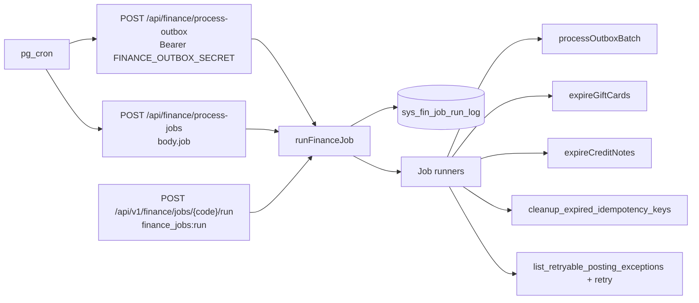

# Finance Jobs Hub

**Status:** IMPLEMENTED · **Migrations applied (owner, 2026-09-17):** `0410`, `0429`, `0505` on local + remote · types regenerated  
**Screen:** `/dashboard/internal_fin/outbox` (Internal Finance And Operations → Outbox Monitor)  
**Packages:** [B07](../Remediation_Work_Packages/B07_Financial_Outbox_Processor.md) (processor + event ops) · [B19](../Remediation_Work_Packages/B19_Expiry_And_Idempotency_Jobs.md) (expiry / cleanup / ERP retry)

This is the current-state runbook for the Scheduled Jobs card on the outbox ops screen. Event emit/retry semantics stay in [OUTBOX_PATTERN_GUIDE.md](OUTBOX_PATTERN_GUIDE.md) (processor path is B07, not the retired 0296 edge worker).

---

## Operator guide

### Who can see what

| Permission | Effect |
|---|---|
| `finance_outbox:view` | Outbox event KPIs, filters, detail, related-record links |
| `finance_outbox:retry` | Single-event Retry and bulk retry of matching FAILED/DEAD_LETTERED events |
| `finance_jobs:view` | Scheduled Jobs card, cron/health, History |
| `finance_jobs:run` | Run Now (confirm required). Hidden, not merely disabled, without this code |

Roles granted both job codes (same as B19): `super_admin`, `tenant_admin`, `admin`, `finance_manager`.

### What the five jobs do

| Job | Schedule (UTC) | Cron name | What a successful run means | Related link |
|---|---|---|---|---|
| Outbox Processor | every minute | `fin-outbox-processor` | Claims up to 50 due events and runs registered handlers | Event table (`#outbox-events`) |
| Gift-Card Expiry | 02:00 daily | `fin-gift-card-expiry` | ACTIVE cards past `expiry_date` → EXPIRED + EXPIRE ledger + non-blocking GL | Marketing → Gift cards |
| Credit-Note Expiry | 02:05 daily | `fin-credit-note-expiry` | ACTIVE notes with `expires_at` before today → EXPIRED + EXPIRY ledger + remaining 0 | Customers → Stored value |
| Idempotency-Key Cleanup | 03:00 daily | `fin-idempotency-cleanup` | Deletes expired `org_idempotency_keys` (D010) | — |
| ERP Posting Retry | hourly at :15 | `fin-erp-posting-retry` | Retries OPEN `SYSTEM_ERROR` exceptions in a 24h window; other types stay for the Exception Workbench | ERP-Lite → Exceptions |

Wallet expiry and loyalty-points expiry are **not** jobs. Wallet has no policy surface. Loyalty has `points_expiry_days` but no per-lot ledger — an approximate sweep could zero redeemed points. Same deferral as B19.

### Using the hub

1. Open Outbox Monitor. Header **Scheduled jobs** jumps to the card (`#finance-jobs`).
2. Cron badge **Active** means pg_cron has that jobname. **Unknown** means `fin_list_job_schedules()` is missing (0505 not applied). **Inactive** means the cron row is off or gone.
3. **History** shows recent runs. For the processor, idle empty SUCCESS ticks are omitted except the latest heartbeat (the every-minute log is pruned after 36 hours).
4. **Run Now** asks for confirm. If a run is already RUNNING (started within 15 minutes), the API returns **409** `JOB_ALREADY_RUNNING` and no second sweep starts. Scheduled ticks that overlap are skipped (HTTP 200) so pg_cron does not storm.
5. A yellow health banner lists missing `FINANCE_OUTBOX_SECRET`, inactive crons, last-run FAILED, or a processor that has not ticked in more than 5 minutes.

`0 processed, 0 failed` is a valid SUCCESS (nothing eligible). FAILED means the wrapper caught an exception; fix the cause and Run Now again (jobs are idempotent).

### Credit-note expiry (ledger)

The retired 0296 cron `expire-credit-notes` only did `UPDATE ... SET status='EXPIRED'` with **zero** `org_credit_note_txn_dtl` rows. 0505 unschedules it. The app job:

- Locks the note, writes `txn_type='EXPIRY'` when remaining > 0, sets status EXPIRED and remaining 0
- Idempotent on `cn-expiry-{id}`
- Does **not** post ERP-Lite GL (no credit-note-expired dispatcher exists; gift-card expiry still owns D008/D012 GL)

Notes already flipped by the old cron are **not** backfilled (no honest lineage).

---

## Developer guide

### Job codes

`FINANCE_JOB_CODES` in `web-admin/lib/services/finance-jobs.service.ts` (must match `sys_fin_job_run_log.chk_fjrl_job_code`):

`outbox_processor` · `gift_card_expiry` · `credit_note_expiry` · `idempotency_cleanup` · `erp_posting_retry`

### APIs

| Method | Path | Auth | Purpose |
|---|---|---|---|
| GET | `/api/v1/finance/jobs` | `finance_jobs:view` | Catalog + last run + cron health + next run + related href |
| GET | `/api/v1/finance/jobs/[jobCode]/runs` | `finance_jobs:view` | History (max 50) |
| POST | `/api/v1/finance/jobs/[jobCode]/run` | CSRF + `finance_jobs:run` | Manual run; 409 if overlapping |
| POST | `/api/finance/process-outbox` | Bearer `FINANCE_OUTBOX_SECRET` | Cron: outbox processor |
| POST | `/api/finance/process-jobs` | Bearer `FINANCE_OUTBOX_SECRET` | Cron: `{ "job": "<code>" }` via `fin_trigger_job()` |

Access contract: `web-admin/src/features/billing/access/billing-access.ts` (`viewFinanceJobs`, `viewJobHistory`, `runFinanceJob`).

### Overlap and logging

- Partial unique index `uq_fjrl_one_running` on `(job_code) WHERE status = 'RUNNING'`
- Stale RUNNING rows older than 15 minutes are marked FAILED `STALE_RUNNING_RELEASED` before a new run
- Processor SUCCESS ticks with 0/0 counts older than 36 hours are deleted, keeping the latest row

### Env

`FINANCE_OUTBOX_SECRET` must equal `sys_fin_runtime_cf.outbox_secret_key`. If empty, cron POSTs 401 and the processor never drains (Preview §11.2 symptom). No new secret for 0505.

### UI / i18n

- `src/features/billing/ui/finance-jobs-section.tsx` — hub
- `src/features/billing/ui/outbox-monitor-page.tsx` — `#outbox-events`, jump to `#finance-jobs`
- `messages/en|ar/billing.json` → `billing.financeJobs.*`

Cmx only: `CmxDataTable`, `CmxConfirmDialog`, `CmxDialog`, `CmxStatusBadge`, `CmxSummaryMessage`, `useMessage`.

### Tests

- `__tests__/services/finance-jobs.service.test.ts` — five jobs, overlap MANUAL vs SCHEDULE, history, `nextCronOccurrence`
- `__tests__/services/stored-value.service.test.ts` — `expireCreditNote` / `expireCreditNotes`

Manual QA: [QA_TEST_GUIDE.md](../Remediation_Work_Packages/QA_TEST_GUIDE.md) §11.16–11.22 and §20.12–20.18.

---

## Deploy

1. Migrations `0410`, `0429`, `0505` applied (done 2026-09-17 local + remote).
2. Types regenerated (done).
3. Set `FINANCE_OUTBOX_SECRET` in every runtime that serves `/api/finance/process-*`.
4. Confirm `cron.job`: `fin-outbox-processor`, `fin-gift-card-expiry`, `fin-credit-note-expiry`, `fin-idempotency-cleanup`, `fin-erp-posting-retry` active; `expire-gift-cards` and `expire-credit-notes` absent.
5. Preview: Outbox hub five rows, cron Active, processor last-run advances about every minute.

Rollback for 0505 only: see the migration POST-MIGRATION NOTES (unschedule `fin-credit-note-expiry`, optionally restore `expire-credit-notes`, drop `fin_list_job_schedules` / `uq_fjrl_one_running`, restore the three-code CHECK). Do not drop `fn_expire_credit_notes()`.

---

## Feature flags / settings / plan limits

None. Jobs are not flag-gated. Tenant isolation: expiry loops `org_tenants_mst` and runs per-tenant with `withTenantContext`. Run log is system-level (cross-tenant sweep, same justification as B7 `claim_outbox_batch`).
