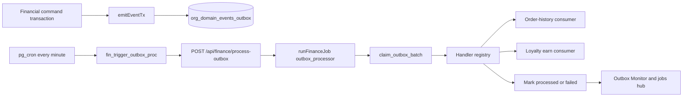
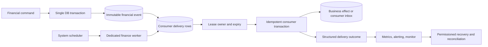

# Financial Outbox Production Architecture Review

**Status:** Read-only architecture review and remediation proposal  
**Date:** 2026-09-25  
**Scope:** `org_domain_events_outbox`, financial processor, scheduler, consumers, operational monitor, and recovery controls  
**Implementation status:** No implementation or migration is authorized by this document.

## Executive decision

Do **not** replace the financial outbox or financial domain from zero.

The existing transactional-outbox foundation is correct: a business transaction writes an event in the same database transaction, and `claim_outbox_batch` uses `FOR UPDATE SKIP LOCKED` to avoid double claims. The production path needs a controlled evolution that introduces secure invocation, explicit event contracts, delivery leases, consumer-level outcomes, durable recovery audit, and reconciliation-led rollout.

The monitor screenshot shows an oldest pending event of **179,420 minutes** (about 124 days and 14 hours) while another event was processed at the current time. That means a worker heartbeat exists; it does not prove that every old event remains eligible or drainable.

## Review boundary and evidence

Repository evidence reviewed:

- `supabase/migrations/0292_outbox_idempotency.sql`
- `supabase/migrations/0296_pg_cron_jobs.sql`
- `supabase/migrations/0410_b07_financial_outbox_processor.sql`
- `supabase/migrations/0429_b19_expiry_and_idempotency_jobs.sql`
- `supabase/migrations/0505_fin_jobs_outbox_and_cn_expiry.sql`
- `supabase/migrations/0511_b19_loyalty_points_fifo_expiry.sql`
- `web-admin/lib/services/outbox.service.ts`
- `web-admin/lib/services/outbox-processor.service.ts`
- `web-admin/lib/services/outbox-monitor.service.ts`
- `web-admin/lib/services/order-history-consumer.service.ts`
- `web-admin/lib/services/outbox-handlers/loyalty-earn.handler.ts`
- `web-admin/lib/services/finance-jobs.service.ts`
- `web-admin/app/api/finance/process-outbox/route.ts`
- `web-admin/app/api/v1/finance/outbox/**`
- `web-admin/app/api/v1/finance/jobs/**`

Remote production reads were attempted but could not be completed because the configured Supabase MCP token was unauthorized. Therefore, all production row-level statements below are explicitly marked as repository inference unless verified by a future read-only preflight.

## Current architecture

### Current strengths

- Events are emitted inside existing financial transactions.
- The claim function uses a database lock, not an application-level read-then-write sequence.
- Retry backoff exists: 1, 5, 15, 60, and 240 minutes, then dead-lettering.
- Order-history and loyalty earn handlers have idempotency mechanisms for their current effects.
- The monitor is tenant-scoped for normal operations and exposes event details and retries.
- The finance-jobs run log prevents overlapping scheduled jobs.

## Findings

### F-01 — SECURITY DEFINER worker functions need explicit execution restriction

**Severity:** Critical  
**Evidence:** `claim_outbox_batch` and `fin_trigger_outbox_proc` are declared `SECURITY DEFINER`. The related migrations do not revoke `EXECUTE` from `PUBLIC` for these functions.

PostgreSQL grants function execution to `PUBLIC` by default. Since `claim_outbox_batch` is cross-tenant and updates event status, it must never be exposed to normal RPC roles. `fin_trigger_outbox_proc` can also trigger privileged scheduler work.

**Required direction:** move privileged worker functions to a non-exposed schema, or explicitly revoke from `PUBLIC`, `anon`, and `authenticated`; grant only the controlled database/worker role. Re-verify every caller after the change.

### F-02 — Payment-history event contract is incomplete

**Severity:** Critical  
**Evidence:** the processor registry routes only `ORDER_COMPLETED`, `VOUCHER_POSTED_AND_WIRED`, `AR_INVOICE_ISSUED`, and `PAYMENT_VERIFIED` to order history. The history consumer itself supports six additional emitted payment transitions: `PAYMENT_CANCELLED`, `PAYMENT_FAILED`, `PAYMENT_VOIDED`, `PAYMENT_REVERSED`, `PAYMENT_CAPTURED`, and `PAYMENT_SETTLED`.

The processor marks an event with no registered handler as processed. Those six events can therefore become `PROCESSED` without the intended order-history materialization.

**Required direction:** establish one typed event-consumer contract as the source of truth. Every emitted event must be one of:

1. required delivery to one or more named consumers;
2. explicitly documented, audited no-op; or
3. rejected/dead-lettered as an unsupported event type.

Before correcting routing, run a tenant-scoped reconciliation for historical auto-processed payment events and create only safe compensating history effects.

### F-03 — An old PENDING event may be permanently ineligible

**Severity:** High  
**Evidence:** the claim query accepts only `PENDING` or `FAILED` rows where `next_retry_at <= NOW()`. The original schema permits `next_retry_at` to be `NULL`.

The current emitter sets a due time, but legacy rows or direct writes can have no due time. A `PENDING` row with `next_retry_at IS NULL` is never claimed. This is the strongest repository-based explanation for the screenshot's very old pending event while the latest processor tick remains current.

**Required direction:** replace nullable retry eligibility with a mandatory `available_at` for all non-terminal delivery states. Do not bulk-change historic rows blindly; first reconcile each affected business effect.

### F-04 — PROCESSING has no lease or safe crash recovery

**Severity:** High  
**Evidence:** current state has no `claimed_at`, `lease_owner`, `lease_expires_at`, or attempt execution record. The claim query cannot reclaim `PROCESSING` rows.

A worker crash after a successful claim can strand a row indefinitely. The monitor calls a processing row stuck based on its creation time, which is not the time it entered processing.

**Required direction:** use a lease state. A worker claims a delivery with an owner token and expiry; completion/failure updates require that same token; another worker can reclaim only after expiry.

### F-05 — Parent-event completion is insufficient for multi-consumer delivery

**Severity:** High  
**Evidence:** one parent event can fan out to multiple handlers, but the current parent row has one status and one retry count.

If handler A succeeds and handler B fails, retrying the parent invokes A again. Existing handlers happen to be idempotent, but this contract is unsafe for future tax, GL, notification, or external integrations.

**Required direction:** retain the immutable parent event and add one delivery record per required consumer. Each delivery has its own lease, attempts, result, and terminal status. A parent completes only when all required deliveries complete.

### F-06 — Global manual runs should not be tenant-admin actions

**Severity:** High  
**Evidence:** `POST /api/v1/finance/jobs/[jobCode]/run` invokes the global `runFinanceJob()` path. The outbox worker claims across tenants, while `finance_jobs:run` is granted to tenant-facing operational roles.

**Required direction:** only the system scheduler or an HQ/system operator may execute a global drain. A tenant operator may request a bounded tenant-scoped recovery, subject to rate limiting, explicit event selection, and audit.

### F-07 — Manual recovery is not a complete financial audit trail

**Severity:** High  
**Evidence:** a manual retry resets attempts, error message, and due time but does not persist actor, reason, approval, previous state, or recovery correlation ID in the outbox domain.

**Required direction:** add immutable recovery-action records. For material event classes, require reason, preflight result, optional dual approval, and reconciliation outcome before requeueing.

### F-08 — Monitoring uses the wrong operational time basis

**Severity:** Medium  
**Evidence:** stuck detection uses `created_at` for pending, failed, and processing rows. Old failed rows may still be waiting within backoff; newly claimed old rows can appear stuck immediately.

**Required direction:** measure due age from `available_at`, active lease age from `leased_at`, and health from the last successful scheduler run plus delivery throughput/failures.

### F-09 — Configurable max attempts is not authoritative

**Severity:** Medium  
**Evidence:** `max_attempts` is persisted, but retry escalation is governed by a fixed in-code delay array rather than the stored event value.

**Required direction:** define retry policy by named policy code and snapshot the selected policy/version onto a delivery at creation. The worker must use that snapshot, not a mutable implicit default.

## Target production architecture

### Event envelope

The event remains immutable and includes:

- `event_id`
- `tenant_org_id`
- `event_type`
- `event_version`
- `aggregate_type` and `aggregate_id`
- business idempotency key
- causation ID and correlation ID
- occurred-at timestamp
- payload classification and schema version
- immutable payload snapshot

The business idempotency key is not the outbox row ID. It is derived from the business operation so an accidental duplicate emission cannot create a second economic effect.

### Delivery ledger

Create a delivery record for every required consumer. It contains:

- parent event ID and consumer code
- delivery state: `READY`, `LEASED`, `RETRY_SCHEDULED`, `SUCCEEDED`, `DEAD_LETTERED`, or `CANCELLED`
- `available_at`, `leased_at`, `lease_expires_at`, and `lease_owner`
- attempt number and retry-policy snapshot
- error code, safe operator message, and protected diagnostic detail
- completed timestamp and effect/inbox reference

The delivery unique key is `(event_id, consumer_code)`. Each consumer writes its own idempotency/inbox key in the same transaction as its effect.

### Worker boundary

Use a separately deployed finance-worker process or service identity. It may continue to use PostgreSQL polling and `FOR UPDATE SKIP LOCKED`; Kafka, RabbitMQ, or a second queue is not required at the current stage.

The scheduler only wakes the worker or validates its heartbeat. It should not be the worker itself, and it must capture HTTP failure outcomes. The worker must be deployable independently of web requests, use bounded concurrency, renew leases for long work, and expose structured metrics.

### Consumer contract

Maintain one declarative contract containing:

- each event type and schema version
- expected producer(s)
- required consumers and delivery criticality
- idempotency/effect key
- retry policy and terminal handling
- payload classification and retention rule
- reconciliation query or invariant

Compile-time tests must fail if a producer emits an event without a contract or a required consumer is absent from the worker registry.

## Recovery policy

### Immediate incident procedure

1. Take a read-only tenant-scoped inventory of old pending, expired processing, failed, dead-lettered, and auto-processed events.
2. Classify each row: effect already exists, safely replayable, requires business repair, intentionally no-op, or unknown.
3. Verify financial source-of-truth facts first: voucher, ledger, invoice, payment, loyalty transaction, and order-history effect as applicable.
4. Requeue only rows with a documented expected effect and verified idempotency.
5. Never mark a row processed merely to remove it from the dashboard.
6. For unknown or unsafe rows, dead-letter with a diagnosis and create an operator work item.

### Alerting SLOs

- processor heartbeat older than three minutes
- scheduled request failure or unauthorized response
- due delivery older than the event-class SLA
- expired lease count above zero
- dead-letter growth by consumer/error code
- handler failure rate and latency
- unhandled event contract violation
- reconciliation mismatch between event outcome and financial effect

## Phased implementation plan

### Phase 0 — Production preflight and freeze

- Restore read-only remote database access.
- Produce tenant-scoped evidence for the screenshot tenant and platform aggregate totals.
- Temporarily disable bulk retry for unknown/dead-lettered financial event classes.
- Record a recovery disposition for every affected historical row.

**Exit criterion:** no historic event is modified without a verified financial effect classification.

### Phase 1 — Immediate security and authority hardening

- Restrict execution of `SECURITY DEFINER` worker functions.
- Separate system-worker authority from tenant operator authority.
- Remove global worker execution from tenant-facing `Run Now`.
- Add scheduler HTTP-result observability and secret-rotation runbook.

**Exit criterion:** no public or tenant-facing path can claim or trigger global outbox work.

### Phase 2 — Event-contract correctness

- Correct handler registration for all intended payment-history events.
- Mark existing intentional no-op events explicitly in the contract.
- Fail unknown event types safely instead of silently auto-processing them.
- Reconcile and repair historical missing history effects through a controlled, idempotent procedure.

**Exit criterion:** every emitted event type has a tested required-delivery or explicit no-op classification.

### Phase 3 — Leases and delivery-level state

- Add delivery ledger, lease ownership, retry-policy snapshot, and recovery audit tables.
- Dual-write new events to parent plus delivery records.
- Introduce worker compare-and-set completion and expired-lease reclaim.
- Retain compatibility reads until all active work uses delivery records.

**Exit criterion:** crash, duplicate-delivery, concurrent-worker, poison-event, and recovery tests pass.

### Phase 4 — Dedicated worker cutover

- Deploy the worker independently from web request serving.
- Shadow-process or compare outcomes without applying duplicate effects.
- Canary by low-risk tenant cohort, then expand with SLO gates.
- Retire the legacy direct processor route only after reconciliation is green.

**Exit criterion:** stable throughput, no expired leases, and reconciled financial effects through at least one normal operating cycle.

### Phase 5 — Retention and operating maturity

- Archive processed payloads under approved financial/privacy retention rules.
- Keep immutable audit metadata and delivery outcomes for the required period.
- Publish operator runbook, dashboard definitions, alert ownership, and incident drill scenarios.

**Exit criterion:** support, finance, and engineering teams can diagnose and recover an event without direct database modification.

## Required validation before rollout

- Database tests for locking, lease reclaim, state transitions, and function grants.
- Consumer tests for duplicate delivery and duplicate emission.
- Integration tests for every producer/consumer contract pair.
- Tenant-isolation tests for monitor, recovery, and tenant-scoped processing.
- Failure injection: worker killed after claim, after effect/before acknowledgement, during lease renewal, and during concurrent manual requests.
- Reconciliation tests against vouchers, payment legs, AR, loyalty, and order history.
- Load test for expected per-minute event volume and backlog drain time.
- Security review of all privileged functions, scheduler routes, secrets, and operational permissions.

## Decisions still required

1. Which financial consumers are critical enough to block parent completion?
2. Which recovery operations require finance-manager approval versus HQ/system approval?
3. What are the event-class SLOs for history, loyalty, tax, GL, and external integrations?
4. What retention period and payload redaction rules apply by jurisdiction and event class?
5. Which deployment runtime will own the dedicated worker: the future `cmx-api` service or a separately deployed worker service?

## Related documents

- [Outbox Pattern Guide](OUTBOX_PATTERN_GUIDE.md)
- [Finance Jobs Hub](FINANCE_JOBS_HUB.md)
- [B07 Financial Outbox Processor](../Remediation_Work_Packages/B07_Financial_Outbox_Processor.md)
- [Financial Idempotency and Lineage](../Remediation_Work_Packages/00_Phase_0_Financial_Semantics/D010_Financial_Idempotency_And_Lineage.md)
