# Order Financial Platform — Data Model

## Migration Dependency Graph

```
0278 (rename discounts)
  └─→ 0279 (sys lookup tables)
        └─→ 0280 (order_charges_dtl)
              └─→ 0281 (order_taxes_dtl)
                    └─→ 0282 (orders_mst financial columns)
                          └─→ 0283 (harden credit_apps + refunds)
                                ├─→ 0284 (customer_wallets_mst)
                                ├─→ 0285 (customer_advances_mst)
                                ├─→ 0286 (credit_notes_mst)
                                ├─→ 0287 (loyalty_accounts_mst)
                                ├─→ 0288 (promotions extend)
                                ├─→ 0289 (tax_profiles_cf)
                                ├─→ 0290 (currency_rounding)
                                ├─→ 0291 (payment_config seed)
                                ├─→ 0292 (domain_events_outbox)
                                └─→ 0293 (reconciliation)
0294 (permissions seed) — no schema deps
0295 (navigation seed)  — no schema deps
0296 (pg_cron jobs)     — no schema deps
```

## ER Diagram (Mermaid)

```mermaid
erDiagram
  org_orders_mst ||--o{ org_order_charges_dtl : "has"
  org_orders_mst ||--o{ org_order_taxes_dtl : "has"
  org_orders_mst ||--o{ org_order_discounts_dtl : "has"
  org_orders_mst ||--o{ org_order_payments_dtl : "has"
  org_orders_mst ||--o{ org_order_credit_apps_dtl : "has"
  org_orders_mst ||--o{ org_order_refunds_dtl : "has"

  org_customers_mst ||--o{ org_customer_wallets_mst : "has"
  org_customer_wallets_mst ||--o{ org_wallet_txn_dtl : "has"

  org_customers_mst ||--o{ org_customer_advances_mst : "has"
  org_customer_advances_mst ||--o{ org_advance_txn_dtl : "has"

  org_customers_mst ||--o{ org_credit_notes_mst : "has"

  org_customers_mst ||--o{ org_loyalty_accounts_mst : "has"
  org_loyalty_accounts_mst ||--o{ org_loyalty_txn_dtl : "has"

  org_promotions_mst ||--o{ org_promotion_usage_dtl : "tracks"

  org_cash_drawers_cf ||--o{ org_cash_drawer_sessions_mst : "has"
  org_cash_drawer_sessions_mst ||--o{ org_cash_drawer_movements_dtl : "has"

  org_reconciliation_runs_mst ||--o{ org_reconciliation_issues_dtl : "produces"
```



## Table Descriptions

### Order Fact Tables

**`org_order_charges_dtl`**
One row per surcharge on an order (express, delivery, packaging). Written atomically with settlement.

| Column | Type | Notes |
|---|---|---|
| tenant_org_id | UUID | RLS filter |
| order_id | UUID | FK to org_orders_mst |
| charge_type | TEXT | CHECK: EXPRESS, DELIVERY, PACKAGING, OTHER |
| label / label2 | TEXT | EN / AR |
| amount | DECIMAL(19,4) | Always positive |
| currency_code | TEXT | From order snapshot |
| charge_source_id | UUID | Optional: source config row |

**`org_order_taxes_dtl`**
One row per tax line on an order.

| Column | Type | Notes |
|---|---|---|
| tax_type | TEXT | VAT, CUSTOM |
| rate | DECIMAL(6,4) | 0.05 = 5% |
| taxable_amount | DECIMAL(19,4) | Base amount tax was applied to |
| tax_amount | DECIMAL(19,4) | Computed tax |

**`org_order_discounts_dtl`**
One row per discount applied. `applied_seq` preserves stacking order.

| Column | Type | Notes |
|---|---|---|
| applied_seq | INT | 1-based, order matters for stacking |
| source_type | TEXT | MANUAL, AUTO_RULE, PROMO_CODE, GIFT_CARD |
| discount_type | TEXT | PERCENTAGE, FIXED_AMOUNT |
| discount_rate | DECIMAL(6,4) | NULL for fixed amounts |
| discount_amount | DECIMAL(19,4) | Always the actual deducted amount |
| promotion_id | UUID | FK when source_type=PROMO_CODE |
| stacking_group | TEXT | Groups stacking-limited discounts |

**`org_order_payments_dtl`**
One row per REAL_PAYMENT leg.

| Column | Type | Notes |
|---|---|---|
| payment_method_code | TEXT | Snapshot of method at payment time |
| payment_nature_snapshot | TEXT | Always 'REAL_PAYMENT' |
| amount | DECIMAL(19,4) | Amount actually received |
| tendered_amount | DECIMAL(19,4) | Cash handed over |
| change_returned_amount | DECIMAL(19,4) | Overpayment returned |
| cash_drawer_session_id | UUID | FK when requiresCashDrawer=true |
| payment_status | TEXT | COMPLETED, FAILED, VOIDED |

**`org_order_credit_apps_dtl`**
One row per CREDIT_APPLICATION leg.

| Column | Type | Notes |
|---|---|---|
| credit_type | TEXT | WALLET, ADVANCE, CREDIT_NOTE, GIFT_CARD, LOYALTY_POINTS |
| credit_source_id | UUID | Reference to the credit document (wallet id, credit note id, etc.) |
| applied_amount | DECIMAL(19,4) | Amount deducted from credit |

**`org_order_refunds_dtl`**
One row per refund request.

| Column | Type | Notes |
|---|---|---|
| refund_no | TEXT | Sequential: REF-XXXXXXXX-00001 |
| refund_amount | DECIMAL(19,4) | Must not exceed order total_paid |
| refund_method_code | TEXT | CASH, WALLET, CREDIT_NOTE, ORIGINAL_METHOD |
| refund_status | TEXT | PENDING_APPROVAL → APPROVED → PROCESSED |
| requested_by | UUID | Staff who initiated |
| approved_by | UUID | Manager who approved |
| processed_at | TIMESTAMPTZ | When reversal was executed |

### Stored Value Tables

**`org_customer_wallets_mst`**
One wallet per customer per tenant (soft-created on first top-up).

| Column | Type | Notes |
|---|---|---|
| balance | DECIMAL(19,4) | Current spendable balance |
| currency_code | TEXT | Wallet currency |

**`org_wallet_txn_dtl`**
Immutable ledger. txn_type: TOP_UP, REDEMPTION, REFUND_CREDIT, ADJUSTMENT, EXPIRY.

**`org_customer_advances_mst`** / **`org_advance_txn_dtl`**
Same pattern as wallet. Advance = pre-paid credit separate from wallet.

**`org_credit_notes_mst`**
Document-based credit (not a running balance). Each note has its own remaining_balance.

| Column | Type | Notes |
|---|---|---|
| credit_note_no | TEXT | Sequential: CN-XXXXXXXX-00001 |
| original_amount | DECIMAL(19,4) | Amount when issued |
| remaining_balance | DECIMAL(19,4) | Decrements on each redemption |
| status | TEXT | ACTIVE, EXHAUSTED, EXPIRED, CANCELLED |
| expires_at | TIMESTAMPTZ | NULL = no expiry |

### Loyalty Tables

**`org_loyalty_accounts_mst`**
One per customer. `points_balance` is the spendable balance. `lifetime_earned` never decrements.

**`org_loyalty_txn_dtl`**
Immutable earn/redeem ledger. txn_type: EARN, REDEEM, ADJUSTMENT, EXPIRY.

### Promotions Tables (extended in 0288)

**`org_promotions_mst`**
| Key columns | Notes |
|---|---|
| promo_code | Unique within tenant when not NULL |
| discount_type | PERCENTAGE, FIXED_AMOUNT, BUY_X_GET_Y |
| discount_value | Rate or fixed amount |
| can_stack_with_promo | Boolean — controls stacking with auto-rules |
| max_usage / max_usage_per_customer | NULL = unlimited |

**`org_promotion_usage_dtl`**
One row per application. Used to enforce max_usage limits.

### Tax Tables

**`org_tax_profiles_cf`**
| Key columns | Notes |
|---|---|
| tax_type | VAT, CUSTOM |
| rate | Decimal (0.05 = 5%) |
| is_default | True for the tenant's default profile |
| applies_to_categories | JSONB — NULL means all categories |
| compound | Boolean — compound on top of previous tax |

**`org_tax_exemptions_cf`**
Maps customers or service categories to a zero-rate tax profile.

### Infrastructure Tables

**`org_domain_events_outbox`**
Append-only. Workers claim rows atomically via CTE.

| Column | Notes |
|---|---|
| event_type | From OUTBOX_EVENT_TYPES constant |
| aggregate_type | e.g. 'order', 'refund' |
| aggregate_id | ID of the entity that changed |
| payload | JSONB — event data |
| status | PENDING → PROCESSING → COMPLETED/FAILED |
| attempts | Incremented on each retry |
| max_attempts | Default 6 |
| next_retry_at | Exponential backoff schedule |
| idempotency_key | Optional — prevents duplicate events |

**`org_cash_drawer_sessions_mst`** / **`org_cash_drawer_movements_dtl`**
Session lifecycle table + movement ledger. Only one OPEN session per drawer allowed.

**`org_reconciliation_runs_mst`** / **`org_reconciliation_issues_dtl`**
Audit trail of reconciliation check results. Issues have severity: BLOCKER, WARNING, INFO.

## CHECK Constraint Reference

| Table | Column | Constraint |
|---|---|---|
| org_order_charges_dtl | charge_type | IN ('EXPRESS', 'DELIVERY', 'PACKAGING', 'OTHER') |
| org_order_payments_dtl | payment_status | IN ('COMPLETED', 'FAILED', 'VOIDED') |
| org_order_refunds_dtl | refund_status | IN ('PENDING_APPROVAL', 'APPROVED', 'PROCESSED', 'REJECTED') |
| org_credit_notes_mst | status | IN ('ACTIVE', 'EXHAUSTED', 'EXPIRED', 'CANCELLED') |
| org_domain_events_outbox | status | IN ('PENDING', 'PROCESSING', 'COMPLETED', 'FAILED') |
| org_cash_drawer_sessions_mst | status | IN ('OPEN', 'CLOSED', 'FORCE_CLOSED') |
| org_reconciliation_runs_mst | overall_status | IN ('PASSED', 'FAILED', 'PARTIAL') |
| org_reconciliation_issues_dtl | severity | IN ('BLOCKER', 'WARNING', 'INFO') |

## Money Field Convention

All monetary columns use `DECIMAL(19, 4)`. No `FLOAT` or `NUMERIC` without precision. Currency codes stored as TEXT (no foreign key to avoid lock contention).
