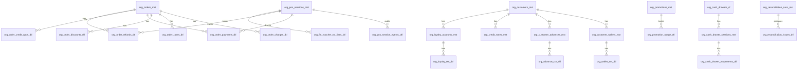

# Order Financial Platform — Data Model

## Migration Dependency Graph

```
0278 (rename discounts)
  └─→ 0279 (sys lookup tables)
        └─→ 0280 (order_charges_dtl)
              └─→ 0281 (order_taxes_dtl)
                    └─→ 0282 (orders_mst financial columns)
                          └─→ 0283 (harden credit_apps + refunds)
                                ├─→ 0284 (customer_wallets_mst)
                                ├─→ 0285 (customer_advances_mst)
                                ├─→ 0286 (credit_notes_mst)
                                ├─→ 0287 (loyalty_accounts_mst)
                                ├─→ 0288 (promotions extend)
                                ├─→ 0289 (tax_profiles_cf)
                                ├─→ 0290 (currency_rounding)
                                ├─→ 0291 (payment_config seed)
                                ├─→ 0292 (domain_events_outbox)
                                └─→ 0293 (reconciliation)
0294 (permissions seed) — no schema deps
0295 (navigation seed)  — no schema deps
0296 (pg_cron jobs)     — no schema deps
0396 (POS session catalogs + permissions + component metadata) — no schema deps
  └─→ 0397 (POS session master/events)
        └─→ 0398 (nullable POS lineage links on active finance tables)
0399 (POS sessions navigation seed) — no schema deps
```

## ER Diagram (Mermaid)


```mermaid
erDiagram
  org_orders_mst ||--o{ org_order_charges_dtl : "has"
  org_orders_mst ||--o{ org_order_taxes_dtl : "has"
  org_orders_mst ||--o{ org_order_discounts_dtl : "has"
  org_orders_mst ||--o{ org_order_payments_dtl : "has"
  org_orders_mst ||--o{ org_order_credit_apps_dtl : "has"
  org_orders_mst ||--o{ org_order_refunds_dtl : "has"

  org_customers_mst ||--o{ org_customer_wallets_mst : "has"
  org_customer_wallets_mst ||--o{ org_wallet_txn_dtl : "has"

  org_customers_mst ||--o{ org_customer_advances_mst : "has"
  org_customer_advances_mst ||--o{ org_advance_txn_dtl : "has"

  org_customers_mst ||--o{ org_credit_notes_mst : "has"

  org_customers_mst ||--o{ org_loyalty_accounts_mst : "has"
  org_loyalty_accounts_mst ||--o{ org_loyalty_txn_dtl : "has"

  org_promotions_mst ||--o{ org_promotion_usage_dtl : "tracks"

  org_cash_drawers_cf ||--o{ org_cash_drawer_sessions_mst : "has"
  org_cash_drawer_sessions_mst ||--o{ org_cash_drawer_movements_dtl : "has"
  org_pos_sessions_mst ||--o{ org_pos_session_events_dtl : "audits"
  org_pos_sessions_mst ||--o{ org_order_payments_dtl : "traces"
  org_pos_sessions_mst ||--o{ org_order_refunds_dtl : "traces"
  org_pos_sessions_mst ||--o{ org_fin_voucher_trx_lines_dtl : "traces"

  org_reconciliation_runs_mst ||--o{ org_reconciliation_issues_dtl : "produces"
```

## Table Descriptions

### Order Fact Tables

**`org_order_charges_dtl`**
One row per surcharge on an order (express, delivery, packaging). Written atomically with settlement.

| Column | Type | Notes |
|---|---|---|
| tenant_org_id | UUID | RLS filter |
| order_id | UUID | FK to org_orders_mst |
| charge_type | TEXT | CHECK: EXPRESS, DELIVERY, PACKAGING, OTHER |
| label / label2 | TEXT | EN / AR |
| amount | DECIMAL(19,4) | Always positive |
| currency_code | TEXT | From order snapshot |
| charge_source_id | UUID | Optional: source config row |

**`org_order_taxes_dtl`**
One row per tax line on an order.

| Column | Type | Notes |
|---|---|---|
| tax_type | TEXT | VAT, CUSTOM |
| rate | DECIMAL(6,4) | 0.05 = 5% |
| taxable_amount | DECIMAL(19,4) | Base amount tax was applied to |
| tax_amount | DECIMAL(19,4) | Computed tax |

**`org_order_discounts_dtl`**
One row per discount applied. `applied_seq` preserves stacking order.

| Column | Type | Notes |
|---|---|---|
| applied_seq | INT | 1-based, order matters for stacking |
| source_type | TEXT | MANUAL, AUTO_RULE, PROMO_CODE, GIFT_CARD |
| discount_type | TEXT | PERCENTAGE, FIXED_AMOUNT |
| discount_rate | DECIMAL(6,4) | NULL for fixed amounts |
| discount_amount | DECIMAL(19,4) | Always the actual deducted amount |
| promotion_id | UUID | FK when source_type=PROMO_CODE |
| stacking_group | TEXT | Groups stacking-limited discounts |

**`org_order_payments_dtl`**
One row per REAL_PAYMENT leg.

| Column | Type | Notes |
|---|---|---|
| payment_method_code | TEXT | Snapshot of method at payment time |
| payment_nature_snapshot | TEXT | Always 'REAL_PAYMENT' |
| amount | DECIMAL(19,4) | Amount actually received |
| tendered_amount | DECIMAL(19,4) | Cash handed over |
| change_returned_amount | DECIMAL(19,4) | Overpayment returned |
| cash_drawer_session_id | UUID | FK when requiresCashDrawer=true |
| pos_session_id | UUID | Optional operational POS lineage; not cash reconciliation truth |
| payment_status | TEXT | COMPLETED, FAILED, VOIDED |

**`org_order_credit_apps_dtl`**
One row per CREDIT_APPLICATION leg.

| Column | Type | Notes |
|---|---|---|
| credit_type | TEXT | WALLET, ADVANCE, CREDIT_NOTE, GIFT_CARD, LOYALTY_POINTS |
| credit_source_id | UUID | Reference to the credit document (wallet id, credit note id, etc.) |
| applied_amount | DECIMAL(19,4) | Amount deducted from credit |

**`org_order_refunds_dtl`**
One row per refund request.

| Column | Type | Notes |
|---|---|---|
| refund_no | TEXT | Sequential: REF-XXXXXXXX-00001 |
| refund_amount | DECIMAL(19,4) | Must not exceed order total_paid |
| refund_method_code | TEXT | CASH, WALLET, CREDIT_NOTE, ORIGINAL_METHOD |
| refund_status | TEXT | PENDING_APPROVAL → APPROVED → PROCESSED |
| requested_by | UUID | Staff who initiated |
| approved_by | UUID | Manager who approved |
| processed_at | TIMESTAMPTZ | When reversal was executed |
| pos_session_id | UUID | Optional operational POS lineage for POS-aware refunds |

### POS Session Tables

**`org_pos_sessions_mst`**
User-owned operational POS work period. One active row is allowed per `tenant_org_id + user_id` while status is `OPEN` or `PAUSED`. `terminal_id` is optional session context and is not unique. `cash_drawer_session_id` may link to the physical drawer session, but cash reconciliation remains owned by the drawer session.

| Column | Type | Notes |
|---|---|---|
| tenant_org_id | UUID | RLS filter |
| branch_id | UUID | Branch where the POS session was opened |
| user_id | UUID | Authenticated cashier/operator owner |
| terminal_id | UUID | Optional payment terminal context |
| cash_drawer_id | UUID | Optional drawer context |
| cash_drawer_session_id | UUID | Optional physical drawer session link |
| session_no | TEXT | Unique per tenant + branch |
| business_date | DATE | Fixed at open time |
| business_timezone | TEXT | Timezone snapshot used for business date |
| status | TEXT | OPEN, PAUSED, CLOSED, FORCE_CLOSED |

**`org_pos_session_events_dtl`**
Append-only audit trail for POS lifecycle actions.

| Column | Type | Notes |
|---|---|---|
| pos_session_id | UUID | FK to `org_pos_sessions_mst` |
| event_type | TEXT | OPEN, AUTO_OPEN, PAUSE, RESUME, CLOSE, FORCE_CLOSE, AUTO_LINK_DRAWER |
| previous_status | TEXT | Previous status snapshot |
| new_status | TEXT | New status snapshot |
| idempotency_key | TEXT | Optional retry-safety key |
| source_channel | TEXT | Optional caller/source channel |

### Stored Value Tables

**`org_customer_wallets_mst`**
One wallet per customer per tenant (soft-created on first top-up).

| Column | Type | Notes |
|---|---|---|
| balance | DECIMAL(19,4) | Current spendable balance |
| currency_code | TEXT | Wallet currency |

**`org_wallet_txn_dtl`**
Immutable ledger. txn_type: TOP_UP, REDEMPTION, REFUND_CREDIT, ADJUSTMENT, EXPIRY.

**`org_customer_advances_mst`** / **`org_advance_txn_dtl`**
Same pattern as wallet. Advance = pre-paid credit separate from wallet.

**`org_credit_notes_mst`**
Document-based credit (not a running balance). Each note has its own remaining_balance.

| Column | Type | Notes |
|---|---|---|
| credit_note_no | TEXT | Sequential: CN-XXXXXXXX-00001 |
| original_amount | DECIMAL(19,4) | Amount when issued |
| remaining_balance | DECIMAL(19,4) | Decrements on each redemption |
| status | TEXT | ACTIVE, EXHAUSTED, EXPIRED, CANCELLED |
| expires_at | TIMESTAMPTZ | NULL = no expiry |

### Loyalty Tables

**`org_loyalty_accounts_mst`**
One per customer. `points_balance` is the spendable balance. `lifetime_earned` never decrements.

**`org_loyalty_txn_dtl`**
Immutable earn/redeem ledger. txn_type: EARN, REDEEM, ADJUSTMENT, EXPIRY.

### Promotions Tables (extended in 0288)

**`org_promotions_mst`**
| Key columns | Notes |
|---|---|
| promo_code | Unique within tenant when not NULL |
| discount_type | PERCENTAGE, FIXED_AMOUNT, BUY_X_GET_Y |
| discount_value | Rate or fixed amount |
| can_stack_with_promo | Boolean — controls stacking with auto-rules |
| max_usage / max_usage_per_customer | NULL = unlimited |

**`org_promotion_usage_dtl`**
One row per application. Used to enforce max_usage limits.

### Tax Tables

**`org_tax_profiles_cf`**
| Key columns | Notes |
|---|---|
| tax_type | VAT, CUSTOM |
| rate | Decimal (0.05 = 5%) |
| is_default | True for the tenant's default profile |
| applies_to_categories | JSONB — NULL means all categories |
| compound | Boolean — compound on top of previous tax |

**`org_tax_exemptions_cf`**
Maps customers or service categories to a zero-rate tax profile.

### Infrastructure Tables

**`org_domain_events_outbox`**
Append-only. Workers claim rows atomically via CTE.

| Column | Notes |
|---|---|
| event_type | From OUTBOX_EVENT_TYPES constant |
| aggregate_type | e.g. 'order', 'refund' |
| aggregate_id | ID of the entity that changed |
| payload | JSONB — event data |
| status | PENDING → PROCESSING → COMPLETED/FAILED |
| attempts | Incremented on each retry |
| max_attempts | Default 6 |
| next_retry_at | Exponential backoff schedule |
| idempotency_key | Optional — prevents duplicate events |

**`org_cash_drawer_sessions_mst`** / **`org_cash_drawer_movements_dtl`**
Session lifecycle table + movement ledger. Only one OPEN session per drawer allowed. *Current behaviour (until CLF ships)* — see "Target data model — cash ledger (ADR-057)" below.

**`org_reconciliation_runs_mst`** / **`org_reconciliation_issues_dtl`**
Audit trail of reconciliation check results. Issues have severity: BLOCKER, WARNING, INFO.

## CHECK Constraint Reference

| Table | Column | Constraint |
|---|---|---|
| org_order_charges_dtl | charge_type | IN ('EXPRESS', 'DELIVERY', 'PACKAGING', 'OTHER') |
| org_order_payments_dtl | payment_status | IN ('COMPLETED', 'FAILED', 'VOIDED') |
| org_order_refunds_dtl | refund_status | IN ('PENDING_APPROVAL', 'APPROVED', 'PROCESSED', 'REJECTED') |
| org_credit_notes_mst | status | IN ('ACTIVE', 'EXHAUSTED', 'EXPIRED', 'CANCELLED') |
| org_domain_events_outbox | status | IN ('PENDING', 'PROCESSING', 'COMPLETED', 'FAILED') |
| org_cash_drawer_sessions_mst | status | IN ('OPEN', 'CLOSED', 'FORCE_CLOSED') — target adds `CLOSING` (ADR-057) |
| org_reconciliation_runs_mst | overall_status | IN ('PASSED', 'FAILED', 'PARTIAL') |
| org_reconciliation_issues_dtl | severity | IN ('BLOCKER', 'WARNING', 'INFO') |

## Money Field Convention

All monetary columns use `DECIMAL(19, 4)`. No `FLOAT` or `NUMERIC` without precision. Currency codes stored as TEXT (no foreign key to avoid lock contention).

## Deprecated Ledger Status (Remediation 2026-07)

`org_payments_dtl_tr` is deprecated (ADR-002) and **empty**; the canonical order-payment ledger is `org_order_payments_dtl` (+ voucher trx lines). As of Remediation Phase 1, no order-detail UI or order print reads `_tr`; remaining readers (tenant payments report, cash-up, legacy invoice/customer payment flows, `internal_fin/payments` screens) are removed in Phases 2–3, and the table itself (plus `org_payment_audit_log` and `org_invoice_payments_dtl.payment_id`) is dropped in Phase 5. See `../Order_Fin_Remediation_2026-07/PLAN.md`.

## Legacy ledger DROPPED (Remediation 2026-07 Phase 5)

Migration `0395_drop_org_payments_dtl_tr.sql` (guarded, RESTRICT-only) removed `org_payments_dtl_tr`, `org_payment_audit_log`, and `org_invoice_payments_dtl.payment_id` (AR allocations are voucher-referenced only). Canonical payment truth: `org_order_payments_dtl` + `org_fin_voucher_trx_lines_dtl` + AR/receipt/stored-value ledgers. See ADR-002 (completed) + ADR-055.

## Target data model — cash ledger (ADR-057)

**Target architecture — approved 2026-09-25 ([ADR-057](../ADR/ADR-057-Two-Domain-Cash-Ledger.md)), implementation pending in package CLF (releases R1 Ledger → R2 Sessions → R3 Retirement).** None of these objects exist yet. Full column lists: [IMPLEMENTATION_PLAN.md §4B.3](../POS_Session_Cash_Drawer_Hardening/IMPLEMENTATION_PLAN.md). Migration numbers are assigned "next free" when written; each is stop-and-wait.

### New lookups (`sys_*`, global)

| Table | Purpose / key columns |
|---|---|
| `sys_cash_drawer_type_cd` | `COUNTER`, `TEMPORARY`, `DRIVER_BAG`, `SAFE`, `PENDING_DEPOSIT`. Hard capabilities `accepts_customer_cash`, `allows_customer_cash_out`, `can_be_trx_source`, `can_be_trx_dest`, `can_receive_disposition`, `is_mobile`; overridable defaults `requires_session_default`, `opening_count_required_default`, `closing_count_required_default`. Replaces CHECK `chk_org_cash_drawers_type`. |
| `sys_cash_drawer_trx_type_cd` | `FLOAT_ISSUE`, `CASH_DROP`, `DRAWER_TO_DRAWER`, `DRIVER_HANDOVER`, `DEPOSIT_PREP`, `CLOSE_DISPOSITION` (system), `REVERSAL` (system); `allowed_src_types[]`, `allowed_dest_types[]`, `requires_notes`, `is_system` |
| `sys_cash_drawer_cnt_type_cd` | `OPENING`, `SPOT`, `CLOSING`, `RECOUNT` |
| `sys_cash_drawer_ses_disp_cd` | `LEFT_IN_DRAWER`, `MOVED_TO_SAFE`, `HANDED_TO_MANAGER`, `PREPARED_FOR_DEPOSIT`, `PARTIAL_REMOVED`, `OTHER`, `LEGACY` (not selectable); `moves_cash`, `dest_drawer_type_code`, `requires_notes`, `requires_kept_amount` |
| `sys_cash_drawer_ses_post_cd` | `IN_TRANSIT`, `DEPOSITED_TO_BANK`, `HANDED_TO_HQ`, `OTHER` |
| `sys_cash_drawer_session_status_cd` (existing) | adds `CLOSING` |

### New tenant tables (`org_*`, RLS)

| Table | Key columns | Rules |
|---|---|---|
| `org_cash_drawer_trx_mst` | `trx_no` (`CDT-YYYYMMDD-NNNN`), `trx_type_code`, `occurred_at`, `source_session_id`, `reverses_trx_id`, `performed_by`, `approved_by`, `idempotency_key` | immutable; corrections = reversal transactions |
| `org_cash_drawer_trx_dtl` | `trx_id`, `cash_drawer_id`, `cash_drawer_session_id` (nullable), `ledger_seq`, `direction` (`IN`/`OUT`), `amount > 0`, `currency_code` | deferred trigger: ≥ 2 lines on ≥ 2 drawers in one branch, Σ IN = Σ OUT per currency; unique `(tenant, drawer, ledger_seq)` |
| `org_cash_drawer_cnt_mst` | `cash_drawer_id`, `cash_drawer_session_id`, `count_type`, `count_method` (`TOTAL_ONLY`/`DENOMINATION`), `ledger_seq`, `expected_amount`, `counted_amount`, `variance_amount`, `supersedes_count_id` | immutable; exists only when something was counted |
| `org_cash_drawer_cnt_denom_dtl` | `count_id`, `denomination_id` → `sys_currency_denominations_cd`, `denom_value_minor_snap`, `quantity`, `line_amount` | Σ lines must equal the count total |
| `org_cash_drawer_ses_bal_dtl` | per session + currency: `opening_expected/_counted/_variance`, `fin_in`, `fin_out`, `trx_in`, `trx_out`, `closing_expected/_counted/_variance`, `closing_basis`, threshold/tolerance snapshots | unique `(session, currency)`; immutable once session is closed |
| `org_cash_drawer_ses_post_tr` | `cash_drawer_session_id`, `post_close_status_code`, `post_close_notes`, `changed_by`, `changed_at` | insert-only after-close change log |

### Altered tables

| Table | Change |
|---|---|
| `org_cash_drawers_mst` | add `ledger_seq BIGINT` (per-drawer sequence, allocated under row lock); `drawer_type` FK → `sys_cash_drawer_type_cd`; one `PENDING_DEPOSIT` per branch (partial unique index) + `ensure_branch_pd_drawer()` + branch-insert trigger; retire `requires_session`, `opening_float_required` (moved to settings) |
| `org_fin_voucher_trx_lines_dtl` | add `cash_drawer_id`, `cash_ledger_seq`, `cash_recognized_at`, `cash_recognized_by`, `cash_effect_code` (`PENDING` / `DRAWER` / `UNTRACKED` / `NONE`); composite FKs; CHECK `chk_vtl_cash_effect`; unique `(tenant, drawer, cash_ledger_seq)`; immutability trigger (`CASH_LINE_IMMUTABLE`) on posted lines; retire `cash_drawer_mvt_id`. New line roles `CASH_OVER_SHORT`, `CASH_PAY_IN` |
| `org_cash_drawer_sessions_mst` | add `open_ledger_seq`, `close_ledger_seq`, `opening_count_id`, `closing_count_id`, `closing_started_at/_by`, `cash_disposition_code`, `cash_disposition_notes`, `disposition_dest_drawer_id`, `disposition_kept_amount`, `disposition_trx_id`, `post_close_status_code`, `post_close_notes`, `post_close_by/_at`; `uq_open_cash_drawer_session` covers `OPEN` and `CLOSING`; closed sessions require disposition + cut; retire `opening_float_amount`, `expected_cash_amount`, `counted_cash_amount`, `difference_amount`, `variance_threshold_snapshot`, `chk_org_cds_amounts` |
| `org_fin_cash_ctrl_stng_cf` | add `requires_session`, `opening_count_required`, `closing_count_required`; retire `cash_drop_requires_dest` |

### Retired (release R3, after readers are rewired)

`org_cash_drawer_movements_dtl`, `sys_cash_drawer_movement_type_cd`, `org_order_refunds_dtl.cash_drawer_movement_id` (+ `uq_ord_refund_cash_mvt`), voucher-line `cash_drawer_mvt_id`, the session money columns above. `hq_mntnc_cleanup_tenant_orders` is redefined without the movements table in the same migration. The planned `org_cash_sess_curr_dtl` is not built.
