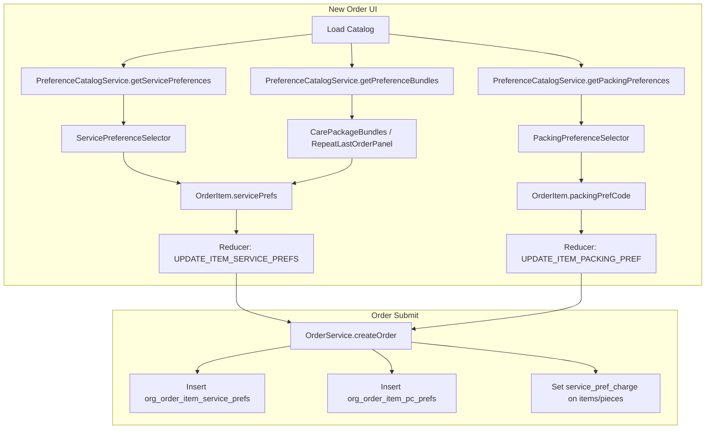
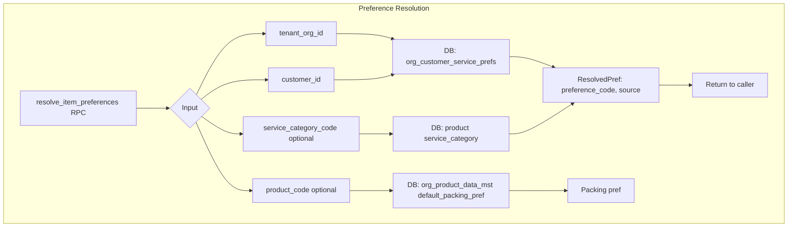
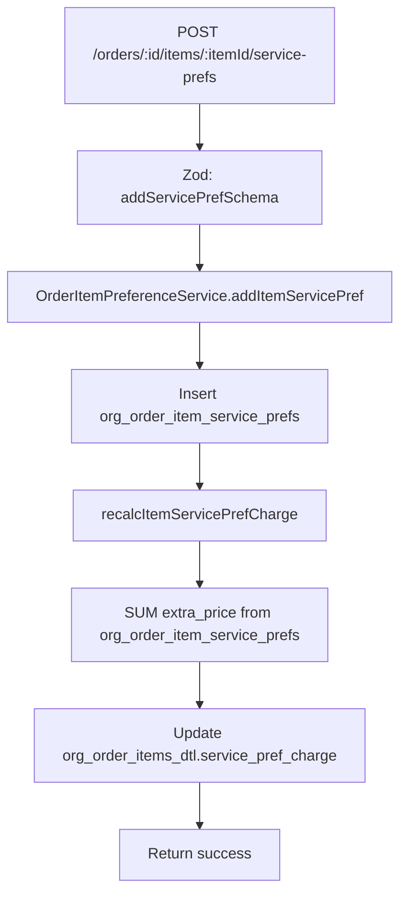
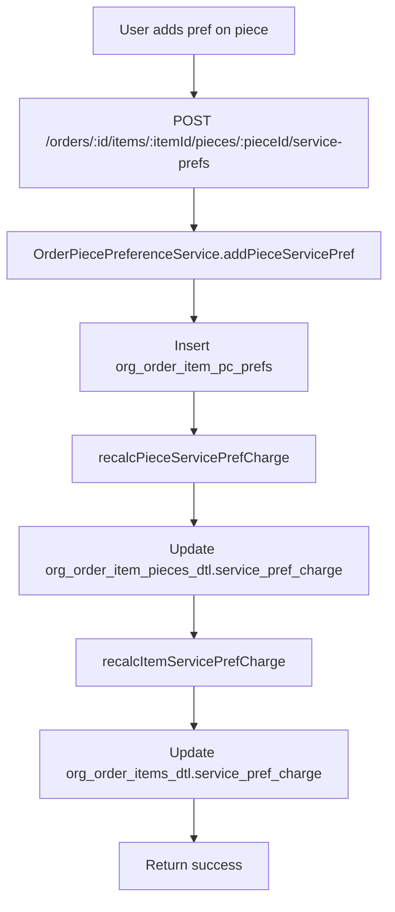

# Order Service Preferences — Developer Guide Flowcharts

## New Order Preference Flow

```mermaid
flowchart TD
    subgraph UI["New Order UI"]
        A[Load Catalog] --> B[PreferenceCatalogService.getServicePreferences]
        A --> C[PreferenceCatalogService.getPackingPreferences]
        A --> D[PreferenceCatalogService.getPreferenceBundles]
        B --> E[ServicePreferenceSelector]
        C --> F[PackingPreferenceSelector]
        D --> G[CarePackageBundles / RepeatLastOrderPanel]
        E --> H[OrderItem.servicePrefs]
        F --> I[OrderItem.packingPrefCode]
        G --> H
        H --> J[Reducer: UPDATE_ITEM_SERVICE_PREFS]
        I --> K[Reducer: UPDATE_ITEM_PACKING_PREF]
    end

    subgraph Submit["Order Submit"]
        J --> L[OrderService.createOrder]
        K --> L
        L --> M[Insert org_order_item_service_prefs]
        L --> N[Insert org_order_item_pc_prefs]
        L --> O[Set service_pref_charge on items/pieces]
    end
```

## Preference Resolution Flow

```mermaid
flowchart TD
    subgraph Resolve["Preference Resolution"]
        A[resolve_item_preferences RPC] --> B{Input}
        B --> C[tenant_org_id]
        B --> D[customer_id]
        B --> E[product_code optional]
        B --> F[service_category_code optional]
        C --> G[DB: org_customer_service_prefs]
        D --> G
        E --> H[DB: org_product_data_mst default_packing_pref]
        F --> I[DB: product service_category]
        G --> J[ResolvedPref: preference_code, source]
        H --> K[Packing pref]
        I --> J
        J --> L[Return to caller]
    end
```

## Add Service Pref to Order Item Flow

```mermaid
flowchart TD
    A[POST /orders/:id/items/:itemId/service-prefs] --> B[Zod: addServicePrefSchema]
    B --> C[OrderItemPreferenceService.addItemServicePref]
    C --> D[Insert org_order_item_service_prefs]
    D --> E[recalcItemServicePrefCharge]
    E --> F[SUM extra_price from org_order_item_service_prefs]
    F --> G[Update org_order_items_dtl.service_pref_charge]
    G --> H[Return success]
```

## Piece-Level Pref Override Flow

```mermaid
flowchart TD
    A[User adds pref on piece] --> B[POST /orders/:id/items/:itemId/pieces/:pieceId/service-prefs]
    B --> C[OrderPiecePreferenceService.addPieceServicePref]
    C --> D[Insert org_order_item_pc_prefs]
    D --> E[recalcPieceServicePrefCharge]
    E --> F[Update org_order_item_pieces_dtl.service_pref_charge]
    F --> G[recalcItemServicePrefCharge]
    G --> H[Update org_order_items_dtl.service_pref_charge]
    H --> I[Return success]
```
