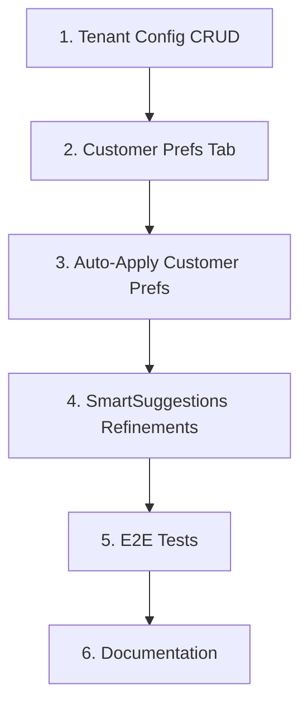

# Order Service Preferences — Complete Implementation Plan

## Scope

Implement the six missing items identified in the gap analysis, following CleanMateX conventions (Cmx design system, tenant isolation, i18n, RBAC).

---

## 1. Tenant Config CRUD (org_service_preference_cf, org_packing_preference_cf)

### 1.1 Backend: PreferenceCatalogService Extensions

**File:** [web-admin/lib/services/preference-catalog.service.ts](web-admin/lib/services/preference-catalog.service.ts)

Add methods:

- `upsertServicePreferenceCf(supabase, tenantId, preferenceCode, input, userId, userName)` — Upsert into `org_service_preference_cf`. Input: `{ name?, name2?, extra_price?, is_included_in_base?, is_active?, display_order?, extra_turnaround_minutes? }`. Use `.upsert()` with `onConflict: 'tenant_org_id,preference_code'`.
- `upsertPackingPreferenceCf(supabase, tenantId, packingPrefCode, input, userId, userName)` — Same pattern for `org_packing_preference_cf`.
- `getServicePreferenceCfForAdmin(supabase, tenantId)` — Return raw rows from `org_service_preference_cf` joined with `sys_service_preference_cd` for admin edit view (includes system defaults for comparison).
- `getPackingPreferenceCfForAdmin(supabase, tenantId)` — Same for packing.

**Audit fields:** Set `created_by`, `created_info`, `updated_at`, `updated_by`, `updated_info` on insert/update.

### 1.2 API Routes

**New/updated routes:**

| Method | Path                                         | Purpose                                                   |
| ------ | -------------------------------------------- | --------------------------------------------------------- |
| GET    | `/api/v1/catalog/service-preferences/admin`  | List service prefs with tenant overrides (for admin edit) |
| GET    | `/api/v1/catalog/packing-preferences/admin`  | Same for packing                                          |
| PUT    | `/api/v1/catalog/service-preferences/[code]` | Upsert org_service_preference_cf                          |
| PUT    | `/api/v1/catalog/packing-preferences/[code]` | Upsert org_packing_preference_cf                          |

**Guards:** `requirePermission('config:preferences_manage')`, tenant from auth.

**Request body (PUT):** `{ name?, name2?, extra_price?, is_included_in_base?, is_active?, display_order? }`

### 1.3 Admin Catalog UI

**File:** [web-admin/app/dashboard/catalog/preferences/page.tsx](web-admin/app/dashboard/catalog/preferences/page.tsx)

- Add **Edit** action per service preference and packing preference (alongside read-only list).
- Open dialog with: Enable/Disable (is_active), Custom Name (name), Custom Name AR (name2), Extra Price (extra_price), Included in Base (is_included_in_base).
- On save, call PUT `/api/v1/catalog/service-preferences/[code]` or packing equivalent.
- Use Cmx components from [web-admin/.clauderc](web-admin/.clauderc) (`CmxDialog`, `CmxInput`, `CmxSwitch`, etc.).
- Invalidate catalog queries on success.

**UX:** Show system default vs tenant override; allow "Reset to default" (delete org row) for service and packing prefs.

---

## 2. Customer Preferences Tab

### 2.1 New Tab and Component

**File:** [web-admin/app/dashboard/customers/[id]/page.tsx](web-admin/app/dashboard/customers/[id]/page.tsx)

- Add tab `{ id: 'preferences', label: t('preferences'), icon: '⚙️' }` to `tabs` array.
- Add `PreferencesTab` component (similar structure to ProfileTab, AddressesTab).
- Gate tab visibility by `customers:preferences_manage` or `orders:service_prefs_view` (RequireAnyPermission).

### 2.2 PreferencesTab Component

**New file:** `web-admin/src/features/customers/ui/CustomerPreferencesTab.tsx` (or inline in page)

- Fetch `GET /api/v1/customers/[id]/service-prefs`.
- Display list of standing prefs (preference_code, source) with Remove button.
- "Add preference" control: dropdown of available service prefs (from catalog API), then `POST /api/v1/customers/[id]/service-prefs` with `{ preference_code, source: 'customer_pref' }`.
- Use `usePreferenceCatalog` or fetch `/api/v1/catalog/service-preferences` for the add dropdown.
- Show empty state when no prefs.
- Use Cmx components; support RTL.

### 2.3 i18n

Add keys in `messages/en.json` and `messages/ar.json` under `customers`:

- `preferences`, `preferencesTab`, `addPreference`, `noPreferences`, `removePreference`, etc. Reuse `catalog.preferences.*` where applicable.

---

## 3. Auto-Apply Customer Prefs on New Order

### 3.1 TenantSettingsService

**File:** [web-admin/lib/services/tenant-settings.service.ts](web-admin/lib/services/tenant-settings.service.ts)

- Add `SERVICE_PREF_AUTO_APPLY_CUSTOMER_PREFS` to `SETTING_CODES`.
- Add `autoApplyCustomerPrefs: boolean` to a new interface (e.g. `TenantPreferenceSettings`) or extend existing. Expose via `getMultipleSettings` or a dedicated `getPreferenceSettings(tenantId, branchId?, userId?)`.

### 3.2 New Order Flow Integration

**File:** [web-admin/src/features/orders/ui/new-order-content.tsx](web-admin/src/features/orders/ui/new-order-content.tsx)

- In `handleAddItem`, when adding a product:
  1. Check `autoApplyCustomerPrefs` (from tenant settings — may need a hook like `useTenantPreferenceSettings` or fetch in parent).
  2. If true and `state.customer?.id` exists and `servicePreferencesEnabled`:
     - Call `GET /api/v1/preferences/resolve?customerId=...&productCode=...&serviceCategoryCode=...` (product_code from product; service_category_code from product).
     - For each resolved `preference_code`, get `extra_price` from `servicePrefs` (catalog).
     - Build `servicePrefs: [{ preference_code, source: 'customer_pref', extra_price }]` and attach to `newItem`.
  3. Pass `servicePrefs` into `newItem` before `state.addItem(newItem)`.

**Async handling:** `handleAddItem` becomes async or uses a fire-and-forget fetch; prefer awaiting resolve before adding to avoid flicker. Use `usePreferenceCatalog` for price lookup.

### 3.3 Custom Item Flow

**File:** [web-admin/src/features/orders/ui/new-order-modals.tsx](web-admin/src/features/orders/ui/new-order-modals.tsx) and [custom-item-modal.tsx](web-admin/src/features/orders/ui/components/custom-item-modal.tsx)

- When adding custom item, if `autoApplyCustomerPrefs` and customer selected, call resolve (productCode may be null; serviceCategoryCode from custom item if available). Merge resolved prefs into the custom item before `onAdd`.

### 3.4 Hook for Tenant Preference Settings

**New file:** `web-admin/src/features/orders/hooks/use-tenant-preference-settings.ts`

- Fetch `SERVICE_PREF_AUTO_APPLY_CUSTOMER_PREFS` via TenantSettingsService or a lightweight API (e.g. `GET /api/v1/tenant-settings/preference?keys=SERVICE_PREF_AUTO_APPLY_CUSTOMER_PREFS`). Cache with React Query. Expose `autoApplyCustomerPrefs`.

---

## 4. SmartSuggestionsPanel Refinements

**File:** [web-admin/src/features/orders/ui/preferences/SmartSuggestionsPanel.tsx](web-admin/src/features/orders/ui/preferences/SmartSuggestionsPanel.tsx)

- Use `extra_turnaround_minutes` from catalog when applying suggestion (currently uses `default_extra_price` only — already correct).
- Add loading skeleton instead of plain "Loading..." text.
- Add `data-testid="smart-suggestions-panel"` for E2E.
- Ensure RTL layout for suggestion buttons (`flex-row-reverse` when RTL).
- Optional: Show usage_count as badge (e.g. "Used 3x") for better UX.

---

## 5. E2E Tests

**File:** [web-admin/e2e/new-order.spec.ts](web-admin/e2e/new-order.spec.ts)

Add or extend tests:

- **Preference catalog (admin):** Navigate to `/dashboard/catalog/preferences`, verify service/packing lists render, edit a service pref (enable/disable, price), save, verify.
- **New order with preferences:** Select customer, add item, verify service pref selector appears; add preference, verify `service_pref_charge` in summary; submit order.
- **Repeat last order:** Select customer with prior order, add item, click "Repeat from last order", verify prefs applied.
- **Customer prefs tab:** Navigate to customer detail, open Preferences tab, add standing pref, verify it appears; remove, verify.

Use existing Playwright patterns from [web-admin/e2e/new-order.spec.ts](web-admin/e2e/new-order.spec.ts). Add `data-testid` attributes where needed for stable selectors.

---

## 6. Documentation Updates

**Files to update:**

- [docs/features/Order_Service_Preferences/progress_summary.md](docs/features/Order_Service_Preferences/progress_summary.md) — Mark tenant config CRUD, customer prefs tab, auto-apply, SmartSuggestions, E2E as completed.
- [docs/features/Order_Service_Preferences/current_status.md](docs/features/Order_Service_Preferences/current_status.md) — Remove "Customer prefs tab: API ready; customer detail tab UI pending" and "Smart suggestions panel: UI scaffold may need refinement" from Known Limitations.
- [docs/features/Order_Service_Preferences/developer_guide.md](docs/features/Order_Service_Preferences/developer_guide.md) — Document new API routes, PreferenceCatalogService methods, auto-apply flow.
- [docs/features/Order_Service_Preferences/technical_docs/tech_api_spec.md](docs/features/Order_Service_Preferences/technical_docs/tech_api_spec.md) — Add admin catalog APIs.
- [docs/features/Order_Service_Preferences/implementation_requirements.md](docs/features/Order_Service_Preferences/implementation_requirements.md) — Confirm all items checked.
- [docs/features/Order_Service_Preferences/CHANGELOG.md](docs/features/Order_Service_Preferences/CHANGELOG.md) — Add v1.2.0 entry with new features.

---

## Implementation Order

1. **Tenant config CRUD** — Unblocks admin configuration.
2. **Customer prefs tab** — Completes standing prefs UX.
3. **Auto-apply** — Depends on customer prefs and resolve API (already exists).
4. **SmartSuggestions** — Low-risk polish.
5. **E2E tests** — Validate all flows.
6. **Documentation** — Finalize.

---

## Key Conventions

- **UI:** Cmx components from `@ui/primitives`, `@ui/overlays`, `@ui/forms`; imports from [web-admin/.clauderc](web-admin/.clauderc).
- **Tenant isolation:** All org\_\* queries filter by `tenant_org_id` from auth.
- **i18n:** Search existing keys in `messages/en.json`, `messages/ar.json` before adding; run `npm run check:i18n` after changes.
- **Permissions:** `config:preferences_manage` for catalog admin; `customers:preferences_manage` for customer prefs tab.
- **Build:** Run `npm run build` in web-admin after changes; fix any ESLint/TypeScript errors.

---

## Validation Checklist

- [ ] Tenant can enable/disable and set custom prices for service and packing prefs via catalog page.
- [ ] Customer standing prefs manageable from customer detail Preferences tab.
- [ ] New order items auto-receive customer prefs when `SERVICE_PREF_AUTO_APPLY_CUSTOMER_PREFS` is true.
- [ ] SmartSuggestionsPanel has improved UX (loading, RTL, testid).
- [ ] E2E tests cover catalog edit, new order prefs, repeat last order, customer prefs tab.
- [ ] Documentation updated; `npm run build` passes.
