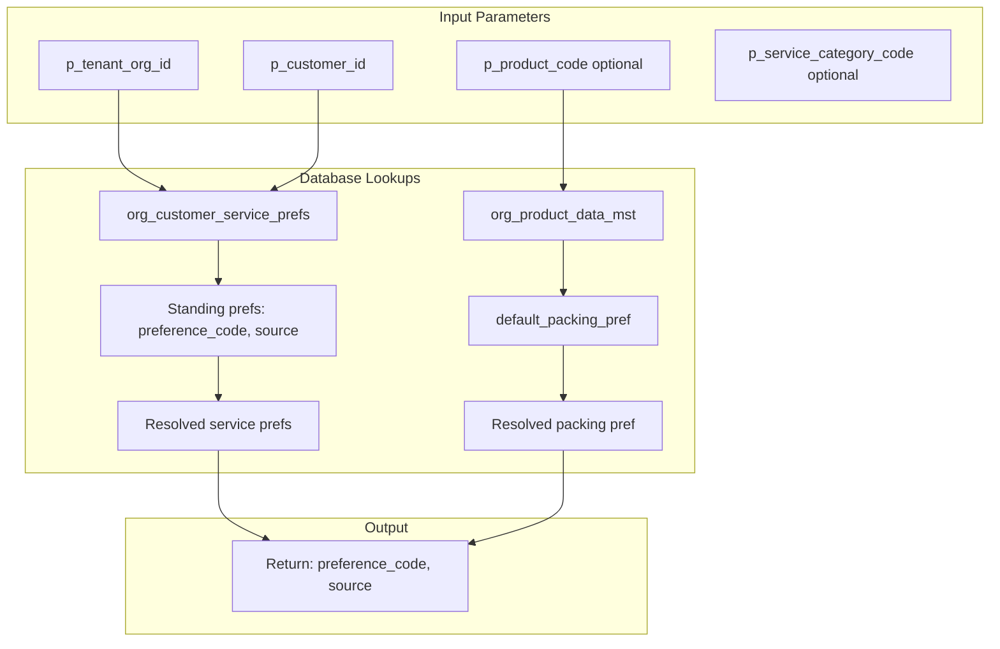
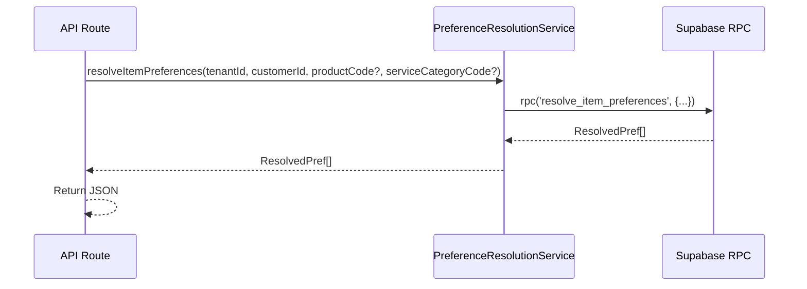
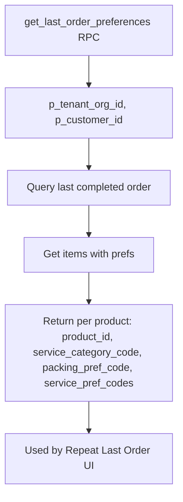
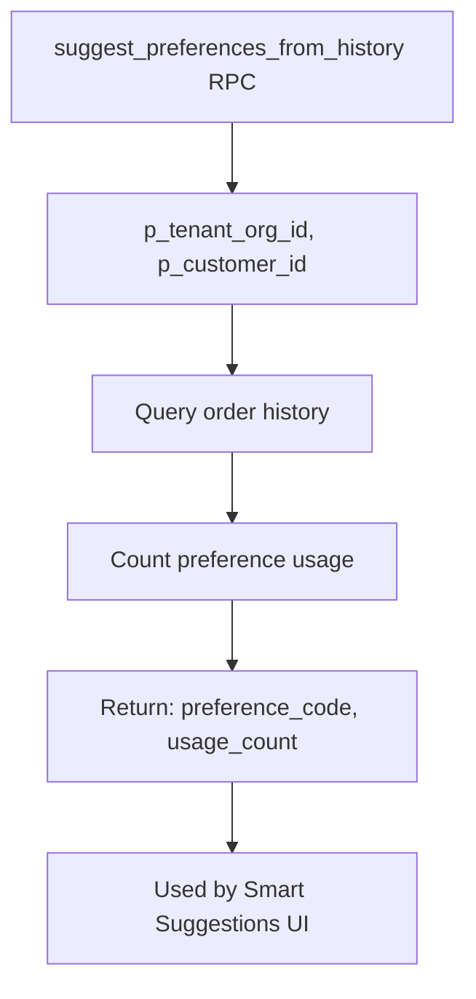

# Service Preferences — Preference Resolution Flow

## resolve_item_preferences (DB Function)

## Resolution Flow (API → Service → DB)

## get_last_order_preferences Flow

## suggest_preferences_from_history Flow

