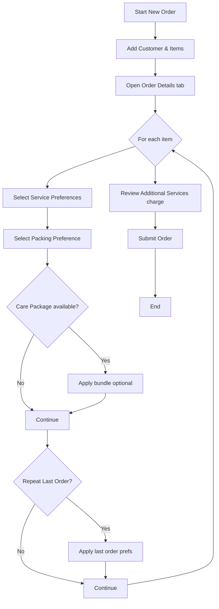
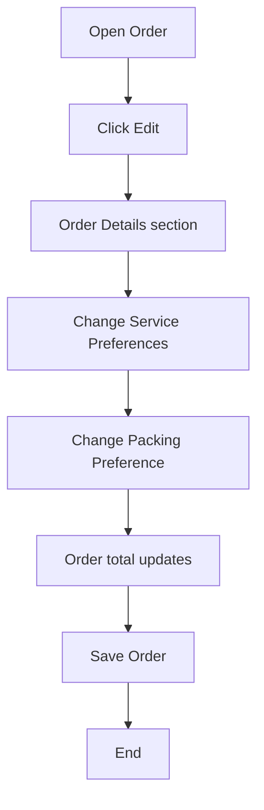
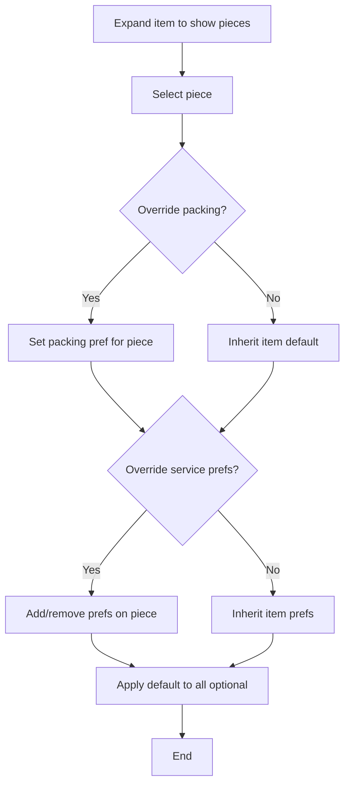
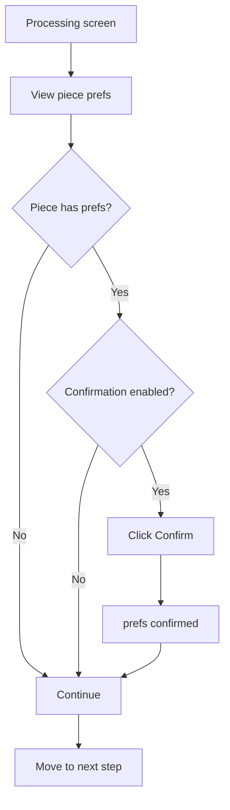

# Order Service Preferences — User Guide Flowcharts

## New Order — Add Preferences Flow

## Edit Order — Change Preferences Flow

## Per-Piece Override Flow (Enterprise)

## Processing Confirmation Flow

