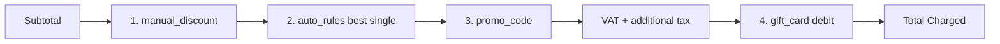

# Promotions and Gift Cards

End-to-end production feature combining stored-value gift cards, promo discount codes, and automatic discount rules across all checkout paths in CleanMateX.

- **Plan:** [`docs/dev/plans/promotions_and_gifts_30156abf.plan.md`](../../dev/plans/promotions_and_gifts_30156abf.plan.md)
- **Schema base migration:** [`supabase/migrations/0029_payment_enhancement_tables.sql`](../../../supabase/migrations/0029_payment_enhancement_tables.sql)
- **Cancellation reversal migration:** [`supabase/migrations/0250_promo_usage_log_voiding.sql`](../../../supabase/migrations/0250_promo_usage_log_voiding.sql)

---

## 1. Overview

CleanMateX supports three coordinated discount mechanisms:

| Mechanism | Description | Stored in |
|---|---|---|
| **Stored-value gift cards** | Card with `original_amount` + `current_balance`; debited on redemption, restorable on refund up to original. | `org_gift_cards_mst`, `org_gift_card_transactions` |
| **Promo codes** | Operator/customer-entered codes with percentage or fixed discounts, usage caps, validity windows, category filters. | `org_promo_codes_mst`, `org_promo_usage_log` |
| **Automatic discount rules** | Server-evaluated rules (e.g. weekday discount, loyalty tier discount); structured `conditions` JSONB. | `org_discount_rules_cf` |

The schema for all three was already in place from `0029_payment_enhancement_tables.sql`. This feature implementation closed the production gaps:

- **Atomicity:** promo + gift debits now happen inside the same Prisma transaction as the order/invoice/payment write.
- **TOCTOU safety:** `SELECT FOR UPDATE` on promo and gift card rows.
- **Side-effect cleanup:** `validateGiftCard` no longer mutates state; mutation only inside `applyGiftCardTx`.
- **Refund integrity:** `refundToGiftCard` returns `actualRefundAmount` so partial refunds are observable.
- **Cancellation reversal:** order cancellation reverses promo usage and refunds gift card debits.
- **Stacking policy:** explicit `DISCOUNT_STACKING_ORDER` constant with `evaluateDiscountRules` integration.
- **Admin CRUD:** Marketing section with promo / gift card / discount rule screens.
- **RBAC:** seven new permission keys.
- **Receipt rendering:** invoice/receipt prints show promo, auto-rule, and gift line items.
- **Realtime expiry:** inline checks at every read/write site for gift cards.

---

## 2. Permissions

Defined in the auth permission registry; granted to roles by default as below.

| Permission | tenant_admin | admin | operator | viewer | Gates |
|---|:---:|:---:|:---:|:---:|---|
| `promotions:read` | ✓ | ✓ | ✓ | ✓ | List + view promo codes, usage report |
| `promotions:write` | ✓ | ✓ |  |  | Create / edit / archive promo codes |
| `gift_cards:read` | ✓ | ✓ | ✓ | ✓ | List + view gift cards, transaction history |
| `gift_cards:issue` | ✓ | ✓ | ✓ |  | Issue new gift card |
| `gift_cards:adjust` | ✓ | ✓ |  |  | Cancel / suspend / adjust balance |
| `discount_rules:read` | ✓ | ✓ |  | ✓ | List + view discount rules |
| `discount_rules:write` | ✓ | ✓ |  |  | Create / edit / archive discount rules |

Access contracts: [`web-admin/src/features/marketing/access/marketing-access.ts`](../../../web-admin/src/features/marketing/access/marketing-access.ts) — registered in [`page-access-registry.ts`](../../../web-admin/src/features/access/page-access-registry.ts).

---

## 3. Navigation tree 

Added to [`web-admin/config/navigation.ts`](../../../web-admin/config/navigation.ts) under a new top-level Marketing section.

| Key | Label (i18n) | Path | Permission |
|---|---|---|---|
| `marketing` | `navigation.marketing` | `/dashboard/marketing` | `promotions:read` |
| `marketing_promos` | `navigation.marketingPromos` | `/dashboard/marketing/promos` | `promotions:read` |
| `marketing_gift_cards` | `navigation.marketingGiftCards` | `/dashboard/marketing/gift-cards` | `gift_cards:read` |
| `marketing_rules` | `navigation.marketingRules` | `/dashboard/marketing/discount-rules` | `discount_rules:read` |

---

## 4. Stacking policy

Single source of truth: [`web-admin/lib/constants/discount-stacking.ts`](../../../web-admin/lib/constants/discount-stacking.ts).

```ts
export const DISCOUNT_STACKING_ORDER = [
  'manual_discount', // 1. % or fixed amount, applies to subtotal
  'auto_rules',      // 2. evaluateDiscountRules — best single rule
  'promo_code',      // 3. explicit staff/customer code
  // VAT and additional tax apply to the post-code amount
  'gift_card',       // 4. stored-value debit, applied post-tax
] as const;
```



Plain-English rules (from `STACKING_RULES`):

- **autoRules: best_single** — multiple auto rules never stack with each other; only the rule with the highest discount fires.
- **autoRulesWithPromo: stackable_flag** — the auto rule and the promo stack only when `rule.can_stack_with_promo === true`. Otherwise the higher of the two wins (promo wins if its discount is greater than or equal to the auto-rule discount; the other side is zeroed).
- **maxCombinedDiscountCap: subtotal** — the sum of `manual + auto + promo` discounts is capped at the subtotal.

Gift card debit is *not* a discount — it is a post-tax payment instrument. It applies to the final post-tax amount.

---

## 5. Conditions schema (auto-rules)

Defined in [`web-admin/lib/constants/discount-conditions-schema.ts`](../../../web-admin/lib/constants/discount-conditions-schema.ts).

```ts
interface DiscountConditions {
  schema_version: 1;
  min_order_amount?: number;        // ≥ 0
  min_items?: number;               // integer ≥ 1
  service_categories?: string[];    // service category codes
  customer_tiers?: ('bronze'|'silver'|'gold'|'platinum')[];
  days_of_week?: number[];          // 0=Sun … 6=Sat
  time_ranges?: { start: 'HH:MM'; end: 'HH:MM' }[];
}
```

Each key is independently optional; a rule with no keys matches every order. The structured Zod schema (`discountConditionsSchema`) is enforced server-side; the admin form renders one labeled control per key (no raw JSON textarea).

`schema_version` allows backwards-compatible upgrades — older rules continue to load read-only with an upgrade banner if the version diverges.

---

## 6. API routes (server actions)

Located under [`web-admin/app/actions/marketing/`](../../../web-admin/app/actions/marketing/).

### Promo codes ([`promo-actions.ts`](../../../web-admin/app/actions/marketing/promo-actions.ts))

| Action | Permission | Purpose |
|---|---|---|
| `listPromoCodes` | `promotions:read` | Paginated list of promo codes for the tenant |
| `createPromoCode` | `promotions:write` | Create new promo (Zod-validated form payload) |
| `updatePromoCode` | `promotions:write` | Edit existing promo |
| `archivePromoCode` | `promotions:write` | Soft-delete (`is_active=false`) |
| `getPromoCodeUsageAction` | `promotions:read` | Usage history per promo code |

### Gift cards ([`gift-card-actions.ts`](../../../web-admin/app/actions/marketing/gift-card-actions.ts))

| Action | Permission | Purpose |
|---|---|---|
| `listGiftCards` | `gift_cards:read` | Paginated list with status filter |
| `issueGiftCard` | `gift_cards:issue` | Create + activate a new card; auto-generates card number |
| `adjustGiftCard` | `gift_cards:adjust` | Manual balance adjustment with audit |
| `cancelGiftCard` | `gift_cards:adjust` | Set status `cancelled`, freeze balance |
| `getGiftCardTransactionsAction` | `gift_cards:read` | Full transaction history |

### Discount rules ([`discount-rule-actions.ts`](../../../web-admin/app/actions/marketing/discount-rule-actions.ts))

| Action | Permission | Purpose |
|---|---|---|
| `listDiscountRules` | `discount_rules:read` | Paginated list ordered by priority |
| `createDiscountRule` | `discount_rules:write` | Create rule with structured conditions |
| `updateDiscountRule` | `discount_rules:write` | Edit rule + reorder priority |
| `archiveDiscountRule` | `discount_rules:write` | Soft-delete |

All actions follow the same pattern: `requirePermission` → Zod parse → service call inside `withTenantContext` → typed result.

---

## 7. Migrations

| Migration | Purpose |
|---|---|
| [`0029_payment_enhancement_tables.sql`](../../../supabase/migrations/0029_payment_enhancement_tables.sql) | Original tables for promo codes, usage log, gift cards, gift transactions, discount rules |
| [`0081_comprehensive_rls_policies.sql`](../../../supabase/migrations/0081_comprehensive_rls_policies.sql) | RLS policies for all `org_*` tables in the feature |
| [`0106_add_branch_id_to_transaction_tables.sql`](../../../supabase/migrations/0106_add_branch_id_to_transaction_tables.sql) | Adds `branch_id` to gift card transactions |
| [`0250_promo_usage_log_voiding.sql`](../../../supabase/migrations/0250_promo_usage_log_voiding.sql) | **NEW** — Adds `voided_at TIMESTAMPTZ` and `voided_by TEXT` to `org_promo_usage_log` for cancellation reversal |

The `0250` migration enables soft-voiding usage rows on order cancellation (instead of deleting them) so the audit trail is preserved while `current_uses` can still be safely decremented.

---

## 8. Constants and types

| Constant / type | File | Why |
|---|---|---|
| `DISCOUNT_STACKING_ORDER`, `DiscountStackingStep`, `STACKING_RULES` | [`lib/constants/discount-stacking.ts`](../../../web-admin/lib/constants/discount-stacking.ts) | Frozen evaluation order so frontend, backend, and receipts agree on stacking semantics |
| `DiscountConditions`, `discountConditionsSchema`, `CONDITIONS_SCHEMA_VERSION` | [`lib/constants/discount-conditions-schema.ts`](../../../web-admin/lib/constants/discount-conditions-schema.ts) | Single typed shape for the `conditions` JSONB column on `org_discount_rules_cf`; powers Zod validation and the admin form renderer |

Both are consumed by services (validation), actions (parsing), and UI (rendering).

---

## 9. i18n keys

All UI strings live under `marketing.*` in [`web-admin/messages/en.json`](../../../web-admin/messages/en.json) and mirrored in [`messages/ar.json`](../../../web-admin/messages/ar.json).

```
marketing
├── title
├── promos
│   ├── title, create, edit, archive, usageReport
│   ├── fields.{ code, name, discountType, discountValue, maxUses, validFrom, validTo, minOrder, categories }
│   ├── status.{ active, expired, maxReached }
│   └── errors.{ codeExists, maxUsesExceeded }
├── giftCards
│   ├── title, issue, detail, adjust, cancel, transactions
│   ├── fields.{ cardNumber, cardName, amount, balance, issuedTo, expiryDate, pin }
│   ├── status.{ active, used, expired, cancelled, suspended }
│   └── errors.{ insufficientBalance, cardCancelled }
└── discountRules
    ├── title, create, edit, archive
    ├── fields.{ code, name, priority, discountType, discountValue, stackWithPromo, stackWithRules, validFrom, validTo }
    ├── conditions.{ title, minOrder, minItems, categories, customerTiers, daysOfWeek, timeRanges }
    └── errors.{ codeExists }
```

Run `npm run check:i18n` after touching translations to verify EN and AR are in sync.

---

## 10. Receipt rendering

Updated component: [`web-admin/src/features/orders/ui/order-invoices-payments-print-rprt.tsx`](../../../web-admin/src/features/orders/ui/order-invoices-payments-print-rprt.tsx).

The payment summary section now emits these line items when the corresponding amount is non-zero:

| Condition | Line item shown | Data source |
|---|---|---|
| `promoDiscount > 0` | "Promo Discount (CODE)" — `−{amount}` | `org_payment_transactions.promo_discount_amount` joined to `org_promo_codes_mst.promo_code` via `promo_code_id` |
| `autoRuleDiscount > 0` | "Discount" — `−{amount}` | `org_payment_transactions.metadata.auto_rule_discount_amount` (or dedicated column when present) |
| `giftCardApplied > 0` | "Gift Card (•••• last4)" — `−{amount}` | `org_payment_transactions.gift_card_applied_amount` joined to `org_gift_cards_mst.card_number` via `gift_card_id` |
| Always | "Total Charged" | Final post-tax amount minus gift debit |

---

## 11. Realtime expiry (gift cards)

No scheduler — expiry is enforced inline at every point a gift card is touched. This guarantees consistency regardless of how long any cron lag would have been.

| Call site | Behaviour |
|---|---|
| [`validateGiftCard`](../../../web-admin/lib/services/gift-card-service.ts) | If `expiry_date < now()` → return `{ isValid: false, errorCode: 'EXPIRED' }`. **Read-only** (no DB write). |
| [`applyGiftCardTx`](../../../web-admin/lib/services/gift-card-service.ts) | After acquiring `SELECT FOR UPDATE` lock, if `expiry_date < now()` → write `status='expired'` + throw `GIFT_CARD_EXPIRED`. The status mutation is safe because we hold the row lock inside an active transaction. |
| `getGiftCardBalance` | If expired → return `{ balance: 0, status: 'expired' }`. Read-only. |
| Admin list | Renders `Expired` badge based on `expiry_date < now()` — no separate sweep needed for display correctness. |
| `expireGiftCards` | Manual admin reconciliation (still exported), JSDoc-marked as supplemental. Not called automatically. |

`pg_cron` is an optional belt-and-suspenders sweep — kept out of this implementation. The realtime check inside the row lock is authoritative.

---

## 12. SELECT FOR UPDATE locking strategy

Both promo `current_uses` increments and gift card balance debits are TOCTOU-prone (check-then-modify). We use `SELECT … FOR UPDATE` instead of conditional raw `UPDATE … WHERE … RETURNING` because:

- Business logic (`max_uses`, expiry, status checks) stays in TypeScript — readable, type-safe, unit-testable.
- Concurrent transactions block on the lock and re-read the committed value after release, so the second tx sees the freshly-incremented `current_uses` or freshly-debited balance and rejects correctly.
- Row-level lock is released automatically on commit/rollback.

```ts
// applyPromoCodeTx
SELECT id, current_uses, max_uses
FROM org_promo_codes_mst
WHERE id = ${promoCodeId} AND tenant_org_id = ${tenantOrgId}
FOR UPDATE;

// applyGiftCardTx
SELECT id, current_balance, status, card_pin, expiry_date, tenant_org_id
FROM org_gift_cards_mst
WHERE card_number = ${cardNumber} AND tenant_org_id = ${tenantOrgId} AND is_active = true
FOR UPDATE;

// refundToGiftCardTx
SELECT id, tenant_org_id, current_balance, original_amount
FROM org_gift_cards_mst
WHERE card_number = ${cardNumber} AND tenant_org_id = ${tenantOrgId} AND is_active = true
FOR UPDATE;

// reversePromoUsageTx — locks every affected promo row before decrementing
SELECT id FROM org_promo_codes_mst
WHERE id = ${promoCodeId} AND tenant_org_id = ${tenantOrgId}
FOR UPDATE;
```

---

## 13. Refund and reversal rules

### Gift card refund

- Call site: [`refundToGiftCard`](../../../web-admin/lib/services/gift-card-service.ts) (own tx) or [`refundToGiftCardTx`](../../../web-admin/lib/services/gift-card-service.ts) (composes into outer tx, e.g. cancellation).
- Refund is **capped at `original_amount`** — a card can never be restored above what it was originally issued for.
- Caller receives `actualRefundAmount`. When `actualRefundAmount < requested`, the cancellation flow surfaces a warning to the operator (it is not a hard error — the order can still be cancelled).

### Promo reversal on cancellation

- Call site: [`reversePromoUsageTx`](../../../web-admin/lib/services/discount-service.ts).
- Sets `voided_at = now()` and `voided_by = userId` on every non-voided usage log row for the cancelled order.
- Aggregates voided rows per `promo_code_id` and decrements `current_uses` once per promo (avoids double-decrement when an order has multiple usage rows for the same promo).
- Does **not** restore per-customer usage capacity for the *same* customer — `max_uses_per_customer` is computed from non-voided rows on next validation, so reversal naturally re-enables reuse if applicable.

### Cancellation orchestration

[`cancelOrder`](../../../web-admin/lib/services/order-cancel-service.ts) sequence:

1. Call Supabase RPC `cmx_ord_canceling_transition` (status flip).
2. Cancel each completed payment via `cancelPayment`.
3. Inside `withTenantContext` + `prisma.$transaction`:
   - If any payment had `promo_code_id` + `promo_discount_amount > 0` → `reversePromoUsageTx`.
   - For each payment with `gift_card_id` + `gift_card_applied_amount > 0` → resolve `card_number` then `refundToGiftCardTx`.
4. Collect non-fatal warnings (partial refund, missing card lookup) into `CancelOrderResult.warnings`.

Partial cancellation (line-item subset) is not yet wired through this service — covered in plan §5.4 as a follow-up.

---

## 14. Testing

### Unit tests (`web-admin/__tests__/services/`)

| Test file | What it proves |
|---|---|
| [`discount-service.test.ts`](../../../web-admin/__tests__/services/discount-service.test.ts) | `applyPromoCodeTx` row-lock + TOCTOU guard; `getBestDiscount` selects highest discount; min-order filter |
| [`gift-card-service.test.ts`](../../../web-admin/__tests__/services/gift-card-service.test.ts) | `applyGiftCardTx` debit/expire/used transitions; `validateGiftCard` PIN guard + no-mutation; `refundToGiftCard` `actualRefundAmount` surface + cap at original |
| [`order-cancel-service.test.ts`](../../../web-admin/__tests__/services/order-cancel-service.test.ts) | Cancellation reverses promo usage, refunds gift card; both together; partial-refund warning; missing-card warning; no-op when no promo/gift |

### Integration test (`web-admin/__tests__/integration/`)

| Test file | What it proves |
|---|---|
| [`create-with-payment-promo-gift.integration.test.ts`](../../../web-admin/__tests__/integration/create-with-payment-promo-gift.integration.test.ts) | Promo + gift commit inside one tx (happy path); rollback when gift throws mid-tx; `SELECT FOR UPDATE` issued for both rows; second concurrent promo apply rejected when max_uses reached; idempotency-key follow-up documented |

Run targeted suite:

```powershell
cd web-admin
npx jest --testPathPattern "order-cancel-service|discount-service|gift-card-service|create-with-payment-promo-gift"
```

All 38 tests pass (1 skipped — idempotency follow-up).
