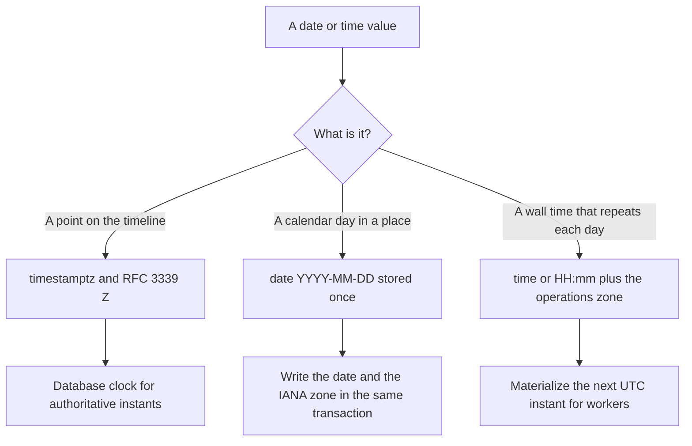
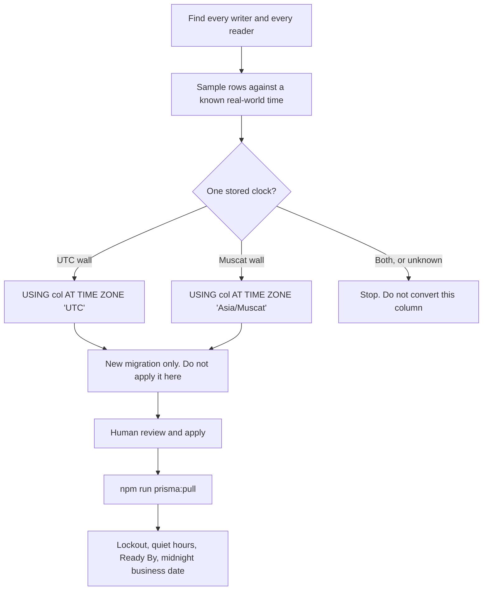
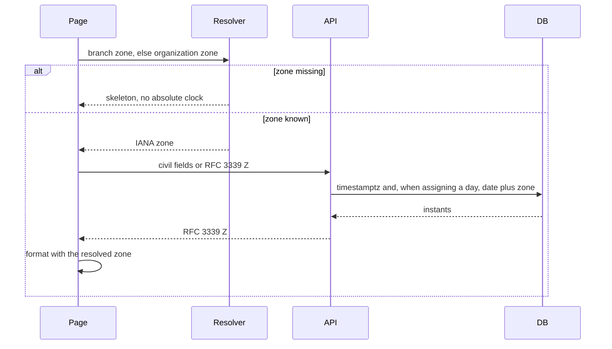

# Developer flows

## Classify a value

```mermaid
flowchart TD
  start[A date or time value] --> kind{What is it?}
  kind -->|A point on the timeline| instant[timestamptz and RFC 3339 Z]
  kind -->|A calendar day in a place| civil[date YYYY-MM-DD stored once]
  kind -->|A wall time that repeats each day| local[time or HH:mm plus the operations zone]
  instant --> store[Database clock for authoritative instants]
  civil --> snap[Write the date and the IANA zone in the same transaction]
  local --> fire[Materialize the next UTC instant for workers]
```

## Convert a legacy naive column

```mermaid
flowchart TD
  find[Find every writer and every reader] --> sample[Sample rows against a known real-world time]
  sample --> shape{One stored clock?}
  shape -->|UTC wall| utc["USING col AT TIME ZONE 'UTC'"]
  shape -->|Muscat wall| mct["USING col AT TIME ZONE 'Asia/Muscat'"]
  shape -->|Both, or unknown| stop[Stop. Do not convert this column]
  utc --> mig[New migration only. Do not apply it here]
  mct --> mig
  mig --> review[Human review and apply]
  review --> pull[npm run prisma:pull]
  pull --> tests[Lockout, quiet hours, Ready By, midnight business date]
```

## Request path for an operational screen

```mermaid
sequenceDiagram
  participant Page
  participant Resolver
  participant API
  participant DB
  Page->>Resolver: branch zone, else organization zone
  alt zone missing
    Resolver-->>Page: skeleton, no absolute clock
  else zone known
    Resolver-->>Page: IANA zone
    Page->>API: civil fields or RFC 3339 Z
    API->>DB: timestamptz and, when assigning a day, date plus zone
    DB-->>API: instants
    API-->>Page: RFC 3339 Z
    Page->>Page: format with the resolved zone
  end
```
