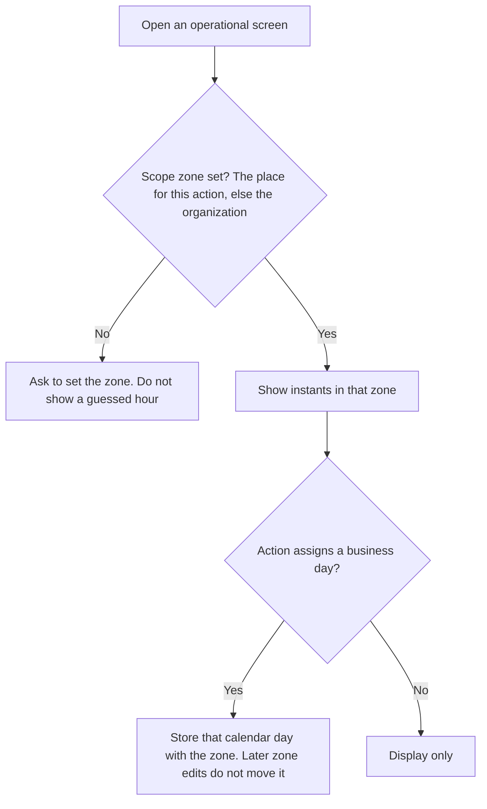

# What staff see

```mermaid
flowchart TD
  open[Open an operational screen] --> zone{Scope zone set? The place for this action, else the organization}
  zone -->|No| ask[Ask to set the zone. Do not show a guessed hour]
  zone -->|Yes| show[Show instants in that zone]
  show --> act{Action assigns a business day?}
  act -->|Yes| freeze[Store that calendar day with the zone. Later zone edits do not move it]
  act -->|No| done[Display only]
```
