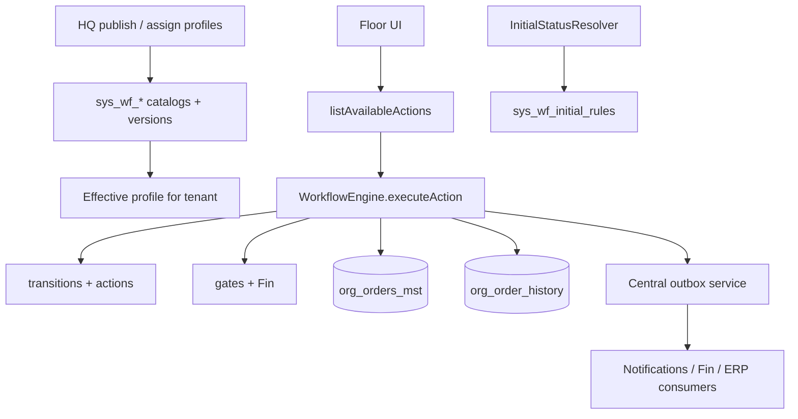

# 02 — Architecture

**Status:** P0 correction pass · **Date:** 2026-07-24  
**Scope:** [ADR_SCOPE_AND_CORRECTION_PASS.md](ADR_SCOPE_AND_CORRECTION_PASS.md)

## 1. Target shape (V1.0)

## 2. Configuration governance (HQ)

| Role | Capability |
|------|------------|
| HQ | Author draft → validate → publish immutable version → assign to tenant / service / branch |
| Tenant | Read effective profile; optional select among HQ-approved profiles; **no** edit of statuses/transitions/gates/initial rules |
| Floor | Actions only |

Tenant “Workflow Studio” in V1.0 = **effective-profile viewer + approved-list picker**, not a graph editor. Rich designer: cleanmatexsaas (V1.2) via HQ APIs.

## 3. Status cutover model

| Phase | Physical | Meaning |
|-------|----------|---------|
| V1.0 | `current_status` worklist SoT; dual-write `status` | Operational summary for screens |
| V1.1 | Add projections / additive summary fields; stage executions | Reduce overload; migrate readers |
| Later | Contract migration may retire legacy aliases | Not a P1 rename prerequisite |

**Reject for V1.0:** big-bang rename to `operational_status` as P1 gate.

Dimensions (commercial / fulfilment / exception / custody / payment / invoice / customer milestone) are **owned by their domains or projections** — not all stuffed into one status enum forever.

## 4. Concurrency

- Column: `state_version` (bigint, increment on workflow write)
- API: `expected_state_version`
- Also row lock `FOR UPDATE` in TX
- `updated_at` remains audit metadata only

## 5. Outbox / idempotency

- **Reuse** existing central outbox (`lib/services/outbox.service.ts` / claim-batch consumers)
- Reuse existing idempotency utilities where applicable
- New `org_wf_outbox_tr` **only if** discovery proves central outbox cannot meet workflow atomic emit needs (document gap first)

## 6. What dies (V1.0)

- Authority of `cmx_order_transition` / `cmx_ord_execute_transition` / CASE create SoT
- Floor `toStatus`; bypass writers
- Tenant graph editing
- Hot-path calls to Enhanced execute RPC

## 7. Related

- [03_ERD_and_Data_Model.md](03_ERD_and_Data_Model.md)
- [06_API_Contracts.md](06_API_Contracts.md)
