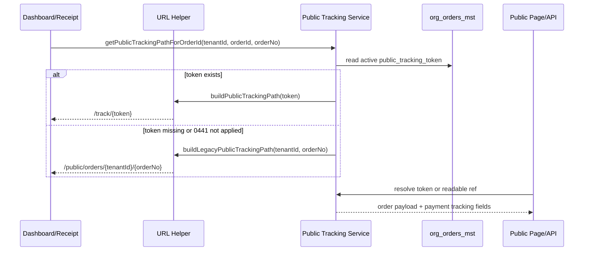
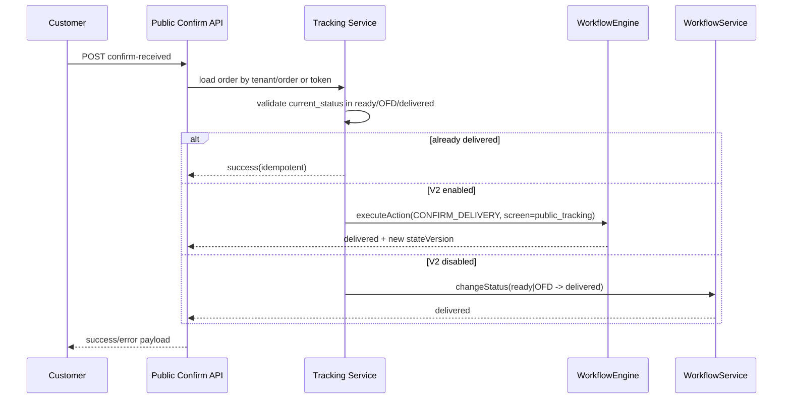

# Developer Guide — Mermaid

## Public tracking resolution

```mermaid
sequenceDiagram
  participant Dashboard as Dashboard/Receipt
  participant Helper as URL Helper
  participant OrderSvc as Public Tracking Service
  participant DB as org_orders_mst
  participant Public as Public Page/API

  Dashboard->>OrderSvc: getPublicTrackingPathForOrderId(tenantId, orderId, orderNo)
  OrderSvc->>DB: read active public_tracking_token
  alt token exists
    OrderSvc->>Helper: buildPublicTrackingPath(token)
    Helper-->>Dashboard: /track/{token}
  else token missing or 0441 not applied
    OrderSvc->>Helper: buildLegacyPublicTrackingPath(tenantId, orderNo)
    Helper-->>Dashboard: /public/orders/{tenantId}/{orderNo}
  end
  Public->>OrderSvc: resolve token or readable ref
  OrderSvc-->>Public: order payload + payment tracking fields
```

## Public confirm-received

```mermaid
sequenceDiagram
  participant Customer as Customer
  participant API as Public Confirm API
  participant Resolver as Tracking Service
  participant Engine as WorkflowEngine
  participant Legacy as WorkflowService

  Customer->>API: POST confirm-received
  API->>Resolver: load order by tenant/order or token
  Resolver->>Resolver: validate current_status in ready/OFD/delivered
  alt already delivered
    Resolver-->>API: success(idempotent)
  else V2 enabled
    Resolver->>Engine: executeAction(CONFIRM_DELIVERY, screen=public_tracking)
    Engine-->>API: delivered + new stateVersion
  else V2 disabled
    Resolver->>Legacy: changeStatus(ready|OFD -> delivered)
    Legacy-->>API: delivered
  end
  API-->>Customer: success/error payload
```
