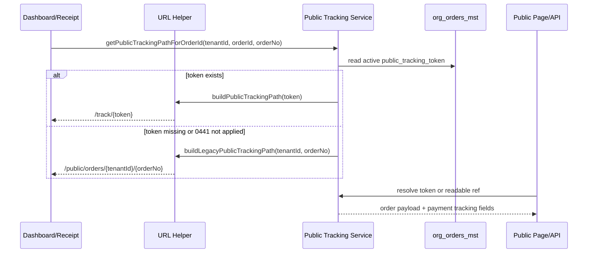
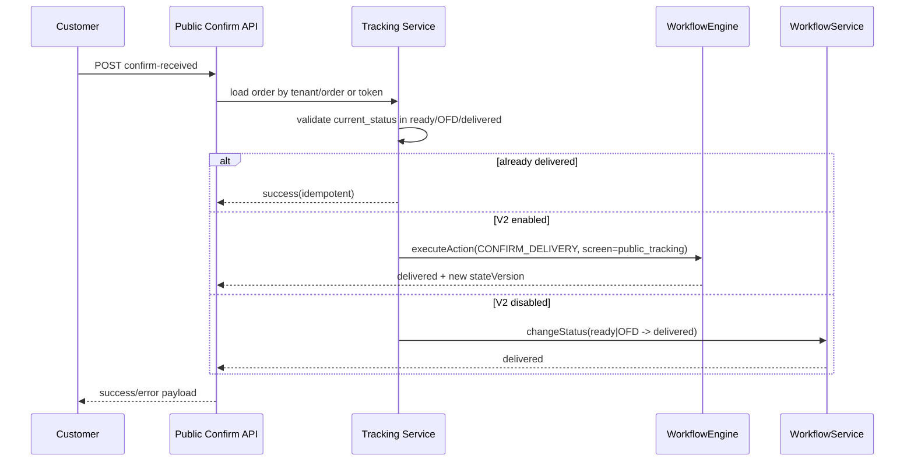
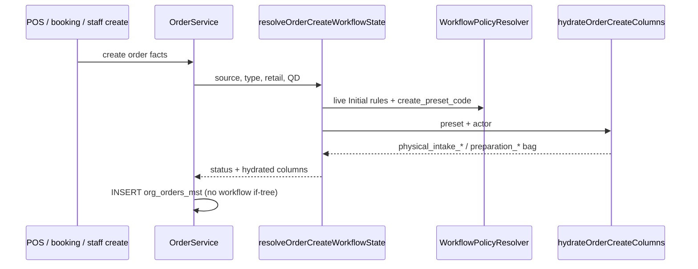
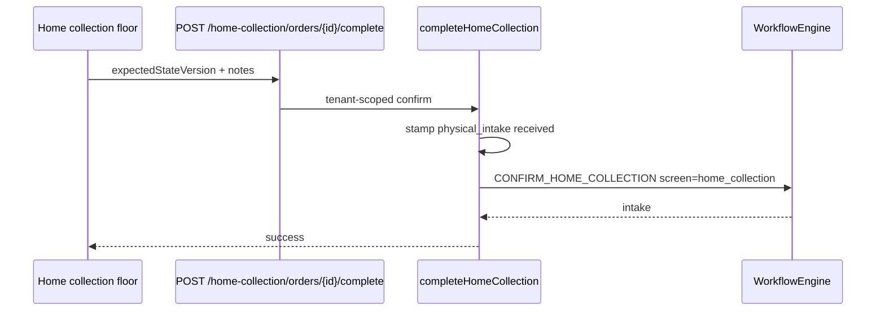

# Developer Guide — Mermaid

## Public tracking resolution

```mermaid
sequenceDiagram
  participant Dashboard as Dashboard/Receipt
  participant Helper as URL Helper
  participant OrderSvc as Public Tracking Service
  participant DB as org_orders_mst
  participant Public as Public Page/API

  Dashboard->>OrderSvc: getPublicTrackingPathForOrderId(tenantId, orderId, orderNo)
  OrderSvc->>DB: read active public_tracking_token
  alt token exists
    OrderSvc->>Helper: buildPublicTrackingPath(token)
    Helper-->>Dashboard: /track/{token}
  else token missing or 0441 not applied
    OrderSvc->>Helper: buildLegacyPublicTrackingPath(tenantId, orderNo)
    Helper-->>Dashboard: /public/orders/{tenantId}/{orderNo}
  end
  Public->>OrderSvc: resolve token or readable ref
  OrderSvc-->>Public: order payload + payment tracking fields
```

## Public confirm-received

```mermaid
sequenceDiagram
  participant Customer as Customer
  participant API as Public Confirm API
  participant Resolver as Tracking Service
  participant Engine as WorkflowEngine
  participant Legacy as WorkflowService

  Customer->>API: POST confirm-received
  API->>Resolver: load order by tenant/order or token
  Resolver->>Resolver: validate current_status in ready/OFD/delivered
  alt already delivered
    Resolver-->>API: success(idempotent)
  else V2 enabled
    Resolver->>Engine: executeAction(CONFIRM_DELIVERY, screen=public_tracking)
    Engine-->>API: delivered + new stateVersion
  else V2 disabled
    Resolver->>Legacy: changeStatus(ready|OFD -> delivered)
    Legacy-->>API: delivered
  end
  API-->>Customer: success/error payload
```

## Create hydration

```mermaid
sequenceDiagram
  participant Client as POS / booking / staff create
  participant OrderSvc as OrderService
  participant CreateWf as resolveOrderCreateWorkflowState
  participant Resolver as WorkflowPolicyResolver
  participant Hydrator as hydrateOrderCreateColumns

  Client->>OrderSvc: create order facts
  OrderSvc->>CreateWf: source, type, retail, QD
  CreateWf->>Resolver: live Initial rules + create_preset_code
  CreateWf->>Hydrator: preset + actor
  Hydrator-->>CreateWf: physical_intake_* / preparation_* bag
  CreateWf-->>OrderSvc: status + hydrated columns
  OrderSvc->>OrderSvc: INSERT org_orders_mst (no workflow if-tree)
```

## Home collection confirm

```mermaid
sequenceDiagram
  participant Floor as Home collection floor
  participant Complete as POST /home-collection/orders/{id}/complete
  participant Svc as completeHomeCollection
  participant Engine as WorkflowEngine

  Floor->>Complete: expectedStateVersion + notes
  Complete->>Svc: tenant-scoped confirm
  Svc->>Svc: stamp physical_intake received
  Svc->>Engine: CONFIRM_HOME_COLLECTION screen=home_collection
  Engine-->>Svc: intake
  Svc-->>Floor: success
```
