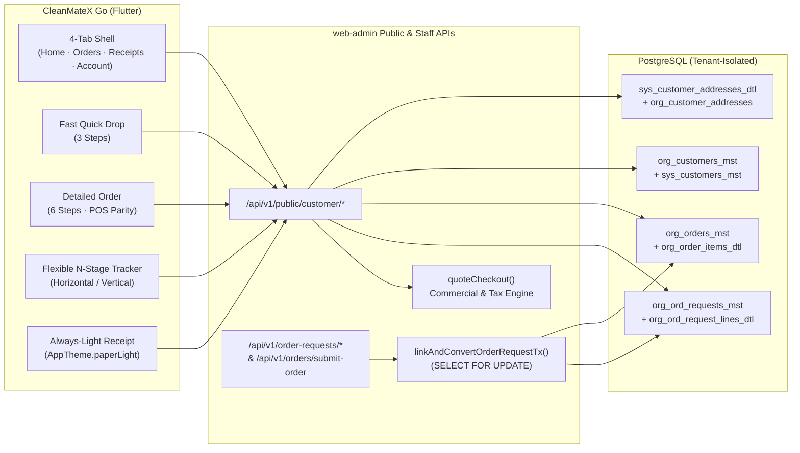
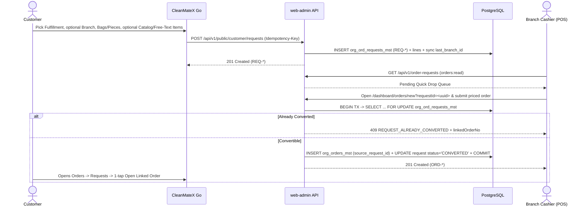

# Architecture & Sequence Diagrams — Customer App Orders

## 1. End-to-End Architecture

```mermaid
flowchart LR
  subgraph Mobile["CleanMateX Go (Flutter)"]
    Shell["4-Tab Shell\n(Home · Orders · Receipts · Account)"]
    QD["Fast Quick Drop\n(3 Steps)"]
    DO["Detailed Order\n(6 Steps · POS Parity)"]
    Tracker["Flexible N-Stage Tracker\n(Horizontal / Vertical)"]
    Paper["Always-Light Receipt\n(AppTheme.paperLight)"]
  end

  subgraph Gateway["web-admin Public & Staff APIs"]
    PubAPI["/api/v1/public/customer/*"]
    StaffAPI["/api/v1/order-requests/*\n& /api/v1/orders/submit-order"]
    QuoteSvc["quoteCheckout()\nCommercial & Tax Engine"]
    ConvSvc["linkAndConvertOrderRequestTx()\n(SELECT FOR UPDATE)"]
  end

  subgraph DB["PostgreSQL (Tenant-Isolated)"]
    ReqTbl["org_ord_requests_mst\n+ org_ord_request_lines_dtl"]
    OrdTbl["org_orders_mst\n+ org_order_items_dtl"]
    CustTbl["org_customers_mst\n+ sys_customers_mst"]
    AddrTbl["sys_customer_addresses_dtl\n+ org_customer_addresses"]
  end

  QD --> PubAPI
  DO --> PubAPI
  Shell --> PubAPI
  Tracker --> PubAPI
  Paper --> PubAPI

  PubAPI --> QuoteSvc
  PubAPI --> ReqTbl
  PubAPI --> OrdTbl
  PubAPI --> CustTbl
  PubAPI --> AddrTbl

  StaffAPI --> ConvSvc
  ConvSvc --> ReqTbl
  ConvSvc --> OrdTbl
```

## 2. Fast Quick Drop to Atomic Staff POS Conversion

```mermaid
sequenceDiagram
  actor Customer
  participant App as CleanMateX Go
  participant API as web-admin API
  participant DB as PostgreSQL
  actor Staff as Branch Cashier (POS)

  Customer->>App: Pick Fulfillment, optional Branch, Bags/Pieces, optional Catalog/Free-Text Items
  App->>API: POST /api/v1/public/customer/requests (Idempotency-Key)
  API->>DB: INSERT org_ord_requests_mst (REQ-*) + lines + sync last_branch_id
  API-->>App: 201 Created (REQ-*)
  Staff->>API: GET /api/v1/order-requests (orders:read)
  API-->>Staff: Pending Quick Drop Queue
  Staff->>API: Open /dashboard/orders/new?requestId=<uuid> & submit priced order
  API->>DB: BEGIN TX -> SELECT ... FOR UPDATE org_ord_requests_mst
  alt Already Converted
    API-->>Staff: 409 REQUEST_ALREADY_CONVERTED + linkedOrderNo
  else Convertible
    API->>DB: INSERT org_orders_mst (source_request_id) + UPDATE request status='CONVERTED' + COMMIT
    API-->>Staff: 201 Created (ORD-*)
    Customer->>App: Opens Orders -> Requests -> 1-tap Open Linked Order
  end
```
