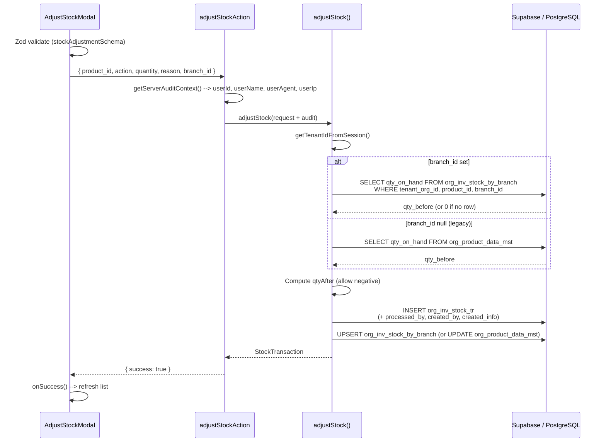
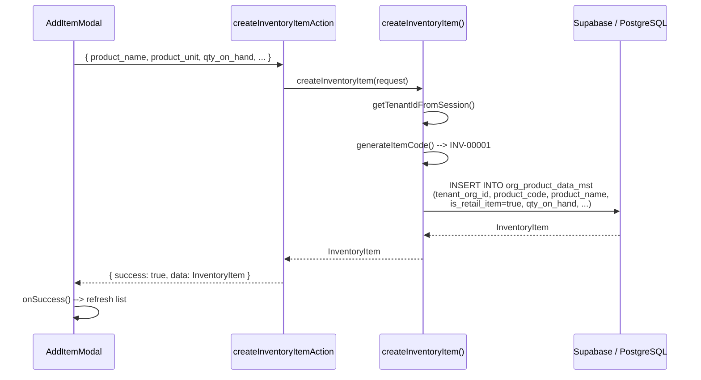
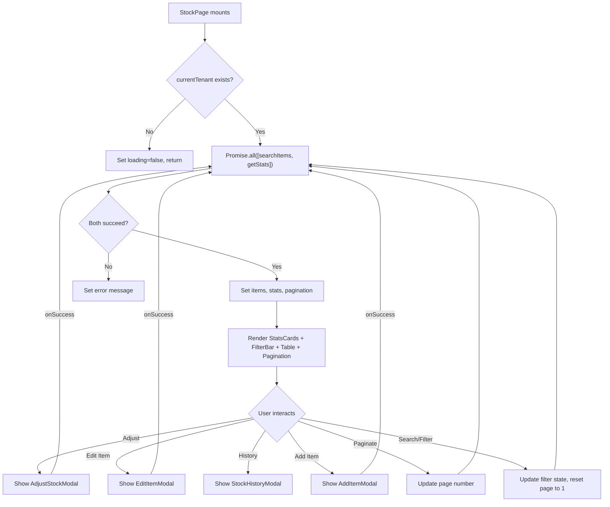
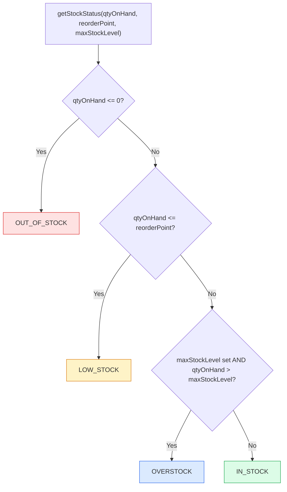

# Inventory Stock Management -- Developer Flow Diagrams

> **v1.2.0:** Quantity and stats use `org_inv_stock_by_branch` (branch-specific or aggregated). Adjust flow includes audit context and Zod validation. See [Branch-Wise Enhancement](./branch-wise-enhancement.md).

## Stock Adjustment Flow (v1.2.0)



## Inventory Search Flow (v1.2.0)

```mermaid
sequenceDiagram
    participant UI as StockPage
    participant SA as searchInventoryItemsAction
    participant SVC as searchInventoryItems()
    participant DB as Supabase / PostgreSQL

    UI->>SA: { page, limit, search, stock_status, is_active, branch_id }
    SA->>SVC: searchInventoryItems(params)
    SVC->>DB: SELECT * FROM org_product_data_mst (retail items)
    DB-->>SVC: rows[]
    alt branch_id set
        SVC->>DB: SELECT product_id, qty_on_hand FROM org_inv_stock_by_branch<br/>WHERE branch_id = ?
    else branch_id empty (All Branches)
        SVC->>DB: SELECT product_id, qty_on_hand FROM org_inv_stock_by_branch<br/>SUM per product
    end
    SVC->>SVC: Build branchQtyMap; has_branch_record when branch set
    SVC->>SVC: Map to InventoryItemListItem; getStockStatus; stock_value
    SVC-->>SA: InventorySearchResponse
    SA-->>UI: { success: true, data: { items, total, page, ... } }
```

## Create Item Flow



## Page Load Flow



## Stock Status Computation


