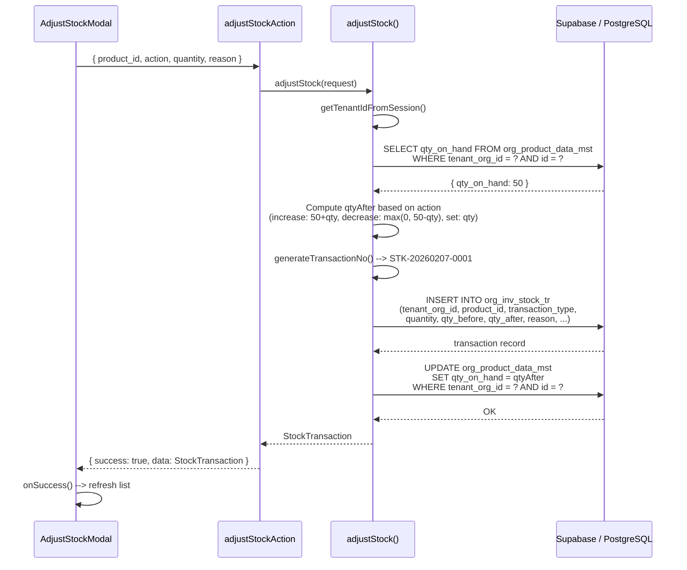
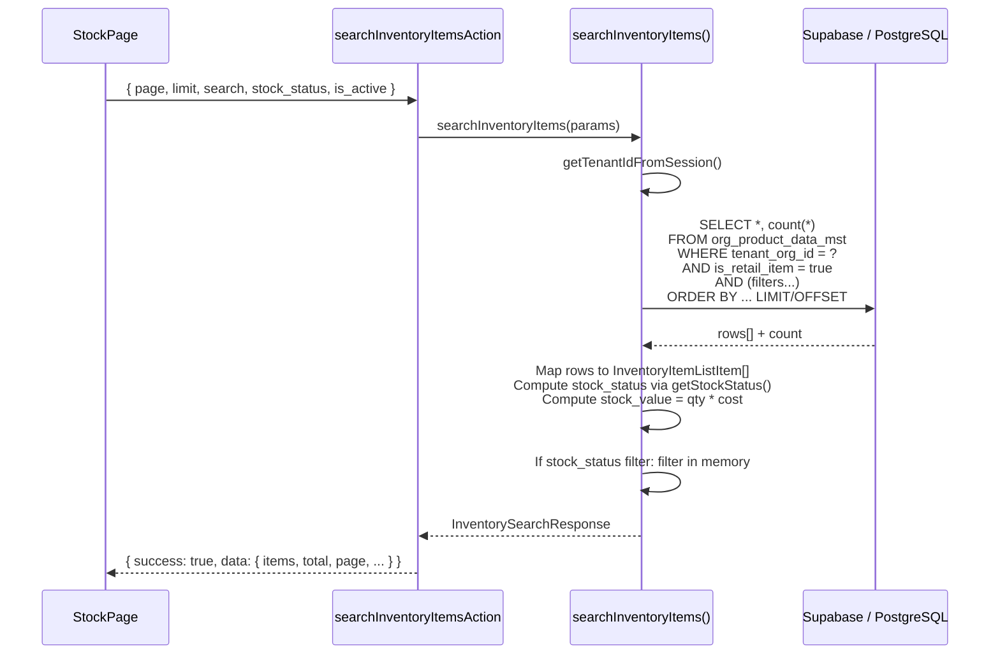
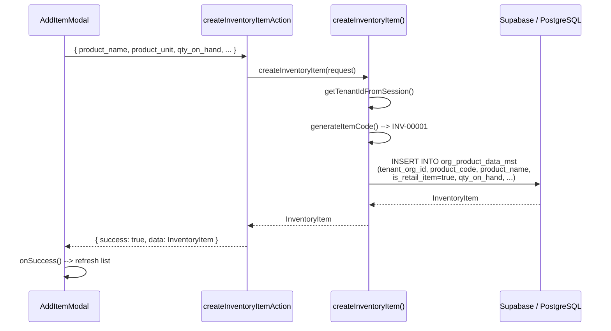
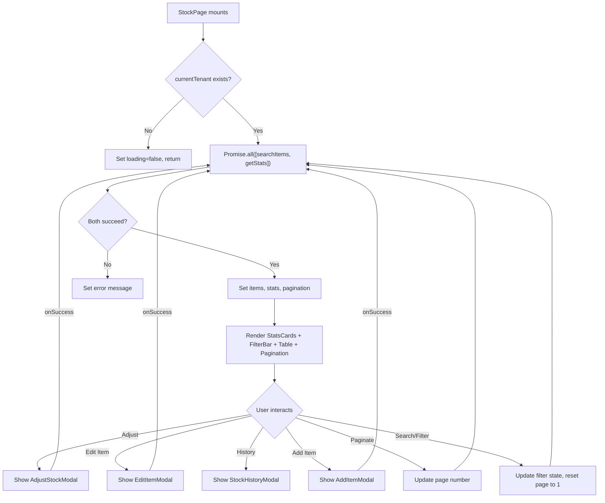
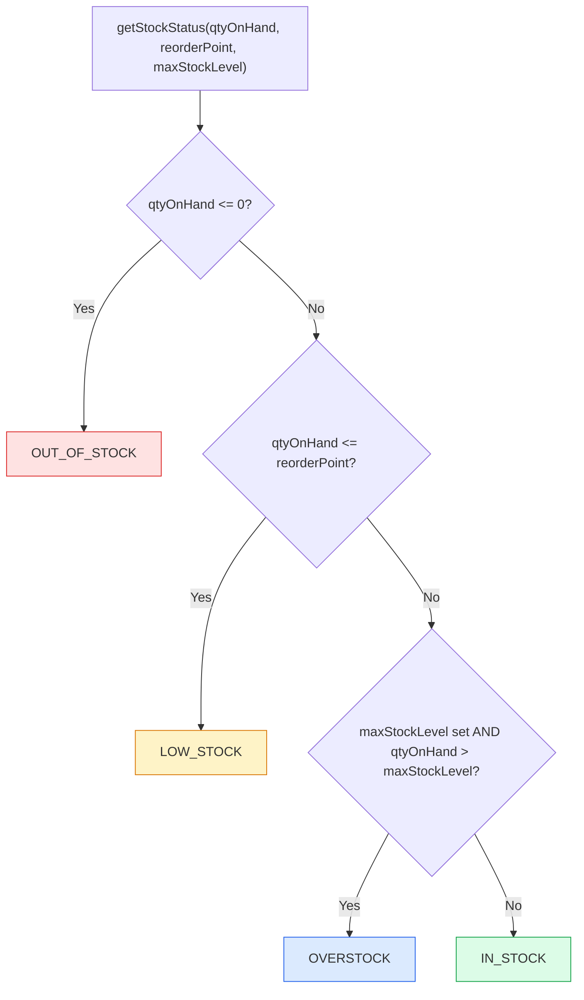

# Inventory Stock Management -- Developer Flow Diagrams

## Stock Adjustment Flow

```mermaid
sequenceDiagram
    participant UI as AdjustStockModal
    participant SA as adjustStockAction
    participant SVC as adjustStock()
    participant DB as Supabase / PostgreSQL

    UI->>SA: { product_id, action, quantity, reason }
    SA->>SVC: adjustStock(request)
    SVC->>SVC: getTenantIdFromSession()
    SVC->>DB: SELECT qty_on_hand FROM org_product_data_mst<br/>WHERE tenant_org_id = ? AND id = ?
    DB-->>SVC: { qty_on_hand: 50 }
    SVC->>SVC: Compute qtyAfter based on action<br/>(increase: 50+qty, decrease: max(0, 50-qty), set: qty)
    SVC->>SVC: generateTransactionNo() --> STK-20260207-0001
    SVC->>DB: INSERT INTO org_inv_stock_tr<br/>(tenant_org_id, product_id, transaction_type,<br/>quantity, qty_before, qty_after, reason, ...)
    DB-->>SVC: transaction record
    SVC->>DB: UPDATE org_product_data_mst<br/>SET qty_on_hand = qtyAfter<br/>WHERE tenant_org_id = ? AND id = ?
    DB-->>SVC: OK
    SVC-->>SA: StockTransaction
    SA-->>UI: { success: true, data: StockTransaction }
    UI->>UI: onSuccess() --> refresh list
```

## Inventory Search Flow

```mermaid
sequenceDiagram
    participant UI as StockPage
    participant SA as searchInventoryItemsAction
    participant SVC as searchInventoryItems()
    participant DB as Supabase / PostgreSQL

    UI->>SA: { page, limit, search, stock_status, is_active }
    SA->>SVC: searchInventoryItems(params)
    SVC->>SVC: getTenantIdFromSession()
    SVC->>DB: SELECT *, count(*)<br/>FROM org_product_data_mst<br/>WHERE tenant_org_id = ?<br/>AND is_retail_item = true<br/>AND (filters...)<br/>ORDER BY ... LIMIT/OFFSET
    DB-->>SVC: rows[] + count
    SVC->>SVC: Map rows to InventoryItemListItem[]<br/>Compute stock_status via getStockStatus()<br/>Compute stock_value = qty * cost
    SVC->>SVC: If stock_status filter: filter in memory
    SVC-->>SA: InventorySearchResponse
    SA-->>UI: { success: true, data: { items, total, page, ... } }
```

## Create Item Flow

```mermaid
sequenceDiagram
    participant UI as AddItemModal
    participant SA as createInventoryItemAction
    participant SVC as createInventoryItem()
    participant DB as Supabase / PostgreSQL

    UI->>SA: { product_name, product_unit, qty_on_hand, ... }
    SA->>SVC: createInventoryItem(request)
    SVC->>SVC: getTenantIdFromSession()
    SVC->>SVC: generateItemCode() --> INV-00001
    SVC->>DB: INSERT INTO org_product_data_mst<br/>(tenant_org_id, product_code, product_name,<br/>is_retail_item=true, qty_on_hand, ...)
    DB-->>SVC: InventoryItem
    SVC-->>SA: InventoryItem
    SA-->>UI: { success: true, data: InventoryItem }
    UI->>UI: onSuccess() --> refresh list
```

## Page Load Flow

```mermaid
flowchart TD
    A[StockPage mounts] --> B{currentTenant exists?}
    B -->|No| C[Set loading=false, return]
    B -->|Yes| D["Promise.all([searchItems, getStats])"]
    D --> E{Both succeed?}
    E -->|Yes| F[Set items, stats, pagination]
    E -->|No| G[Set error message]
    F --> H[Render StatsCards + FilterBar + Table + Pagination]
    H --> I{User interacts}
    I -->|Search/Filter| J[Update filter state, reset page to 1]
    I -->|Paginate| K[Update page number]
    I -->|Add Item| L[Show AddItemModal]
    I -->|Edit Item| M[Show EditItemModal]
    I -->|Adjust| N[Show AdjustStockModal]
    I -->|History| O[Show StockHistoryModal]
    J --> D
    K --> D
    L -->|onSuccess| D
    M -->|onSuccess| D
    N -->|onSuccess| D
```

## Stock Status Computation

```mermaid
flowchart TD
    A["getStockStatus(qtyOnHand, reorderPoint, maxStockLevel)"] --> B{qtyOnHand <= 0?}
    B -->|Yes| C["OUT_OF_STOCK"]
    B -->|No| D{qtyOnHand <= reorderPoint?}
    D -->|Yes| E["LOW_STOCK"]
    D -->|No| F{maxStockLevel set AND qtyOnHand > maxStockLevel?}
    F -->|Yes| G["OVERSTOCK"]
    F -->|No| H["IN_STOCK"]

    style C fill:#fee2e2,stroke:#dc2626
    style E fill:#fef3c7,stroke:#d97706
    style G fill:#dbeafe,stroke:#2563eb
    style H fill:#dcfce7,stroke:#16a34a
```
