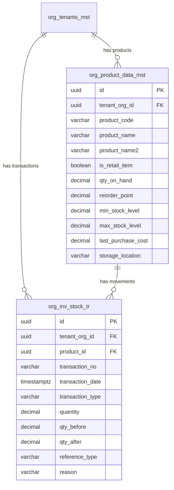
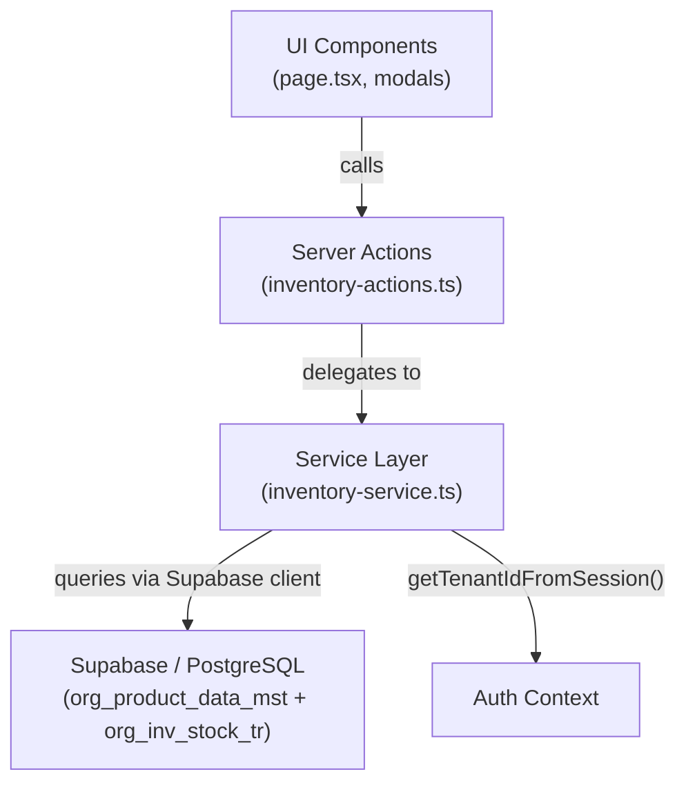

# Inventory Stock Management

## Table of Contents

1. [Feature Overview](#1-feature-overview)
2. [Database Schema](#2-database-schema)
3. [Architecture and File Structure](#3-architecture-and-file-structure)
4. [Constants and Types](#4-constants-and-types)
5. [Service Layer](#5-service-layer)
6. [Server Actions (API Layer)](#6-server-actions-api-layer)
7. [UI Components](#7-ui-components)
8. [Key Design Decisions](#8-key-design-decisions)
9. [Multi-Tenancy and Security](#9-multi-tenancy-and-security)
10. [Internationalization (i18n)](#10-internationalization-i18n)
11. [Testing Scenarios](#11-testing-scenarios)
12. [Future Enhancements](#12-future-enhancements)
13. [Implementation Status](#13-implementation-status)

---

## 1. Feature Overview

### Purpose

Inventory Stock Management provides real-time tracking of retail and consumable items used in laundry operations: detergents, packaging materials, hangers, bags, tags, and other supplies. Operators can monitor stock levels, receive low-stock alerts, adjust quantities, and review the full transaction history for each item.

### Scope

This implementation covers **stock tracking only**. The following are explicitly out of scope and planned for future phases:

- Machine management
- Supplier management
- Purchase orders and procurement
- Usage-per-order allocation (linking stock consumption to laundry orders)
- Batch/lot tracking
- Barcode scanning

### Access Path

```
Sidebar --> "Inventory & Machines" --> "Stock"
URL: /dashboard/inventory/stock
```

Accessible to **admin** and **operator** roles.

### User Capabilities

| Capability | Description |
|---|---|
| View stock list | Paginated table of all inventory items with search, filter by status, filter by active/inactive |
| KPI dashboard | 4 cards: Total Items, Low Stock count, Out of Stock count, Total Stock Value |
| Add new item | Create an inventory item with name (EN/AR), unit, costs, initial quantity, reorder point, and storage location |
| Edit item | Modify item details (name, unit, cost, reorder point, storage location) |
| Soft-delete item | Deactivate an item (`is_active=false`, `rec_status=0`) |
| Adjust stock | Increase, decrease, or set a new quantity with a mandatory reason |
| View history | Transaction log per item showing date, type, quantity change, before/after snapshots, and reason |

---

## 2. Database Schema

### Migration File

```
supabase/migrations/0101_inventory_stock_management.sql
```

Dependencies: `0001_core_schema.sql`, `0045_catalog_system_2027_architecture.sql`

The migration is wrapped in a single `BEGIN; ... COMMIT;` transaction.

### Part 1: Columns Added to `org_product_data_mst`

Inventory items reuse the existing product master table filtered by `is_retail_item = true`.

| Column | Type | Default | Description |
|---|---|---|---|
| `qty_on_hand` | `DECIMAL(19,4)` | `0` | Current quantity on hand |
| `reorder_point` | `DECIMAL(19,4)` | `0` | Quantity threshold for low-stock alert |
| `min_stock_level` | `DECIMAL(19,4)` | `0` | Minimum stock level allowed |
| `max_stock_level` | `DECIMAL(19,4)` | `NULL` | Maximum stock level capacity |
| `last_purchase_cost` | `DECIMAL(19,4)` | `NULL` | Cost from most recent purchase |
| `storage_location` | `VARCHAR(100)` | `NULL` | Physical storage location / bin |

**Indexes added:**

| Index Name | Columns | Condition | Purpose |
|---|---|---|---|
| `idx_prod_low_stock` | `(tenant_org_id, qty_on_hand, reorder_point)` | `WHERE is_retail_item = true AND is_active = true` | Low-stock alert queries |
| `idx_prod_retail_active` | `(tenant_org_id, is_retail_item, is_active)` | `WHERE is_retail_item = true` | Inventory listing performance |

### Part 2: New Table `org_inv_stock_tr`

Stock movement transaction table. Every adjustment creates a row here.

| Column | Type | Nullable | Description |
|---|---|---|---|
| `id` | `UUID` | NOT NULL | Primary key (auto-generated) |
| `tenant_org_id` | `UUID` | NOT NULL | Tenant isolation key |
| `product_id` | `UUID` | NOT NULL | FK to `org_product_data_mst` (composite with `tenant_org_id`) |
| `transaction_no` | `VARCHAR(30)` | YES | Auto-generated: `STK-YYYYMMDD-NNNN` |
| `transaction_date` | `TIMESTAMPTZ` | NOT NULL | Defaults to `now()` |
| `transaction_type` | `VARCHAR(20)` | NOT NULL | `STOCK_IN`, `STOCK_OUT`, or `ADJUSTMENT` |
| `quantity` | `DECIMAL(19,4)` | NOT NULL | Positive for IN, negative for OUT |
| `unit_cost` | `DECIMAL(19,4)` | YES | Cost per unit at time of transaction |
| `total_cost` | `DECIMAL(19,4)` | YES | `abs(quantity) * unit_cost` |
| `qty_before` | `DECIMAL(19,4)` | YES | Snapshot: qty_on_hand before transaction |
| `qty_after` | `DECIMAL(19,4)` | YES | Snapshot: qty_on_hand after transaction |
| `reference_type` | `VARCHAR(30)` | YES | `ORDER`, `PURCHASE`, or `MANUAL` |
| `reference_id` | `UUID` | YES | FK to source document (future use) |
| `reference_no` | `VARCHAR(50)` | YES | Human-readable reference number |
| `reason` | `VARCHAR(200)` | YES | Reason for adjustment |
| `notes` | `TEXT` | YES | Additional notes |
| `processed_by` | `UUID` | YES | User who performed the action |
| `is_active` | `BOOLEAN` | NOT NULL | Soft-delete flag (default `true`) |
| `rec_status` | `SMALLINT` | YES | Record status (default `1`) |
| `created_at` | `TIMESTAMPTZ` | YES | Auto-set |
| `created_by` | `TEXT` | YES | Audit field |
| `created_info` | `TEXT` | YES | Audit field |
| `updated_at` | `TIMESTAMPTZ` | YES | Auto-updated via trigger |
| `updated_by` | `TEXT` | YES | Audit field |
| `updated_info` | `TEXT` | YES | Audit field |

**Constraints:**

| Constraint | Type | Detail |
|---|---|---|
| `uk_inv_stock_tr_tenant` | UNIQUE | `(tenant_org_id, id)` -- composite for tenant isolation |
| `fk_inv_stock_tenant` | FK | `tenant_org_id` --> `org_tenants_mst(id)` ON DELETE CASCADE |
| `fk_inv_stock_product` | FK | `(product_id, tenant_org_id)` --> `org_product_data_mst(id, tenant_org_id)` -- composite FK |
| `chk_inv_stock_type` | CHECK | `transaction_type IN ('STOCK_IN', 'STOCK_OUT', 'ADJUSTMENT')` |

**Indexes:**

| Index Name | Columns | Purpose |
|---|---|---|
| `idx_inv_stock_tenant` | `(tenant_org_id)` | Tenant-scoped queries |
| `idx_inv_stock_product` | `(tenant_org_id, product_id, transaction_date DESC)` | Per-item history lookups |
| `idx_inv_stock_type` | `(tenant_org_id, transaction_type)` | Filter by transaction type |
| `idx_inv_stock_date` | `(tenant_org_id, transaction_date DESC)` | Date-ordered listings |

### Part 3: RLS Policies

```sql
ALTER TABLE org_inv_stock_tr ENABLE ROW LEVEL SECURITY;

-- Tenant isolation: user can only see rows for their tenant(s)
CREATE POLICY tenant_isolation_org_inv_stock_tr ON org_inv_stock_tr
  FOR ALL
  USING (tenant_org_id IN (SELECT tenant_id FROM get_user_tenants()))
  WITH CHECK (tenant_org_id IN (SELECT tenant_id FROM get_user_tenants()));

-- Service role bypass for server-side operations
CREATE POLICY service_role_org_inv_stock_tr ON org_inv_stock_tr
  FOR ALL
  USING (auth.jwt() ->> 'role' = 'service_role');
```

### Part 4: Auto-Update Trigger

```sql
CREATE OR REPLACE FUNCTION trg_inv_stock_updated()
RETURNS TRIGGER AS $$
BEGIN
  NEW.updated_at = now();
  RETURN NEW;
END;
$$ LANGUAGE plpgsql;

CREATE TRIGGER trigger_inv_stock_updated
  BEFORE UPDATE ON org_inv_stock_tr
  FOR EACH ROW
  EXECUTE FUNCTION trg_inv_stock_updated();
```

### Entity Relationship Diagram



---

## 3. Architecture and File Structure

### Complete File Listing

```
web-admin/
  lib/
    constants/
      inventory.ts                              # Constants: categories, units, tx types, stock status, helpers
    types/
      inventory.ts                              # TypeScript interfaces for all inventory entities
    services/
      inventory-service.ts                      # Service layer: CRUD, search, adjust, statistics

  app/
    actions/
      inventory/
        inventory-actions.ts                    # 7 server actions wrapping the service layer

    dashboard/
      inventory/
        page.tsx                                # Redirect page --> /stock
        stock/
          page.tsx                              # Main listing page (client component)
          components/
            stats-cards.tsx                     # 4 KPI cards (Total Items, Low Stock, Out of Stock, Stock Value)
            add-item-modal.tsx                  # Create new inventory item dialog
            edit-item-modal.tsx                 # Edit + delete item dialog
            adjust-stock-modal.tsx              # Stock adjustment (increase / decrease / set)
            stock-history-modal.tsx             # Transaction history per item

supabase/
  migrations/
    0101_inventory_stock_management.sql         # DDL: alter table + new table + RLS + trigger

messages/
  en.json                                       # English i18n keys under "inventory.*"
  ar.json                                       # Arabic i18n keys under "inventory.*"
```

### Layer Diagram



---

## 4. Constants and Types

### Constants (`web-admin/lib/constants/inventory.ts`)

All constants follow the `as const` pattern for type derivation.

```typescript
// Item categories for inventory consumables
export const ITEM_CATEGORIES = {
  DETERGENT: 'DETERGENT',
  PACKAGING: 'PACKAGING',
  HANGER: 'HANGER',
  BAG: 'BAG',
  TAG: 'TAG',
  CONSUMABLE: 'CONSUMABLE',
  OTHER: 'OTHER',
} as const;

// Units of measure
export const UNITS_OF_MEASURE = {
  PIECE: 'piece',
  LITER: 'liter',
  KG: 'kg',
  GRAM: 'gram',
  BOX: 'box',
  BOTTLE: 'bottle',
  PACK: 'pack',
  ROLL: 'roll',
} as const;

// Stock transaction types (matches DB CHECK constraint)
export const TRANSACTION_TYPES = {
  STOCK_IN: 'STOCK_IN',
  STOCK_OUT: 'STOCK_OUT',
  ADJUSTMENT: 'ADJUSTMENT',
} as const;

// Computed stock status (not stored in DB, calculated at runtime)
export const STOCK_STATUS = {
  IN_STOCK: 'in_stock',
  LOW_STOCK: 'low_stock',
  OUT_OF_STOCK: 'out_of_stock',
  OVERSTOCK: 'overstock',
} as const;

// Reference types for stock transactions
export const REFERENCE_TYPES = {
  ORDER: 'ORDER',
  PURCHASE: 'PURCHASE',
  MANUAL: 'MANUAL',
} as const;

// Adjustment action types (UI-level, mapped to transaction types)
export const ADJUSTMENT_ACTIONS = {
  INCREASE: 'increase',
  DECREASE: 'decrease',
  SET: 'set',
} as const;
```

**Helper function:**

```typescript
export function getStockStatus(
  qtyOnHand: number,
  reorderPoint: number,
  maxStockLevel?: number | null
): StockStatus {
  if (qtyOnHand <= 0) return STOCK_STATUS.OUT_OF_STOCK;
  if (qtyOnHand <= reorderPoint) return STOCK_STATUS.LOW_STOCK;
  if (maxStockLevel && qtyOnHand > maxStockLevel) return STOCK_STATUS.OVERSTOCK;
  return STOCK_STATUS.IN_STOCK;
}
```

### Types (`web-admin/lib/types/inventory.ts`)

**Core interfaces:**

| Interface | Purpose |
|---|---|
| `InventoryItem` | Full inventory item record from `org_product_data_mst` (used for create/update responses) |
| `InventoryItemListItem` | Lighter shape for table display, includes computed `stock_status` and `stock_value` |
| `CreateInventoryItemRequest` | Input for creating a new item (most fields optional, `product_name` required) |
| `UpdateInventoryItemRequest` | Input for updating (requires `id`, all other fields optional) |
| `StockTransaction` | Full transaction record from `org_inv_stock_tr` |
| `StockAdjustmentRequest` | Input for stock adjustment: `product_id`, `action`, `quantity`, `reason` |
| `InventorySearchParams` | Pagination + filters for item listing |
| `InventorySearchResponse` | Paginated response with `items[]`, `total`, `page`, `limit`, `totalPages` |
| `StockTransactionSearchParams` | Pagination + filters for transaction history |
| `StockTransactionSearchResponse` | Paginated response with `transactions[]` |
| `InventoryStatistics` | Aggregate stats: `totalItems`, `lowStockCount`, `outOfStockCount`, `totalStockValue` |

**Key type: `InventoryItemListItem`**

```typescript
export interface InventoryItemListItem {
  id: string;
  product_code: string;
  product_name: string | null;
  product_name2: string | null;       // Arabic name
  item_type_code: string | null;
  product_unit: string | null;
  product_cost: number | null;
  default_sell_price: number | null;
  id_sku: string | null;
  qty_on_hand: number;
  reorder_point: number;
  max_stock_level: number | null;
  storage_location: string | null;
  is_active: boolean;
  created_at: string;
  // Computed at service layer:
  stock_status: StockStatus;          // in_stock | low_stock | out_of_stock | overstock
  stock_value: number;                // qty_on_hand * product_cost
}
```

**Key type: `StockAdjustmentRequest`**

```typescript
export interface StockAdjustmentRequest {
  product_id: string;
  action: AdjustmentAction;           // 'increase' | 'decrease' | 'set'
  quantity: number;
  reason: string;                     // mandatory
  notes?: string;
  unit_cost?: number;
}
```

---

## 5. Service Layer

**File:** `web-admin/lib/services/inventory-service.ts`

All service functions:
1. Create a Supabase server client via `createClient()`
2. Obtain the current tenant via `getTenantIdFromSession()`
3. Filter every query by `tenant_org_id` for multi-tenant isolation

### Function Reference

#### `generateItemCode(): Promise<string>` (private)

Auto-generates sequential item codes in the format `INV-00001`. Queries the highest existing code for the tenant and increments.

#### `createInventoryItem(request: CreateInventoryItemRequest): Promise<InventoryItem>`

Inserts a new row into `org_product_data_mst` with `is_retail_item = true`. Auto-generates an item code if none provided. Sets `service_category_code = 'RETAIL_ITEMS'` and `item_type_code = 'RETAIL_GOODS'` as defaults.

**Error handling:** Catches Postgres unique violation (`23505`) and throws "Item code already exists."

#### `updateInventoryItem(request: UpdateInventoryItemRequest): Promise<InventoryItem>`

Partial update on `org_product_data_mst` for a specific item. Only provided fields are updated. The query is scoped by `tenant_org_id`, `id`, and `is_retail_item = true`.

#### `deleteInventoryItem(id: string): Promise<void>`

Soft-deletes an item by setting `is_active = false` and `rec_status = 0`. Scoped by `tenant_org_id` and `is_retail_item = true`.

#### `getInventoryItemById(id: string): Promise<InventoryItem>`

Fetches a single inventory item by ID, scoped to the current tenant.

#### `searchInventoryItems(params: InventorySearchParams): Promise<InventorySearchResponse>`

Paginated search with the following capabilities:

| Filter | Mechanism |
|---|---|
| `search` | `ilike` on `product_code`, `product_name`, `product_name2`, `id_sku` |
| `is_active` | Exact match on boolean column |
| `item_type_code` | Exact match |
| `stock_status` | **Client-side filter** (computed field, not in DB) |

Sort options: `code`, `name`, `quantity`, `value`, `createdAt` (default).

**Computed fields** added during mapping:
- `stock_status`: via `getStockStatus(qtyOnHand, reorderPoint, maxStockLevel)`
- `stock_value`: `qtyOnHand * productCost`

#### `generateTransactionNo(): Promise<string>` (private)

Generates daily sequential transaction numbers: `STK-YYYYMMDD-NNNN` (e.g., `STK-20260207-0001`).

#### `adjustStock(request: StockAdjustmentRequest): Promise<StockTransaction>`

The core stock adjustment function. Performs two sequential operations:

1. **Read** the current `qty_on_hand` from `org_product_data_mst`
2. **Compute** the new quantity based on the action:

| Action | Transaction Type | Quantity Logic | Resulting `qty_after` |
|---|---|---|---|
| `increase` | `STOCK_IN` | `+abs(quantity)` | `qtyBefore + quantity` |
| `decrease` | `STOCK_OUT` | `-abs(quantity)` | `max(0, qtyBefore - quantity)` |
| `set` | `ADJUSTMENT` | `target - qtyBefore` | `target` |

3. **Insert** a transaction record into `org_inv_stock_tr` with before/after snapshots
4. **Update** `qty_on_hand` on `org_product_data_mst`

**Important:** These are two sequential Supabase calls, not a single DB transaction. If the update fails after the transaction insert, the transaction record will exist but `qty_on_hand` will not be updated.

#### `searchStockTransactions(params: StockTransactionSearchParams): Promise<StockTransactionSearchResponse>`

Paginated search of transactions for a specific product. Ordered by `transaction_date DESC`. Supports optional filter by `transaction_type`.

#### `getInventoryStatistics(): Promise<InventoryStatistics>`

Fetches all active retail items for the current tenant and computes aggregate statistics in memory:

```typescript
{
  totalItems: number;       // count of active retail items
  lowStockCount: number;    // items where 0 < qty_on_hand <= reorder_point
  outOfStockCount: number;  // items where qty_on_hand <= 0
  totalStockValue: number;  // SUM(qty_on_hand * product_cost)
}
```

---

## 6. Server Actions (API Layer)

**File:** `web-admin/app/actions/inventory/inventory-actions.ts`

All server actions follow the standard CleanMateX pattern:

```typescript
{ success: true, data?: T }       // on success
{ success: false, error: string }  // on failure
```

### Action Reference

| Action | Input | Success Response | Description |
|---|---|---|---|
| `createInventoryItemAction` | `CreateInventoryItemRequest` | `{ success: true, data: InventoryItem }` | Create a new inventory item |
| `updateInventoryItemAction` | `UpdateInventoryItemRequest` | `{ success: true, data: InventoryItem }` | Update an existing item |
| `deleteInventoryItemAction` | `id: string` | `{ success: true }` | Soft-delete an item |
| `searchInventoryItemsAction` | `InventorySearchParams` | `{ success: true, data: InventorySearchResponse }` | Paginated search |
| `adjustStockAction` | `StockAdjustmentRequest` | `{ success: true, data: StockTransaction }` | Adjust stock quantity |
| `searchStockTransactionsAction` | `StockTransactionSearchParams` | `{ success: true, data: StockTransactionSearchResponse }` | Per-item transaction history |
| `getInventoryStatisticsAction` | *(none)* | `{ success: true, data: InventoryStatistics }` | Aggregate KPI statistics |

### Usage Example

```typescript
import { searchInventoryItemsAction } from '@/app/actions/inventory/inventory-actions';

const result = await searchInventoryItemsAction({
  page: 1,
  limit: 20,
  search: 'detergent',
  stock_status: 'low_stock',
  is_active: true,
  sortBy: 'quantity',
  sortOrder: 'asc',
});

if (result.success && result.data) {
  console.log(result.data.items);    // InventoryItemListItem[]
  console.log(result.data.total);    // Total matching items
}
```

---

## 7. UI Components

### Page: `inventory/page.tsx`

**Purpose:** Redirect page. Immediately redirects `/dashboard/inventory` to `/dashboard/inventory/stock` using `router.replace()`.

**Renders:** Nothing (`return null`).

---

### Page: `inventory/stock/page.tsx`

**Purpose:** Main inventory stock listing page. Client component that serves as the orchestrator for all sub-components.

**State management:**
- `items: InventoryItemListItem[]` -- current page of inventory items
- `stats: InventoryStatistics | null` -- KPI data
- `pagination: { page, limit, total, totalPages }`
- Filter state: `search`, `stockStatus`, `activeFilter`
- Modal state: `showAdd`, `editItem`, `adjustItem`, `historyItem`

**Data loading:** Uses `useCallback` + `useEffect` to load items and stats in parallel via `Promise.all`. Refreshes on filter/pagination changes.

**Renders:**
1. Page header with title and "Add Item" button
2. `StatsCards` component (4 KPI cards)
3. Filter bar (search input, stock status dropdown, active/inactive dropdown, search + clear buttons)
4. Error display (red card if data loading fails)
5. Responsive data table with columns: Item Code, Item Name, Quantity, Unit, Unit Cost, Stock Value, Status (badge), Actions
6. Pagination controls (Previous, page X/Y, Next)
7. Conditional modals: AddItemModal, EditItemModal, AdjustStockModal, StockHistoryModal

**Bilingual name rendering:** Displays `product_name2` (Arabic) when `document.dir === 'rtl'`, otherwise shows `product_name` (English).

---

### Component: `stats-cards.tsx`

**Props:**

```typescript
interface StatsCardsProps {
  stats: InventoryStatistics;
}
```

**Renders:** A 4-column responsive grid of KPI cards:

| Card | Icon | Color | Value |
|---|---|---|---|
| Total Items | Package | Blue | `stats.totalItems` |
| Low Stock | AlertTriangle | Yellow | `stats.lowStockCount` |
| Out of Stock | XCircle | Red | `stats.outOfStockCount` |
| Total Stock Value | DollarSign | Green | `stats.totalStockValue` (formatted to 2 decimals) |

Uses `lucide-react` icons and the shared `Card` component.

---

### Component: `add-item-modal.tsx`

**Props:**

```typescript
interface AddItemModalProps {
  onClose: () => void;
  onSuccess: () => void;
}
```

**Form fields:**
- Item Name (EN) -- required
- Item Name (AR) -- optional, `dir="rtl"`
- Unit (select from `UNITS_OF_MEASURE`)
- SKU
- Initial Quantity (number)
- Reorder Point (number)
- Unit Cost (number)
- Sell Price (number)
- Storage Location

**Behavior:** Calls `createInventoryItemAction` on submit. Shows inline error on failure. Calls `onSuccess()` then `onClose()` on success.

---

### Component: `edit-item-modal.tsx`

**Props:**

```typescript
interface EditItemModalProps {
  item: InventoryItemListItem;
  onClose: () => void;
  onSuccess: () => void;
}
```

**Form fields:** Same as AddItemModal minus Initial Quantity (quantity is managed through stock adjustments, not direct edits).

**Additional functionality:** Includes a **Delete** button (destructive variant) that calls `deleteInventoryItemAction` after a `confirm()` prompt. Footer layout: [Delete] --- [Cancel] [Save].

---

### Component: `adjust-stock-modal.tsx`

**Props:**

```typescript
interface AdjustStockModalProps {
  item: InventoryItemListItem;
  onClose: () => void;
  onSuccess: () => void;
}
```

**Renders:**
1. Current quantity display (large number with unit)
2. Adjustment type radio buttons: Increase, Decrease, Set To
3. Quantity input (number, required)
4. Reason input (text, required)

**Behavior:** Calls `adjustStockAction` with the selected action, quantity, and reason. Validates that quantity > 0 and reason is non-empty before submission.

---

### Component: `stock-history-modal.tsx`

**Props:**

```typescript
interface StockHistoryModalProps {
  item: InventoryItemListItem;
  onClose: () => void;
}
```

**Renders:** Paginated table of stock transactions (10 per page) with columns:

| Column | Display |
|---|---|
| Date | Formatted via `toLocaleDateString()` |
| Type | Badge: green for STOCK_IN, red for STOCK_OUT, blue for ADJUSTMENT |
| Quantity | Green with `+` prefix for positive, red for negative |
| Before | `qty_before` snapshot |
| After | `qty_after` snapshot (bold) |
| Reason | Truncated to 200px |

Includes pagination controls when more than one page of results.

---

## 8. Key Design Decisions

### ADR-001: Reuse `org_product_data_mst` Instead of a Separate Table

**Decision:** Inventory items are stored as rows in the existing `org_product_data_mst` table with `is_retail_item = true`, rather than creating a new `org_inv_items_mst` table.

**Rationale:**
- Avoids data duplication for items that may also appear in orders or catalogs
- Leverages existing RLS policies on `org_product_data_mst`
- Simplifies the data model by adding columns to an existing table
- Retail items already had `is_retail_item` flag; this extends that concept naturally

**Trade-off:** The product table becomes wider. Inventory-specific columns are `NULL` for non-retail products, which is acceptable given the sparse column approach.

### ADR-002: Computed Stock Status (Not Stored)

**Decision:** `stock_status` is computed in the service layer using `getStockStatus()`, not stored in the database.

**Rationale:**
- Status depends on the relationship between `qty_on_hand`, `reorder_point`, and `max_stock_level`
- Storing it would require keeping it synchronized on every quantity change
- Computing it at read time is simpler and always correct
- The `stock_status` filter is applied client-side after the DB query returns

**Trade-off:** Filtering by `stock_status` requires loading all matching rows first, then filtering in memory. For large datasets, this may need optimization (e.g., a DB computed column or materialized view).

### ADR-003: Sequential Stock Adjustments (Not Atomic DB Transaction)

**Decision:** The `adjustStock` function performs two sequential Supabase calls: (1) insert transaction, (2) update product quantity.

**Rationale:**
- Supabase client does not expose a transaction API for multi-table operations
- The operations are sequential and deterministic
- If step 2 fails, step 1 (the transaction record) exists as an audit trail of the attempt

**Trade-off:** There is a small window where the transaction record exists but `qty_on_hand` has not been updated. In production, this could be addressed with a database function or Supabase Edge Function that wraps both operations in a single SQL transaction.

### ADR-004: Auto-Generated Codes

**Decision:**
- Item codes: `INV-00001`, `INV-00002`, ... (per tenant)
- Transaction numbers: `STK-YYYYMMDD-0001` (per tenant, per day)

**Rationale:** Human-readable sequential codes make items easy to reference in conversation and on printed labels, while the UUID remains the system-level primary key.

---

## 9. Multi-Tenancy and Security

### Tenant Isolation

Every service function calls `getTenantIdFromSession()` and includes `tenant_org_id` in all queries:

```typescript
const tenantId = await getTenantIdFromSession();
query = query.eq('tenant_org_id', tenantId);
```

### RLS Policies

The `org_inv_stock_tr` table has RLS enabled with two policies:

1. **Tenant isolation policy** -- users can only access rows where `tenant_org_id` matches one of their tenants (via `get_user_tenants()`)
2. **Service role policy** -- the service role can access all rows (for server-side operations)

The `org_product_data_mst` table already has RLS policies from the core schema.

### Composite Foreign Keys

The FK from `org_inv_stock_tr.product_id` to `org_product_data_mst` is a **composite foreign key** including `tenant_org_id`, preventing cross-tenant references:

```sql
CONSTRAINT fk_inv_stock_product
  FOREIGN KEY (product_id, tenant_org_id)
  REFERENCES org_product_data_mst (id, tenant_org_id)
```

---

## 10. Internationalization (i18n)

### Message Key Structure

All inventory-related i18n keys live under the `inventory` namespace in both language files.

**English:** `web-admin/messages/en.json` --> `inventory.*`
**Arabic:** `web-admin/messages/ar.json` --> `inventory.*`

### Key Groups

| Namespace | Keys | Purpose |
|---|---|---|
| `inventory.title` | 1 | Page title |
| `inventory.labels.*` | 15 | Form labels and table headers |
| `inventory.statuses.*` | 4 | Stock status badge labels |
| `inventory.units.*` | 8 | Unit of measure display names |
| `inventory.actions.*` | 6 | Button labels |
| `inventory.adjustActions.*` | 3 | Adjustment action labels |
| `inventory.transactionTypes.*` | 3 | Transaction type badge labels |
| `inventory.stats.*` | 4 | KPI card titles |
| `inventory.filters.*` | 2 | Filter UI labels |
| `inventory.pagination.*` | 1 | Pagination text with interpolation |
| `inventory.messages.*` | 7 | Feedback messages (empty state, errors, confirmations) |
| `inventory.placeholders.*` | 1 | Input placeholder text |
| `inventory.validation.*` | 3 | Client-side validation messages |

### Common Keys Used

The feature also references keys from `common.*`:

- `common.active`, `common.inactive` -- Active/Inactive filter options
- `common.saving`, `common.deleting` -- Button loading states
- `common.search`, `common.clear`, `common.cancel`, `common.save`, `common.delete`
- `common.edit`, `common.close`, `common.all`
- `common.loading`, `common.previous`, `common.next`, `common.actions`

### Bilingual Field Display

The stock listing table detects RTL mode and shows `product_name2` (Arabic) when appropriate:

```typescript
const isRtl = useMemo(() =>
  typeof document !== 'undefined' && document.dir === 'rtl', []);

// In table cell:
{isRtl ? item.product_name2 || item.product_name : item.product_name}
```

The Add/Edit item modals include separate fields for English and Arabic names, with `dir="rtl"` on the Arabic input.

---

## 11. Testing Scenarios

### Functional Tests

| # | Scenario | Steps | Expected Result |
|---|---|---|---|
| T-01 | Create inventory item | Open Add Item modal, fill required fields, submit | Item created with auto-generated `INV-XXXXX` code; appears in list |
| T-02 | Create with Arabic name | Fill both EN and AR name fields | Item shows Arabic name in RTL mode |
| T-03 | Edit item | Click Edit on an item, change name and cost, save | Item updated; list refreshes with new values |
| T-04 | Soft-delete item | Click Edit, then Delete, confirm | Item disappears from default (active) list; visible with "Inactive" filter |
| T-05 | Increase stock | Click Adjust, select Increase, enter quantity and reason | `qty_on_hand` increases; transaction record created with STOCK_IN type |
| T-06 | Decrease stock | Click Adjust, select Decrease, enter quantity and reason | `qty_on_hand` decreases (floor at 0); transaction has STOCK_OUT type |
| T-07 | Set stock | Click Adjust, select Set To, enter target quantity | `qty_on_hand` set to exact value; transaction has ADJUSTMENT type |
| T-08 | View history | Click History on an item with transactions | Modal shows chronological list with before/after snapshots |
| T-09 | Search by name | Type partial name in search field | List filters to matching items |
| T-10 | Search by code | Type item code fragment | Matching items shown |
| T-11 | Search by SKU | Type SKU value | Matching items shown |
| T-12 | Filter by stock status | Select "Low Stock" from dropdown | Only items with `qty_on_hand <= reorder_point` displayed |
| T-13 | Filter inactive items | Select "Inactive" from status dropdown | Only soft-deleted items shown |
| T-14 | Pagination | Create > 20 items, navigate pages | Correct items on each page; page count matches |
| T-15 | KPI cards accuracy | Create items with various stock levels | Stats cards show correct totals, low stock counts, and value |

### Edge Cases

| # | Scenario | Expected Result |
|---|---|---|
| E-01 | Decrease stock below zero | `qty_after` set to 0 (floor), never negative |
| E-02 | Set stock to same value | Transaction created with `quantity = 0`, `qty_before = qty_after` |
| E-03 | Adjust with empty reason | Validation error: "Reason is required" |
| E-04 | Adjust with zero quantity | Validation error: "Quantity must be greater than 0" |
| E-05 | Create item with duplicate code | Error message: "Item code already exists" |
| E-06 | Empty inventory | "No inventory items found" message; stats show all zeros |
| E-07 | No tenant context | Data loading skipped; page remains in loading/empty state |

### Multi-Tenant Isolation

| # | Scenario | Expected Result |
|---|---|---|
| MT-01 | Tenant A creates item | Item only visible to Tenant A users |
| MT-02 | Tenant B searches items | Tenant A items are not returned |
| MT-03 | Direct ID access | Fetching another tenant's item by UUID returns "not found" |
| MT-04 | Cross-tenant product reference | Composite FK prevents linking transaction to another tenant's product |

---

## 12. Future Enhancements

| Phase | Feature | Description |
|---|---|---|
| 2 | Machine Management | Track laundry machines (washers, dryers, presses) with maintenance schedules |
| 2 | Supplier Management | Maintain supplier records linked to inventory items |
| 3 | Purchase Orders | Create, approve, and receive purchase orders; auto-update stock on receipt |
| 3 | Usage per Order Allocation | Link stock consumption to laundry orders (e.g., detergent used per wash cycle) |
| 4 | Batch/Lot Tracking | Track inventory by batch or lot number for traceability and expiry management |
| 4 | Barcode Scanning | Scan item barcodes for quick stock adjustments and lookups |
| 4 | Atomic Stock Adjustments | Move the adjust logic to a PostgreSQL function for true transactional integrity |
| 4 | Low-Stock Notifications | Push/email alerts when items fall below reorder point |

---

## 13. Implementation Status

- [x] Database migration (`0101_inventory_stock_management.sql`)
- [x] RLS policies and tenant isolation
- [x] Constants and type definitions
- [x] Service layer (CRUD + search + adjust + statistics)
- [x] Server actions (7 actions)
- [x] Main listing page with filters and pagination
- [x] KPI stats cards
- [x] Add item modal
- [x] Edit/delete item modal
- [x] Stock adjustment modal
- [x] Transaction history modal
- [x] i18n keys (English)
- [x] i18n keys (Arabic)
- [x] Bilingual name display (EN/AR + RTL detection)
- [ ] Automated tests
- [ ] Machine management (Phase 2)
- [ ] Supplier management (Phase 2)
- [ ] Purchase orders (Phase 3)

---

## Related Documentation

- [Master Plan](../../plan/master_plan_cc_01.md)
- [Database Migration Guide](../../database/migration_guide.md)
- [Constants and Types Unification](../../dev/unification_types_order_payment_audit.md)
- [Documentation Standards](../../../.claude/skills/documentation/SKILL.md)
